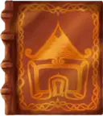


<!DOCTYPE html>
<html>
<!--
Copyright 2010 by Dan Fabulich.

Dan Fabulich licenses this file to you under the
ChoiceScript License, Version 1.0 (the "License"); you may
not use this file except in compliance with the License. 
You may obtain a copy of the License at

 http://www.choiceofgames.com/LICENSE-1.0.txt

See the License for the specific language governing
permissions and limitations under the License.

Unless required by applicable law or agreed to in writing,
software distributed under the License is distributed on an
"AS IS" BASIS, WITHOUT WARRANTIES OR CONDITIONS OF ANY KIND,
either express or implied.
-->

<head>
  <meta http-equiv="X-UA-Compatible" content="IE=edge" />
  <meta name="viewport" content="width = device-width, initial-scale = 1.0, maximum-scale = 1.0">
  <!-- INSERT correct meta values -->
  <!-- <title>Tales From Teren: The Approaching Rot</title> -->

  
  
  
  
  
  <link href="../style.css" rel="stylesheet" type="text/css">
  
  
  
  
  
  
  
  
  
  
  <link href="../alertify.css" rel="stylesheet" type="text/css">
  <link href="dict.css" rel="stylesheet" type="text/css">
  <link href="codexButton.css" rel="stylesheet" type="text/css">
  <!--[if IE 6]><![endif]-->
  <meta name="apple-mobile-web-app-capable" content="yes" />
  <script>allScenes = {"startup": {"crc":1519561148, "lines":["*comment either express or implied.","","*title Tales From Teren: The Approaching Rot","*author Team Teren","*scene_list","\tchapter1","\tchapter2","\tchapter3","\tchapter4","\tchapter5","\tchapter6","\tchapter7","\tchapter8","\tchapter9","\tchapter10","\tmerc-chapter5","\tmerc-chapter6","\tmerc-chapter7","\tmerc-chapter8","\tmerc-chapter9","\tmerc-chapter9-5","\tmerc-chapter10","\tcombat_test","\tgeneral","","*comment ------------------------------ GLOBALS --------------------------------","*comment Why use the implicit_control_flow variable?","*comment ChoiceScript doesn't allow you to fall out of an if statement so you","*comment have to use a goto or an equivalent, setting this to true allows us to","*comment fall out of an if statement.","*create implicit_control_flow true","","*comment ///////// User-facing Globals /////////","*create name \"???\"","*create gender \"???\"","*create faction \"None\"","*create item \"murder_weapon\"","*create bought \"None\"","*create coin 0","*create puppy_name \"???\"","","*comment Colors","*create brawn_color   \"#d60d0d\"","*create agility_color \"#FF9900\"","*create cunning_color \"#4A86E8\"\t","","*comment ///////// General Purpose Globals (used in subroutine calls) /////////","*comment Read only! DO NOT WRITE TO THIS OUTSIDE OF A SUBROUTINE AND SELECT CIRCUMSTANCES!!!","*create returnData true","*create GP_arg0 0","*create GP_arg1 0","*create GP_arg2 0","*create GP_arg3 0","*create GP_arg4 0","","*comment ///////// Attribute Globals /////////","*create Brawn 0","*comment brawn skills","*create Endurance 0","*create Strength 0","*create Presence 0","*create Courage 0","","*create Agility 0","*comment agility skills","*create ReactionSpeed 0","*create Stealth 0","*create MotorSkill 0","*create Acrobatics 0","","*create Cunning 0","*comment cunning skills","*create Improvisation 0","*create Knowledge 0","*create Medical 0","*create Speechcraft 0","","*create Divine 0","*create Arcane 0","","*comment ///////// Phase Globals /////////","*comment Phase1","*create CH2_followed_voice false","*create CH4_visited_reese_grave false ","*comment Phase2","*create P2_branch 0","*create P2M_roommate 0","","*comment ///////// Codex Globals /////////","","*comment Monster sightings global vars","*create isDirewolfDiscovered    false","*create isIchorSwogDiscovered   false","*create isJackaloidDiscovered   false","*create isMockguardenDiscovered false","*create isMogfishDiscovered     false","*create isWOWDiscovered         false","*comment -----------------------------------------------------------------------","","*comment *set GP_arg0 6","*comment *set GP_arg1 \"difficult\"","*comment *gosub_scene general AttributeSkillCheck","","*comment *print \"[head]@{returnData Success|Failure}![/head]\"","*label GAMESTART","WIP build for the UAT production studio milestone review","","What chapter?","*fake_choice","\t#Phase 1","\t\t*choice","\t\t\t#Chapter 1 ","\t\t\t\t*goto_scene chapter1","\t\t\t#Chapter 2","\t\t\t\t*goto_scene chapter2","\t\t\t#Chapter 3","\t\t\t\t*goto_scene chapter3","\t\t\t#Chapter 4","\t\t\t\t*goto_scene chapter4","\t#Phase 2","\t\tThese chapters are in an alpha state, Some systems may not be implemented","\t\t*choice","\t\t\t#Chapter 5 ","\t\t\t\t*goto_scene chapter5","\t\t\t#Chapter 6","\t\t\t\t*goto_scene chapter6","\t\t\t#Chapter 7","\t\t\t\t*goto_scene chapter7","\t\t\t#Chapter 8","\t\t\t\t*goto_scene chapter8","\t\t\t#Chapter 9","\t\t\t\t*goto_scene chapter9","\t\t\t#Chapter 10","\t\t\t\t*goto_scene chapter10","\t\t\t#Back","\t\t\t\t*goto GAMESTART","","\t#TEMP: Combat Test","\t\t*goto_scene combat_test",""], "labels":{"gamestart":104}},
"dict": {"crc":-2088852753, "lines":["*comment If you delete this file, it breaks the dictionary code. "], "labels":{}},
"codex": {"crc":301059873, "lines":["*label CodexStart","[head]Codex[/head]","The codex sections Factions, Items, Magic, and Species are unpopulated.","*line_break","The rest of the codex sections are underpopulated.","*fake_choice","    # DEBUG: Unlock all dynamic entries","        [head]Monsters[/head]","        *set isDirewolfDiscovered    true","        Discovered Direwolf!!!","        *line_break","        *set isIchorSwogDiscovered   true","        Discovered IchorSwog!!!","        *line_break","        *set isJackaloidDiscovered   true","        Discovered Jackaloid!!!","        *line_break","        *set isMockguardenDiscovered true","        Discovered Mockguarden!!!","        *line_break","        *set isMogfishDiscovered     true","        Discovered Mogfish!!!","        *line_break","        *set isWOWDiscovered         true","        Discovered Will-O-Wisps!!!","        *page_break","        *goto CodexStart","    # Characters","        *goto Characters","    # Factions","        *goto Factions","    # Items","        *goto Items","    # Magic","        *goto Magic","    # Monsters","        *goto Monsters","    # Places","        *goto Places","    # Species","        *goto Species","","*comment -------------------------- Characters Choice --------------------------","*label Characters","[head]Cel Storm[/head]","Cel Storm is a priestess of the Flames of Sigel. She joined the order at a young age when a priest named Dustin saved her from icgor-swogs. The rotted creatures overwhelmed her old town. She was one of the few survivors when the Flames of Sigil showed up. Cel managed to hide herself in an old storage shed and used the holy water her parents gave her to protect herself. Dustin was the one who found her and took her to the order\u2019s temple.","","She is seen helping anyone who needs help, much to the dismay of the order. She followed Dustin\u2019s footsteps in that regard. She doesn\u2019t care who you are or where you came from, if you need help she will find a way to help. She has been seen saving people form Krigania from the jackaloids and mogfish.","","When her mentor Dustin was killed because some direwolves were forced out of their territory because of the incoming rot. Cel did some research on direwolves and partitioned a new branch in the order. One that patrolled towns near direwolf territories. She didn\u2019t want these wolves to hurt anyone else.","","[head]Dustin[/head]","Dustin was the priest that took Cel Storm to the Flames of Sigel\u2019s temple. He is the one who took care of her during her childhood after her town was taken over by ichor-swogs.","","He was known for taking in strays even before his wife died. She always talked about how the order should protect and help the people who have lost their homes to the rot. Not many people she took in made it far in the order, and most would leave after getting back on their feet. Some will stay and fully join the order, but they don\u2019t make it far. This didn\u2019t sway her. She was always a kind person and Dustin loved that about her. After she died Dustin continued to help people to honor her memory. ","","When he brought Cel in, he treated her like his own. The priests thinks she reminded him of his wife. He helped her get accommodated to the temple and got her a private tutor to help her along. Cel grew to look up to him and did her best to make him proud. In return, Dustin tried to be the kind of role model she needed. ","","Dustin died to a direwolf attack when he was patrolling the towns along the rot border. The direwolves got pushed out of their territory by the rot and attacked a nearby town. From what Cel said, he was protecting a family when the direwolves got him.","","[head]Glador[/head]","TODO:!!!","","[head]Murderer[/head]","TODO:!!!","","[head]Lord Odel[/head]","TODO:!!!","","[head]Reese[/head]","TODO:!!!","","[head]Rip Daring[/head]","Rip Daring, known as \"The Fearless Blade,\" is a renowned mercenary and key member of The Wolves of Davenport, a legendary band of mercenaries. Standing at six feet tall with a muscular build, Rip's rugged countenance and piercing green eyes reflect his unwavering determination and prowess on the battlefield.","","Skilled in various combat techniques, Rip is a master of swordsmanship and hand-to-hand combat. His agility, speed, and acrobatic prowess make him a lethal opponent, while his custom-crafted dual-bladed longsword, \"Shadowfang,\" grants him versatility and power. Rip's leadership qualities and loyalty to his comrades have been forged through past experiences and the mentorship of the fallen leader, Alistair Blackthorn.","","With a dry sense of humor and keen intellect, Rip navigates challenges with wit and resolve. His unwavering commitment to protecting the realm and upholding the ideals of honor and integrity makes him an invaluable asset to The Wolves of Davenport. Rip Daring's legacy as a fearless warrior who led the Wolves and defended Teren from darkness is forever etched in the annals of history.","","[head]Sigel[/head]","TODO:!!!","","[head]Skadon[/head]","Skadon, known as \"The Father of Oblivion,\" emerged from the primordial void, a sentient force embodying darkness and the void itself. As the clash between Skadon and Sigel, the sun god, raged, the chaotic magic within creation stirred. Tera, the goddess of beauty, fertility, and \"Mother Earth,\" manifested as the physical world of Teren. In another realm, Galdor, the embodiment of magic's will, brought order to the once chaotic forces.","","Recognizing the fragility of life on Teren, Tera sought Sigel's protection, showing him the burgeoning life on the planet's surface. Impressed by mankind's potential, Sigel proposed a union with Tera to safeguard Teren from Skadon's encroaching darkness. The cosmic balance began to stabilize, with Galdor controlling magic, while Skadon and Sigel's clash birthed other celestial beings and deities.","","Skadon, as the God of Darkness and The Void, represents the ever-present threat of oblivion. His eternal conflict with Sigel shapes the world of Teren, while Tera nurtures life and Galdor tames the forces of magic. Within this delicate equilibrium, Lune, the goddess of the moon, and other deities emerged. The struggle between light and darkness remains an enduring theme, influencing the destiny of Teren and its inhabitants throughout time.","","","[head]Teren[/head]","TODO:!!!","","*page_break","*goto CodexStart","","*comment --------------------------- Factions Choice ---------------------------","*label Factions","[head]Flames of Sigel[/head]","The Flames of Sigel is a band of priests and priestesses, joined together as devout followers of Sigel and the Holy Order. Using their skills in battle and unwavering dedication, they fight against the encroaching rot and strive to protect the people of Teren from all the beasts and terrors lurking in the dark. This order is currently overseen by the Zealot, a brave man who is adorned in armor that shines like the morning sun. With his stalwart presence and commanding voice, many have been swayed into joining the Flames just for a chance to be acknowledged by this legendary man.   ","","The Flames of Sigel follows these tenets:","- Devote yourself to Sigel.","- Devote yourself to the Holy Order.","- Protect your people.","- Fight against Skadon and all other forces of darkness."," ","With these tenets guiding their actions, the members of this group are regarded as a force of good throughout the land. Members are brought in from all corners of the world. The Flames of Sigel has brought together warriors of sword and bow, scholars who know all the secrets of the land, and even mages who are strong enough to push back darkness. All of them have been brought together due to their devotion to Sigel and their desire to make the world better for all who live in it.","","While there are many exceptional members, Cel Storm stands out as a pillar of the Flames of Sigel. Her grace and power leaves an impression as she travels with her entourage as she is known for offering aid to any who ask. A true example of the goodness the Flames of Sigel are determined to spread. With Cel\u2019s name beginning to spread far and wide, The Flames of Sigel are only growing in renown. With each new town or city they pass through, they continue  to spread the word of Sigel and protect the people from evil.","","[head]Wolves of Davenport[/head]","The Wolves of Davenport are a legendary band of mercenaries whose name strikes fear into the hearts of their enemies across the realm of Teren. Led by the seasoned warrior Alistair Blackthorn, this renowned group embodies the epitome of skill, camaraderie, and unwavering determination. With each member possessing unique talents, they form a formidable force that stands as a bulwark against the encroaching darkness. They are a diverse group, drawing individuals from all walks of life, each bringing their own set of exceptional skills to the table.","","From expert archers to masterful tacticians, from skilled trackers to powerful spellcasters, their combined expertise makes them a well-rounded and adaptable team. Bound by a shared purpose, they have forged an unbreakable bond, where trust and loyalty are paramount. Their reputation is built on a long and storied history of successful missions and epic battles fought in defense of Teren. They have faced and triumphed over formidable foes, ranging from hordes of monstrous creatures to powerful sorcerers. The Wolves' relentless pursuit of justice and their unwavering commitment to protecting the realm has earned them both respect and fear throughout the land.","","Though Alistair Blackthorn's fall in battle was a devastating loss, it paved the way for Rip Daring, his trusted protege, to step up and assume leadership. Under Rip's guidance, The Wolves of Davenport continue to stand as a beacon of hope, defending Teren against the rising tide of darkness. Their saga of courage, unity, and unwavering resolve has etched their name into the annals of Teren's history, leaving a lasting legacy that will inspire generations to come.","","*page_break","*goto CodexStart","","*comment ---------------------------- Items Choice -----------------------------","*label Items","[head]Flames of Sigel Amulet[/head]","TODO:!!!","","[head]Bloody Knife[/head]","TODO:!!!","","*page_break","*goto CodexStart","","*comment ---------------------------- Magic Choice -----------------------------","*label Magic","[head]Divine Magic[/head]","TODO:!!!","","[head]Arcane Magic[/head]","TODO:!!!","","*page_break","*goto CodexStart","","*comment --------------------------- Monsters Choice ---------------------------","*label Monsters","*comment Monsters not discovered","*if ((((((isDirewolfDiscovered = false) and (isIchorSwogDiscovered = false)) and (isJackaloidDiscovered = false)) and (isMockguardenDiscovered = false)) and (isMogfishDiscovered = false)) and (isWOWDiscovered = false))","    [head]You have not discovered any monsters yet\u2026[/head]","","*if isDirewolfDiscovered","    [head]Direwolf[/head]","    *image images/Dire_Wolf_adult.webp","    The Direwolf, a creature of awe-inspiring stature and intelligence, reigns as a formidable presence within the realms it calls home. Far surpassing the mere size of their smaller kin, these majestic beings exhibit a level of intelligence that sets them apart from regular wolves. Scholars and druids alike attest to their heightened cognitive abilities, recognizing them as remarkable beings in the animal kingdom.","    ","    The Direwolf's imposing physique and strength make it a force to be reckoned with. Legends recount tales of these colossal creatures engaging in solitary hunts, where they display their formidable prowess by taking down powerful adversaries such as warhorses. Come morning, all that remains are the mere skeletal remnants of their prey.","    ","    While solitary hunters by nature, it is not uncommon to hear accounts of a Direwolf taking command of a troublesome wolfpack, effectively becoming their dominant leader. In extremely rare instances, reports suggest the existence of a fully-fledged Direwolf pack. However, such occurrences are scarcely recorded due to the astronomical demands of sustaining a group of such large predators.","    ","    Possessing the resilience of a bear and the cunning pack tactics of a wolf, encounters with a Direwolf can quickly escalate into perilous situations. Travelers who find themselves within the hunting territory of these creatures are strongly advised to take the shortest and quickest route out of the area. If possible, seeking refuge behind fortified structures with capable defenders is strongly recommended. It is believed that Direwolves, with their heightened intellect, are known to hold grudges and may relentlessly pursue those who have wronged them.","    ","    Despite their fearsome reputation, there exist rare tales of a human forming a bond of mutual respect and trust with a Direwolf. In extreme and exceptional circumstances, when a human has proven their mettle and earned the respect of the imposing creature, a Direwolf may allow itself to be tamed. These extraordinary alliances between man and beast serve as testaments to the depth of connection and loyalty that can transcend the boundaries of species.","    ","    The Direwolf, a creature of immense power, intelligence, and strategic prowess, commands respect and captivates the imagination. Their imposing presence in the natural world serves as a reminder of the delicate balance between fear and admiration. Whether viewed as formidable adversaries or as potential allies, the Direwolf continues to inspire awe and reverence in those who encounter them, forever etching their legacy in the annals of folklore and exploration.","    *line_break","","*if isIchorSwogDiscovered","    [head]Ichor-Swog[/head]","    *image images/Ichor-Swog.webp","    The Ichor-Swag, an abominable creature spawned from the depths of corruption, is a testament to the dark forces that pervade the natural world. Emerging from the festering wounds of blighted trees, these cursed beings embody the malevolence that feasts upon the vitality of their surroundings. Although individually feeble, they compensate for their weakness through sheer numbers, swarming together to unleash havoc should the blight go unchecked. Measuring no larger than the heel of a boot, the Ichor-Swag possesses a repulsive appearance. Their grotesque forms are an amalgamation of oozing sap, corrupted flesh, and a sickly aura that resonates with necrotic energy. Their bites transmit a blighted sickness, spreading further devastation within their victims. It is vital to employ fire and holy water when confronting these creatures, as the cleansing power of these elements proves most effective against the darkness that empowers them.","    ","    Bright lights, such as flames or holy energy, strike fear into the hearts of Ichor-Swags. This aversion to luminosity can be harnessed to advantage by utilizing fire or holy energy to flush them out from the epicenter of rot, typically a diseased tree, and expose them to the purifying light of day. By doing so, their extermination becomes more manageable, and the threat they pose can be mitigated, allowing the process of healing to begin for the blighted landscape.","    ","    Caution must be exercised when dealing with these creatures and their originating blights. The Ichor-Swag, born from the decay and maleficence of the natural world, serves as a haunting reminder of the relentless struggle between light and darkness, and the delicate balance upon which the harmony of existence hangs.","    *line_break","","*comment Jackaloid Section","*if isJackaloidDiscovered ","    [head]Jackaloids[/head]","    *image images/Jackaloid.webp","    The Manned Jackaloids are small, werewolf-like creatures that inhabit remote regions far from civilized settlements. Standing between 3 and a half to just under 5 feet tall, they operate in packs, using their presence to frighten away other predators from potential prey and scavenging off decaying carcasses. Despite their frail and lesion-ridden appearance, these creatures exhibit surprising resilience.  ","    ","    Afflicted by an augmented form of leprosy, the Manned Jackaloids are not true lycanthropes in the traditional sense. However, their bites not only spread mundane leprosy to the small hamlets they afflict but also transmit their augmented leprosy to humanoids below the age of physical maturity. The symptoms of this sickness resemble the ordinary affliction, but upon death, the victim's sores widen to unveil a hide of matted fur beneath the skin, transforming them into one of these Jackaloids. This transformation stunts their natural growth, rendering the Jackaloid permanently the size of its host. ","    ","    Encounters with these beasts warrant caution, as their infectious nature poses a grave threat. It is advised for individuals to carry an ample supply of healing potions and promptly seek the aid of experienced apothecaries or temples for treatment if bitten. Preemptive measures and swift medical attention are crucial to mitigate the spread of the augmented leprosy and its dire consequences.   ","    ","    The presence of Maned Jackaloids serves as a grim reminder of the perils lurking in the untamed corners of the world. Their unique affliction, contagious nature, and predatory behavior make them a formidable and unsettling force. Knowledge and vigilance are key to protecting oneself and the communities at risk from these enigmatic and dangerous creatures","    *line_break","","*comment Mycelium","*if isMockguardenDiscovered","    [head]Mockguarden[/head]","    *image images/Mockgarden_Closeup.webp","    The Mockguarden, a perilous and cunning predator, is a formidable form of predatory plant that lurks within the depths of untamed forests. With its ability to adapt and camouflage, it poses a significant threat to unsuspecting creatures that venture too close. While its visible parts may change and blend with the surroundings, it is the subterranean mycelium network that truly defines this enigmatic entity.","    ","    Beneath the earth's surface lies a vast mycelium network, a sprawling and semi-sentient entity that forms the core of the Mockguarden. This underground network, often circular and measuring between 10 to 20 feet in diameter, serves as the life force and intelligence of this peculiar organism. From this hidden realm, the Mockguarden orchestrates its sinister tactics.","    ","    The Mockguarden patiently positions itself in areas of high traffic, such as game trails and footpaths, where it awaits an unsuspecting creature to step upon its mycelium-covered surface. In an instant, the Mockguarden springs into action, employing a variety of deadly mechanisms to subdue its prey. Fungal tentacles, coated in acidic spores, lash out to ensnare and immobilize the unfortunate victim. Additionally, the Mockguarden can launch acidic spores from its above-ground appendages, further augmenting its offensive capabilities.","    ","    The acidic spores secreted by the Mockguarden serve a dual purpose. Primarily, they act as a potent digestive enzyme, designed to break down and decompose the prey's body upon contact. The mycelium network eagerly absorbs the resulting nutrients, fueling its growth and sustaining its existence. However, the unique properties of these spores and acid have caught the attention of skilled metalworkers.","    ","    Metalworkers have discovered the remarkable applications of the Mockguarden's acidic spores in their craft. From rust removal to the intricate embellishment of armor, the acid's corrosive properties have proven valuable. Some smiths claim that when used in the treatment of metals, the Mockguarden's acid contributes to the creation of higher quality steel, enhancing its durability and strength. The adventurous and enterprising few brave the dangers of harvesting these unique resources, harnessing their potential in the realm of craftsmanship.","    ","    The Mockguarden stands as a testament to the marvels and perils that exist within the natural world. Its ability to adapt, ensnare, and utilize acidic spores showcases its formidable nature. While it presents a formidable challenge to those who cross its path, it also offers intriguing opportunities for those who dare to explore its enigmatic properties and continues to intrigue and captivate the minds of scholars, adventurers, and craftsmen alike.","    *line_break","    ","*if isMogfishDiscovered","    [head]Mogfish[/head]","    *image images/Mogfish.webp","    Mogfish are dangerous creatures that live in very muddy areas and are big enough to eat an elf. They have dorsal fins along their back and the some of the species have been seen with a long tether on their head that has a glowing orb at the end of it. This orb can mimic the light of torches, making people think there is a person deep in the forest or there is a town in that direction. However, there have been sightings of mogfish without this tether. It is theorized that these are the males.","","    (finds book)","","    The Mogfish with orbs will stay in the mud with the orb above ground. They wait for an unsuspecting victim to walk over them, then they will open their huge maw to ensnare the unsuspecting victim and suck them in. The rest have to find other ways to get food. These ones will team up with will-o-wisps to mimic the light the other mogfish have. ","","    If you manage to get away, they will climb out of the mud and chase you down. They move really slow, but they can jump far distances. The best way to out run them is to keep something tall between you and it. They will have to get around the object as they can not jump high enough to get over most trees. If you manage to kill one, the orb can be used to create a magical ointment to make whatever it is applied to have a temporary glow.","","*if isWOWDiscovered","    [head]Will-O-Wisps[/head]","    *image images/Mogfish.webp","    Will-o-wisps are glowing orbs, usually seen floating above the ground in swamps. Their glow  can mimic a torch light, so many people mistake it as a person or a nearby town. They are mischievous little creatures and will lead their victims into trouble. Off cliffs, into tunnels, it is even said that they help the mogfish get food. When they are almost caught or have gotten their victim where they wanted them, they will stop glowing. They will turn basically invisible and watch what happens to their victims. It is rumored that they feed off of the misery of their victims.","","    It is unknown where they came from There have been many theories over the years, but no one knows for sure. Some believe that they hover over treasure to protect it, others think they are children who have gotten lost in the forest. Some think it\u2019s the ghosts of the people taken by the rot. None of these theories have been proven and no one who went to discover the real reason ever came back. ","    ","    There have been rumored sightings of wisps right before the rot invades the town. As of yet, there has been no confirmed relationship between the two. ","","*page_break","*goto CodexStart","","*comment ---------------------------- Places Choice ----------------------------","*label Places","[head]Davenport[/head]","Davenport, a city that stands as a testament to the ingenuity and resilience of humanity, is a sprawling metropolis nestled within the embrace of the Broken Fields. With its roots reaching back through the annals of history, this cosmopolitan hub has become a beacon of civilization amid the untamed wilderness of the world. Its strategic position, nestled against the flowing river that gracefully winds its way to the vast seas beyond, has transformed Davenport into a thriving center of trade and cultural exchange.","","At the heart of the city lies the bustling marketplace, a vibrant tapestry of color, sound, and aromatic delights. Merchants from far and wide gather here, showcasing their exotic goods and rare treasures. Intricately carved carts and stalls brim with vibrant fabrics, tantalizing spices, gleaming jewelry, and mystical artifacts. It is within this kaleidoscope of commerce that the true spirit of Davenport comes alive, as voices from countless lands intermingle, creating a symphony of diverse cultures and languages.","","One of the defining features of Davenport is its renowned port, a gateway to distant horizons and uncharted waters. Located on the city's outskirts, this bustling harbor welcomes a constant influx of ships, their sails billowing with the winds of adventure. Here, seafarers and traders from across the known world dock their vessels, unloading cargoes laden with treasures and stories from far-off lands. The port of Davenport has gained a reputation for being a reliable and efficient hub, catering to both merchants seeking to expand their horizons and adventurers yearning for the next great journey.","","The city itself is a captivating mosaic of contrasting districts. From the opulence of Goldenspire, where the wealthy elite reside in luxurious splendor, to the humble neighborhoods of the working class, such as Hearthstead and Forgehold, where the heartbeat of Davenport's industries resounds, the city offers experiences for every stratum of society. Beyond the grandeur and the hardship, there is a sense of unity that binds the diverse populace together, as they navigate the intricacies of urban life and embrace the vibrancy that makes Davenport truly unique.","","As twilight descends upon the city, the glow of countless lanterns casts an ethereal light upon the winding streets and canals, illuminating the charm and allure that permeate every corner. Davenport, the City of Splendors, thrives not only on its wealth and prosperity but also on the dreams, aspirations, and stories of its inhabitants. It is a place where adventurers find respite, where craftsmen hone their skills, where scholars uncover ancient wisdom, and where the indomitable spirit of humanity continues to flourish in the face of ever-present challenges.","","To visit Davenport is to immerse oneself in a vibrant tapestry of life, to witness the ebb and flow of ambition and inspiration that weaves the very fabric of this remarkable city. Whether you seek treasures, knowledge, or a chance encounter that may shape the course of your journey, Davenport awaits, ready to unveil its secrets and welcome you into its embrace.","","[head]Krigania[/head]","TODO:!!!","","[head]Teville[/head]","The capital city Teville is located by the Ironmount mountains on the west side of the country Teville. The capital is broken up into ten different districts. Each district is split up depending on the wealth of the people living in it. With four slums and a castle amongst the city, there is something for everyone.","","Starting from the top is the castle. In the castle lives the King of the country. They are the ones running and taking care of their county. Not very many among the common populace have seen the inside, but rumor has it an entire war-room is dedicated to keeping an eye on the Rot within the nation\u2019s borders.. Next is Lowrock. This is where most of the middle-class live and where The Beggar\u2019s Tavern is located, a famous pitstop for many mercenaries and adventuring parties. Most other shops and taverns can also be found in this district. ","","The Old District is where you can find the largest temple in the city. It is said to be the very first temple and the foundation of Teville. Right next to it is the docks. This is where the largest melting pot can be seen within the city and where most outside trades happen. Then there is Noblicar\u2019s Road. The district that produces anything from the weapons the army uses to the wagons people travel with.","","Heathergateis named after the wife of a past King who died during childbirth. Her daughter, Dianica, became the first ruling Queen of the nation and a great ruler. In the local park you can find statues of great war heroes who made sacrifices for their country. Among them you can find Dianica\u2019s mother Heather. Pelor\u2019s Performance Centre can also be found here. Formerly known as The Bone Bleachers in a time when they were once used for vicious gladiatorial combat, here you can watch yearly battles as knights are pitted against each other. With ample healers and healing potions, this event is one of the safest ones in the country as well as the most popular.","","The Six Lodges is the nicest of the outside slums. It has six large inns, each famous in their own right, and is the second biggest slum in the city of Teville. The biggest goes to the Goldensprawl. Far from the glory of the Six Lodges sector of the city, Goldensprawl is still much nicer than the seedier areas of the city. It got its name from how the sun hits the buildings in the morning, making it look like it's showered in gold. There is also a rumor going around that the true birthplace of Teville (the founder of the kingdom) is hidden somewhere in here.","","Next is Woolrock, the second nicest slum. Here you will find a lot more elves, dwarves, and gnomes roaming the streets. With many shrines dedicated to their gods and some of the nicer buildings in the area. The worst place in the city is Ratbowl. Ratbowl has the highest crime rate and the worst people. A thieve\u2019s guild has a heavy presence here, and not much attention is paid to crimes that occur within its streets. Not a place you would want to visit on your next trip to Teville.","","[head]Summerlight[/head]","TODO:!!!","*page_break","*goto CodexStart","","*comment --------------------------- Species Choice ----------------------------","*label Species","[head]Dwarves[/head]","TODO:!!!","","[head]Elves[/head]","TODO:!!!","","[head]Gnomes[/head]","TODO:!!!","","[head]Humans[/head]","TODO:!!!","","*page_break","*goto CodexStart","","*comment -----------------------------------------------------------------------","",""], "labels":{"codexstart":0,"characters":43,"factions":97,"items":122,"magic":133,"monsters":144,"places":229,"species":265}},
"choicescript_stats": {"crc":-2079517319, "lines":["This is a stats screen!","","*stat_chart","","  text name","  text gender","  text Brawn","  text Agility","  text Cunning","  text faction","  text item","  text bought","  text coin "], "labels":{}},
"chapter1": {"crc":-1770269447, "lines":["*label chapter1","[head]Chapter 1: Who Are You?[/head]","*comment *goto Player_Init","\t","*goto PI_GetName","","*label StartChapterOne","Nestled on the outskirts of Davenport, far beyond the city's bustling streets and grand architecture, lies a serene farmstead. This picturesque land stretches across acres of fertile soil and rolling fields, offering a tranquil respite from the urban chaos. The farmstead serves as the backdrop for your upbringing and sets the stage for your journey.","","The farm is a place where hard work and dedication intersect with the rhythms of nature. Fields of vibrant crops sway in the wind, their colors blending together to form a breathtaking tapestry. Rows of vegetables, fruits, and grains stretch as far as the eye can see, a testament to the labor poured into the land. At the heart of the farmstead stands a quaint farmhouse, weathered by time but filled with warmth and love. It is here that your character was raised, nurtured by the unwavering devotion of your parents. The aroma of home-cooked meals often wafts through the air, a testament to your mother's culinary skills and her ability to transform the farm's bounty into delicious feasts.","","Your parents are pillars of strength and determination. A seasoned farmer, your mother possesses an uncanny understanding of the land and an unwavering commitment to its care. She has imparted her knowledge and love for the farm to you, teaching you the secrets of cultivating crops and tending to livestock. Together, you have toiled under the sun, sowed seeds, and reaped the rewards of your labor. The farmstead is more than just a source of sustenance; it's a sanctuary. The wide-open spaces invite exploration and introspection.","","Your father is often on trips to Davenport. He is a sailor that takes food and other goods down the river to Davenport or smaller towns that can\u2019t grow much. He\u2019s become well known across this side of Teville. ","*page_break","","You wake up to the sun's gentle rays, the farmstead comes alive with the sounds of nature. The roosters crow in the distance, signaling the start of a new day. You have many chores to do and little time to do them. ","","You decide to,","*choice","\t# Help Mother on the Farm","\t\tYou feel the warmth of the morning sun gently caress your face as you awaken in your cozy bedroom on the farmstead. Slowly, you rise from your bed, the remnants of sleep still clinging to your eyes. As you contemplate the day ahead, you remember the unspoken expectation that your mother has of you\u2014helping with the farm tasks.","","\t\tKnowing that your mother relies on your assistance, you slip into your simple farm attire, a comfortable tunic and sturdy breeches. With determination in your heart, you make your way to the kitchen, where the aroma of fresh bread and brewed tea envelops the air.","","\t\tEmerging from the kitchen, you step outside, greeted by the familiar sights and scents of the farmstead. The gentle breeze carries with it the earthy fragrance of fertile soil, while the distant sounds of cows mooing and chickens clucking remind you of the livestock your family tends to. Walking toward the fields, you find your mother diligently working among the crops.","","\t\tShe looks up as you approach, her eyes softening with affection. ","","\t\t\"Hey there\u2026\"","\t\t*fake_choice","\t\t\t# Buddy (Boy)","\t\t\t\t*set gender \"Male\"\t\t\t\t","\t\t\t# Honey (Girl)","\t\t\t\t*set gender \"Female\"","\t\t\t# Kiddo (Other)","\t\t\t\t*set gender \"Other\"","\t\t","\t\t\u201cYou look like you barely slept! Your hair is a mess,\" she teases, a warm smile playing on her lips. ","","\t\t\"I could use your help with a few farming tasks today,\" she says, wiping the sweat off her brow. \"I need you to assist me in plowing the fields or you can gather the harvest that is ready.\"","\t\t\t\t","\t\t*fake_choice","\t\t\t# Tend to the fields ([color=${brawn_color}]Brawn++[/color] [color=${agility_color}]Agility++[/color])","\t\t\t\t*set Brawn +1","\t\t\t\t*set Agility +1","\t\t\t\tYou pick up a sturdy plow and work alongside your mother, pushing it through the earth with all your strength, utilizing your brawn. The physical exertion tests your muscles, and you can feel them straining with the effort. At the same time, you must navigate the uneven terrain and maneuver around rocks and obstacles, showcasing your agility.","","\t\t\t\tTogether, you and your mother plow the fields, preparing them for the planting season. The combination of your brawn and agility allows you to complete the task efficiently, impressing your mother with your physical abilities.","\t\t\t# Gather the harvest ([color=${cunning_color}]Cunning++[/color] [color=${agility_color}]Agility++[/color])","\t\t\t\t*set Cunning +1","\t\t\t\t*set Agility +1","\t\t\t\tYou follow your mother to the rows of ripe crops, ready to be harvested. She explains the importance of carefully selecting the fruits and vegetables, ensuring that only the best ones are collected. Your keen eye and attention to detail will be essential in discerning the optimal time for harvesting each crop, utilizing your cunning.","","\t\t\t\tWith nimble hands and quick reflexes, you deftly pluck the ripe produce from the plants, showcasing your agility. You must also exercise caution not to damage the delicate crops during the process, relying on your careful movements and precise control.","\t\t\t\t","\t\tTogether, you and your mother gather the harvest, filling baskets with an abundance of fresh, nutritious produce. Your combination of cunning and agility proves invaluable in selecting the best crops and handling them with care.","\t","\t\tOnce you finish your task, you help your mother take some baskets back to the house. There, your stomach grumbles, signaling the need for sustenance. You and your mother take a break, enjoying a simple but satisfying meal prepared from the farm's bounty. Once you've replenished your energy, your mother turns to you and says, \"Thank you, ${name}. Now, I need you to head into the marketplace after breakfast and gather some bread for dinner tonight.\"","","\t\tGrateful for your help, she hands you a small pouch of coins to cover the expenses. With a sense of purpose, you bid your mother farewell and make your way toward the bustling marketplace, ready to fulfill your task and discover what lies beyond the familiar boundaries of the farmstead.","\t\t*page_break","","\t\t*goto SC1_Market","","\t# Head to the market","\t\t*comment You'll have to randomly assign the base stats...","\t\tFeeling a sense of urgency, you decide to bypass the farm tasks today. Perhaps you're eager to venture beyond the confines of the farmstead or simply feel that you have already mastered the necessary skills. Without delay, you slip into your chosen attire, bypassing the farm attire and instead opting for something more practical for the market. As you make your way to the kitchen, you catch a whiff of freshly brewed tea, but you decide to forego breakfast for now. With a determined stride, you step out of the house and head straight to the marketplace, bypassing the farm tasks that would have shaped your skills and attributes. As you enter the bustling market, you're immediately greeted by a symphony of colors and sounds\u2014merchants shouting, the rustling of fabric, and the aroma of diverse goods.","","\t\tNavigating through the crowd, you begin to take in the variety of stalls and carts. However, amidst the chaos, a tall Elf vendor approaches you, a curious expression on their face. They recognize you and ask, ","\t\t","\t\t\"Hey there\u2026\" ","\t\t*fake_choice","\t\t\t# Buddy (Boy)","\t\t\t\t*set gender \"Male\"\t\t\t\t","\t\t\t# Young Lady (Girl)","\t\t\t\t*set gender \"Female\"","\t\t\t# Kiddo (Other)","\t\t\t\t*set gender \"Other\"","\t\t","\t\t\u201dWhat are you doing here by yourself?\" Choosing to skip the tutorials, you respond with a confident smile, \"Just browsing.\" With that, you immerse yourself in the vibrant marketplace, ready to explore and find your own path in this world of opportunities.","\t\t","\t\t*goto SC1_Market","","\t# Create a Meal with Limited Ingredients ","\t\tYou open the pantry to find the house is lower on food stores than you realized. With a little thinking and a can-do attitude, you manage to make yourself a small and semi-satisfying breakfast.","\t\t","\t\tAs you awaken to the sun's gentle rays, you feel a pang of hunger in your stomach. ","","\t\tYou pass the mirror on the way to the kitchen and see a,","\t\t*fake_choice ","\t\t\t# Boy","\t\t\t\t*set gender \"Male\"","\t\t\t# Girl","\t\t\t\t*set gender \"Female\"","\t\t\t# Kid","\t\t\t\t*set gender \"Other\"","","\t\tOnce you are in the kitchen, you glance around and realize that the house's food supply is lower than you had realized. It seems you'll have to make do with the limited ingredients available to you.","","\t\tWith a can-do attitude, you open the pantry and begin scavenging for any remnants of sustenance. \t\t\t\t","","\t\t*fake_choice ","\t\t\t# Culinary Creativity ([color=${brawn_color}]Brawn++[/color] [color=${agility_color}]Agility++[/color])","\t\t\t\t","\t\t\t\t*set Brawn +1","\t\t\t\t*set Agility +1","","\t\t\t\tAfter some resourceful thinking, you manage to gather a handful of vegetables, a few eggs, and a small loaf of bread. It may not be a lavish feast, but it's enough to appease your hunger. ","","\t\t\t\tYou set to work in the kitchen. By utilizing your creativity and culinary skills to prepare a small but semi-satisfying breakfast. The aroma of sizzling vegetables and the sound of cracking eggs fill the air, as you transform the modest ingredients into a nourishing meal. ","","\t\t\t\tYou use your strength to handle the knife and cooking utensils with skill and precision, chopping the vegetables and flipping the eggs with ease. Your agility allows you to swiftly move around the kitchen, multitasking between various cooking techniques.","","\t\t\t\tYour mother walks into the kitchen from the farm and sees the breakfast you made.","","\t\t\t\tThanks for cooking breakfast\u2026","\t\t\t\t*fake_choice","\t\t\t\t\t# Buddy (Boy).\u201d","\t\t\t\t\t\t*set gender \"Male\"","\t\t\t\t\t# Honey (Girl).\u201d","\t\t\t\t\t\t*set gender \"Female\"","\t\t\t\t\t# Kiddo (Other).\u201d","\t\t\t\t\t\t*set gender \"Other\"","\t\t\t\t","\t\t\t\t\u201cCould you head to the market after breakfast? We need to stock up on some food. The harvest isn\u2019t in yet.\u201d Your mother asks you. You nod and finish your food.","","\t\t\t\tHaving savored your breakfast,  you grab the coin and items you\u2019re planning to trade so you can replenish the dwindling food supplies. You have also been hearing some rumors spreading through the town and wanted to ask some people about them.","\t\t\t\t*page_break","\t\t\t\t\t\t","\t\t\t# Uncovering Secrets ([color=${cunning_color}]Cunning++[/color] [color=${agility_color}]Agility++[/color])","\t\t\t\t*set Cunning +1","\t\t\t\t*set Agility +1","\t\t\t\tWhile searching through the pantry, you stumble upon a hidden compartment. Confused, you open it and find a note from your father.","","\t\t\t\t\u201cI was wondering when you would find this. You\u2019re such a clever child. In here you\u2019ll find some toys I got you from Davenport. Thought you and Reese may enjoy playing with them. I hid them from you because I wanted it to be a scavenger hunt, but since you found them before I came back you can have them.\u201d","","\t\t\t\tYour father would sometimes come back with toys or treats from out of town. He tries to get you some of your favorite bread baked by the dwarves. They bake the best bread you have ever had and whenever he leaves that is the one thing you ask from him.","","\t\t\t\t\u201cWhat did you find in there?\u201d Your mother calls out.","","\t\t\t\t\u201cWooden swords and a note from Dad!\u201d You shout back.","","\t\t\t\t\u201cOh, you found the hidden compartment, I told your dad that you would find it. He needs to find better hiding places.\u201d Your mother laughs. \u201cYou can play with them after you get back from the market. I need you to pick up some food.\u201d","","\t\t\t\tYou excitedly nod and grab the coin before running out.","","\t\t*page_break","","\t\t*goto SC1_Market","","*comment Go to the market ------------------------------------------------------","*label SC1_Market","The marketplace is the vibrant heart of the city, a sprawling area that serves as the bustling hub of commerce and trade. Nestled in the downtown district, it radiates a sense of energy and liveliness that permeates the air.","","As you step into the marketplace, your senses are immediately captivated by a kaleidoscope of colors and sounds. The main street is lined with an assortment of stalls, each adorned with vibrant tents and intricately carved carts, creating a visually captivating tapestry. The merchants, representing diverse races and cultures, are passionately engaged in their craft, enticing customers with their displays and calls to attention.","","The air is filled with an amalgamation of scents that intermingle harmoniously. The aroma of freshly baked bread wafts through the air, intermingling with the fragrant spices from exotic cuisines. The scent of freshly harvested fruits and vegetables, as well as the unmistakable scent of various herbs, lingers enticingly. The marketplace is a cornucopia of tantalizing smells, promising culinary delights and aromatic treasures. The soundscape of the marketplace is a symphony of voices, each merchant eager to captivate the attention of potential customers. The air resonates with a chorus of enthusiastic greetings, persuasive sales pitches, and friendly banter. Amidst the bustling crowd, the melodic tunes of street musicians and the rhythmic clinking of coins create a lively backdrop, adding to the vibrant atmosphere.","*page_break","","Navigating through the marketplace requires a keen sense of observation and adaptability. The bustling crowd, composed of locals and visitors alike, weaves through the maze of stalls, creating a dynamic flow of movement. People from all walks of life can be seen here, dressed in a myriad of vibrant and diverse attire, representing their cultural heritage and personal styles. The marketplace is not merely a place of commerce; it is a center of social interaction. Amidst the transactions and haggling, friends catch up over cups of steaming tea, families explore the wares together, and strangers strike up conversations that lead to unexpected friendships. Laughter, shared stories, and the exchange of ideas are interwoven into the fabric of this bustling place.","","Amongst the crowd you hear a shout and turn around. You can see Reese, your best friend, running towards you.","","\u201c${name}! ${name}!\u201d Reese shouts before they stop a few feet away, panting. \u201cWhat\u2026 Are\u2026 You\u2026 Doing\u2026?\u201d","","*fake_choice","\t# \"Gathering food for dinner\" ([color=${cunning_color}]Cunning++[/color])","\t\t*set cunning +1","\t\tThey stop you in your tracks and ask, \"Hey there, ${name} and Reese, what are you two doing here by yourselves?\" ","","\t\t\"Mother needs me to pick up various food items for supper tonight.\" You respond.","","\t\tThe Elf nods, understanding your task. \"Ah yes,\" they say, their voice tinged with a hint of wisdom. \"While I don't have everything you need, I know that Ferren has the remaining goods you require. Go see them first, and I'll have the rest of what you need by the time you get back.\" With directions in mind, you head towards the vendor. As you approach their stall, they greet you warmly. \"Well hello there, little human. What can I do for you today?\"","\t\t*page_break","","\t\t\u201cI need to get vegetables for dinner tonight. Our harvest is late and we can\u2019t pick them yet.\u201d You explain as well as you can.","","\t\t\"I can provide you with what you need, but first, I have a few minor tasks that require your expertise. I will even let you choose which tasks you would like to complete.\" With determination, you and Reese embark on the tasks assigned by the vendor, immersing yourself in the challenges they present.","","\t\t*fake_choice","\t\t\t# The Strongarm Delivery ([color=${brawn_color}]Brawn++[/color] [color=${cunning_color}]Cunning++[/color])","","\t\t\t\tThe Elf considers your request for a moment before speaking, \"Ah, yes. While I don't have everything you need, I know that a trusted merchant named Gorrim down the lane has the remaining goods you require. However, before I can assist you further, I have a task that requires you to be strong and smart. Although, with the two of you working together, it shouldn\u2019t be that difficult.\"","","\t\t\t\t\u201cHe is right down this path, but be careful. The crate is very heavy and there are many obstacles along the way. You will need to find a way to work together if you want to deliver this.\u201d The Elf explains. ","\t\t\t\t*page_break","","\t\t\t\tYour task is clear: deliver the crate to the designated merchant without damaging its contents and without falling into any traps or pitfalls along the way. As you carry the weight on your shoulders, your muscles strain and your brawn is put to the test. ","","\t\t\t\t\u201cI can help! You don\u2019t have to carry it by yourself.\u201d Reese offers, but you shake your head.","","\t\t\t\t\u201cThis is my task, just help me not bump into anything.\u201d You request. Reese runs ahead and tells you where some obstacles are.","","\t\t\t\tWhen the two of you get back, the Elf imparts their knowledge of combat tactics and strategic thinking, honing both your brawn and cunning skills.","","\t\t\t# The Agile Pursuit ([color=${agility_color}]Agility++[/color] [color=${cunning_color}]Cunning++[/color])","\t\t\t\t\"There's been an incident in the marketplace where a mischievous pickpocket has been causing trouble. I need one of you to catch them before they slip away using your speed and outsmarting them.\" The Elf explains.","","\t\t\t\t\u201cFrom what I have heard, they are a sneaky fellow. From what I have gathered, they are shorter than a dwarf and wear a dark hood. They keep out of sight, but find ways to move through the crowd. If the two of you work together, you will be able to find and catch them.\u201d The Elf explains before you and Reese join the crowd.","","\t\t\t\tYour mission is to navigate through the bustling marketplace, swiftly and deftly, in pursuit of the pickpocket. Your agility and quick reflexes will be crucial in catching them, but you must also employ cunning tactics to outsmart their tricks and evasive maneuvers.","\t\t\t\t*page_break","","\t\t\t\tAs you two dart through the marketplace, jumping over obstacles, maneuvering through tight spaces, and blending seamlessly with the flow of people, you must also anticipate the pickpocket's moves and set cunning traps of your own. By strategically positioning yourself and using your wits, you gradually close in on the pickpocket, outmaneuvering them at every turn. Reese follows close behind you, ready to block any escape routes that may pop up. ","","\t\t\t\tWith a final burst of speed and a well-placed trap, you apprehend the pickpocket, returning the stolen goods to their rightful owners. The Elf commends your agile and cunning pursuit, impressed by your ability to think on your feet and adapt to the ever-changing circumstances.","","\t\t\t\tIn recognition of your accomplishment, the Elf imparts their knowledge of stealth techniques and cunning strategies, enhancing your agility and cunning.","\t\t","\t\t*page_break","\t\tOnce you've fulfilled their request, you return to the friendly Elf vendor in the marketplace, who now has the rest of the food items you need for dinner. Grateful for your efforts, the Elf vendor hands you the completed package. \"Here you go,\" they say with a smile. \"You've proven yourself resourceful and capable and I thank you.\"","","","\t# \u201cJust browsing.\u201d (choice)","\t\tAs you wander through the sprawling marketplace, your eyes dart from one stall to another, taking in the array of goods and the vibrant colors that surround you. The voices of merchants calling out their offers blend into a harmonious background noise.","","\t\tIn the midst of the crowd, the tall Elf approaches you, wearing a friendly expression. They stop you and inquire, \"Hey there, (Player_Name), Reese, what are you two doing here by yourselves?\"","","\t\tWith a nonchalant smile, you respond, \"Just browsing.\" The Elf nods, seemingly understanding your desire to explore the marketplace without any particular goal in mind. They offer you a nod of acknowledgement before continuing on their way, leaving you to your own devices.","","\t\t[b]With the tutorials skipped, you are free to apply your skills, and attributes as you see fit. The world of possibilities awaits you in the marketplace, where you can interact with various merchants, engage in conversations, and uncover hidden opportunities.[/b]","\t\t*fake_choice","\t\t\t# Strength [color=${brawn_color}]Brawn++[/color]","\t\t\t\t*set brawn +1","\t\t\t# Agility  [color=${agility_color}]Agility++[/color]","\t\t\t\t*set agility +1","\t\t\t# Cunning  [color=${cunning_color}]Cunning++[/color]","\t\t\t\t*set cunning +1","","\t#\u201cTrading Crops and Items\u201d ([color=${brawn_color}]Brawn++[/color])","\t\t*set brawn +1","\t\tAs you traverse the bustling marketplace, your eyes scan the various stalls, assessing the potential value of your farm's crops and other items. You know that the stock of food at home is dwindling, and you seek a way to replenish it.","","\t\tAmidst the crowd, the tall Elf spots you and strides over with an intrigued expression. They stop you in your tracks and inquire, \"What do you have, little human? Let's see if we can make a deal.\" Understanding their intent, you respond, \"Well, I seem to be running low on food. I have various crops and items to trade.\"","","\t\tThe Elf's eyes sparkle with interest, and they invite you to showcase your offerings. Together, you examine the items you have brought, discussing their worth and potential trade possibilities. Reese watches as you trade, not understanding how you do this. ","\t\t*page_break","","\t\tAfter negotiating, you strike a deal, exchanging your crops and items for much-needed food supplies. With the trade completed, the Elf presents you with the acquired provisions and a thoughtful smile. \"Thank you for your business,\" they say. \"However, if you're looking to fully settle into the marketplace, I have a few minor tasks that require your expertise. Completing them will grant you additional skills, further honing your abilities. I will let you choose which task you wish to complete for me.\"","","\t\tGrateful for the opportunity, you eagerly accept the challenge and embark on the tasks assigned by the Elf. With each successful completion, you acquire new knowledge and grow.","","\t\t*fake_choice","\t\t\t# The Resourceful Cook ([color=${brawn_color}]Brawn++[/color] [color=${cunning_color}]Cunning++[/color])","\t\t\t\t*set brawn +1","\t\t\t\t*set cunning +1","\t\t\t\tThe Elf sends you and Reese to Master Remus, the best chef in town. Believing that you two could learn something new from him.","","\t\t\t\tAfter hearing that the Elf sent you here, Master Remus has offers you a challenge. He has a secret recipe that requires a combination of strength and speed. The ingredients are scattered throughout the market, and you must navigate the bustling stalls and negotiate with vendors to gather everything you need.","","\t\t\t\tYour task is to gather the specific ingredients Master Remus requires, showcasing your agility as you swiftly move through the market and your brawn as you negotiate and trade with the vendors. ","","\t\t\t\tAlong the way, you encounter various obstacles, crates and people in your way. You and Reese work together to get the food back to Master Remus. Climbing over crates and dodging through people you two manage to collect all the necessary ingredients. Master Remus is impressed by your culinary prowess and rewards you with a lesson in both agility and brawn. He teaches you techniques that will enhance your physical prowess and quick reflexes.","","","\t\t\t# The Elusive Secrets ([color=${brawn_color}]Brawn++[/color] [color=${cunning_color}]Agility++[/color])","\t\t\t\t*set brawn +1","\t\t\t\t*set agility +1","\t\t\t\tThe elf sends the two of you to get some cloth from the merchant on the other side of town. However, before you leave, he gives a warning.","\t\t\t\t","\t\t\t\t\u201cBe careful of the people called the Whisper. They may be known for having some good information, but they can\u2019t be trusted.\u201d The Elf tells you before sending you both off.","","\t\t\t\tAs you wander through the market, you notice a shady figure lurking in the shadows. Intrigued, you approach them cautiously, discovering that they are the Whisper. Whisper specializes in acquiring valuable secrets and information, and they have something that piques your interest.","\t\t\t\t*page_break","","\t\t\t\tWhisper offers you a deal \u2013 in exchange for a favor, they will share valuable secrets that can aid you in your journey. The favor they require involves using your cunning to gather classified information from various individuals in the market. You are cautious  at first, but Reese thinks it may prove useful to stay on their good side. They provide you with a list of targets and specific questions to ask them discreetly.","","\t\t\t\tYour task is to navigate the bustling market, using your cunning to approach the targets, engage them in conversation, and extract the desired information without arousing suspicion. You must rely on your ability to read people, employ persuasive tactics, and adapt to each target's personality and demeanor.","","\t\t\t\tMany times you and Reese have to find creative hiding spots. A few times even creating some. The two of you will push a barrel into a better location or climb a difficult wall.","","\t\t\t\tWith your natural gift for cunning and strength, you successfully gather the information Whisper seeks, impressing them with your cleverness and resourcefulness. In return, Whisper imparts invaluable knowledge of covert operations and cunning strategies.","","*page_break","","After a hearty dinner with Mom, you head to bed with a book. It\u2019s a journal of everything you have found. You have a section for monsters, locations, people and items, each categorized with their own bookmark.","","You open your book and add in a new creature you learned about today. The mockguarden. While you and Reese were running around town, you overheard some travelers talking about it.","","\u201cI\u2019d be careful walking down the main road to Lindow if I were you. Heard that it\u2019s been overrun by mockgardens.\u201d One merchant said to another. \u201cTake the side path between Stormdenn and the river, it\u2019s a longer path, but safer.\u201d","","After hearing about the creature, you asked Reese to stop by the library so you could read about it. They agreed, as long as you played knights with them.","","At the library, you searched for the book about monsters and flipped through the pages. You see a wide array of monsters you have never heard of, but you only had time to read about one.","You choose to read:","","*fake_choice","\t# Mockgardens","\t\tYou came here to read about this new creature and you set on reading about it. You continue to flip through the pages until you hit \u201cMockguarden.\u201d","","\t\t\u201cThe Mockguarden, a perilous and cunning predator, is a formidable form of predatory plant that lurks within the depths of untamed forests. With its ability to adapt and camouflage, it poses a significant threat to unsuspecting creatures that venture too close. While its visible parts may change and blend with the surroundings, it is the subterranean mycelium network that truly defines this enigmatic entity.\u201d","\t\t","\t\t[b]You've unlocked the Mockgardens codex entry![/b]","\t\tTo view this entry, click on the codex in the top right corner, and enter the \"Monster\" section.","\t\t*set isMockguardenDiscovered true","\t# Jackaloids","\t\tYou never heard of a Jackaloid before and was interested in what it was. Deciding that you could read up about Mockguardens later, you flip back to the manned Jackaloid page.","","\t\t\u201cThe Manned Jackaloids are small, werewolf-like creatures that inhabit remote regions far from civilized settlements. Standing between 3 and a half to just under 5 feet tall, they operate in packs, using their presence to frighten away other predators from potential prey and scavenging off decaying carcasses. Despite their frail and lesion-ridden appearance, these creatures exhibit surprising resilience.","\t\t","\t\t[b]You've unlocked the Jackaloid codex entry![/b]","\t\tTo view this entry, click on the codex in the top right corner, and enter the \"Monster\" section.","\t\t*set isJackaloidDiscovered   true","\t# Direwolves","\t\t\u201cDirewolf?\u201d you mumble as you flip to the page. It has sparked your curiosity and you decide to read it.","","\t\t\u201cThe Direwolf, a creature of awe-inspiring stature and intelligence, reigns as a formidable presence within the realms it calls home. Far surpassing the mere size of their smaller kin, these majestic beings exhibit a level of intelligence that sets them apart from regular wolves. Scholars and druids alike attest to their heightened cognitive abilities, recognizing them as remarkable beings in the animal kingdom.\u201d","","\t\t[b]You've unlocked the Direwolf codex entry![/b]","\t\tTo view this entry, click on the codex in the top right corner, and enter the \"Monster\" section.","\t\t*set isDirewolfDiscovered    true","","You are enthralled by the readings before you can finish reading, the book is torn from your hands.","","\u201cThis isn\u2019t something someone so young to read about. There is much more appropriate creature books over in the kids section.\u201d The librarian explains with a rude voice.","","You and this librarian have never got along. Every time you find a new book, she will snatch it from your hands and send you to the kids section. You are old enough to buy food and sell crops, why are you not allowed to read about the creatures of this world?","","\u201cCome on ${name}, let\u2019s just go play. It isn\u2019t worth angering Miss Librarian.\u201d Reese drags you out of the library and into the town.\t\t\t\t","","*finish","","*comment Initialize the player -------------------------------------------------","","*label PI_GetName","Your name?","","*input_text name","","*goto PI_ConfirmName","","*label PI_ConfirmName","${name}, Is that right?","","*choice","\t# Yes.","\t\t*goto StartChapterOne","\t# No.","\t\t*goto PI_GetName",""], "labels":{"chapter1":0,"startchapterone":6,"sc1_market":152,"pi_getname":325,"pi_confirmname":332}},
"chapter2": {"crc":795179385, "lines":["*comment Start of Chapter 2 ----------------------------------------------------","[head]Chapter 2: The Encounter[/head]","The sun was high in the sky, the dappling of clouds providing cool shade as you walk along the fields. A warm breeze ruffles your loose shirt, the sweat on the back of your neck drying slowly. A few yards ahead of you, your friend Reese is batting the tall grass with a thin branch they found on their way from their house to yours. They poked and teased you with it until you chased them out of your yard. The chase continued through town until you both began to tire. As it turns out, this was their plan all along. ","","\u201cI\u2019ve got nothing to do today, and you haven\u2019t either. Let\u2019s go play in the forest! We can gather flowers on the way!\u201d they exclaimed.","","*fake_choice","    # You saw no reason to say no.","    # You are concerned about what both of your parents will do.","        \u201cOur parents have been telling us to stay away from the forest.\u201d You explain as you stare off towards the forest. ","        ","        Reese shakes their head and shouts, \u201cCome on! We won\u2019t go that far into the forest, just far enough to find some flowers!\u201d","        ","        \u201cAlright\u2026\u201d You reluctantly agree.","*page_break","","The forest on the edge of town was well-traveled. The footpaths are spread across the forest floor like one large spider web of interconnecting routes. The trees were far enough apart to let in plenty of sunlight, illuminating the dense patch of a mockguarden that grew on the forest floor. Having grown up a stone\u2019s throw away from this forest, you had long heard stories about these unassuming plants that grew on the forest floor. Their benign color and simple appearance was just a natural ruse. They weren\u2019t too common, but recently a hunter had noticed a mockguarden hidden amongst the thick grass on the forest floor. It had become town-wide news in less than an hour and all the adults were warning their children about the dangerous plant. Looking closer as you passed the deadly clusters of mushroom-like plants, you could see the pale white bone of some unfortunate animal that had been caught in their snare. ","*set isMockguardenDiscovered true","","The two of you chased each other, playing tag and picking pretty flowers as you ventured deeper into the forest. The branch Reese found having changed hands multiple times and continuously used to tease and attack.  Eventually, you found your own branch and goaded your friend into playing swords. ","","So distracted by your game, the two of you didn\u2019t notice that you\u2019d wandered too far into the forest. ","","The trees had become taller, their trunks growing nearly side by side. The thick canopy of leaves had created shadows everywhere. In one of those shadows was a monster. ","*page_break","","*comment Call for attribute skill check against Acrobatics","*set GP_arg0 Acrobatics","*set GP_arg1 \"simple\"","*gosub_scene general AttributeSkillCheck","","*comment Use returnData because I don't want to move it to a temp var.","*if (returnData)","    Reese runs at you with their stick and swings at your arm. You take a step back and dodge the attack. WIth them off balance, you swing at their stick and it flies out of their hand.","    ","    Reese drags you over to a stump on the ground and proclaims \u201cYou win! You get to stand on the stump of victory!\u201d","*else","    Just as your dramatic sword fight was nearing its end, Reese managed to knock your branch out of your hand with a quick strike of their trusty weapon. They leaped up on a nearby stump, raising their branch to the sky with a wide smile on their face. ","","    \u201cHa! I won! I\u2019m the best swordsman this town has ever seen!\u201d","","You roll your eyes in a big dramatic way. It's enough to miss what happened next. ","","Reese\u2019s haughty laughter turns into a deafening scream. You look up to see your friend gone from their place of glory. A blur of brown quickly vanished behind a nearby tree. You drop the flowers in your hand and grab the branch that had been knocked from your grasp mere moments ago.  You hurry behind the tree, freezing in fright at the sight of a sickly looking beast tearing at your friend\u2019s leg. Their wide eyes turn to you, tears streaming down their cheeks. They reach out to you, \u201cHELP!\u201d","*set isJackaloidDiscovered true","","You charge forward, shouting and yelling with the branch held high above your head. The beast, one you recognize now as a Jackaloid, whips its ugly head to you. Its large muzzle pulls into a grin-like snarl, showing a row of gleaming sharp teeth.","","*fake_choice","    # Leap onto the stump your friend was standing on.","        *comment TODO: Increment some Agility sub-attribute","        Terrified, but determined, you grip your branch in your hand and leap up on the nearby stump. The added height bolsters your confidence, looking down on the jackaloid instead of staring at it face to face makes this moment feel a little less dire. You have the upper ground now. you can win.","        ","        Clenching your makeshift weapon, you leap off the branch with a battle cry. You swing down hard,  whacking the beast right between its eyes. The branch whistled in the air like a whip. The jackaloid screeches and pulls back, its long clawed hand pawing at its face. The tip of the branch had punctured its eye. ","        ","        Reese kicks the beast spindly leg with their own. With your adrenaline singing in your veins, you hurry over and kick the same leg with all your might. You both flinch when eventually you hear a loud snap. The jackaloid howls in pain and that\u2019s when you realize it\u2019s time to flee. ","        ","        Grabbing your friend's arm and hoisting them to their feet, you begin running towards town.        ","        ","    # Rush toward the beast to tackle it.","        *comment TODO: Increment some Brawn sub-attribute","        Something in your mind snaps into focus. You throw away the branch and charge at the jackaloid with a wild battle cry. Both the monster and Reese turn when they hear you, and in a flash of movement, you collide with the jackaloid. Instinctually, you drive your shoulder into its chest, the feeling startling close to play tackling your friend. The beast, now that you're closer, isn\u2019t much larger than yourself. ","","        The two of you go flying back. The jackaloid clearly wasn\u2019t expecting to be confronted like this and is quickly swept up in your tackle. It yelps as all its long limbs begin wildly waving. You both fall right next to a large rock. ","","        Your mind is almost scrambling to catch up with what your body is doing. You never would have guessed that you would react this way in such a dire situation.         ","        *page_break","","        Before you know it, the heavy rock is in your hands. You think about slamming it down on the creature's face, only to realize you\u2019ve already done that twice so far. The jackaloid yelps in pain, but it's not done yet. A large clawed hand comes up, ready to swipe at your face. ","        ","        Suddenly, you\u2019re jerked back. Reese had grabbed you by your collar and pulled you away before the blow could land. ","        ","        \u201cC\u2019mon!\u201d They shout.","        ","        You jump up to your feet. Taking the large rock, you throw it down with all your might onto the jackaloid. It lands with a terrible crunch right on its snarling snout. The beast's whole body jerks, yet it doesn\u2019t make a sound. ","        ","        Not wasting any more time, you reach out to grab Reese's hand and begin running to town.        ","        ","    # Look around for something to help you.","        *comment TODO: Increment some Cunning sub-attribute","        The branch in your hand feels like a flimsy twig all the sudden. You toss it to the side and quickly look around to try and find something, anything to help you in this moment. By some strange twist of fate, a trail of bees flies past the tip of your nose. Suddenly, you become much more aware of your surroundings. Panic still floods your veins, but there is a moment of clarity that helps your mind process the things around you in a matter of seconds. ","        ","        The bees are covered in pollen. They are flying back to their hive. ","        ","        You follow their path with your eyes and see it. An active beehive is clinging to a branch that is bent so severely due to the weight, it looks like it would snap at any moment. You quickly pick up your branch again and hurry over. ","        ","        The hum of the buzzing bees is unnerving. There\u2019s so many, more than enough to completely cover your body from head to toe. It\u2019s a good thing that the jackaloid is roughly the same size as you.        ","        *page_break","        ","        \u201cGet ready to run!\u201d you shout. ","        ","        You stand next to the hive, flinching whenever a curious bee flies too close. Pulling back the branch, you take a deep breath and aim. ","        ","        You swing the branch with all your might, watching as a large portion of the hive breaks off from the branch and sails through the air towards the beast attacking your friend. It lands with a resounding crack and then a swarm of very angry bees converge on the closest creature. ","        ","        The jackaloid screeches and stands to its full height. Its large clawed hands begin swiping the air, trying desperately to ward off the tiny tornado of stingers. ","        ","        With the monster fully distracted, Reese scrambles to get away, kicking up dirt as they finally get to their feet. They look around wildly before their eyes lock on to you. A relieved smile pulls at their lips. ","        ","        Hurrying past the now screaming jackaloid, the two of you begin running back to town.        ","","*page_break","","As you get closer to town, you hear a voice in the forest. A low, grumbling voice, most likely a human. Do you follow? ","","*choice","     # Yes","        *set CH2_followed_voice true","        *goto CH2_Affirm","     # No","        *set CH2_followed_voice false","        *goto CH2_Reffuse","","*label CH2_Affirm","As the two of you run, you see the figure of what looks to be a man, a Priest of the Sigel judging by the golden sun emblem on his outfit. The man has a bag bursting with herbs and is trying to stuff more into his overfilled bag. ","","There doesn\u2019t seem to be an easy path to get to him. One path has a steep drop, another is covered in roots, and the last has mockgardens too close for your liking.","","*comment Improper usage of attribute variables in this branch","*fake_choice","    # The drop is small and you\u2019ll just have to pick your friend up (Brawn++)","        You help Reese sit on the edge of the drop and check what is at the bottom of the drop. It looks to be just dirt and leaves scattered about. You jump down and help your friend down. They stagger, but you catch them and help them back to their feet.","        ","        You both return to running towards the person.","    # The root path looks the safest, all you need to do is avoid tripping. (Agility++)","        \u201cWatch your step,\u201d you tell your friend as you both begin running down the rooted path. ","        ","        As the two of you are running, Reese screams out as their good foot gets caught on a root and they begin to fall down. You quickly catch your balance and help Reese get back up and continue down the path. ","    # This isn\u2019t your first time in the forest, you know how to avoid getting caught. (Cunning++)","        The two of you run down the path of the mockguardens. You make sure you stay on the closer side of the plants. This way Reese has less of a chance to run into them and you can keep an eye out. ","        A rabbit jumps along the path and gets sucked into the ground. You briefly look away and make sure to avoid that spot.","","You burst through the trees with your friend trailing behind you, startling the man so much he nearly falls over. ","","\u201cAh! Why-why you unruly, rowdy\u2014\u201c","","\u201cPlease help us!\u201d You gasp. You\u2019re not sure how long you\u2019ve been running, but it feels as though your lungs are about to burst out of your chest. ","","The priest takes one look at you and your friend and immediately hurries over. You brush off his concerned looks and pull your friend forward.","","\u201cPlease\u2026they\u2019ve been hurt!\u201d","*page_break","","Reese looks pale, their lips already an unsettling cool color. Sweat beads on their forehead and their eyes are still as wide and terrified as they were when they were pinned under the beast. The priest hurried over to them and asked what happened.  ","","It takes you a few moments to begin, but eventually the story comes out. Playing in the forest, going too deep, the jackaloid. ","","The priest looks over to you, shocked. ","","\u201cOnly one? Are you sure you only saw one?\u201d He asked urgently. You nod quickly, aggravating the headache pulsing behind your eyes. \u201cOdd,\u201d the priest mutters, \u201cbut lucky, they usually travel in packs.\u201d","*page_break","","The priest has your friend sit on a fallen tree as they\u2019re examined. His attention is immediately drawn to the slash marks on Reese\u2019s leg. He keeps asking over and over if they were bitten. You open your mouth, ready to deny it, but are left breathless when your friend's trembling hand pulls down the collar of their shirt. A round set of deep red puncture wounds stand out on their left shoulder. A sickly green splotch of color around the wound seems to be growing right in front of your eyes. ","","You never saw them get bit. ","","The priest stops his treatment. He stands, looking down at the two of you with a look on his face that you\u2019ve never seen before. He puts a hand on your shoulder. ","","\u201cI\u2019m afraid I cannot help you.\u201d He says, looking straight at Reese. Your whole body fills with tension.","*page_break","","\u201cWhat do you mean?\u201d you cry. \u201cHelp them, please!\u201d","","\u201cThere is nothing to be done. We are too far from any temple that might be able to help. If we were to leave right this moment, taking the fastest horse this town has to offer\u2013 hell, we could travel through the night and it still would be in vain. The journey is simply too far. You\u2026 you will die from this bite, I\u2019m afraid. I am truly sorry, young one. So very sorry.\u201d He pulls you closer to him, almost like he was trying to hug you. You try not to move, to stay close to Reese, but it\u2019s hard. You\u2019re still just a child and this Sigel priest is much stronger than he looks.","","Shaking his head, he turns to you. \u201cWe cannot change their fate, but we can ease their journey.\u201d He bends down a bit, getting eye level with you. \u201cI need you to run ahead and tell their parents what has happened. Tell them a Priest of the Sigel is caring for them. They will know where to find me. And once you\u2019ve done that, you must return home.\u201d","","Nothing the priest said makes any sense to you. You know he\u2019s speaking, but it doesn\u2019t sound like real words. It just sounds like strange sounds echoing through the trees. Your eyes dart over to your best friend.  ","*page_break","","Reese is shaking, their hands twisted into fists on top of their knees. More tears begin cutting through the grime and dirt on their face as they stare up at you. Eyes you\u2019ve known for as long as you can remember. Your first friend and confidant, the person you turn to for a laugh and a smile. ","","They are dying. ","","You don\u2019t want them to die. ","","\u201cGo, child. You should return before dusk.\u201d The priest gently pushes you behind him and steps forward. You watch as he unwraps a cloth from his belt and begins tying it around head, covering his nose and mouth. \u201cI take you somewhere to rest, young one. With a soft bed and plenty of spices to make you a good meal. Your parents will join us there as well.\u201d","","Reese\u2019s eyes don\u2019t leave yours. Not for a second. ","","\u201c\u2026Please. I-I\u2019m scared. I don\u2019t want to d-die.\u201d","","*choice","    #You listen to the priest","        You close your eyes and take a deep breath. It does very little to settle your aching heart. You flinch as the priest puts his hand on your shoulder again. ","        ","        \u201cIt will be alright, child. Be brave.\u201d","        ","        In the fading daylight, a few rays peek through the canopy of leaves. A ray of yellow sunlight illuminates the center of the sun emblem on the priest's chest. It shines brilliantly. ","        ","        With a shaky resolve, you turn to your friend. They\u2019re already looking at you. ","        ","        \u201cI\u2019ll see you soon.\u201d you promise. Reese nods, a tentative smile on their face. It looks so strange with the tear tracks on their cheeks. ","        ","        Without having the courage to say anything else, you turn and begin hurrying home.","        *page_break","        ","        You reach town in a bit of a haze and end up bumping into one of your neighbors. They begin to scold you, but it quickly turns into worry when they see the state of you. You\u2019re passed off from one adult to another, each one trying to get you to speak. You don\u2019t have the courage to say what you need to say more than once, so you wait to open your mouth until you find Reese\u2019s parents. You spot them at the same time as you see your parents. ","        ","        Telling them what happened does feel real. The pain in their eyes is what really hits you. This has happened, and there is nothing you can do to change it. Reese\u2019s parents rush off without a second thought. Your mother bundles you up in her arms. You can tell she wants to lift you, but you're a little too heavy for her now. Both your mother and father insist you stay home for a while and you don\u2019t have the strength to argue. ","        ","        \u201cI want to see Reese before\u2026 before it\u2019s time.\u201d you say quietly. Your mother runs her fingers through your hair.","        ","        \u201cI know, my darling. We\u2019ll speak with their parents. We\u2026 we want you to be able to say goodbye.\u201d","        *page_break","        ","        The request comes too late. Reese is gone in a matter of days. Your last promise to them was broken.","        ","        The priest kept saying there was no hope. Later the guards, the healer, your parents and even Reese\u2019s parents will all say there was nothing you could do. That you made the best choice you could have at that moment. ","        ","        Their words won\u2019t matter to you. All you know is loss and the stinging guilt that you hadn\u2019t done enough. And now, you\u2019ve lost your dearest friend.","        *finish","","    # You try to help your friend","        You can\u2019t tear your eyes away from Reese\u2019s face. Less than an hour ago, you were both laughing and playing like nothing else mattered. You joked about the awful haircut his father had given him. They laughed at the crooked stitches on your shirt that you tried to fix yourself. The two of you planned out a wonderful future in mere minutes, talking about how you would become expert swordsman's traveling the world and protecting the innocent from harm. You talked about what it would be like to see magic, real magic, right in front of your eyes. ","        ","        Now, you were terrified that these were your last moments together. ","        ","        This couldn\u2019t be the last you get to see of your friend. You refuse. ","        ","        In a burst of energy, you push past the priest and sprint towards Reese. ","        ","        \u201cNo! Stay back! It\u2019s too dangerous!\u201d he shouts. You ignore the priest and grab your friend\u2019s hand. ","        ","        You begin running once again, speeding away from the angry shouts of the priest. He may be older and stronger than you, but you're quicker than a rabbit along these familiar paths. It doesn\u2019t take long to lose him. ","        *goto CH2_Reffuse","","    # You continue to argue with the priest.","        \u201cNo!\u201d You shout. \u201cI-I don\u2019t believe you. You\u2019re lying! You have to be lying!\u201d","        ","        The priest turned back to you, a weary sigh on his lips. \u201cI have no reason to lie, child. You asked for my help, and I am trying to give it.\u201d","        ","        You feel as all the anger and fear pulsing through your veins begins to congeal in your heart. It builds and builds with each tearful whimper from Reese, making you feel as though you\u2019re being crushed by a boulder. One thought keeps racing through your mind, over and over and over. ","        ","        This can\u2019t be the end.","        ","        \u201cYou have to trust me, child. I will make sure they\u2019re taken care of. They\u2019ll be comfortable\u2013\u201d ","        ","        \u201cNo!\u201d You stomp your feet on the hard packed ground. You feel like a toddler in the midst of a temper tantrum. \u201cI\u2019m not going with you. And you\u2019re not going to take my friend away!\u201d","        *fake_choice","            # You push against the priest. (Brawn++)","                *comment TODO: Increment some Brawn sub-attribute","                You put your entire weight into the priest and manage to get him off balance.","            # You run around the priest (Agility++)","                *comment TODO: Increment some Agility sub-attribute","                You rush around the priest, when he tries to grab you, you move your arm away from him. He tries to take another step, but gets his foot caught on a root.","            # You grab their bag of herbs (Cunning++)","                *comment TODO: Increment some Cunning sub-attribute","                You pull on their bag of herbs at their waist. Stunned, the priest tries to back away from you and the rope on the bag breaks. You quickly open the bag and throw the herbs at the fact of the priest.","        ","        With the priest stunned you run over to your friend. You fling your arms out and stand between him and Reese. ","        ","        \u201cYou are making this harder than it should be. Come here, child! It's early, but the disease could still spread. Be careful\u2013\u201d","        ","        \u201cNo!\u201d you shout. \u201cWe\u2019re going to town. Together!\u201d","        *page_break","","        \u201cDon\u2019t be foolish! I am sorry, but a jackaloid bite is terribly dangerous. We don\u2019t have the means to treat it here.\u201d The priest stepped forward, his arms open. \u201cI promise that your friend will be well taken care of here.\u201d ","        ","        \u201cSo we\u2019ll leave this town! We\u2019ll go to the next town or-or we\u2019ll find a temple or\u2026or someone with magic! I\u2019ll find a way to save Reese!\u201d ","        ","        The priest shook his head, \u201cYou have a better chance of learning how to fly than you do finding someone with enough magic to save your friend around these parts.\u201d ","        ","        Your chest aches with each heavy beat of your heart. You can hear your pulse in your ears and taste sweat on your tongue. But you can\u2019t back down, you can\u2019t move. You can\u2019t let this man take you away from your friend. ","        ","        There\u2019s a sharp snap of a branch breaking behind you. The priest\u2019s gaze darts swiftly to the side and you watch as all the color rapidly drains from his face. Your curiosity gets the better of you, and as you turn to look, all the sudden you\u2019re yanked forward into the priest's arms, your nose crushed against his chest. ","        *page_break","","        You shout, wriggling in the man\u2019s grasp as Reese cries out in pain once again.","        ","        \u201cLet me go!\u201d You scream. You fight to break free with all your might. ","        ","        \u201cW-we have to go. Now!\u201d The priest begins to drag you away.","        ","        The pure fear in the man\u2019s voice sends a jolt of panic through you. Instead of continuing to fight, you focus on spinning around in the man\u2019s arms to see what scared him. You wish you hadn\u2019t. ","        *page_break","","        The image of your friend's face will stay with you for years to come. The wide eye panic that contorts their once familiar face into something only seen in nightmares. Their mouth open wide in a horrendous scream, a gaping maw of raw pain and terror. All of this, splashed with bright red blood. It\u2019s the most vibrant color you\u2019ve ever seen in your life. It's something you\u2019ll never forget. ","        ","        The creature had followed you. Maybe you were  too slow when running away. Maybe your shouts at the priest drew it to you. No matter the cause, the jackaloid came back to finish what it started and it wasn\u2019t going to be beaten back this time. ","        ","        You stared, unblinking, as the jackaloid clamped down on Reese\u2019s neck. The priest had quickly given up on trying to get you to run and had picked you up instead. He tossed you over his shoulder and began running towards town with the type of reckless abandon only a man running for his life had. ","        ","        Your eyes stayed focused on the spot you last saw your friend. You didn\u2019t look away for a long time. ","        *finish","    ","","*label CH2_Reffuse","\u201cCome on! We\u2019re almost there!\u201d You pull Reese closer, your grip on their wrist tighter than a steel shackle. ","","Reese stumbles as they run. \u201cI\u2026I\u2019m trying.\u201d Their voice is nearly inaudible, drowned out by their heaving breaths. Their skin feels clammy under your hand. ","","The two of you burst through the tree line, the warm orange rays of the setting sun blinding you for a moment. You blink rapidly, trying to focus on your goal. Nothing else exists out of getting your friend to safety. Seeing your parents, getting Reese to theirs. Frustrated tears build at the corner of your eyes as you run. How could something like this happen?","","Your reckless running draws the attention of a woman at the outskirts of town. She calls out to you. ","","\u201cHey! Hey kids!\u201d ","*page_break","","Her voice startles the both of you. You stumble to a stop, your chest heaving as you look over to the woman now rushing over to you, ","","You don\u2019t know her well, only that she\u2019s a scout for a group of mercenaries that frequently pass through town on their way to the forest or beyond. Even so, being the first adult you\u2019ve seen after all that has happened, you rush towards her. ","","The woman nearly topples over as the two of you all but crash into her. ","","*page_break","\u201cHey\u2026hey what's wrong? You two were running like a demon was snapping at your heels.\u201d You hear a subtle gasp. \u201cAre you hurt, kid? It looks like you're bleeding.\u201d ","","\u201cSomething attacked us!\u201d you cry between gasps. \u201cM-my friend, they were attacked! Help them!\u201d","","Reese suddenly fell to the ground, exhausted. The mercenary quickly knelt down, pulling a handkerchief from a bag on her waist. ","","\u201cYou\u2019re burning up kid\u2026\u201d she mumbled. Putting pressure on Reese\u2019s bleeding leg, she turned to you. \u201cYour friend needs help. Run to the barracks and tell them to bring a medic.\u201d","","*choice","    # You refuse, wanting to stay with your friend","        \u201c\u201cN-no! I don\u2019t want to leave them. Please, don\u2019t make me leave.\u201d Your voice shakes as you practically beg this stranger. The mercenary looks back and forth from you Reese. She mutters something under her breath and stands. ","        ","        \u201cPut pressure on the wound.\u201d she orders. \u201cWhat attacked you two, anyway?\u201d","        ","        You hesitate. \u201cIt\u2026it looked like a jackaloid.\u201d","        ","        Her eyes widen at the same time as a curse falls from her lips. \u201cCover your mouths, both of you. And don\u2019t touch their leg any more. Kid, think you can put pressure on it yourself?\u201d","        ","        Reese nods as they pull their shirt over their mouth and nose. You do the same. ","        ","        \u201cIt's probably too soon for you to be contagious, but we can\u2019t take any risks. I\u2019ll be back. Stay here.'' With that, the mercenary takes off in a sprint. She begins shouting for help, yelling that two children have been attacked, and causing a ruckus as she goes. You watch as lanterns begin filling the streets. Some begin to head towards you. ","        *page_break","","        \u201cHelp is coming soon.\u201d You say quietly. You want to comfort your friend, to let them know that everything is going to be okay, but the words escape you.","        ","        \u201c\u2026I want my mom.\u201d Reese says quietly.","        ","        \u201cMe too.\u201d","        ","        \u201cI\u2019m going to be okay, right?\u201d","        ","        You feel a dry lump in your throat. You answer the only way you can. \u201cOf course you are. We\u2026 we\u2019re going to become great swordsmen, remember? I can\u2019t do that without you.\u201d","        ","        Even though you can\u2019t see it, you know that Reese is smiling. Their pale, sweaty face looks almost normal in the last warm rays of the day. It's easy to pretend that it had been a normal day. That the two of you ventured off into the forest and just played in the cool shade for hours. ","        *page_break","","        Next, you would have hurried home before the street lanterns were lit. Your mother would nag you about how late you were out and you\u2019d look over your shoulder to see Reese getting the same scolding. They\u2019d make a funny face as soon as their mother turned her back that would make you laugh. ","        ","        And then, you\u2019d do it all again the next day, and the day after that as well. One perfect summer day that was supposed to repeat itself until the fall came. And then there\u2019d be leaf piles to jump in, new crops to plant and traders to see. ","        ","        After that would be winter, filled with snowball fights and days by the hearthfire, and then spring, with what felt like miles of wildflowers to pick and sweet blossoms filling the air. ","        ","        All your life, the seasons have come and gone much the same. However, it had never been boring. You always had Reese by your side. Sharing in the simple joys of life with a smile and a streak of playful mischief. ","        ","        You can\u2019t imagine facing another season, another day, without them. You refuse to.","","        *comment FIXME: This is bad, the options should not be this long. ","        *fake_choice","            # \u201cYou\u2019re my best friend, Reese. We have so much more to do together. We still need to finish that path we were creating.\u201d ","                *comment TODO: Increment some Agility sub-attribute","            # \u201cYou\u2019ll get through this and we\u2019ll go on another adventure. Remember? We planned to visit Greenpeak with our parents. They needed us to help transport something.\u201d","                *comment TODO: Increment some Brawn sub-attribute","            # \u201cYou better. Who else will I get in trouble with? We still need to plan our next trick.\u201d","                *comment TODO: Increment some Cunning sub-attribute","","        \u201cYou\u2019re my best friend, Reese. We have so much more to do together.\u201d  ","","        Reese lets out a huff, almost like a laugh. They grasp your hand tightly and quickly blink away tears. ","        ","        Suddenly, a rush of people swarm around you. All of them are familiar faces of the people in town. They\u2019re all talking over each other, shouting over their shoulders and quickly covering their facing when they notice you\u2019ve done the same. You can\u2019t tell if they\u2019re saying anything to you, it\u2019s all so loud. Reese grabs your hand and squeezes. ","        ","        \u201cMove out of the way!\u201d The mercenary\u2019s voice parts the crowd easily. Behind her, a town guard with a large pack comes rushing through. ","        ","        From there, everything feels like a blur. ","        *page_break","        ","        Reese is quickly assessed and then bundled up in a blanket. You\u2019re forced to let go of their hand. ","        ","        You hear the moment their parents see them at the center of the commotion. Their voices are the loudest in the crowd. ","        ","        In what feels like a blink of your eyes, Reese is picked up in the guards arms. You jump to your feet, intending to follow, but someone steps in your way. ","        ","        \u201cNo! I need to go with them!\u201d you shout. ","        ","        Arms wrap around you, lifting you up with dizzying speed. There\u2019s a voice in your ear, but it's hard to make out. It\u2019s hard to focus. You feel so tired. ","        ","        \u201c--it\u2019s alright, they\u2019ll be alright. We need to get you home.\u201d ","        ","        You recognize the voice. \u201cDad\u2026?\u201d","        *page_break","","        Your father rubs your back as he pushes through the crowd. \u201cYou scared me half to death. A-are you hurt? We need to\u2013I need to find your mother. Ah, where is she\u2026\u201d ","        ","        \u201cDad, is Reese going to be okay?\u201d ","        ","        Your father is quiet for a moment too long. \u201cThey\u2026they\u2019re going with the medic. He\u2019ll take good care of them, I promise.\u201d ","        ","        \u201cIt was an accident, dad. We\u2019ve been that far in the forest before and nothing happened. Why\u2026 why did something happen now?\u201d You clutch onto your father who bears your weight like you were still a small child. You didn\u2019t realize how long it\u2019s been since he carried you like this. ","        ","        \u201cI don\u2019t know, dear. I don\u2019t know.\u201d ","        *page_break","","        When you get home, both your parents hold you for what feels like hours. Your mother checks you over for any wounds, treating the scraps on your knees after making you a hot bath. You fall asleep in the middle of their bed, afraid to spend any time alone after the harrowing day you had. ","        ","        As the days go by, Reese\u2019s house is noticeably empty. You ask your mother and she tells you that your friend and their parents are staying at the barracks to be close to the medic. Reese had a fever that needed to be watched. ","        ","        More days pass, and eventually, weeks. The house stays empty. ","        ","        Everyone in town knows what happened to the two of you. The lady mercenary had left the same night she helped you, and three days later brought her group with her to hunt the beast. They cleared the forest, making sure that any packmates the jackaloid had were also found and taken care of. The forest was safe once again, but the sight of it sent a chill down your spine that you were unused too. ","        ","        Over a month later, your father sits you down and tells you that Reese is gone. They couldn\u2019t beat the fever. ","        ","        You don\u2019t know how you reacted. You don\u2019t remember it. All your fears and sorrows consumed you in that moment, creating a void in your memory. When you finally came to, exhaustion wracked your entire frame and your face felt sticky with tears. It took you a moment to realize that you were curled up on your parents bed, your head on your mothers lap. You stayed there for a long time. ","        *finish","","    # You listen to the woman and run to the barracks","        Swallowing the lump in your throat, you nod. You give Reese a firm squeeze on their hand and stand. ","        ","        \u201cWait, kid. What attacked you two?\u201d The mercenary asked. ","        ","        You hesitate. \u201cIt\u2026it looked like a jackaloid.\u201d","        ","        Her eyes widen at the same time as a curse falls from her lips. She turns to Reese.\u201cCover your mouth Kid, think you can put pressure on your leg yourself?\u201d","        ","        Reese nods as they pull their shirt over their mouth and nose. You nervously watch as the mercenary does the same.","        ","        \u201cIt's probably too soon for you to be contagious, but we can\u2019t take any risks. Hurry back, kid. Don\u2019t take any detours.\u201d ","        ","        With one more quick look at your friend, you take off to the town. ","        ","        You know the path to the barracks, but there is a lot of people on the path. You need to get there as quickly as possible.","        *fake_choice","            # I know a few side streets that will get me there. (Cunning++)","                *comment TODO: Increment some Cunning sub-attribute","                You run through the streets until you see an alleyway. You and Reese have used this alley many times to hide and get away from trouble. You know it like the back of your hand. ","                ","                While you are running, you pass by Old Man Herbert. He grabs at your atm.","                ","                \u201cWhere do you think you\u2019re going? You still haven\u2019t fixed the mess you and your friend had created!\u201d","            # It is not the safest, but Reese helped me make a pathway through town (Agility++)","                *comment TODO: Increment some Agility sub-attribute","                You run across the bridges you and Reese created on the roofs of sturdy buildings. They aren\u2019t the most sturdy of bridges, but they do in a pinch.","                ","                After you jump down to a balcony, an old man grabs you by the arm. ","                ","                \u201cI thought I told you two to stop it with the bridges! It is not safe to be running across rooftops.","            # I don\u2019t have time for this, I will run through the crowd. (Brawn++)","                *comment TODO: Increment some Brawn sub-attribute","                You run recklessly, tripping over uneven stones and nearly bowling over a small child in your hast. People yell at you to slow down, but you don\u2019t even spare them a glance. One man, a grumpy grandpa with a limp, snatches your arm and pulls you to an abrupt stop. ","                ","                \u201cWatch where you\u2019re going! You could have knocked me over!\u201d","","        You try and pull your arm out of his grasp, but his wiry long fingers are surprisingly strong. \u201cLet me go! I need to get to the barracks!\u201d you shout. ","","        \u201cWhoa whoa, hold on kid. I don\u2019t care where you\u2019re going. You need to apologize\u2013\u201d","","        \u201cReese is hurt! I-I need to get to the medic!\u201d  ","","        The old man is finally startled enough to let go and you take off without looking back.","        *page_break","","        The barracks is one of the few buildings in town that is always buzzing with activity. They\u2019re always prepared for something to go wrong. ","        ","        You don\u2019t waste anytime asking for help, shouting as soon as you see one of the guards lingering outside. ","        ","        \u201cHelp! I-I need help! My friend was attacked!\u201d","        ","        The guard turns to shout over his shoulder. By the time you actually stumble up to the building, a man with a large bag hurried out the double doors. You open your mouth to tell them what's going on, but what comes out instead is a rough cough. ","        ","        He kneels down to you. \u201cHey, breath\u2026 come on, take a few deep breaths for me. There you go. Now, tell me what's going on, you said someone is hurt?\u201d","        ","        You nod quickly. \u201cM-my friend, Reese. We were playing in the forest a-and a j-jackloid attacked them.\u201d","        ","        The medic\u2019s eyes widened. He stood quickly. \u201cTake me to them.\u201d ","        *page_break","","        The run back to Reese was far less crowded than before. You couldn\u2019t figure out why until you noticed the bobbing lantern lights all converging towards the spot just out of town where you left Reese and the mercenary. You started running faster. ","        ","        As you got closer, you shouted at all the adults to move. Instead, you ran almost headlong into a wall of bodies. You pushed and shoved your way through the crowd, begging them to let you through. Behind you, the medic began yelling for everyone to move out of the way. Their authority eventually spurred the crowd into moving. ","        ","        The mercenary was still kneeling next to Reese, who looked even more pale surrounded by so many people. Before you had a change to comfort them, the medic rushed past you and blocked your view. ","        ","        In the whirlwind of adrenaline, you didn\u2019t even notice your father break out from the crowd. Hands grasped your shoulders, pulling you in a tight hug. You squirm for a moment, but quickly hug him back just as tightly. When you turn back to the scene, Reese is being lifted into the medic\u2019s arms. ","        *page_break","","        \u201cW-wait!\u201d you reachout, not really knowing why you need them to stay, why you need to see your friend so desperately at this moment.","        ","        \u201cNo! I need to go with them!\u201d you shout. ","        ","        Arms wrap around you, lifting you up with dizzying speed. Your fathers voice is saying something in your ear, but It\u2019s hard to focus. You feel so tired. ","        ","        \u201c--it\u2019s alright, they\u2019ll be alright. We need to get you home.\u201d ","        ","        \u201cBut Dad\u2013!\u201d","        ","        \u201cReese needs to go with the medic, okay? And we need to find your mother. Ah, she must be driving herself crazy by now\u2026\u201d","        ","        \u201cDad, is Reese going to be okay?\u201d ","        ","        Your father is quiet for a moment too long. \u201cThey\u2026they\u2019re going with the medic. He\u2019ll take good care of them, I promise.\u201d ","        ","        \u201cIt was an accident, dad. We\u2019ve been that far in the forest so many times before and nothing happened. Why\u2026 why did something happen now?\u201d You clutch onto your father who bears your weight like you were still a small child. You didn\u2019t realize how long it\u2019s been since he carried you like this. ","        ","        \u201cI don\u2019t know, dear. I don\u2019t know.\u201d ","        *page_break","","        When you get home, both your parents hold you for what feels like hours. Your mother checks you over for any wounds, treating the scraps on your knees after making you a hot bath. You fall asleep in the middle of their bed, afraid to spend any time alone after the harrowing day you had. ","        ","        As the days go by, Reese\u2019s house is noticeably empty. You ask your mother and she tells you that your friend and their parents are staying at the barracks to be close to the medic. Reese had a fever that needed to be watched. ","        *page_break","","        More days pass, and eventually, weeks. The house stays empty. ","        ","        Everyone in town knows what happened to the two of you. The lady mercenary had left the same night she helped you, and three days later brought her group with her to hunt the beast. They cleared the forest, making sure that any packmates the jackaloid had were also found and taken care of. The forest was safe once again, but the sight of it sent a chill down your spine that you were unused too. ","        ","        Over a month later, your father sits you down and tells you that Reese is gone. They couldn\u2019t beat the fever. ","        ","        You don\u2019t know how you reacted. You don\u2019t remember it. All your fears and sorrows consumed you in that moment, creating a void in your memory. When you finally came too, exhaustion wracked your entire frame and your face felt sticky with tears. It took you a moment to realize that you were curled up on your parents bed, your head on your mothers lap. You stayed there for a long time. ","        *page_break","","        \u201cI don\u2019t remember the last thing I said to them.\u201d You whisper to the fabric of your mothers skirts.","        ","        \u201cWhat was that, honey?\u201d","        ","        Your eyes burn but you have no more tears to shed. \u201cI don\u2019t remember. The last thing I ever said to them, I don't remember what it was.\u201d ","        ","        Your mother doesn\u2019t say anything to you. She simply lifts you by your shoulders and pulls you into a warm hug, slowly rocking you back and forth. ","        ","        It doesn\u2019t take away the sting or pain, but at least for a moment, it doesn\u2019t hurt as bad. ","        *finish"], "labels":{"ch2_affirm":113,"ch2_reffuse":287}},
"chapter3": {"crc":-445468638, "lines":["[head]Chapter 3: Druid Encounter[/head]","The second spring after those tragic events surrounding a dear friend and a Jackaloid you\u2019ve slowly begun to walk nearer and nearer to Frontierwood forest. ","","Your adventurous side could only be held down for so long, despite the\u2026","*fake_choice","    # Fears that may linger (Courage++)","        *set GP_arg0 \"Courage\"","        *gosub_scene general IncrementSkill","    # Disapproval from those in your village (Stealth++)","        *set GP_arg0 \"Stealth\"","        *gosub_scene general IncrementSkill","    # Bitter memories you may have (Improvisation++)","        *set GP_arg0 \"Improvisation\"","        *gosub_scene general IncrementSkill","*page_break","","Besides, this isn\u2019t even the same forest. The other difference now is that you refuse to drag anyone along with you; not again.","","Once upon a time, you hadn\u2019t known better. Now, you\u2019ll make better choices. You\u2019re sure of it. From this moment onward, and for the rest of your life, you\u2019ll make better choices.","","Walking alongside the rushing river, there happens to be a doe walking ahead of you, which you\u2019ve been following\u2026 (split into 3 branches based on reasoning)","*fake_choice","    # To observe its behavior! The way each creature goes about its own routine in the forest is absolutely fascinating! (Cunning++)","        *comment TODO: Cunning++","    # To see how long it takes to notice you! You\u2019ll test your speed if it starts running\u2026 (Agility++)","        *comment TODO: Agility++","    # Because you\u2019re hungry\u2026 That doe could provide a couple days of good eating! (Brawn++)","        *comment TODO: Brawn++","*page_break","","As the doe comes to a fork in the road, it turns away from either path, wandering deeper into the forest. Today, you\u2019re feeling particularly bold, so you continue following the doe in spite of past experiences. If anything seems out of place, you\u2019ll know when to run.","","Once the doe has reached a spring, it begins to transform before your very eyes! Where there was a doe just a moment prior, now stands an elven woman clad in large leaves, characteristic of a druid!","","If you had to guess, you\u2019d say she was a wood elf. You haven\u2019t seen many wood elves; a lot of them live out deep in these forests. Druids are generally a peaceful kind. The opportunity to get a closer look presents itself.","","*fake_choice","    # Speak to the druid (Speechcraft++)","        *set GP_arg0 \"Speechcraft\"","        *gosub_scene general IncrementSkill","","        You walk up to the druid, rather casually, barely containing your excitement. You ask her if she\u2019s, like, a real druid; the kind that really protect the forest and sleep under the shade of the trees.","        ","        She seems unamused, but answers all the questions swiftly. Simple \u201cYes\u201d and \u201cNo\u201d responses. Perhaps a little inappropriately, you wonder aloud\u2026","        ","        \u201cAre you alright, miss?\u201d","        ","        And, that\u2019s when it becomes clear. As much as druids don\u2019t care for outsiders, this one is extra unhappy.","        ","        \u201cYou may hear of our woes, young sapling, if only so that they may be heard\u2026\u201d","    # Watch the druid (Stealth++)","        *set GP_arg0 \"Stealth\"","        *gosub_scene general IncrementSkill","        ","        You hide in a relatively benign-looking bush, and stare at the druid. This is a rare opportunity; has anyone from your village ever even seen a druid? Well, now you can say you have.","        ","        She sits down and lays her head back against a tree, letting out a lengthy sigh, bordering on the territory of a groan. This is odd behavior, you think, for a free spirited druid to be exhibiting. They\u2019re supposed to be happy, from what you\u2019ve heard.","        ","        You wonder what she could possibly be thinking about. Could something be wrong in the forest? The idea causes you to shiver. Maybe this wasn\u2019t such a good idea after all\u2026","        ","        She seems to stay that way, staring up at the branches for a couple of minutes, before lowering her head back down and locking eyes with you.","        ","        You freeze.","        *page_break","","        \u201cYour pursuit did not go unnoticed, young sapling.\u201d","        ","        You sheepishly waddle out of the bush. How silly could you have been? You aren\u2019t a child anymore\u2026","        ","        \u201cYou want to know what ails me, don\u2019t you?\u201d","        ","        You manage to meet the druid\u2019s gaze; the emotions haven\u2019t changed in the slightest. She just looks so dejected\u2026 You give a nervous nod.","        ","        \u201cVery well. You have an air of silence, and our feelings have reached an excess in our hearts. You may know what ails us, young sapling\u2026 if only to ease the pressure.\u201d","    # Leave and explore deeper into the forest (Courage++)","        *set GP_arg0 \"Courage\"","        *gosub_scene general IncrementSkill","","        But, your instincts tell you otherwise. Better not to disturb these peaceful people of the forest with your villager ways. They avoid outsiders for a reason, you\u2019d imagine.","        ","        You wander in a perpendicular direction, deeper into the forest, and, oddly darker. If it gets too dark, you think, you\u2019ll turn back. It\u2019s still daylight, so you don\u2019t take this as a sign of danger.","        ","        The earthy notes of the forest slowly become stronger; quite the plague on your nostrils. That doesn\u2019t strike you as an oddity, at first. You see movement in the pitch blackness up ahead; somehow, you manage to discount it as mere imagination.","        ","        And then you see something whip toward you. It would\u2019ve hit you, had you not felt a force pull you down from behind.","        ","        You look up, heart still pumping, to see a liquid seeping from a tree that was near you; the deep slash mark in the bark looks burnt.","        ","        Behind you is the druid from earlier, who had presumably pulled you back. Still holding onto your hand, she pulls you up.","        ","        \u201cRun!\u201d","        *page_break","","        And she follows her own directions. You\u2019ve got enough sense left in you to follow them too.","        ","        And so you both run. Fast. You\u2019re rather out of breath by the time the two of you return to the spring where you\u2019d initially split directions. The druid, more in charge of her stamina, isn\u2019t panting nearly as hard as you are.","        ","        Your lungs are burning, and your legs are sore. The druid keeps silent until you reclaim your faculties.","        ","        \u201cThere\u2019s a whole Mockguarden in that part of the forest, sapling\u2026 I was hoping you\u2019d avoid it.\u201d","        *page_break","","        As you continue to catch your breath, you take that in. A Mockguarden? Here? Is that what attacked you?","        ","        Perhaps your fellow village folk tell you all those stories for a reason; you take a moment to brood over your inability to take warnings, before apologizing to the druid.","        ","        \u201cNo, perhaps it was our own fault for not telling anyone. Young sapling, if you\u2019ll indulge, you shall hear of what ails us, and spread this knowledge to your kin\u2026\u201d","        ","        You affirm that you\u2019ll hear what she has to say.","*page_break","","Presumably, as she walks off, you\u2019re meant to follow. You\u2019re already in this deep, so, you might as well follow, right?","","As you\u2019re led deeper into the forest, the druid introduces herself as \u201cMilva of the Frontier Woods\u201d. You think to correct her; it\u2019s Frontierwood! On second thought, though, the druids probably just have a different name for it.","","Milva takes you through a somewhat larger clearing in the depths of the forest, where you see plenty more druids, going about their day. Some tend to fruiting plants, others lay in the shade; it\u2019s a rather calm and peaceful place.","","The two of you end up at a more remote part of the clearing where you see a rather gruesome sight: a dying druid. At least, you hoped it was dying; the slash across its chest was too deep for you to see any end to it, and much of the skin around the wound looked charred. You pity anyone who would have to live on with that wound\u2026","*page_break","","Of course, this druid was in the worst condition; it didn\u2019t take you long to notice that a small handful of similarly, if a little less severely, injured druids were laying in this area on makeshift cots with jugs of water and clusters of herbs by their heads.","","The sight reminded you of something you\u2019d only seen once before: this was an infirmary. A makeshift, druid infirmary, but an infirmary nonetheless. Sickening memories of lingering rot and herbal scents mixed with present ones; you covered your mouth and looked down at your feet.","","These casualties, Milva explained, had become more commonplace in recent times, and were not limited to the druids. Plenty of the forest creatures had been dropping like flies too.","","Why? You couldn\u2019t understand it\u2026 Was every forest cursed? Were they all dangerous places where the peaceful and innocent went to die?","","Milva answered your panicked pleas.","","*comment Doing this before the check page because there is a bug in choicescript","*comment that allows you to reroll random chances.","","*set GP_arg0 Presence","*set GP_arg1 \"simple\"","*gosub_scene general AttributeSkillCheck","*temp CH3_Presence_bool returnData","","*set GP_arg0 Stealth","*set GP_arg1 \"simple\"","*gosub_scene general AttributeSkillCheck","*temp CH3_Stealth_bool returnData","","*set GP_arg0 Acrobatics","*set GP_arg1 \"simple\"","*gosub_scene general AttributeSkillCheck","*temp CH3_Acrobatics_bool returnData","","*set GP_arg0 Cunning","*set GP_arg1 \"simple\"","*gosub_scene general AttributeSkillCheck","*temp CH3_Cunning_bool returnData","*set isMockguardenDiscovered true","","*page_break","\u201cI see you\u2019re not unfamiliar to our plight\u2026 for that, young sapling, I apologize.\u201d","","The sight had come as such an overwhelming one that you\u2019d had trouble arriving at the conclusion that Milva finally gave you: A gigantic Mockguarden had taken root here, where it hadn\u2019t been before.","","The naturally caustic species would spell a slow and painful death for any neighbors it found, and Frontierwood had become a new nesting ground for the sour shrooms.","","You found yourself particularly moved by the druids\u2019 plight\u2026 Perhaps you seek some type of glory out of this\u2026 or perhaps you want to help out of sympathy\u2026 or perhaps you simply seek to make right with the forest after what happened with Reese those short years ago\u2026","","You can\u2019t be too sure, but one thing is certain! You\u2019ll help these forest people. As you wrack your brain for answers, what comes to you is the following. ","","You'll","*fake_choice","    # Convince some mercenaries at a nearby tavern to help (Simple Presence Check)","        [head]Presence Check @{CH3_Presence_bool Success|Failure}![/head]","        You make the somewhat inconsequential trek to a tavern near Frontierwood. The path leading through frontierwood is the only link between some smaller villages and the larger Davenport, so it\u2019s a path naturally dotted with taverns and inns.","        As you enter the not-so-fine establishment, you find yourself assaulted by an overwhelm of chatter, music, clinking of glasses, and other miscellaneous noises.","        Fighting through your senses, you manage to spot a group of particularly well armored adults with swords, and shields, and all sorts of other dangerous looking things.","        Now all you need to do is stand out.","","        *if CH3_Presence_bool","            You waste no time getting their attention. You climb up onto their central table and loudly announce your presence, to the disdain of the few of them that were talking.","            But who cares; there are more important things to be talking about.","            ","            You project your voice, explaining in bold terms the plight faced by the forest druids. Sure, you have no money to pay them, but are they not people who do what they do for glory and for honor? Is that not what they stand for!","            ","            You either gave a good speech, or they pitied you for how silly you looked; whatever the case, you seem to have gotten through to these mercenaries, and a good handful of the strong ones, who brought with them a good amount of the weaker ones, agreed to help the inhabitants of Frontierwood.","            ","            You felt hopeful. The mercenaries went to Frontierwood to fulfill their end, and sent the runt of their group to drag you home.","            ","            Stupid responsible adults\u2026","            *page_break","            *goto CH3_Good_End","        *else","            You somewhat nervously approach one of the adults; they tower over you. You gulp and give a light tug on their sleeve. When they look down on you, your blood turns to ice.","            ","            \u201cNeed something, kid?\u201d","            ","            Woah\u2026 Stone cold. You manage to squeeze out the words to explain what\u2019s going on in Frontierwood. The mercenary ponders your request and accepts, bringing along a few of his allies.","            ","            It isn\u2019t the large group of mercenaries you were hoping to gather together, but it would surely be enough, right? They were just going to be mowing down a bunch of shrooms, right? Something didn\u2019t sit well with you, despite this\u2026","            ","            As the small group of mercenaries headed for Frontierwood, you went home and tried to ignore your worries.","            *page_break","            *goto CH3_Bad_End","    #Steal some poison from the town apothecary and handle things personally (Simple Stealth & Acrobatics Check)","        [head]Stealth & Acrobatics Check @{CH3_Stealth_bool Success|Failure}![/head]","        You know of one place, and one place only, that will have what it takes to beat back this great evil. You\u2019ll need to acquire some fungal poison, and if you\u2019re going to acquire enough of it, you\u2019ll need to be less-than-upstanding in your acquisition.","","        You make the rather lengthy trek back to your village and, navigating through the narrow areas between shops, slip into the apothecary\u2019s shop through a back window. You time this just right; if someone\u2019s in there, you\u2019ll be caught immediately.","","        *if (CH3_Stealth_bool and CH3_Acrobatics_bool)","            Yes! Your patience is rewarded with pure silence; looks like you made it in without tripping up the shopkeep's senses!","            ","            Trying not to give into the adrenaline, you bob and weave your way through the shop, searching for a particular group of vials. Reds, yellows, greens\u2026 ah, yes! Purples!","            ","            Purple is the color of poison, after all. Or at least, the large skull and crossbones acompanied by a mushroom on the vials lead you to believe so.","            ","            The fungal poison is labeled for its exact purpose, and exactly for your convenience. You stuff as many into your pockets as you can, and then\u2026","            ","            Chime","            *page_break","            Uh oh. The shopkeep\u2019s returned! You quickly make your escape out the back window from whence you came. You linger just long enough to hear the shopkeep let out a dirty word!","            ","            You don\u2019t look back, but you feel a sense of mischievous satisfaction as you slip into an adjacent street, no one the wiser..","            ","            Once you\u2019ve returned to the part of Frontierwood just before the druid spring, you begin climbing a tree. ","            ","            The only things still making any sounds in the dark part of the forest are the birds and squirrels; if you wanted to keep being able to make sounds, you\u2019d be following their example.","            ","            The forestry, the deeper you go, is quite dense, and you could certainly hop from tree to tree without much risk to yourself.","            *page_break","","            A squirrel tries to nibble at your pocket, clearly smelling food. You tear the squirrel off and set him away from you. He seems to learn his lesson.","            ","            You pull out a sizable pouch of poisoned acorns and your slingshot. Does fungal poison even hurt squirrels? You wouldn\u2019t know, but you\u2019d rather not waste any of your ill-gotten-gains.","            ","            So, hopping deeper and deeper into the forest, from tree to tree, you take aim.","            ","            For the first time in your life, up to that point, you suddenly understand why adults enjoy the hunt. Little by little, you see some of the mycelium stalks start to shrivel and shrink into themselves.","            *page_break","            *goto CH3_Good_End","        *else","            Your excitement becomes your own undoing.","            ","            The shopkeep, halfway through the door, whips their head around. You were caught in the act before it even began! You\u2019d never even had a chance!","            ","            You execute plan B, running past the shopkeep. You dash over the counter, knocking over some recipes. No matter. You grab for the blob of purple loosely defined in your immediate vision; that\u2019s where the poisons are, you think.","            ","            But you can\u2019t think quickly enough; the shopkeep grabs you, and questions your mischievous behavior. They seem really mad, but\u2026","            ","            Once you\u2019ve explained yourself, the shopkeep sighs, and takes pity on you. You get a couple vials of fungal poison for your troubles.","            ","            \u201cThey were barely selling anyway\u2026\u201d","            *page_break","            ","            You get out of his sight.","            ","            Once you\u2019ve returned to the part of Frontierwood just before the druid\u2019s spring, you struggle to climb a tree. You\u2019re tired from all the walking you\u2019ve done today, not to mention the running from earlier.. ","            ","            The only things still making any sounds in the dark part of the forest are the birds and squirrels; if you wanted to keep being able to make sounds, you\u2019d be following their example.","            ","            The forestry, the deeper you go, is quite dense. That should hopefully be enough for you to be able to hop from tree to tree.","            *page_break","","            A squirrel tries to nibble at your pocket, clearly smelling food. You tear the squirrel off and set him away from you. Unfortunately, you lose some acorns in the process. Dang!","            ","            You pull out a small pouch of poisoned acorns and your slingshot. It\u2019s not much, but it\u2019ll have to do\u2026","            ","            You\u2019re sure you took down a couple. You\u2019d remember better if you hadn\u2019t fallen off one of the branches and hit your head on the way down.","            ","            Milva had to rescue you from becoming shroom-food.","            *page_break","            *goto CH3_Bad_End","","    # Consult the town priest (Simple Cunning Check)","        [head]Cunning Check @{CH3_Cunning_bool Success|Failure}![/head]","        *comment I don't think this is proper, in the character attributes doc it says the main attribute groups are not meant for skill tests ","        You know of only one true authority on banishing such evils\u2026 he did all he could for you two years ago, and you\u2019re sure he\u2019ll do what he can for you now too.","        ","        You make the rather lengthy trek back to your village and, navigating through the winding paths and random passerby, you approach the door of one of the more ornate homes in your village. And then you knock.","        ","        You\u2019re met with the tall priest from two years ago. Has he gotten shorter, or have you gotten taller?","        ","        He frowns when he sees you; he\u2019s always done this, ever since what happened. Maybe he blames you, or maybe he pities you. Who\u2019s to say but the man himself? Not that you\u2019d ever ask\u2026","        *page_break","        ","        Before he has the chance to speak, you begin to explain that there\u2019s trouble brewing in Frontierwood.","        ","        \u201cChild\u2026 Slow down. Calm yourself. Can you tell me exactly what it is that you saw in Frontierwood?\u201d","","        *comment Base attributes should not be used in skill checks.","        *if CH3_Cunning_bool","            You explain exactly what you saw. A dark and quiet part of the forest. Druids with blackened, wet wounds on their bodies. What Milva called the \u201cMockguarden.\u201d","            ","            \u201cA Mockguarden? In Frontierwood?\u201d","            ","            You affirm that there is indeed a Mockguarden growing in Frontierwood. The priest looks particularly troubled by this news.","            *page_break","","            \u201cThey\u2019ve spread to Frontierwood? That\u2019s certainly not good\u2026 This close to the village they could pose serious harm.\u201d","            ","            You ask what he\u2019s so worried about. He explains that, apart from the destruction they bring wherever they go, they seldom stop spreading without being knocked back. If they aren\u2019t knocked back at Frontierwood, they\u2019ll spread out of Frontierwood, and be troublesome for Sigel-knows-how-many villages\u2026 Maybe even this one!","            ","            The priest senses your panic, and speaks calming words.","            *page_break","","            \u201cI\u2019ll handle it, child. You were right to come to me. You just go home and relax\u2026\u201d","            ","            You nod hesitantly, thank the priest, and go home. It looks like things will be okay\u2026","            *page_break","            *goto CH3_Good_End","        *else","            You try to recall what you can. A dark and quiet part of the forest by the spring. Druids with slash wounds. Milva spoke of some kind of creature whose name starts with an M\u2026","            ","            \u201cA Mogfish? In Frontierwood?\u201d","            ","            Yes! That was definitely it!","            *page_break","","            The priest gives you a confused and concerned look. He explains that a Mogfish shouldn\u2019t be causing such widespread disaster in a forest like Frontierwood; they\u2019re not difficult to avoid, after all, even if they\u2019re dangerous.","            ","            Nonetheless, the priest agrees to bring some supplies and take a look. The Mogfish are only present in a particular part of the forest; he\u2019ll lay some strong herbs and say a few prayers to stop them from leaving their territory, but that\u2019s really all he\u2019ll be able to do.","            ","            You thank him, nonetheless. You\u2019re glad to have his aid.","            *page_break","            *goto CH3_Bad_End","","*comment Good Ending -----------------------------------------------------------","*label CH3_Good_End","A few days pass. You\u2019re confident that the Mockguarden\u2019s been knocked back from Frontierwood, but you just can\u2019t help but wonder\u2026 So you make the walk back to that little spring, and the clearing, and\u2026","","Everyone\u2019s still there. That\u2019s definitely a relief. ","","Everyone seems a little put off by the presence of an outsider unaccompanied, but you push past it. You ask around until you\u2019re able to find Milva. You tell her what you did, and you ask her if the Mockguarden has cleared up.","","Milva gives you a smile; the first one you\u2019ve seen her give.","","\u201cThank you, young sapling. We have our traditions, but perhaps there are times when we ought to seek the help of outsiders\u2026\u201d","","She confirms what you were hoping for; your plan worked. You\u2019re glad. You\u2019re so very glad. It feels like a weight has been lifted off your shoulders.","","You\u2019ve grown. You can handle the dangers of the forest now in ways that you wouldn\u2019t have ever thought to try all those seasons ago\u2026","","You take this realization not to fuel any hubris, but to fuel a growing child\u2019s much-needed sense of self-confidence. ","","You\u2019ve proven yourself an ally to the druid enclave of the Frontier, and are welcome here any time for the foreseeable future.","*finish","","*comment Bad Ending ------------------------------------------------------------","*label CH3_Bad_End","A few days pass. You\u2019re really worried about the druids in Frontierwood, and you\u2019re unable to stop thinking about it, until finally\u2026 You make the long and anxious walk back to that little spring, and the clearing, and\u2026","","It doesn\u2019t feel nearly as dense or lively as it was. You feel a strong sense of unease. ","","No one gives you any attention. You keep trying to find Milva, and it takes you a while. She seems to be brooding, while loading some supplies into a makeshift container  Desperately, you walk up to her. You tell her what you did. You ask her if the Mockguarden has cleared up. You really want her to say yes.","","Milva gives you a frown; a strong frown.","","\u201cYoung sapling\u2026 We applaud your efforts, really, we do, but there really wasn\u2019t a lot you could do\u2026 You bought us a little more time, and for that we\u2019re thankful, but this side of the forest no longer welcomes us; we will hopefully be able to make a home on the other side...\u201d","","Your heart sinks. It\u2019s true, then; forests are cursed! There\u2019s no fighting the dark forces that seek to metabolize these woodlands from the inside\u2026","","Milva gives you a look of pity. She doesn\u2019t seem particularly cross with you. Maybe she\u2019s as accepting of the natural condition as you\u2019re feeling right about now?","","\u201cThis isn\u2019t your first time, is it?\u201d ","","You give her a curious look. ","","\u201cIt won\u2019t be your last, either. I can see it in you\u2026 An adventurous spirit.\u201d ","","Then, unexpectedly, Milva embraces you. You\u2019re not wholly sure what to make of this\u2026 ","","\u201cHear this, young sapling\u2026 Your actions bought us a couple of extra days. At expense only to yourself, you sought to help us, and you made as significant of a difference as you could. You\u2019ve done more in just that day than some people do in their lives.\u201d ","","You try to get out the words. You try to tell her that it just doesn\u2019t count if you fail. But, with your face pressed up against her abdomen, you\u2019re bound to silence. ","","\u201cFrom this day on, absolve yourself of your past. Today, you start anew with the forest, as it does with you. The tree of life forgives those who seek to water its leaves.\u201d ","","You don\u2019t understand her druid expression, but, on that day, what she said to you finally resonated. You did what you could; you\u2019re getting too old to keep reliving every possibility\u2026 You\u2019ve gotta grow up.","","In your heart of hearts, you apologize to Reese for the last time.","","*finish",""], "labels":{"ch3_good_end":323,"ch3_bad_end":344}},
"chapter4": {"crc":634905953, "lines":["*label chapter4","*comment temporary variables","*temp option","*temp bought","","[head]Chapter 4: The Mix-up[/head]","You are walking through the market in the middle of town. There are multiple shops around you, each having a few customers looking around or chatting. Your job has just finished a huge order and the coin just came in. You decided that you were going to spoil yourself today for all of your hard work. There have been some items you have been wanting to get. ","","Along your way through the market, you see two people arguing. You can\u2019t see what they are arguing about, but you can tell that one of them is quite upset. You walk on the other side of the path, trying to avoid getting caught in the crossfire. One looks over at you and you catch their eye. You can\u2019t get a good look at them, but you can see the scar they have across their left eye. Before anything could happen, the guard gets in between the two of them and breaks up the fight.","*page_break","","Deciding that it is none of your business, you continue your way into the market. It is a lot busier than normal at this time of day, but not unexpected. The dwarves are in town and that usually makes it busier. Once you get there, you walk over to the:","","*fake_choice","    # Bakery. It is run by a dwarven baker and they rarely visit. They are said to have the best bread in the land.","        There shop is surrounded by people, many of them munching on their bread. At the stand there are two dwarves. One is baking fresh bread and the other is taking orders. Occasionally the one taking orders offers some idle conversation.","        ","        While you are waiting for your bread to get done the dwarf stands next to you.","        ","        \"You look like a traveler, I'd leave as quickly as possible if I was you.\" He said while leaning against the table.","","        \u201cOn our way here we saw some evidence of Ichor-swogs along the road.\u201d","","        \u201cHow far out?\u201d You ask, while looking towards the forest.","","        \u201cTwo or three days, maybe. Though, it seems like your lord has already started precautions, there are a lot of armed men here.\u201d The dwarf looks around, you join him and note the amount of guards.","","        \u201cWe aren\u2019t going to be here for much longer. Packing up tomorrow. Enjoy your bread.\u201d","        ","        *set faction \"guards\"","        *set item \"bread\"","        *set bought \"bread\"","        *comment FIXME: Base attributes should not be mutated outside certain circumstances.","        *set Brawn +2","        *set coin -2","        ","    # Bookstore. You have been looking at a book for weeks and you finally have the money to get it.","        The book store is never really busy. The books cost too much and not enough people know how to read. However, the Flames of Sigel requires there to be at least a small store for them to read while they stay. They visit at least once a month and that's enough to keep the store in business. Although, there is a lot more people in here then usual. You wonder they're in town.","        ","        You walk over to a book you have been thinking about getting for awhile now and the librarian notices you.","","        \u201cI\u2019d grab that book fast, there are many priests around and a couple of them have commented on that book.\u201d She says while walking over.","","        \u201cAnything good?\u201d You flip over the book and admire the cover.","","        \u201cNothing but praise, though\u2026 There does seem to be a lot of them around. I hope nothing has happened.\u201d As she mentions this, you take a closer look at everyone and notice that there is a lot of priests. Double the amount you normally see when they visit.","","        \u201cThe last time I saw this many around was about five years ago.\u201d The librarian says as she puts another book away on a nearby shelf."," ","        \u201cI hope that it\u2019s nothing too serious.\u201d You comment, looking at all the priests.","        ","        *set faction \"priests\"","        *set item \"book\"","        *set bought \"book\"","        *comment FIXME: Base attributes should not be mutated outside certain circumstances.","        *set Cunning +2","        *set coin -3","        ","    #Blacksmith. Your dagger is old and falling apart. You have been meaning to replace it.","        The blacksmith isn't particularly busy today. Only a handful of people actually looking at his stuff, everyone else seems to just be standing off to the side and talking. Though, there is a lot of groups of unfamiliar looking people with weapons. Makes you a little nervous. ","        ","        You see the blacksmith teaching their apprentice when you walk up and start looking at the daggers.","","        \u201cLooking for a new dagger?\u201d The blacksmith asks, leaving their apprentice to work.","        ","        You nod, looking at the dagger rack.","","        \u201cThat\u2019s probably a smart idea. Which one are you looking at?\u201d The blacksmith walks over and brings down a few daggers.","","        You point out the iron one with a fancier leather handle and the blacksmith hands it to you.","","        \u201cWhy\u2019s that?\u201d You ask him, feeling the weight of the blade.","","        \u201cBecause there are a lot of mercenaries out and about.\u201d He points to some of the groups of people in the crowd.","","        \u201cHuh,\u201d you said while looking around.","","        \u201cI haven\u2019t seen this many in about five years.\u201d","","        You nod and hand over the coin.","","        \u201cI\u2019d be careful walking home tonight, it looks like we have multiple groups here and not all of them get along.\u201d He explains and then walks back towards his apprentice.","        ","        \u201cBrig! I told you, not while it\u2019s so hot, you\u2019ll warp the metal!\u201d","        ","        *set faction \"mercenaries\"","        *set item \"dagger\"","        *set bought \"dagger\"","        *comment FIXME: Base attributes should not be mutated outside certain circumstances.","        *set Agility +2","        *set coin -5","*page_break","","You find it odd that there are so many ${faction} around. The last time you saw this many was\u2026 Five years ago, when you went out exploring with Reese. It made you nervous, maybe you should visit them again soon. However, first you need to take your ${item} back to your house and put it away. Maybe you\u2019ll visit after-","*page_break","","[b] SCREAM [/b]","*page_break","","A scream came out of the house you were passing. Confused, you look over at the house, deciding what to do.","","*choice","    #You run in.","        Inside of the first room of the building isn't much of note. A rug on the floor and household items littered about. When you run into the main room is where everything happened. There is a dead body on the floor with a pool of blood underneath him. When you walk up to the body you notice that it is Lord Odel. Lord Odel is a lord from a neighboring town, not many like him, but you didn't think it was this bad.","        ","        *set option \"run\"","        *goto C4_Chase","    ","    #You ignore it, many things happen in this town, you don\u2019t need to be a part of it.","        ","        As you continue walking towards your house, someone bumps into you. They have a hood on and you can\u2019t see their face. You check your pockets, only to find your ${item} missing, replaced with a bloody iron knife.","","        When you realize what you were holding, a guard walks up to you and aggressively grabs your arm.","","        \u201cYou are under arrest for the murder of Lord Odel!\u201d","        *set item \"bloody dagger\"","        *set option \"leave\"","        *goto guard","        ","*label C4_Chase","When you look up you see a shadowed figure running through the backdoor.","","*set GP_arg0 Cunning","*set GP_arg1 \"simple\"","*gosub_scene general AttributeSkillCheck","*temp CH4_cuttoff_cunning returnData","","*fake_choice","    #Cut him off","        You go back through the front door and start running in the direction you saw them go. As you run, you look down every alley you can see. However, there is no sign of them. You seemed to have lost them.","","        As you are trying to catch your breath, a guard walks up to you and harshly grabs your arm.","","        \u201cYou are under arrest for the murder of Lord Odel and fleeing the scene of the crime!\u201d","        ","        *comment Base attributes should not be used in skill checks.","    *if (CH4_cuttoff_cunning) #Chase after him","        You run through the house, not noticing as you step in the pool of blood.","","        Outside, you see the cloaked figure running down an alley. You run into the alley right after it, remembering that they connect. You see the cloaked figure running through the alley.","","        You grab his arm and just manage dodges out of the way of a knife attack. The hood moves slightly and underneath it you can see a familiar scar across his eye.","","        While you are stunned by the attack, he climbs over the wall. You go to follow him when-","","        \u201cStop!\u201d A guard shouts at you.","","        \u201cYou are arrested for the murder of Lord Odel!\u201d The guard runs towards you and grabs your arm.","                ","        *comment Base attributes should not be used in skill checks.","    *if (not (CH4_cuttoff_cunning)) #Chase After him","","        You run through the house, not noticing as you step in the pool of blood.","","        Outside, you see the cloaked figure running down an alley. You run into the alley right before it, believing that it connected to that alley.","","        You get to the other side of the alley and do not find them. When you run over to where the Alley would have stopped, you see a wall. You did not pick the correct alleyway.","","        You start running towards the other alley when-","","        \u201cStop!\u201d A guard shouts at you.","","        \u201cYou are arrested for the murder of Lord Odel!\u201d The guard runs towards you and grabs your arm.","","*goto guard","","*label guard","\u201cYou have the wrong person!\u201d You try to explain.","","\u201cThen why were you the only one spotted leaving the scene of the crime?\u201d The guard asks, dragging you towards the carriage.","","*if (option = \"run\")","    \u201cI was walking home and I heard a scream in the house. I didn\u2019t know something happened until I walked in there!\u201d You struggle against the guard.","","    \u201cIf you heard it, why didn\u2019t you alert us?\u201d The guard pulls harder at your arm.","","    \u201cBecause there wasn\u2019t time! I could have gotten in there in time and saved his life!\u201d","","*if (option = \"leave\")","    \u201cI was walking home and I heard a scream in the house. I didn\u2019t know something happened!\u201d You struggle against the guard.","","    \u201cIf you heard it, why didn\u2019t you alert us? And why do you have the murder weapon?\u201d The guard pulls harder at your arm.","","    \u201cBecause I didn\u2019t see any of you yet and the murderer planted this on me! They went that way!\u201d You try to point in the direction they went in when the guard just pulls on you rougher.","","*choice","    #Go with the guard, there isn't much you can do.","        *goto C4_Prison","    ","        *comment Base attributes should not be used in skill checks.","    *if ((Agility > 6) or (Agility = 6)) #Try to escape","        The guard grabs you by your bicep and wrist, twisting them upwards, and starts walking you towards the carriage. You bend the elbow the guard has, spin towards the guard and push at his shoulder with your other hand. Not expecting it, the guard falls face first to the ground.","        ","        After you see him on the ground, you run away to a nearby alley and climb over the wall. Once over you join the crowd and start working your way home.","        ","        After grabbing your clothes, some food, and a few items of importance, you start to plan your escape. It is night and you decide to:","        *choice","            #To the cemetery to say one last goodbye to your childhood friend.","                *goto C4_Cemetary","","            #To take the side streets and leave.","                *goto C4_Leave","                ","            #To take the path you saw to the forest a few weeks ago.","                *goto C4_Caught","        ","        *comment Base attributes should not be used in skill checks.","    *if (Agility < 6) #Try to escape","        The guard grabs you by your bicep and wrist, twisting them upwards, and starts walking you towards the carriage. You bend the elbow the guard has-","        ","        The guard quickly goes under that arm and places the arm on your back.","        ","        \u201cFunny, don\u2019t try it again.\u201d The guard walks you to the carriage and shoves you in.","        *page_break","","        *goto C4_Prison","","*label C4_Cemetary","*set CH4_visited_reese_grave true","You decide to say one last goodbye to your childhood friend. You would visit their grave from time to time and tell them what has happened. You haven\u2019t visited in a long time and this seemed like your last chance.","","You make your way through the alleys and narrowly avoid the guards until you make it to the cemetery. Once there, you take a familiar path towards your friend, not noticing the person following you.","","The cemetery is right next to the forest with a small fence around it. There are a lot of graves here, but you know it's actually pretty small for a town like your's. You make your way pass the graves, being extra careful because mockgardens like to make their home here.","","When you get to Reese's grave, you kneel over it and leave some flowers.","","\u201cSomeone murdered Lord Odel. I don\u2019t know who, but they got away. The guards seem to think I did it. That jerk managed to leave some evidence on me, so I\u2019m going to have to leave. This will probably be the last time I\u2019m able to visit, I really miss you old friend.\u201d","*page_break","","As you stand you hear the crunching of leaves behind you. You whip around and stare at the priestess. ","","\u201cI\u2019m sorry, I just happened to see you out here. Why are you here so late? You know how dangerous it is to be out at night?\u201d She asks you while walking closer.","","\u201cI was just saying goodbye to my friend. I don\u2019t think I\u2019ll be able to visit them again.\u201d You say as you grab your stuff.","","\u201cWhy not? Are you going somewhere?\u201d  The priestess walks around a grave, towards you.","","\u201cI\u2019ve got mixed up in something I had nothing to do with and I have to leave.\u201d You start heading towards the gate. ","","\u201cIt\u2019s too dangerous to leave this late, why can\u2019t you stay until the morning?\u201d","","\u201cBecause I don\u2019t know when they are going to come get me.\u201d","","\u201cNothing can be bad enough to go into certain death. If you are so worried, why don\u2019t you come to the local temple and stay there?\u201d ","*page_break","","\u201cI\u2019m not sure the temple would accept (him/her/them), Lord Odel was murdered and I think this is the person they are after.\u201d A guy came out of the shadows, wearing a cloak and had a sword on his back.  He doesn\u2019t look like any guard you know, so he must be a mercenary.","","\u201cYou have the wrong guy, I had nothing to do with that.\u201d You say as you start backing away from the mercenary and the priestess.","","\u201cEven so, you are the one everyone is after.\u201d The mercenary crosses his arms and stares at you.","","\u201cI don\u2019t think a murderer would visit their friend\u2019s grave the day of the murder. They would visit the day before so they can leave as quickly as possible.\u201d The priestess comments looking towards the mercenary.","","\u201cA smart one would and to even plan a murder like this you would have to be smart about it. You were seen outside of the house running in, no murder would be that obvious. However, the guards don\u2019t seem to care. They want the person they found caught and tried.\u201d The mercenary walks around the graves.","*page_break","","\u201cThey don\u2019t see that the murder was done by a skilled assassin, not some random person. They\u2019ll hang you on the spot.\u201d He stops a little bit away from you.","","\u201cAll the more reason for me to leave, now if you excuse me.\u201d You say as you creep towards the door.","","\u201cYou won\u2019t make it far without help. There are dangerous creatures outside. I could take you to the temple and protect you from the town\u2019s ire.\u201d The priestess offers.","","\u201cAnd do what? Pray that the problem will solve itself? Come join me, we\u2019ll find out who did this and prevent them from killing again.\u201d The mercenary glares at the priestess and then stares at you.","","*choice","    #\"I choose to go with the priestess and stay at the temple.\"","        \"Welcome to the Flames of Sigel. I'm sure your friend would be proud of you. Come along. We'll head to the temple when we are done here.\" The priestess leads you to the local church.","        ","        *comment *goto_scene Divine","        *finish","","    #\"I choose to go with the mercenary and find out who did this.\"","        \"We'll find who did this, now we need to get you out of here. Thankfully I know some people nearby and you can stay there for the time being.\" The mercenary takes you into a building.","        ","        *finish","        *comment *goto_scene Mercenary","","*label C4_Leave","You need to get out of here as soon as possible. The watch is on high alert and if you use the cover of night you could get out of here.","","You leave your house through the back window and begin using all of the back alleys to get to the edge of town. When you turn the corner of the fourth alley, you see a guard walking in your direction. You turn around to find a place to hide. You find a barrel that will block you from view.","","\u201cI wouldn\u2019t hide there if I were you. The guard\u2019s lamp will cast your arm\u2019s shadow along that wall.\u201d A voice calls you to you.","*page_break","","\u201cThe crate will hide you better. I\u2019d move fast if I were you.\u201d You follow the voice\u2019s advice and move to the crate, just as the guard walks by. The lamp moves over the barrel and lights up the spot you were just hiding in.","","After the guard passes you hear a thump, a guy with a cloak and a sword on his back. He doesn\u2019t look like a guard so he must be a mercenary.","","\u201cNow, why are you out here so late at night? And what is with the stuff?\u201d He asks, looking at your bag.","","\u201cWhat\u2019s it to you?\u201d You grab at your bag.","","\u201cWhoa now! Just asking a simple question. Not many are out this late and that looks like you\u2019re skipping town.\u201d The mercenary crosses his arms and leans against a wall.","","\u201cNot the best time to skip town, not with the murder on the loose and the rot this close to town.\u201d The mercenary looks off to the side, seemingly noticing something. ","*page_break","","\u201cNow if you were to explain why you are out here so late, maybe I\u2019ll help you get out of here.\u201d  He gets off of the wall and turns to face you more.","","\u201cI\u2019m just trying to get to my friend\u2019s -\u201d You start to explain.","","\u201cI\u2019m just going to stop you there. You have way too much stuff in that bag to visit somebody and even if you were moving in with your friend in the middle of the night, you are too jumpy for even sneaking off to a lovers house. Now why are you here before I call that guard back over.\u201d He said while taking a step closer to you.","","You take a step back and sigh.","","\u201cI got caught up in something I had nothing to do with and I have to leave before it comes to get me.\u201d You explain.","","\u201cYou are the one the guards are after.\u201d A female voice says. You turn around to see a priestess at the entrance of the alley.","","*if (option = \"run\")","    \u201cYes, but I had nothing to do with that murder. All that happened was that I heard a scream and chased after him.\u201d You look between the priestess and the mercenary.","    ","*if (option = \"leave\")","    \u201cYes, but I had nothing to do with the murder, I didn\u2019t even know something happened. I was walking home when I heard a scream and a random person bumped into me.\u201d","*page_break","","\u201cYou would have packed your bags and left a long time ago if you planned out the murder.\u201d The priestess walks to the other wall in the alley.","","\u201cThe murder seemed to be too well planned for an amatuer. If you knew what you were doing, you would have heard me sneak up on you.\u201d The mercenary looks up as if he is thinking.","","\u201cI could get you out of this town and help you find the murder if you help me in return. Don\u2019t worry, it\u2019s nothing bad, just help us protect a few towns.\u201d The mercenary looks over at you.","","\u201cDon\u2019t join these ruffians. Come join me to the temple and we can protect you from the town.\u201d The priestess interrupts.","","*choice","    #\"I choose to go with the priestess and stay at the temple.\"","        \"Welcome to the Flames of Sigel. Come along. When we're done here I'll take you to the temple.\" The priestess leads you to the local church.","        *finish","        *comment *goto_scene Divine","        ","    #\"I choose to go with the mercenary and find out who did this.\"","        \"We'll find who did this, now we need to get you out of here. I can't help much if you get caught.\" The mercenary takes you into a building.","        *finish","        *comment *goto_scene Mercenary","","*label C4_Caught","","You remember seeing a path to the forest a few weeks ago. It\u2019s risky, but not many people seem to take it. You take all your stuff and start heading that way.","","You are almost there when -","","\u201cSTOP!\u201d","","A guard caught you. He held up a bow and walked up towards you.","","\u201cPut your stuff on the ground and put your hands up!\u201d","","You complied and when he got to you he put your arm on your back and lead you to a carriage.","","*goto C4_Prison","","*label C4_Prison","","Once you were at the prison, they threw you into a cell. There are only three cells in this prison. Crime isn't much of a problem here. The main criminals are just disputes between neighbors that don't like each other or an out of town person thinking they could get away with something.","","The room you are in is made of stone and you were lucky enough to be thrown into the cell with a window and a door with bars on it. The room you are in is also across from the guard's room","","You found a nice corner and sat in it, questioning how this all happened. All you were trying to do is go home, you had nothing to do with this.","","\u201cHey, what are you in for?\u201d A guy you didn\u2019t notice walks up to the bars from a doorway. It kinda looks like an office. He doesn\u2019t look like any guard you know. He has a cloak on, none of the guards wear a cloak like that. As he walks closer you can see that he has a sword on his back and a dagger in his belt, along with some other shiny things across his clothing. None of the guards look like this, he must be a mercenary passing through.","","\u201cI got caught up in a misunderstanding. They think I murdered Lord Odel when all I was doing was trying to get home.\u201d You explain, putting your head in your knees.","","\u201cSounds rough. I heard about Lord Odel, and checked out his body myself. You don\u2019t seem bloody enough to have done it. He had multiple stab wounds in him, that would have made quite the mess.\u201d The mercenary walks over to a nearby wall and leans against it.","*page_break","","\u201cThe murder was also too well planned out for someone like you to be caught. Seems like they got a scapegoat.\u201d He crossed his arms..","","\u201cGuess so. All I wanted to do was go home and put away my ${bought}. Instead I get a bloody dagger dropped on me and sent to prison for a crime I didn\u2019t commit.\u201d You sigh.","","\u201cWell, I could ask my buddies and see if we could get you out of here, maybe even find out who actually murdered the Lord. But, you\u2019ll have to help us in return. Nothing bad, just help us protect some towns, find some other bad guys, nothing too bad I think.\u201d He explained before sharply looking at the door.","","\u201cThink about it, I\u2019ll come back tonight for your answer.\u201d And with that, he leaves through the door he just came in through.","*page_break","","","\u201cYou\u2019d think he\u2019d be quieter if he didn\u2019t want to be caught.\u201d A female\u2019s voice calls out from the door. A priestess walks in.","","\u201cI happened to overhear you two talking and I overheard that you managed to get yourself into a bit of trouble.\u201d The priestess walks over to the bars.","","\u201cTo counter his offer, I can take you to our temple. We can protect you from the town and anyone who comes after you as long as you follow our rules and help out where you can.\u201d She offered.","","You give her a questioning look.","","\u201cOh, my apologies, I am a priestess of the Flames of Sigel. We protect towns from the upcoming darkness and house those in trouble.\u201d She explained, walking over towards the bars.","","\u201cBut I imagine you have a lot to think about, I\u2019ll come back tonight and you can make your decision then.\u201d With that, she left the room.","*page_break","","That night the priestess walks in through the main door and the mercenary walks through the office. THe entire time you\u2019ve seen guards walk in and out of that room, but you never saw him leave it. He doesn\u2019t seem particularly welcome here either, or else why would he sneak around so much?","","\u201cI shouldn\u2019t be surprised that you showed up. I heard you walking through the halls.\u201d The mercenary says, looking at the priestess.","","\u201cYes, well, I can\u2019t just let (him/her/them) be hanged if there is a chance they are innocent.\u201d The priestess responds.","","\u201cNow, have you made your choice?\u201d","","*choice","    #\"I choose to go with the priestess and stay at the temple.\"","        *set item \"nothing\"","        \"I'll talk with the captain and get you released into my custody.\" The priestess walks out of the room. When you look over at the mercenary, he is gone.","        ","        She comes back with the captain and he unlocks the gate.","        ","        \"Don't come back. I'm already going to be in a rot full of trouble because of this.\"","        *finish","        *comment *goto_scene Divine","        ","    #\"I choose to go with the mercenary and find out who did this.\"","        *set item \"dagger with odd design\"","        \"I'll make sure we get them and clear your name. Until then you'll be under my custody.\" The mercenary grabs a key from his pocket.","        ","        \"You probably won't be allowed back into this town no matter what you choose. However, we'll make sure to keep you safe. Oh, and before I forget. While I couldn't get you your ${bought} back, I was able to snatch the dagger. We'll get it cleaned up for you.\"","        *finish","        *comment *goto_scene Mercenary"], "labels":{"chapter4":0,"c4_chase":119,"guard":166,"c4_cemetary":217,"c4_leave":279,"c4_caught":338,"c4_prison":354}},
"chapter5": {"crc":1571981071, "lines":["*comment Dummy scene to direct the flow of phase 2 branch","","*if P2_branch = \"merc\"","    *gosub_scene merc-chapter5 StartChapter5","*elseif P2_branch = \"divine\"","    *gosub_scene divine-chapter5 StartChapter5","*else","    *comment bug_continue defined in commands.js","    *bug_continue P2_branch: ${P2_branch} is not \"merc\" or \"divine\", defaulting to \"merc\"","    *gosub_scene merc-chapter5 StartChapter5","","*finish"], "labels":{}},
"chapter6": {"crc":1839239615, "lines":["*comment Dummy scene to direct the flow of phase 2 branch","","*if P2_branch = \"merc\"","    *gosub_scene merc-chapter6 StartChapter6","*elseif P2_branch = \"divine\"","    *gosub_scene divine-chapter6 StartChapter6","*else","    *comment bug_continue defined in commands.js","    *bug_continue P2_branch: ${P2_branch} is not \"merc\" or \"divine\", defaulting to \"merc\"","    *gosub_scene merc-chapter6 StartChapter6","","*finish",""], "labels":{}},
"chapter7": {"crc":1753498923, "lines":["*comment Dummy scene to direct the flow of phase 2 branch","","*if P2_branch = \"merc\"","    *gosub_scene merc-chapter7 StartChapter7","*elseif P2_branch = \"divine\"","    *gosub_scene divine-chapter7 StartChapter7","*else","    *comment bug_continue defined in commands.js","    *bug_continue P2_branch: ${P2_branch} is not \"merc\" or \"divine\", defaulting to \"merc\"","    *gosub_scene merc-chapter7 StartChapter7","","*finish"], "labels":{}},
"chapter8": {"crc":-106992955, "lines":["*comment Dummy scene to direct the flow of phase 2 branch","","*if P2_branch = \"merc\"","    *gosub_scene merc-chapter8 StartChapter8","*elseif P2_branch = \"divine\"","    *gosub_scene divine-chapter8 StartChapter8","*else","    *comment bug_continue defined in commands.js","    *bug_continue P2_branch: ${P2_branch} is not \"merc\" or \"divine\", defaulting to \"merc\"","    *gosub_scene merc-chapter8 StartChapter8","","*finish"], "labels":{}},
"chapter9": {"crc":-486274089, "lines":["*comment Dummy scene to direct the flow of phase 2 branch","","*if P2_branch = \"merc\"","    *gosub_scene merc-chapter9 StartChapter9","*elseif P2_branch = \"divine\"","    *gosub_scene divine-chapter9 StartChapter9","*else","    *comment bug_continue defined in commands.js","    *bug_continue P2_branch: ${P2_branch} is not \"merc\" or \"divine\", defaulting to \"merc\"","    *gosub_scene merc-chapter9 StartChapter9","","*finish"], "labels":{}},
"chapter10": {"crc":2082910959, "lines":["*comment Dummy scene to direct the flow of phase 2 branch","","*if P2_branch = \"merc\"","    *gosub_scene merc-chapter10 StartChapter10","*elseif P2_branch = \"divine\"","    *gosub_scene divine-chapter10 StartChapter10","*else","    *comment bug_continue defined in commands.js","    *bug_continue P2_branch: ${P2_branch} is not \"merc\" or \"divine\", defaulting to \"merc\"","    *gosub_scene merc-chapter10 StartChapter10","","*finish"], "labels":{}},
"merc-chapter5": {"crc":-584846685, "lines":["*ending","*label StartChapter5","[head]Chapter 5: Wolves of Davenport[/head]","","\u201cFollow me, I\u2019ll get you to a place where the guards won\u2019t think to look for you.\u201d The mercenary leads you down some back alleys. You look around, trying to recognize some of the area, but none of it looks familiar. You avoided this side of town as much as you could since Reese\u2019s death. Couldn\u2019t bear to visit the places the two of you used to play.","","\u2018I wonder how our old pathways look now, it has probably been destroyed by now.\u2019 You thought soberly as you looked up at the rooftops.","","Both you and the mercenary sneak around the alleys until he stops at a door. It looks vaguely familiar and you can\u2019t quite figure out why. Something about the odd design carved on the front. It looks like it was carved after it was put up, but you can\u2019t quite make out the symbol.","","\u201cIn here.\u201d The mercenary opens the door and walks in. You follow, stopping for a second to look at the carvings up close before closing the door.","","The room is barely lit up with only the moonlight showing through a broken window. You can make out a table, a couple of chairs, and some barrels lining the walls. One of the chairs is on the floor, missing a leg, and the table looks rough with some planks broken. It doesn\u2019t look like anyone lived here for years. You can see the mercenary standing over by the table.","","\u201cWe can hole up in here for the night and we\u2019ll leave as soon as it is morning. I don\u2019t think I ever got your name. My name is Rip, wish this was under better circumstances, but in my line of work it rarely is.\u201d ","","You respond with,","","*fake_choice","    # \u201c${name}.\u201d","    # \u201cMy name is ${name}, and likewise.\u201d","        Rip walks over to you and you shake his hand.","    # \u201cHow do I know I can trust you?\u201d","        \u201cYou don\u2019t, but clearly you trusted me more than the priestess or else you won\u2019t be here.\u201d Rip crosses his arms and leans against the broken table. You make a note that the table is stronger than it looks.","","        \u201c${name}\u201d","","\u201cRest for the night. You\u2019ve had a long day and we\u2019re going to have an early morning. We can talk more in the morning.\u201d Rip walks over to the barrels and sits behind the farthest one. You can\u2019t see him anymore, but you can make out some movements and can guess he\u2019s getting comfortable.","","You walk over to the darkest corner you can find and sit down. Your mind is still racing from everything that has happened. \u2018How did I go from shopping at the market to getting mixed up with a murder. More so, how did I end up sleeping within 10 feet of a mercenary?\u201d","","*comment \"item could probably be replaced with the name of the item in this case...\"","Before you head to sleep you open your bag and look at your item.","","*if item = \"bread\" ","    You take your bread out of your bag. It is a little smashed, but still good.","    (Option 1, Generous) Share with Rip","","    *fake_choice","        # Share with Rip","            \u201cRip,\u201d you whisper.","","            \u201cWhat? Go to sleep,\u201d Rip mumbles.","","            \u201cWould you like a piece of bread?\u201d","","            \u201cWhat? Where did you get bread?\u201d You can see movement on the other side of the room.","","            \u201cI bought it at the market.\u201d You can see Rip get up and start walking towards you.","","            \u201cI\u2019ll take some, thank you.\u201d Rip takes the piece you offer him and sits nearby.","            *set item \"none\"","        # Eat it","            You break the bread in half, put one half back in your bag and eat the other half.","            *set item \"none\"","        # Save it for later","            You put the bread back in your bag.","*elseif item = \"dagger\"","    You take your dagger out of your bag and place it next to you. Then you try to get comfy against the corner.","*elseif item = \"book\"","    You take out your book and place it in the light. \u201cCreatures around Tellos.\u201d You open up to the first page about Jackaloids. ","*elseif item = \"murder_weapon\"","    You admire the designs on the knife, wondering what they mean.","*else","    There's nothing there\u2026","    *bug_continue item: ${item}, we should probably be dealing with this???","*page_break","  ","The next morning Rip wakes you up and you pack up your stuff.","","\u201cWe have to get going before the sun is high. Do you have everything?\u201d Rip is standing by the door.","","\u201cYeah, I packed all my important stuff before I left,\u201d You say as you stand up.","","\u201cGood, we need to get going.\u201d","","As you walk out of the building, you take a closer look at the carving on the door. It is Reese\u2019s family name. This was Reese\u2019s house.","","\u201cAre you coming? We don\u2019t have long,\u201d Rip calls out to you.","","\u201cYeah, I\u2019m coming.\u201d You make your way over to Rip.","*page_break","","When you get to him, Rip hands you an old cloak. It is a dark blue and has some tears in it.","","\"To help you blend in, we can get you a better one later.\" He tells you before walking down the alley.","","You put on the cloak before following Rip. The sun is just barely peeking over the trees and it is still very dark out. You notice that Rip seems to be trying to move slightly more in the light. Everytime he stays in the shadows it is like he disappeared, you are very thankful he is making sure you can see him.","","It doesn't take long to make it to the forest. You forgot how close Reese's house was to the forest. You haven't been here since Reese\u2026","","\"Come on, if you lag behind I won't be able to help if you get caught,\" Rip calls out. You didn't realize he moved.","","\u201cWe should get moving, guards are on their way. Someone must have seen us.\u201d Rip starts running towards the trees, you follow suit.","","When the two of you make it to the forest, Rip leads you down a pathway. It is a small pathway, but the footprints on it still look fresh. Someone has walked down it recently. Rip doesn\u2019t seem to be worried, he took a quick glance at the path before beginning to walk down it.","","\u201cSo\u2026 You said a little bit about what had happened, what is the full story?\u201d Rip turns to look over his shoulder at you while he asks.","","*comment /// I have legit no idea how to implement this... ///","TODO: use the reputation system here\u2026","*comment (If the player ran into the house, Rip rep++)","","*comment \u201cI heard a scream while I was walking home. Not very much happens here, so I decided to go check it out. You never know if it is something as simple as a mouse, or if someone has fallen. When I walked into the house, there was a body on the floor, I\u2026 I walked up to the body to see who it was\u2026 It was Lord Odel\u2026 I-I should have called the guards right then and there.\u201d You look at the ground as you talk.","","*comment \u201cThen what happened?\u201d","","*comment (Chased the murderer)","","*comment \u201cI saw the murderer leave through the back door, and without thinking I ran after him. I must have stepped in the pool of blood. When I got out of the house I saw him go down an alleyway, I know these alleys like the back of my hand. I knew that the right after the one he ran into connected. So\u2026 I ran into that alley and cut him off. I managed to grab his arm and caught a quick look at him. After that the guards came to arrest me.\u201d","","*comment \u201cWhat did he look like?\u201d Rip asks.","","*comment \u201cI didn\u2019t get a good look at them, but they had a scar across their eye.\u201d You look up at Rip and he hums.","","*comment (Lost the murderer)","","*comment \u201cI saw the murderer leave through the back door, and without thinking I ran after him. I must have stepped in the pool of blood. When I got out of the house I saw him go down an alleyway. I used to play in these alleys a lot as a kid and thought I knew which one it connected with. I was wrong, I went down the alley right before it and it ended in a dead end. The guards caught me before I could fix my mistake.\u201d","","*comment Rip hums in response.","","*comment (Tried to cut off the murderer)","*comment \u201cI saw the murderer leave through the back door. Without thinking I went through the front door and ran in the direction I saw him go in. However, I couldn\u2019t find him anywhere. When I stopped to catch my breath the guards caught me.\u201d","","*comment \u201cHe probably jumped over a wall or blended in with the crowd if you didn\u2019t know what you were looking for,\u201d Rip explains.","","*comment (Ignored the scream, Rip rep--)","","*comment \u2018\u201cI heard a scream coming from a house, so I\u2026 decided to leave the area. Nothing good ever happens when you get involved with something you don\u2019t have anything to do with. I was walking away from the scream, keeping a look out for a guard, when someone bumped into me. I didn\u2019t realize at the time it was the murderer. He took my (ITEM) and gave me the murder weapon. While I was confused, the guards grabbed me.\u201d","","*comment Rip hums in disapproval.","*page_break","","\u201cThat does explain some things. You don\u2019t seem like the murdering type and to pull something like that off requires a lot of planning. They made you take the blame so they could get away.\u201d Rip looks straight in front of him.","","\u201cDon\u2019t worry too much about this. We\u2019ll figure out who did this and get your name cleared, but it\u2019s going to take a bit. I\u2019m going to send some people out to get some information and I\u2019ll let you know as soon as we find anything. Until then you can help out around the camp.\u201d Rip pats you on the back and you continue walking.","","Keeping an eye on the ground, you spot some mockgardens on the ground. You avoid them, remembering running through the forest and learning where all of the mockgardens hide. Lost in thought you didn\u2019t notice when Rip stopped and ran into his back.","","\u201cWe\u2019re here, welcome to the Wolves of Davenport.\u201d Rip steps out of the way so you can see the camp.","","There are three people by the fire, one of them is making wide gestures while he talks while the other two are listening. Another person is petting a horse. One of the other horses bump up against their back. ","","While the two of you are standing at the edge of camp, a giant wolf comes running. It is bigger than any other wolf you have seen before, it must be a direwolf. It is running towards both you and Rip.","","You take a couple of steps back, but notice that Rip hasn\u2019t moved at all. Actually, no one seems concerned about the direwolf. The people sitting at the fire stood up, but no one was going after their weapons.","*page_break","","\u201cTyr!\u201d Rip shouted as the direwolf ran at him. When the direwolf, Tyr, notices you, he stops and stares at you. He tilts his head and sniffs the air before seemingly coming to a conclusion of something and walks to Rip. Tyr sits next to Rip\u2019s feet and accepts the pets given to him.","","\u201cThis is Tyr, my direwolf.\u201d Rip explains while petting the wolf. \u201cI saved him from an enemy faction and ever since then he\u2019s been by my side.\u201d","","\u201cDon\u2019t worry about him. He may be big, but he knows not to attack guests. Now let\u2019s introduce you to the rest of the gang.\u201d Rip walks over to the fire. ","","\u201cThe crazy one over there is Leon. Stay on his good side and he\u2019ll tell you some of the best stories. Get on his bad side and no one will find your body. The girl beside him is Elena. She knows the most about the creatures we find. Ask her any question about a creature and she may have an answer.  The dwarf next to her is Gwyn. He is the local medical expert, come to him with most injuries or illnesses and he\u2019ll find something that helps. Lastly, the elf by the horse is Anwen. She is our weapons expert. Need something fixed and she\u2019ll get it done.\u201d Rip introduces the group.","","\u201cEveryone, this is ${name}, they will be staying with us for the foreseeable future.\u201d Rip puts a hand on your shoulder. You give an awkward wave.","","Leon is the first person to walk up to you, he puts his arm over your shoulders. \u201cWelcome to the party!\u201d","","You,","*fake_choice","    # Accept the gesture.","        Leon walks you over to the campfire and gestures at a log.","    # Move to the side and give Leon a small smile.","        Leon stares at you for a second before shrugging and walks back to the fire. He gestures to you to follow.","    # Shrug off his arm and continue staring at the fire.","        Leon stares at you before walking over to the campfire. He makes a gesture to one of the logs.","","\u201cCome on, take a seat.\u201d Leon hops up on one of the logs.","","You take a seat on one of the empty logs. Elena is sitting to your left, reading a book. From what you can see, it is a book about Teville. You make a note to ask her about it later.","","\u201cIt\u2019s nice to meet you ${name}, how was the journey?\u201d Gwyn asks you. He is to your right and looking through his pouches. ","\u201cEh, I haven\u2019t been out this way for a long while, so it has been an experience.\u201d You stare into the fire.","","\u201cAt least you got here unscaved, Leon over there almost stepped into a mockgaurden,\u201d Anwen says behind you. You didn\u2019t even hear her walk up.","","\u201cHEY! I wasn\u2019t going to step on it, just mess with it!\u201d Leon yells at her.","","\u201cHow have you been alive for this long?\u201d","*page_break","","\u2018Luck and skill! I\u2019ve lasted this long and I\u2019m not going to die of old age.\u201d Leon hops off of the log and walks around the campfire.","","You can see Rip leaning against a tree, watching everyone. Tyr is at his feet watching everyone.","","\u201cWould you two quiet down? I\u2019m trying to read about the Mogfish. I would rather we didn\u2019t go in blind. \u201c Elena looks up over her book, glaring at Leon and Anwen.\u201d Besides, is this anyway to act in front of a new member?\u201d","","Everyone looks at you, you are not used to having so many eyes on you and try to sink into the log. Leon seems to take notice and claps his hands.","","\u201cCome on! Let\u2019s welcome our new recruit by telling some stories about ourselves!\u201d Leon jumps back onto the stump and thinks for a second. \u201cHmmm, whose story would you like to hear first?\u201d","","Leon looks at you expectantly and you glance over everyone at the fire.","","*label MC5StoryLoop","*fake_choice","    #\u201cLet\u2019s hear your story.\u201d","        \u201cOh! You want to hear my story! Hmm\u2026. Where do I start?\u201d","","        \u201cWhen I was a just a baby, I was handed a knife. With this knife I threw it at a tree and hit a squirrel!\u201d Leon moves his arm like he was throwing a knife.","","        \u201cWhen I grew, I was climbing trees and collecting apples for the village-\u201d Leon was telling his story before Anwen interrupted him.","","        \u201cAnd next you helped defeat a boar with just your bare hands?\u201d","","        \u201cOf course I did!\u201d Leon exclaims with a look of offense.","","        \u201cFine, here is a story that actually happened. I stopped a robbery before joining the Wolves. There were four men stealing a cart of grains from the local baker. I was all by myself, but I was able to put a stop to the robbery. I took out the driver and the passenger. After the cart stopped, I got the other two men out and beat them in combat. After I got the cart back to the baker, she gave me some bread for my troubles.\u201d Leon acted out some of the fight scenes and was overly expressive during his whole story.","","    # \u201cI\u2019m curious about Elena.\u201d","        \u201cReally? Okay, umm\u2026 Where should I start?\u201d","","        \u201cBefore joining the Wolves, I was\u2026 The intelligence expert in my previous group. One of my jobs was to learn everything I could about an area and their monsters before we go to the location. Which is why I\u2019m reading about the mogfish.\u201d Elena motions to her book.","","        \u201cDuring one of my jobs, we had to go visit a town close to the beach. I did all the research I could on the area and we left. However, when we got there, it was invaded by a monster I have never seen before. It was in none of my books and not a single person we asked knew what it was. It was a fish-like creature, but it was roaming on land like a person. We killed it in the end, but we still don\u2019t know what it was.\u201d Elena looks off at the forest.","","    # \u201cWhat is Gwyn\u2019s story?\u201d","","        \u201cYou want my story? Okay, let\u2019s see here\u2026\u201d","","        \u201cI have been studying the different types of medicine my entire life, much to the dismay of others. Before joining the Wolves, no one appreciated my extensive knowledge of medicines and poisons.\u201d Gwyn explained before faking a expression of offense. \u201cThey all thought I was mad, when all I was doing was learning the best methods to help someone.\u201d","        ","        \u201cMy methodologies worked wonders and nobody who has used them has complained. My potions work wonders to heal a wound or take care of a cold. A few years back I was asked to create a potion to save a lord who caught a nasty cold. They feared the worst, but my potions helped bring him back from the brink and he was better within a week!\u201d Gwyn exclaimed","","    # \u201cWhat was Anwen\u2019s story?\u201d","        \u201cWhy do you want my story? Fine. Hmmm\u2026\u201d","","        \u201cThe Wolves saved me from a group of bandits. There, that\u2019s my story.\u201d Anwen huffed out.","","        \u201cThat isn\u2019t much of a story, what exciting thing happened before or maybe a journey you took with us is worthy of a story\u201d Leon pouts.","","        \u201c\u2026 Before I joined the wolves I was the local tinker. If someone broke their weapon or something was not working properly, they came to me. I fixed it as well as I could and continued on with life. That wasn\u2019t the life for me, so I set out. I left my town and became a traveling craftswoman. I visited towns during my travels and fixed things for food.\u201d Anwen looked into the fire.","","        \u201cThat isn\u2019t to say I didn\u2019t have my hardships. Many didn\u2019t trust an elf to fix their stuff, but the ones who did got their equipment back in better condition than they first got it. If they allowed, I would improve the design. From what I\u2019ve heard, some of my inventions helped many out of bad situations.","","    # \u201cHow did Rip become the leader?\u201d (End story time)","        *goto MC5StoryLoopEnd","    ","*goto MC5StoryLoop","*label MC5StoryLoopEnd","","\u201cYou want Rip\u2019s story? I guess it does make sense\u2026 Hey Rip! It\u2019s story time!\u201d Leon calls out.","","Rip gets off of the tree and walks over the fire. Tyr not leaving his side.","","\u201cWhat story is it this time?\u201d Rip asks when he gets to the fire. He is standing beside Gwyn, looking up at Leon.","","\u201cYour\u2019s, you get to tell your own story.\u201d Leon jumps off of the log and goes to stand by Elena. \u201cGo on, stand on the log!\u201d","","Rip shakes his head, \u201cWhy? I\u2019ve told these stories a million times too many.\u201d","","\u201cBecause you hate it when I tell it, always say I\u2019m telling it wrong,\u201d Leon pouts. Rip takes a seat on the log.","*page_break","","\u201cThat\u2019s because you are\u2026 Alright, I guess I\u2019ll begin with the crime boss\u2026 It was\u2026 About three years after I joined the Wolves of Davenport when we heard of a local criminal that went from petty theft to the leader of a criminal organization. I led a small group into the city and began searching for him. I found him in a back alley with a few of his own tormenting a small group of gnomes. All at once we surrounded him and attacked. I fought the crime boss one on one while the rest of my group dealt with his lackeys. It was a tough fight and I still have the scar on my left arm because of it. However I did it. I got a good cut on his arm and from there I was able to finish him off.\u201d","","Everyone seems to be enjoying the story. Leon has a smirk with his arms crossed, Elena has placed her book beside her, Gwyn has his hands fouled on his lap, and Anwen is staring at the forest, without her usual grumpy look.","","\u201cWhat\u2019s your story? Are you ready to share it?\u201d Leon askes you, softer than his usual voice. ","","How do you tell the story?","","*fake_choice","    # \u201cI happened to be at the wrong place at the wrong time\u2026\u201d ","        \u201cIt\u2019s more common than you would think,\u201d Elena comments.","        ","        \u201cYeah\u2026 I guess so.\u201d You mumble looking down.","        ","        \u201cBut you are here now and we\u2019ll help you where we can.\u201d Elena offers you a smile.","","    # \u201cI was on my way home when a murder got pinned on me!\u201d ","        \u201cWoah now, I can get the frustration, but you are safe now.\u201d Leon jokingly takes a step back. \u201cMaybe I shouldn\u2019t have asked so soon.\u201d","","    # \u201cI\u2019m not so sure myself. I\u2019m going to need some time to sort it and understand it.\u201d","        \u201cThat\u2019s understandable. A lot has to happen in such a short amount of time for you to turn to us.\u201d Gwyn turns to look at you. \u201cYou can tell us when you are ready.\u201d","","","*comment This kinda, sucks to read, but it makes it easier to reimport if needed.","*temp mc5_path gender","","*comment if Gender is \"Other,\" allow player to choose their path","*if mc5_path = \"Other\"","    \u201cWho do you want to share with? Gwyn or Elena?\u201d Rip asks you.","    *fake_choice","        # Gwyn","            *set mc5_path \"Male\"","        # Elena","            *set mc5_path \"Female\"","*elseif (not (mc5_path = \"Male\")) and (not (mc5_path = \"Female\"))","    *comment Handle if gender isn't set","    *rand mc5_path 1 2","    *set mc5_path \"@{mc5_path Female|Male}\"","","*if mc5_path = \"Female\"","    *set P2M_roommate \"Elena\"","    \u201cElena, could you show ${name} to their tent?\u201d Rip asks.","","    \u201cHuh, oh yeah.\u201d Elena closes her book before standing up and walking towards the tents.","","    It is a decent sized tent, two sleeping bags, a small chest full of books, and plenty of space to move around. You walk over to the emptier side of the tent and place your stuff there.","","    You sit on the ground and lean back against your bag, sighing. \u2018How did I get in this mess? All I wanted to do was treat myself at the market\u2026\u2019","","    Before you know it, Elena walks into the tent. \u201cHow are you doing? I know it isn\u2019t much, but feel free to read any of the books. Just don\u2019t drop them in mud or something.\u201d","","    \u201cI\u2019m doing alright, thank you. Just so much has happened in such a short amount of time I don\u2019t know what to do\u2026\u201d You respond, staring at the roof.","","    \u201cLife does that sometimes and you end up having to make do with what you\u2019ve got. Dinner is almost ready, feel free to come join us.\u201d Elena takes one last look at you before leaving. ","","*elseif mc5_path = \"male\"","    *set P2M_roommate \"Gwyn\"","    \u201cCome on, I\u2019ll take you to your tent. You\u2019ll be sharing with Gwyn.\u201d Rip waits a second before walking towards the tents.","","    It is a decent sized tent, two sleeping bags, what looks to be a small portable work table, and plenty of space to move around. You walk over to the emptier side of the tent and place your stuff there.","","    \u201cI\u2019ll send someone to get you for dinner. It\u2019s going to be busy from this point onward, so I\u2019d suggest to relax while you can.\u201d Rip explains before he leaves the tent","","    You sit on the ground and lean back against your bag, sighing. \u2018How did I get in this mess? All I wanted to do was treat myself at the market\u2026\u2019","","    Before you know it, Gwyn walks into the tent. \u201cHey, how are you doing? Dinner is almost ready.\u201d","","    \u201cI\u2019m doing alright, thank you. Just so much has happened in such a short amount of time I don\u2019t know what to do\u2026\u201d You respond, staring at the roof.","","    \u201cLife has its ups and downs, sometimes you have to make the best of what you\u2019ve got. Feel free to come out when you are ready.\u201d","","    You walk out of the tent to see Leon teasing Anwen by keeping her knife away, Elena and Gwen deep in conversation, and Rip brushing Tyr. ","*page_break","","Anwen is the first to notice you, Leon uses this chance to throw the knife at a nearby tree. \u201cHey!\u201d Anwen grumbles before walking over to the tree.","","\u201cCome and join us ${name}! The food is just about ready, we\u2019re having deer!\u201d Leon shouts at you before walking to the fire.","","You join the group around the fire and sit on the log across from Elena and Gwyn. Now that you are closer, you can see venison cooking on the fire, though the rest of the deer seems to be missing. You look over at Tyr and notice that his fur seems a bit bloody.","","\u201cNow I need to sharpen this before tomorrow and make sure that you didn\u2019t chip it,\u201d Anwen mumbles when she walks back the fire.","","\u201cIt wasn\u2019t enough to destroy your precious blade, it\u2019ll be fine. You need to stop being such a grouch.\u201d Leon laughs as he sits by the fire.","","\u201cWhat\u2019s happening tomorrow?\u201d You ask.","*page_break","","\u201cWe\u2019re hunting the mogfish that has been terrorizing the area.\u201d Rip mentions as he looks up.","","\u201cPeople have been going missing along this road and we suspect it has something to do with the mogfish.\u201d Anwen says as she is inspecting her knife.","","\u201cThat\u2019s why you were in Summerlight?\u201d You ask.","","\u201cThat and your lord had paid us to keep an eye out for rot. We helped take care of some of it, but we don\u2019t have enough power to push it back. All they wanted from us was to keep anything from getting into town and to keep the priests safe as they pushed it back.\u201d Rip explained as he was putting away Tyr\u2019s brush.","","*if CH2_followed_voice","    *comment If the player followed the voice in chapter 2","","    \u201cIt wasn\u2019t the first time, a few years back I was here when there were some Jackaloids running around. Troublesome creatures, heard it bit a child that was playing in the woods.\u201d Anwen mentions while staring at the forest.","","    \u201cReese\u2026\u201d You whisper while looking down, you don\u2019t think anyone heard you.","","    Leon gets up not long after and starts dishing out the venison. When he gets to you he pats your shoulder and gives you an understanding look before sitting down.","","*else","    *comment If the player chose to ignore the voice in chapter 2","","    \u201cIt wasn\u2019t the first time, a few years back I was here when there were some Jackaloids running around. Troublesome creatures, bit a small child. I feel bad for their friend though, cared a great deal for them.\u201c Anwen mentions while staring at the forest.","","    \u201cYou're the mercenary that tried to help, I never did get a chance to thank you.\u201d You look up at Anwen.","","    Anwen looks surprised. \u201cYou\u2019re the\u2026 Huh, should have guessed, always getting into trouble.\u201d Anwen gave a small smile before it fell.","    \u201cI\u2019m sorry for what happened to your friend, there\u2026 There wasn\u2019t anything that could have been done. The only people who can cure the illness your friend had are the high priests and they were days if not weeks out. Your friend only had a couple of days left\u2026 I\u2026 I made sure that they weren\u2019t in pain in the end.\u201d ","","    Everyone had a somber look around the fire before Leon walked to the fire and started handing out the venison. When he got to you, he patted you on the shoulder before sitting on a nearby log.","*page_break","","\u201cWhat\u2019s the plan?\u201d Leon asks with his mouth full.","","\u201cWe will scout out the area and try to kill some mogfish before dark.\u201d Rip answers, taking a bite of his own.","","\u201cWhat do we do with the newbie?\u201d Anwen asks.","","\u201cThey can either stay in camp or we can use this time to test (him, her, them) in the field. There is more to (him, her, them) than meets the eye. It\u2019s up to (him, her, them).\u201d Rip turns to look at you. \u201cYou will have to stay in the back of the group.\u201d","","\u201cWhat can you tell me about mogfish? I didn\u2019t even know they were this close to town.\u201d You ask.","","\u201cThey are usually found in swampy areas or near river beds. They bury themselves underneath the ground with their mouth up. When something lands on them, they will suck in everything in the area to eat it. Sometimes you\u2019ll see a glowing light above them, but since we are doing this in the morning, that won\u2019t be much of a problem.\u201d Elena answers.","","\u201cWe\u2019re going to be using these sticks to find the mogfish. Trick them into thinking they caught something and lure them out.\u201d Anwen holds out a long stick that is a little taller than she is.","","\u201cSo, what do you think? Wanna join us on an adventure?\u201d Leon asks you.","","*fake_choice","    # \u201cI\u2019ll join, but I\u2019ll want to read up on it first.\u201d","        *goto MC5EndBranch1","    # \u201cI want to stay here. I don\u2019t think I\u2019m ready for an adventure just yet\u201d","        *goto MC5EndBranch2","","*label MC5EndBranch1","\u201cI lost my creatures book, but I have a book on the area. Maybe that could be of some help.\u201d Elena offers","","*if item = \"book\"","    *comment If player has book","","    \u201cYou don\u2019t have to worry about it, I\u2019ve brought my own book.\u201d You smile at Elena before eating your food.","    ","    After eating you return to your tent and read up on mogfish.","*else","    *comment If player does not have book","","    \u201cIt\u2019s better than nothing, thank you Elena.\u201d  You smile before eating your food.","","    After you are done eating Elena hands you the book and you return to your tent. You read about Trivell and Davenport.","","A few days later, (ROOMATE) wakes you up and you both go to the campfire.","","\u201cOkay, we need to get out there before the mogfish move. Is everyone ready?\u201d Rip asks at the campfire. Everyone nods their head in agreement.","","\u201cOkay, let\u2019s head out.\u201d Rip walks over to the sticks and starts handing them out to everyone except Gwyn. \u201cGwyn, it is your turn to watch the camp. Keep an eye out for anything and be ready in case something happens.\u201d","","\u201cYes sir.\u201d Gwyn nods his head and goes to a portable table and takes out some supplies. It looks like bandages and elixirs.","","\u201c(PLAYER), you stick with Elena in the back. Leon, you\u2019re with me. Anwen, keep an eye on everyone, make sure nothing happens.\u201d","","\u2018Yes sir!\u201d","*page_break","","With that, everyone went out into the forest. Rip and Leon in the lead, pressing the stick into the ground where they are about to step. Anwen is in the middle, keeping an eye on the forest. Making sure they don\u2019t get jumped by an animal. You and Elena are in the back, stabbing the ground around the area. ","","\u201cHow are you holding up?\u201d Elena asks.","","\u201cAlright I guess. Everything feels like a bad dream. Like one day I will wake up in my bed and none of this would have happened.\u201d You sigh, the next stab seemed harder than usual.","","\u201cA lot had happened. It can leave a mark, but you\u2019ve got people here to help you get through it.\u201d Elena offers you a small smile before continuing her task.","","[i][b]SLURP[/b][/i]","","Before you know it, Leon\u2019s stick was sucked into the ground. Leon was almost sucked in before Rip pulled him back. ","","\u201cFound one!\u201d Shouted Leon with a sinister grin.","","The mogfish slowly pulled itself up from the ground. It is bigger than you expected, big enough to eat a dwarf or a small human. You knew the creature was going to be terrifying, but seeing one up close. It was like nothing you have seen before.","*page_break","","Rip and Leon brought out their swords and Anwen grabbed her bow. Elena stayed back, but kept an eye on them. You move towards a tree to lean your stick against a tree, when another mogfish tries to eat it. Jumping back, you let go of the stick and take out your dagger. ","","The creature looks worse up close, with a huge mouth and emotionless eyes. This creature is nothing like what you had expected.","","You take a few steps back as it drags itself out of the mud. ","","**(Terrified Fight Scene)**","","**(Elena\u2019s leg gets injured)**","*page_break","","Anwen and Leon quickly run over to Elena and help her up. Leon hold her up and begins to slowly walk her back to camp. You stare at her, horrified over what had happened.","","Rip walks over to you and puts a hand on your shoulder. ","","\u201cCome on, let\u2019s go back. Elena will be okay and the creature is dead.\u201d Rip starts to walk back to camp, watching his step while he does. You follow him.","","\u201cStuff happens that is completely out of your control. Remember the story I told? I lost a lot of good people that day. The crime boss had an arcane user. None of the scouts and rumors said anything about magic. We still won the battle, but it was a close one. Everyone looks up to me because of that story and I don\u2019t understand why they always leave out that last part. I\u2019ve gotten so used to it that even I will sometimes miss that part.\u201d","","You look at him and then continue walking the path.","","\u201cPeople don\u2019t want to hear about the bad parts, they just want to listen to a story about a hero saving the day.\u201d You mumble, watching the ground.","","\u201cYeah, it really does seem like that sometimes.\u201d","","Leon and Anwen are sitting by the fire, looking over at Elena\u2019s tent when they notice that both of you are back.","","\u201cGwyn is bandaging her wound, said that it\u2019s not as bad as it seemed.\u201d Anwen comments.","*page_break","","\u201cThat\u2019s good to hear, were there any other injuries?\u201d Rip responds.","","\u201cThe two of us only got some minor scrapes. That does remind me, Gwyn asked for you two to join him in his tent when you got back. He wants to check for injuries.\u201d Leon looks over at the two of you and then looks at the fire.","","When you get to the tent, Elena is laying in the cot and Gwyn is bandaging her leg.","","\u201cWelcome back you two. I\u2019ll be with you in just a moment.\u201d Gwyn ties off the bandage and sets down a bottle on a nearby table. \u201cHeard that there was some trouble during the hunt, are either of you two injured?\u201d","","\u201cNothing more than usual, a couple cuts and scrapes, but nothing major.\u201d Rip looks over at Elena. \u201cHow is she?\u201d","","\u201cShe\u2019s doing just fine, just needs to rest for a while and she\u2019ll be ready to help.\u201d","","You look over at Elena and turn away. Seeing her laying in a cot reminds you of Reese and what happened to them.","","\u201cHow are you ${name}?\u201d","","**(Change based on how fight goes)**","*return","","*label MC5EndBranch2","\u201cOkay, then you\u2019ll help watch the camp.\u201d Rip explains.","","A few days later, (ROOMATE) wakes you up and you both go to the campfire.","","\u201cOkay, we need to get out there before the mogfish move. Is everyone ready?\u201d Rip asks at the campfire. Everyone nods their head in agreement.","","\u201cOkay, let\u2019s head out.\u201d Rip walks over to the sticks and starts handing them out to everyone except Gwyn. \u201cGwyn, it is your turn to watch the camp. Keep an eye out for anything and be ready in case something happens. (PLAYER), you can help him out with any chores that needs to be done.\u201d","","With that, the group grabs their stick and heads out. You turn to Gwyn and see him standing by a portable table.","","\u201cCome here ${name}, I\u2019ll show you what I am doing.\u201d Gwyn motions for you to come closer.","*page_break","","You walk over to the table and see bandages and elixirs on it. You can\u2019t read what is on the elixir, but based on everything else on the table you think it\u2019s for healing.","","\u201cThis is a health potion, it helps speed up the recovery of any injury the person may have. I\u2019m getting them ready in case someone gets hurt>\u201d Gwyn explained while holding up the bottle.","","\u201cHow often does that happen?\u201d You ask, watching the red swirls in the bottle.","","\u201cFar more often than it should\u2026 They are a clumsy group of fellas and always seem to get themselves into trouble.\u201d Gwyn sighs as he puts down the bottle.","","\u201cBut that\u2019s nothing for us to worry about right now. It\u2019ll be a long while before they get back. For now, let\u2019s get some work done. (PLAYER), could you get the firewood?\u201d  Gwyn asks you.","","You grab the firewood and help Gwyn finish up some chores. Afterwards the two of you patrol the outskirts of the camp.","*page_break","","\u201cWhat do you know about the mogfish?\u201d You ask him.","","\u201cThat they are annoying creatures that go after unsuspecting prey. Although, their glowing orb is really good for making ink that glows.\u201d Gwyn hums.","","\u201cI thought that was a myth. Stuff like that never made it to my village, I wonder if I\u2019ll be able to see it.\u201d You say thoughtfully, throwing a stone.","","\u201cWhen they get back, we\u2019ll see if any of the mogfish have a glowing orb on them and I\u2019ll make some ink for you.\u201d","","You hum in response and throw another, bigger stone, this stone hits a small tree and breaks it. The tree lands on the mud and then gets sucked in.","","\u201cUh oh, we need to run!\u201d Gwyn says before grabbing your arm and running back to camp.","*page_break","","You turn around and see what you assume is a mogfish climbing out of the ground. It is much bigger than you expected, bigger than Gwyn.","","The two of you run towards camp when you trip. While Gwyn is helping you get up, you hear a loud THUMP","","The mogfish landed right next to you. You quickly grab your dagger and stand with Gwyn.","","\u201cI don\u2019t think we can outrun it, we\u2019re going to have to fight!\u201d Gwyn shouts.","","**(Fight scene)**","","**(Gwyn gets injured)**","*page_break","","You help Gwyn up and let him lean against you. For a second you see Reese beside you, giving you a weak smile before you shake your head and begin walking. ","","You head back to camp, helping Gwyn walk. When you get there you put Gwyn on the log and run to the portable table. After a bit of searching, you grab the red bottle and give it to Gwyn.","","Gwyn laughs and drinks it. \u201cSee, staying behind isn\u2019t that bad, you learned a new skill. Now, could you help me back to my tent? I should rest.\u201d","","After you take Gwyn back to his tent everyone gets back.","","\u201cWe\u2019re back! And we killed a few of them! Hey, where is everyone?\u201d Leon asks while holding an object with an orb at the end of it. \u201cGwyn! We got the thing you asked for!\u201d","","\u201cGwyn got hurt. We were patrolling the camp with I spooked a mogfish and we had to fight it. He\u2019s currently in his tent\u2026\u201d You say while looking down.","","Rip was the only one to stay behind, everyone else ran into the tent to check on him.","*page_break","","\u201cI didn\u2019t mean for him to get hurt. I was just throwing a stone to pass the time, I didn\u2019t know it would break the tree\u2026\u201d You start apologizing.","","\u201cWhat\u2019s done is done. You don\u2019t learn anything if you don\u2019t make a few mistakes.  I\u2019ve made a fair share of them. Come by the fire, I\u2019ll tell you another story.\u201d Rip says as he walks to a log. You join him.","","\u201cRemember the story I told? I lost a lot of good people that day. The crime boss had an arcane user. None of the scouts and rumors said anything about magic. We still won the battle, but it was a close one. Everyone looks up to me because of that story and I don\u2019t understand why they always leave out that last part. I\u2019ve gotten so used to it that even I will sometimes miss that part. Look at it this way, both of you are okay. Gwyn will make it through.\u201d","","You nod, looking into the fire. You try to understand what Rip is telling you, but it is difficult since it\u2019s your fault Gwyn got hurt. It reminded you too much of what happened to Reese.","","When you look up you see Elena and Leon walking out of the tent. They are talking about something, but you can\u2019t hear it from here.","","\u201cHey ${name}! Rip! Who would win in a fight, a bear or a direwolf?\u201d Leon asks.","*page_break","","\u201cWe both know a direwolf would win, I don\u2019t even understand where this came from\u2026\u201d Elena shakes her head.","","\u201cWell, anyway, are you okay ${name}? I doubt that scuffle would have been easy.\u201d Leon asks you as he sits on a log.","","\u201cI\u2019m alright, Gwyn took the brunt of it\u2026\u201d You mumble.","","\u201cHe\u2019ll be okay, he\u2019s had worse. Now, What about a direwolf and a-\u201d Leon is about to say something when Anwen bonks him on the back of the head.","","\u201cDirewolf next.\u201d","","*return",""], "labels":{"startchapter5":1,"mc5storyloop":195,"mc5storyloopend":240,"mc5endbranch1":394,"mc5endbranch2":489}},
"merc-chapter6": {"crc":494770945, "lines":["*label StartChapter6","[head]Chapter 6: First Mission[/head]","","The tent is warm when ${P2M_ROOMMATE} shakes you awake. ","","\u201cC\u2019mon. Time to pack up.\u201d You look to see ${P2M_ROOMMATE} is nearly done with packing away all their gear. You rub the sleep from your eyes and begin rolling up your bedroll.","","Outside is abuzz as the rest of the Wolves of Davenport are busy taking down tents and tarps, smothering the lingering hot coals from last night's fire and filling canteens with water from the nearby stream. Everyone seems to work together smoothly with little to no direction. It\u2019s clear just from watching that this group has been traveling together a long time. ","","You help ${P2M_ROOMMATE} take down the tent, only getting tangled in the ropes once, and then are tasked with filling up both your canteens. On your way back, you spot Rip securing the last of his gear on the back of his horse. ","","\u201cGood m-morning.\u201d You just manage to hold back a yawn when you speak. ","","\u201cMornin\u2019. You sleep well? ${P2M_ROOMMATE} didn\u2019t give you a hard time or anything?\u201d","","*if P2M_roommate = \"Gywn\"","    *comment If your roommate is GYWN","    \u201cGywn snores like a bear with congestion on the best nights. Woke up once to him snoring and thought we were in the middle of a thunderstorm once.\u201d Rip gives an amused smile.","*else","    *comment If your roommate is ELENA ","    \u201cElena can be a bit of an insomniac when something catches her attention. I\u2019ve caught her researching the most random things in the middle of the night more than once.\u201d Rip gives an amused smile.","","You stifle a chuckle and shake your head. \u201cNo, nothing like that. I think I was too tired to notice anything. Um, by the way, where are we going exactly?\u201d ","","\u201cI was just about to announce that.\u201d Rip turned slightly and clapped his hands once, drawing everyone\u2019s attention. \u201cListen up! We\u2019re heading back home to Davenport, but before that we\u2019ve got to make a quick stop at Stormdenn. Got word that another pack might need our help with a little something.\u201d","","Seemingly out of nowhere, Leon popped up behind you. \u201cWhat kind of something are we talking about?\u201d ","","\u201cWe\u2019ll find out when we get there.\u201d Rip said. \u201cNow, let's get moving.\u201d ","","With all the gear packed and ready to go, you head out on the road with the Wolves of Davenport. ","","[b]It feels strange leaving like this.[/b]","*page_break","","You always thought that when you left home, it would be for some grand adventure or after you gained a great fortune. Reality is so much different. Instead, you're running away from a false accusation and a prison sentence. Still, meeting Rip and everyone else gives you a little hope. Maybe you will have that adventure you always dreamed of. ","","As you get further and further away from town, you find yourself murmuring a little goodbye to the life you had there. It wasn\u2019t much, nothing that made it in the storybooks, but it was a good life filled with possibilities. You turn back to the road before homesickness can creep up on you. ","","The road to Stormdenn is an easy one. It's well traveled enough that getting lost would truly take some skill and the consistent flow of people means the guards keep it safe from bandits and wildlife alike. It's also a long road, just about two weeks of travel. You\u2019re incredibly grateful that there was a spare horse to ride.","","The conversations are pretty lively, splitting off into little groups once and a while and then rejoining every so often. You can\u2019t help but to be drawn to the animated way Leon tells a story or the random, incredible facts that Elena knows off the top of her head. Gwyn and Anwen almost always drifted away from the main conversation. Curious, you decide to listen in and realize they were discussing how to combine one of Gwyn\u2019s poisons into a weapon. Both of them seem to enjoy inventing and letting their imaginations run wild. ","","[b]Thirteen days after you left home, the town of Stormdeen appears on the horizon.[/b]","*page_break","","You arrive in the city at dusk, your stomach grumbling for something besides road food. Rip guides the group to a stable where the horses will be taken care of and then he leads you into the depths of the town.   ","","Stormdeen is bigger than your hometown and so much more crowded. Being right outside Davenport, there are many who stop at Stormdeen on their way to the big city. Merchants with carts filled with products, families on the move for better homes, and so many swords for hire looking for a new client.  ","","Rip navigates the stress with ease. In fact, his stalwart presence seems to part the crowds in front of them.","","You end up inside a tavern a little ways off the main road. Inside it\u2019s dimly lit with a long bar filled with patrons and a group of musicians in the corner. Tables and chairs are scattered everywhere and loud, lively conversation almost drowns out the music. Rip motions towards a large round table near the back of the tavern. There are three people sitting there, but on the table there are at least six mugs. Rip walks over and you all follow. ","","A figure stands as you approach, a woman with broad shoulders and a thin scar running through her left eye brow. She clasped Rip\u2019s hand with a firm looking handshake. ","*page_break","","\u201cRip.\u201d she greets.","","\u201cViper. Good to see you.\u201d ","","Viper\u2019s eyes immediately turn to you. \u201c Picking up strays again?\u201d ","","\u201cGuess so. This is ${name}. They ran into some trouble and you know how lazy the law can be about certain things.\u201d ","","You watch Viper\u2019s intense gaze change every so slightly. ","","You all sit down and a conversation begins. This being your first time out with the wolves, you feel a little out of place with all these mercenaries. It\u2019s a little hard to keep up with some of the things they talk about. However, very quickly, the conversation turns from casual to serious. ","","Your attention perks up when Viper mentions the rot.","*page_break","","\u201cWe just left Davenport this morning and were on our way to Lindow. There\u2019s been a lot of chatter about something just south of the town taking out people left and right. All signs and gossip point to it being the rot.\u201c","","The rot wasn\u2019t something you were really familiar with. It felt like a danger from a completely different world. One with mages and warriors. You realize quite suddenly that you're on the cusp of this very world. ","","\u201cWe were heading down to Lindow in the morning, once we gather supplies.\u201d Viper said. \u201cYou and your pack coming with us, Rip?\u201d ","","Rip doesn\u2019t hesitate. \u201cOf course we are. Wouldn\u2019t have wasted your time otherwise. We\u2019ll be ready to go with you by morning. Leon, make sure the pup is geared up for their first mission.\u201d ","","\u201cYou got it boss.\u201d Leon rises from the table, tugging on your arm as he does. You go to follow him as he leads you up the stairs of the tavern where the Wolves of Davenport have a few rooms reserved for whenever they\u2019re in town.","*page_break","","Leon asked if you have a weapon. ","","*if item = \"dagger\"","    *comment If player bought a dagger","    You pull out the dagger you had bought back home. At Leon\u2019s questioning look, you hand it over for him to inspect. ","    ","    Leon tosses it between his hands a bit, checking the sharpness of the blade as well. ","    ","    \u201cNot bad, ${name}. This won\u2019t need to be sharpened, and the wrap is well done.This is a good weapon. It\u2019ll protect you where we\u2019re going.\u201d ","","*elseif item = \"murder_weapon\"","    *comment If player has the dagger with a strange design","    You hand over the dagger with the strange design. At Leon\u2019s questioning look, you hand it over for him to inspect. ","    ","    Leon tosses it between his hands a bit, checking the sharpness of the blade as well. He inspects the design on the blade closely. ","    ","    \u201cDo you recognize that design?\u201d You ask, curious. ","    ","    \u201cNo. Pretty fancy for a dagger, if you ask me. Anyway, it\u2019s a good blade. It\u2019ll protect you where we're going.\u201d ","*else","    *comment If player did not get a new dagger","    You take out the dagger you\u2019ve had for years. The handle wrap is so smooth with age it\u2019s almost slippery and there are a few minor chips in the blade. ","    ","    \u201cYeah, that definitely won\u2019t protect you.\u201d Leon sighs. \u201cI might have something\u2026\u201d","    ","    Leon begins digging through his pack, emptying a good portion before he finds what he\u2019s looking for. In his hands is a sheathed dagger, wrapped in strips of cloth for extra protection. He hands it to you. ","    ","    You take your time unwrapping it. It\u2019s a little longer than your old one, heavier too. The handle is wrapped in fine leather and when you pull it from its sheath, the blade gleams in the firelight. You gently press your thumb against the blade. It\u2019s sharp enough to nearly cut you. ","    ","    \u201cIt\u2019s a little old, but well kept. It\u2019ll protect you where we\u2019re going.\u201d ","","[b]Maybe you can use this time to ask Felix some questions.[/b]","","*label CH6M_nameloop_start","*fake_choice","    # What are the other people in your group names?","        \u201cThe elves are Ailer and Edea. I\u2019d tell you how to tell them apart, but they like to make it impossible to do that. They switch clothes, weapons, everything just to throw people off. Viper is the only one who can tell them apart at a glance.\u201d","        ","        \u201cThe dwarven woman is Thebeda. She\u2019s pretty sweet once you get to know her, but damn it takes a while for her to warm up to you. I\u2019m pretty sure she only really started liking me after my first year with the group. \u201c","        ","        \u201cYou know Viper, of course. Any idea you might have of her being a hard ass, straight forward woman is spot on. She's tough as hell, but a great leader. I don\u2019t think any of us would say a bad word about her after everything we\u2019ve been through.\u201d ","    # Why did you join the Wolves of Davenport?","        \u201cMe? I joined up because my uncle was a member. He died helping a family out of a burning building when I was about eleven. I always thought the Wolves of Davenport were better than the heroes in stories.\u201d","        ","        \u201cWhy\u2019s that?\u201d you ask. ","        ","        \u201cWell, the Wolves are real. Heroes don\u2019t really exist outside of stories.\u201d","    # Have you seen the rot before?","        A somber look overcomes Felix. He pauses before he speaks. ","        ","        \u201cOnce. I wasn\u2019t ready then. Now I am.\u201d ","    # Ask nothing.","        *goto CH6M_nameloop_end","*goto CH6M_nameloop_start","*label CH6M_nameloop_end","","You continue chatting with Felix about this and that, doing your best to ignore the rest of the group's judging looks. ","","Rip and the rest of your pack also notice the odd tension. More often than not, one of them is present after Viper and her team snap at you for something. It leaves you feeling embarrassed for some reason. ","*page_break","*comment (This section will be based on the relationship with each character. If none of them care for the player, this section is skipped and proceed to the next section.)","*comment Leon","*comment \u201cHey (PLAYERS NAME), got a second?\u201d Leon calls out to one night at camp. He guides you towards the horses, just out of earshot from where everyone is resting. ","*comment \u201cYou okay?\u201d he asks. \u201cViper and her crew, they\u2019re not the nicest, huh?\u201d","*comment \u201cI\u2026guess not.\u201d You don\u2019t want to complain. ","*comment \u201cListen, don\u2019t let them get to you, alright? You're doing fine, better than most people I\u2019d guess. Not everyone can roll with having their life changed like you. So just keep up your spirits, yeah?\u201d ","*comment You crack a smile. Leon\u2019s words are comforting.","*comment Anwen","*comment \u201cHurry up, kid! We can\u2019t be waitin\u2019 on you all day!\u201d The dwarf, Thebeda, has been scolding you for the past few minutes. Her first reprimand made you jump and spill the contents of your bag. ","*comment \u201cMaybe if you\u2019d let the poor (GIRL, BOY, KID) be, (HE,SHE,THEY) would be able to pack. Instead we all have to bear the burden of your donkey bray of a voice.\u201d Anwen shoved past Thebeda, glaring at the twins snickering just behind her. ","*comment \u201cHere ${name}, let me help.\u201d","*comment Anwen helped you pack and load your horse. You notice her sticking a little closer to you and defending you when the others begin to tease. ","*comment Her protective actions are comforting. ","*comment Elena","*comment \u201c${name}, come sit with me.\u201d Elena calls you. You go and join her by the campfire, away from Viper\u2019s group. \u201cI know you're quite the curious one, so I was wondering if you would like to hear about my latest book?\u201d ","*comment She shows you the cover. There\u2019s a beast you\u2019ve never seen on the cover. Your interest has peaked. ","*comment Elena smiles. \u201cI thought you\u2019d be interested. Now, the author is more a theorist than an actual scholar, but his ideas are actually quite sound\u2026\u201d ","*comment You spend the night conversing with Elena, the same with the next night. You realize after the third time that Elena has been pulling you into conversation before Viper\u2019s group has a chance to bother you. ","*comment Elena\u2019s subtle show of affection is comforting. ","*comment Gwyn","*comment \u201c${name}! Come lend me a hand, will you?\u201d Gwyn calls you over as soon as camp is set up. He has a whole line of dried herbs and bottles of strange liquids laid out on the ground. \u201cI found these flowers on the side of the road. They make a simple healing potion that can help blood clot. It\u2019s good to know how to recognize ingredients like this. Let me show you some things.\u201d  ","*comment Before you can say anything, Gwyn begins a mini lecture about herbs and flowers commonly found in the area. You\u2019re roped into helping pull petals and crush beetles the next night. After the third night of potion making, you realize that Gywn has recruited you long before Viper and her crew can bother you. ","*comment Gwyn\u2019s teaching and care is comforting.","*comment Rip","*comment After the third night on the road, after the twins Ailer and Edea made strange comments about your new armor, Rip pulls you aside. Tyr trots along beside him. Rip leads you away from camp a little while, where the grass is taller and the trees are less. Tyr explores freely, going in and out of the tall grass but always coming back to Rip\u2019s side after a while. ","*comment Eventually, you stop in a meadow. The moon is shining brightly before you.","*comment Rip doesn\u2019t say anything, just stands quietly under the moonlight. You take a deep breath and just concentrate on the world around you. It's so peaceful here you completely forget about the frustrations of the day.  ","*comment Eventually, you head back to camp, your mind more settled than before. You find the comments and sneers from the others don\u2019t bother you as much. ","*comment Seeing Rip\u2019s care as a leader is comforting. ","","When you arrive at Lindow, your group is immediately met with a pair of stressed looking towns guards. They approach you with hands braced on their spears and ask why such a large group is coming to Lindow. ","","\u201cWe\u2019re here to help protect this place against the rot.\u201d Rip answers. ","","The guards immediately look relieved.","","\u201cThank Sigel, we need all the help we can get. It\u2019s been spreading faster than we anticipated. We\u2019ve sent word for help from the Flames of Sigel, but with how fast it\u2019s moving, they probably won\u2019t get here in time.\u201d ","*page_break","","Viper speaks up this time. \u201cOur group has two arcane mages. They can hold it back until the priests arrive.\u201d She looks over to the twins, Ailer and Edea. You had no idea that they were trained in the arcane.","","The guards thank Viper over and over and eventually one of them leads the twins deeper into the city, towards the approaching rot. The second guard takes the rest of the group to a stable to settle the horses, and then to a tavern where many have arrived to aid the town. ","","The tavern has been turned into a holding ground. There are more people waiting for word on the rot than there are chairs in the whole place. You pity the people who are staying at the tavern\u2019s inn. They\u2019re probably overwhelmed by the amount of swords and bows in the building. ","","Rip and Viper break off from the party and manage to find a secluded corner. You try to follow them, but are quickly herded to a large round table that just opened up. Leon jovial shoves you down into a seat and a few seconds later, a cup of ale is placed in front of you. Leon and the others begin talking and drinking, their energy building. They seem almost playful, like they aren\u2019t on the precipice of a battle. Many people in the tavern have the same kind of hyper energy. ","*page_break","","The first round is finished quickly and you\u2019re volunteered to grab the next. ","","As you make your way to the bar, a large man suddenly pushes his chair back into you. You quickly step out of the way and end up pressed up against the window. A gleam of light catches our eye. ","","Outside, riding a regal looking gray horse, there is a man in golden armor. The armor is practically glittering in the sunlight, but you can see several places where it has been repaired. It clearly wasn\u2019t just for show. A crimson cape fluttered in the breeze as he rode. Surrounding him was a litany of well dressed soldiers in similar, but far less regal armor. You stare at the man until he rides out of view. ","","A loud shout behind you startles you. Right, you were getting drinks for your crew. ","","After delivering the drinks, you:","*fake_choice","    # Stay with Rip\u2019s group (Increase relationship with entire party)","        You sit down at the table, right in the middle of a gripping story. ","        ","        Leon is standing with one leg up on his chair. Surrounding him is a collection of people, enraptured with the story he weaves. ","        ","        \u201c\u2026and before we knew it, the little beast had surrounded me. I reached for my blade only to feel nothing at my side. Somehow in the chase, my belt had become loose, falling from my hip when I needed it most. I called out for my brave fellow wolves, but all I heard was the monster\u2019s growls!\u201d ","        ","        Leon made a strange growling noise, scaring a few townsfolk and making others laugh. He had them captivated, sitting on the edge of their chairs with every word he spoke.","        ","        \u201cTo be fair,\u201d Anwen chimed in, \u201cWe were all dealing with our own problems. We couldn\u2019t have helped you if we wanted too.\u201d ","        ","        Leon waved her off. \u201cYes, yes, creepy creatures in the dark were attacking all of us, but back to me. So next\u2026\u201d","        *page_break","","        You chuckled at Leon\u2019s expressive face and Anwen\u2019s dry commentary. Next to you, you see Elena is completely unfazed by the loud atmosphere as she quietly sips her drink and reads a book. You glance at the title and see that it has to do with magic. No doubt she\u2019d prepared for the fight ahead.","        ","        Gwyn is also outside of the chaos, drinking tea of his own making and watching the dramatic reenactment of one of their adventures with a smile on his face. This is probably something he sees often. ","        ","        \u201c${name}!\u201d Leon shouts. \u201cCome, come! I was just getting to the part where you joined up!\u201d ","        ","        Leon drags you to his side of the table and suddenly you're in the middle of the chaos. It\u2019s a little overwhelming, but you find yourself smiling more than you have in a long time. ","        *page_break","    # Talk with Felix, the one member of Viper\u2019s group that you get along with (Increase reputation)","        You spot Felix heading out of the tavern. Curious, you follow him. ","        ","        Outside, Felix is leaning against the building. \u201cOh, hey ${name}. What are you doing out here?\u201d","        ","        \u201cI was following you.\u201d You say a little sheepishly. Felix chuckles. You hear a loud fake growling sound, followed by a wave of laughter. You both turn and glance inside to see the table with Leon and the others surrounded by people. ","        ","        \u201cThe group you\u2019re traveling with, they're\u2026something. Are they always like this?\u201d he asks. You smile and explain that they have fun, but when the moment calls for it they can be serious and focused too. ","        ","        \u201cFrom what I can tell, they just try to make the best of every moment.\u201d You finish with a shrug, hoping you got your point across. ","        *page_break","","        Felix is quiet for a moment. You notice his attention drifts from Viper to the Thebeda. You wonder if he\u2019s also thinking about Ailer and Edea. You think back to the trip, the long days on horseback. Viper\u2019s group wasn\u2019t quite as loud as yours, but they had their own jokes, their own quiet comradery. They may not have shown you the greatest hospitality, but you could tell they were just as close as Rip and his Wolves. ","        ","        \u201cHey, I\u2019ll talk to the others.\u201d Felix says. \u201cI know they\u2019ve kind of shown you the cold shoulder, but they\u2019re good people. Even the twins. We all need allies we can count on. I think our teams could do that for each other.\u201d","        ","        You thank Felix for his words and his friendship. You chat for a little while longer before both returning to your groups. Felix sits next to Thebeda, saying something under his breath that instantly makes the dwarven women laugh. ","        ","        Maybe in the future, you can also have that easy camaraderie. ","    # Talk with the townsfolk in the tavern (Gain some knowledge on the rot)","        You return to the bar with your own drink, slowing sipping while listening to the people around you. You were always good at blending into the background and eavesdropping when it suited you. ","        ","        The man sitting next to you had his back turned as he spoke to his elvish friend. ","        ","        \u201c\u2026I heard from Johanna across the road that there was a magic user in town, just a few weeks ago.\u201d","        ","        The elven woman frowned. \u201cReally? Arcane or divine?\u201d","        ","        \u201cWouldn\u2019t know the difference to be honest. But old Johanna said that they went to the westside of town and didn\u2019t come back out.\u201d ","        ","        The west side\u2026that's where the guard led Ailer and Edae. It was the epicenter of the rot in town. Doesn\u2019t magic bring about the rot? If so, what kind? Feeling a little bold, you tap the man on the shoulder and join the conversation. ","        *page_break","","        You quickly explain that you're a part of a group that wishes to help and that two are already holding back the rot. The two nod and bring you into the conversation. ","","        The man doesn\u2019t seem to know too much about magic, only seeing it from a distance twice in his life. The elf is a little more knowledgeable, but only on a scholarly basis. They explain that magic can bring the rot.","","        \u201cDark, evil magic. Magic that should never be performed by a being of Teren. Study of these magic\u2019s is forbidden and any record that is found is destroyed. To learn it, a person must be thoroughly corrupted by the rot.\u201d ","","        You talk a little more, trying to gain an understanding of what's going on. They man and elf share what little information they have. You thank them, finish your drink, and head back to your table. ","","Night comes and Rip leads the group to a set of rooms in the tavern. It feels good to sleep in a reaal bed, but the anticipation of the coming battle makes you restless. ","","In the morning, the tavern is buzzing once again, but this time the energy is much more serious. No one is laughing and joking anymore. Anwen tells you to layer up, even suggesting wearing two pairs of pants. Elena hands you a pair of worn gloves.Gwyn passes around masks to cover your nose and mouth. He makes sure it\u2019s tied tightly in two spots, one on the tip of your head and the other near your neck. You glance around and see others getting ready in a similar way. ","","Felix catches your eye. He gives you a reassuring smile before donning his own mask. Around him, Thebeda, Ailer and Edea are all wearing similar masks. You turn before any of them see you watching. ","","A call comes from outside. Rip and the rest of the Wolves head out. Taking a deep breath, you follow. ","*page_break","","A procession of people is marching out on the street. At the head, was the man you saw yesterday. Splendid golden armor on top of a regal gray horse. Around you, people whisper, calling him a paladin, but just as often if not more, the people call him the Zealot. ","","Rip and Viper lead you all into the crowd. It's full of people prepared for battle just like you. You are led to the west end of town, at the edge of the forest. The man on the horse turns and begins to speak. ","","\u201cYou are all here today because of Sigel\u2019s guiding light. You have come from far and wide to defend the defenseless in this time of encroaching darkness. Know this, brave warriors, Sigel favors those who serve under his light. Your names will be remembered as defenders of the peace and adversaries of the forces of Skadon. Do not waiver in the face of this darkness for dawn will alway follow the darkness night.\u201d ","*page_break","","The people around you seem bolstered by the man's words. Cheers ring out as warriors begin bangging their shields with their swords. All around you, weapons are being drawn. You grasp your dagger, willing your hand to stop shaking. ","","Groups start to form as people enter the forest. Rip and Viper stay behind a bit before turning to two wolf packs. ","","\u201cThe magic users will take front, clear out any rot you can see.\u201d Viper says. The twins and Elena step up. \u201cRip and Tyr will stay close to guard your backs from any creatures that might come your way.\u201d","","\u201cLeon, Thebeda and Felix, you three will be helping clear out a pack of jackaloids.\u201d Rip continues. \u201cThe beast was drawn to the area by the rot. Not sure how many are out there, but there are other groups out hunting them so you won\u2019t be alone. Viper will also be accompanying you.\u201d","","You're assigned to stay back with Gwyn and Anwen in the middle of the group, both of whom will be better at fighting from a distance and can lead aid if needed. Anwen tasks you with carrying her extra ammunition for her catapult so she'd be more free to aim her bow. Gwyn has two bags over his shoulders, one with healing potions and the other with combustion liquid. He makes you memorize which is which. ","","Being in the middle, you can help Gwyn heal people and assist Anwen when someone\u2019s weapon breaks. It's the perfect place to help without getting in harm's way.","*page_break","","Before you know it, the fight has begun. ","","You jump at the first howl of a jackaloid. The sound is followed by three, five, no\u2013 ten more? You quickly lose count of how many howls echo throughout the forest. You always knew jackaloids traveled in packs, but you never thought there would be this many. ","","Off in the distance, you can just barely see sparks of magic lighting up the trees. The magic users have run into the rot and are beginning to clear it out. The light attracts the beasts and suddenly you see thin humanoid figures darting towards the light. ","","Anwen aims her bow and begins firing her arrows at the monsters. They charge towards the magic without even caring. ","","Before the jackaloids can get close, a large steel sword cuts through one of the monsters. The small, sickly body falls to the ground in pieces. You catch a glimpse of golden armor rushing deeper into the forest before Gwyn pulls you over to help him with an injured warrior. ","","The battle continues, and the jackaloids are getting closer. Gwyn has you helping patch up the injured, occasionally tossing a vial of combustion liquid into the fray for Anwen to fire at. The explosions are small, but powerful. You flinch as one such attack blows a leg off a jackaloid in the blink of an eye. ","*page_break","","Closer and closer, the monsters have broken through the front line. You catch glimpses of Leon, Felix and Thebeda, all fighting for their lives. Weren\u2019t they supposed to be much farther away? Were there really that many jackaloids, brought here by the rot?","","Suddenly, all you can see is Reese. The monster that attacked them that day. You remember the terror of that moment. The pain of losing them that day. The memories are too much and they consume you. ","","\u201c\u2026${name}! Snap out of it!\u201d Anwen slaps you. ","","You gasp, your mind slamming back to the present. Anwen is staring at you, a mix of concern and frustration on her face. ","","\u201cYou back with us?\u201d She asks. You nod, not trusting your voice. \u201cGood, then take this.\u201d ","","She gives you her handheld catapult. \u201cShoot anything that attacks us!\u201d","","**(FIGHT SCENE. Skill checks galore. Will end with player having to rescue Felix from a jackaloid)**","*temp CH5M_battle_won true","*bug_continue Fight not implemented yet, assuming battle was won.","","*if CH5M_battle_won","    *comment Battle is won.","    You stare down at the body of the jackaloid. They look so much smaller now that you\u2019ve grown. ","    ","    Felix is breathing hard, he fell to his knees and seems to be in shock. You grab his arm and help him walk. You need to get him back to Gwyn to make sure he\u2019s okay. And  even though you killed the jackaloid, this area isn\u2019t safe. The rot is still creeping closer. ","    ","    As you hurry to safety, a group of ten or more priests and priestesses rush past you. Both you and Felix nearly stumble as a burst of warm magical energy erupts behind you. You\u2019ve never felt anything like it. The rot is instantly burned away without a single trace. ","    ","    More people fly past you, taking out any lingering jackaloids still in the area. The wide bursts of magic keep going off, finally cleansing the land for good. ","    ","    Gwyn rushes over to you when you get to safety. You push Felix forward. ","    ","    \u201cHelp him first. I\u2019m okay.\u201d As you turn to go help more, Felix grasps your arm. ","    ","    \u201cThank you, ${name}.\u201d","    *page_break","","    You smile and head out to see who else needs help. ","    ","    The battle slowly winds down as more of the rot is cleared away and less and less jackaloids appear. Once the last beast has been defeated, everyone gathers at the forest entrance to heal their wounds and find their friends. ","    ","    You see the twins crowding around Felix who has his arm wrapped and a fresh bruise on his eye. You think you hear your name in the conversation, but don\u2019t stay long enough to confirm it. ","    ","    Eventually, the priests file out of the forest, looking tired and worn. They thank everyone for their bravery in the battle. ","    ","    \u201cThe rot has been contained. We will be leaving a small contingency here to watch over the epicenter so it doesn\u2019t spread to this magnitude again.\u201d ","    ","    Relief is palpable in the air. Today\u2019s battle was a success. ","    *page_break","","    Rip pats you on the back, \u201cHeard what you did out there. It was a little reckless, but you managed to save one of our own. Nice job kid.\u201d ","    ","    Viper also steps up and holds out her hand. \u201cI owe you a thanks as well. Turns out, you're not as bad as we thought you were. But really, thank you for saving Felix. Our group wouldn\u2019t be the same without him.\u201d","    ","    The others in Vipers group all come up and offer their thanks as well. You realize suddenly that they are finally looking at you like an equal now. You stand a little taller. ","    ","    Amidst the thanks and cheerful conversation with your new allies, a figure in gold finally emerges from the forest. You frown to see him limping slightly, a strange blot of dirt or something on the side of his armor. ","    ","    Your attention is quickly pulled away by Felix clapping you on the shoulder as you all make your way back into town. ","*else","    *comment Battle is lost.","    You stare down at the body of the jackaloid, and next to it, Felix covered in blood. The jackaloid looks so much smaller now that you\u2019ve grown, but the terror you feel is just like before. ","    ","    Felix is still alive, but you know what that wound means. You know what he will become. You're frozen, staring at the blood. In your mind, one thing keeps repeating itself. How could I let this happen again?","    ","    Suddenly, a group of ten or more priests and priestess rush past you. You nearly stumble as a burst of warm magical energy erupts behind you. You\u2019ve never felt anything like it. The rot is instantly burned away without a single trace.","    ","    One of the priestess turns back and rushes to you. ","    ","    \u201cYou must leave this place!\u201d She shouts. Her eyes are shimmering with magical power. ","    ","    \u201cI-I\u2026\u201d You can\u2019t find the words, your eyes darting down to Felix on the ground. ","    *page_break","","    The priestess kneels down and pulls Felix\u2019s arm over her shoulder. You quickly jump up to help her and the two of you hurry to safety while warriors rush past you to fight off the remaining jackaloids. After that, things begin to blur. ","    ","    Felix is taken away from you. The priestess runs back to the battle. Someone, maybe Rip, pulls you out of the crowd. You hear his voice, but his words do nothing to ease this old guilt. ","    ","    \u201cYou can\u2019t save everyone, ${name}. It\u2019s just a fact of life. You did what you could.\u201d ","    ","    Just like before, you wish with your whole heart that you could do more. ","    ","    Viper and the rest of her group make a point of avoiding you even more. What was once teasing looks and judgmental comments have now faded into nothing. You don\u2019t even exist to them anymore, their dislike is so potent. ","    *page_break","","    It\u2019s fine, you think. You had a chance to save Felix and messed it up. Just like before. ","    ","    Amidst the guilt floating in your mind, you vaguely notice a figure in gold finally emerging from the forest. You frown to see him limping slightly, a strange blot of dirt or something on the side of his armor. ","    ","    Your attention is quickly pulled away by Rip leading you towards town. Viper and the rest of her group are already gone. ","","*return"], "labels":{"startchapter6":0,"ch6m_nameloop_start":116,"ch6m_nameloop_end":137}},
"merc-chapter7": {"crc":2127017428, "lines":["*label StartChapter7","[head]Chapter: Downtime[/head]","Amidst the tumultuous journey and the constant perils faced by you and your newfound companions, there comes a brief respite in the form of a lull in the story.","","You find yourself settling in a makeshift mercenary camp, nestled in a clearing surrounded by towering ancient trees. The camp exudes a sense of camaraderie and worn-out vitality, as battle-hardened warriors unwind from their arduous endeavors.","","In this temporary haven, you can hear snippets of conversations across the camp. Stories of hard battles they won, creatures they have found, or where the rot has been spotted. The intermingling with the aroma of campfire-cooked meals along with the sound of distant laughter. You find yourself welcomed into the circle of mercenaries, their acceptance gradually solidifying as they prove their mettle in battle and demonstrate unwavering loyalty.","","The sunlight filters through the leafy canopy, casting dappled patterns on the ground below. There is a  sense of quiet solitude that pervades the camp, interrupted only by the distant sounds of birdsong and the rustling of leaves in the gentle breeze. ","","The camp is organized with a sense of purpose, with well-worn paths crisscrossing between various sections. Tents of different sizes and conditions are scattered throughout, forming a makeshift village. Each tent reflects the personality of its occupant, adorned with personal belongings, trophies from past battles, and mementos of loved ones left behind.","","A central gathering area serves as the heart of the camp, where a crackling bonfire provides warmth and illumination during the cool evenings. Here, mercenaries gather to exchange tales of valor, engage in friendly sparring matches, or simply unwind after a long day of training or scouting. You can see Anwen talking with a blacksmith, Leon joining in on the sparring matches, and Elena reading by the fire. Gwyn must be in the medical tent and Rip is taking care of Tyr.","*page_break","","The scent of roasted meat and freshly brewed ale wafts through the air, mingling with the sound of laughter and animated conversations. The camp's outskirts house essential facilities for the mercenaries' daily needs.","","A mess tent offers sustenance with hearty meals cooked over open fires, while nearby, a communal well provides fresh water for drinking and washing. A training ground, marked by well-worn sparring circles and target dummies, stands as a testament to the mercenaries' dedication to honing their combat skills.","","Several makeshift stalls and merchants line the edges of the camp, offering a variety of goods and services. Weaponsmiths ply their trade, hammering and shaping weapons of steel and iron, while armorers repair and polish battle-worn gear. A makeshift infirmary tends to the wounded and sick, with healers and apothecaries providing their expertise to mend injuries and alleviate ailments.","","In a quieter corner of the camp, a shrine dedicated to a deity revered by the mercenaries stands. Around it are small shrines for the individual deities that are worshiped by many of the mercenaries there. They serve as a place of solace and reflection, with candles flickering and offering a sense of peace amidst the chaos of their profession. ","","As evening falls, the camp takes on a different ambiance. The soft glow of torches and the occasional strumming of a lute fill the air as mercenaries gather around the campfire, their weary bodies finding respite on makeshift benches or tree stumps. Stories of triumph and tragedy intermingle, forging bonds of camaraderie and shared experiences.","*page_break","","Leon is at the front of it. Standing on a stump with a crowd of people, telling stories and engaging with the people listening. You have no idea how he does it so well. Everyone is on the edge of their seats when he reveals the climax of the story, which is followed by gasps. He just revealed that the main villain was the client all along.","","The camp exudes a rugged charm, a place where warriors find solace and temporary respite from the harsh realities of their chosen path. Within these simple yet vibrant surroundings, you find yourself embraced by the tight-knit community, gaining not only allies but also a sense of belonging in this transient home away from home.","","During the downtime at the mercenary camp, you have a rare opportunity to rest and recharge after the intense battles against the mogfish and The Rot infection.","","*label CH7M_dayone","What will you do with your free time?","*fake_choice","    # Train with Rip Daring","        In the early mornings, before the sun has fully risen, you join Rip Daring for rigorous training sessions. He makes you take laps around the camp, after he gives you a wooden sword.","","        \u201cAttack this dummy.\u201d He points at a straw dummy in the training grounds.","","        You remember building your own dummy to practice fighting. You were determined to learn how to protect yourself and those around you. You attack the dummy with untrained, but determined strikes. Rip adjusts your form a little bit, but seems happy with what he sees.","        *page_break","        ","        \"Alright, kid,\" Rip said, his gravelly voice carrying an air of authority. \"Let's see what you're made of.\" ","","        And so, the training began. Rip takes you to the sparring ring and walks in. You follow him with a mix of fear and respect. Rip is a much better fighter than you, but you know this will be a good chance to test your skills.","","        He first teaches you how to anticipate an opponent's moves, and how to exploit weaknesses in their defenses. After he is satisfied, he walks to the side of the ring.","","        *temp ch7m_has_won_training true","        *bug_continue Fight not implemented, assuming player has won","        TODO: (FIGHT HERE)","        *page_break","","        *if ch7m_has_won_training","            *comment Pass (Minor reputation increase with Rip)","            \u201cYou did well.\u201d Rip bestowed upon them a rare smile, clapping a firm hand on their shoulder.","        *else","            *comment Fail (Insignificant increase increase with Rip)","            \u201cIt takes time and practice, you\u2019ll get there.\u201d Rip pats you on the back before returning the weapons to the pile.","","        \"But remember, it's not just about raw strength. It's about using your head too.\" With that, Rip shared his insights on battlefield tactics, teaching you how to read the flow of battle and make split-second decisions that could turn the tide.","","        By the end of the lesson, you\u2019ve learned a lot more about how to handle yourself in battle. You hope to never have to use this knowledge, but will likely have too in this line of work.","        ","    # Archery Contest","        During the leisure hours, the camp came alive with friendly sparring matches and competitions that brought out the playful spirit of the Wolves of Davenport. ","","        You eagerly joined in on these activities, feeling the rush of adrenaline as they squared off against their fellow mercenaries.","","        The first challenge was a friendly archery competition, where each participant took turns showcasing their marksmanship.  Anwen can be seen in the competition, competing against another mercenary group.","","        You are pitted against an experienced archer named Thalia, who had a reputation for her deadly accuracy.","        *page_break","","        *comment (Motor Skill: Moderate(60%))","        *set GP_arg0 MotorSkill","        *set GP_arg1 \"moderate\"","        *gosub_scene general AttributeSkillCheck","        *temp CH7M_ms_bool returnData","        [head]Motor Skill Check @{CH7M_ms_bool Success|Failure}![/head]","","        *if CH7M_ms_bool","            *comment Pass (Minor reputation increase with the Wolves):","            As the crowd gathers around, cheering and placing friendly bets, you take a deep breath, steadying your bow, and lets the arrow fly. It soars through the air, hitting the target dead center.","    ","            The cheers erupt as you earn a round of applause, even from Thalia herself. The archer smiles, giving a nod of approval, and the two of you exchange a friendly fist bump, your bond strengthened through the shared passion for the art of archery.","    ","            \u201cGood job.\u201d A voice calls out. You turn around and see Anwen. \u201cWe should have a friendly competition of our own next time.\u201d","        *else","            *comment Fail (Insignificant reputation increase the Wolves):","            As the crowd gathers around, cheering and placing friendly bets, you take a deep breath, steadying your bow, and lets the arrow fly. It soars through the air, and hits the outer circle. ","    ","            The cheers erupt as Thalia\u2019s arrow hits the target. She gives you a small nod before turning to the crowd.","    ","            \u201cBetter luck next time.\u201d A voice calls out. You turn around and see Anwen. \u201cThe next time we have time to rest I\u2019ll give you some pointers.\u201d","","    # Foot Race","        *set GP_arg0 Endurance","        *set GP_arg1 \"challenging\"","        *gosub_scene general AttributeSkillCheck","        *temp CH7M_ea_bool returnData","","        *set GP_arg0 Acrobatics","        *set GP_arg1 \"moderate\"","        *gosub_scene general AttributeSkillCheck","        *set CH7M_ea_bool returnData and CH7M_ea_bool","","        [head]Endurance & Acrobatics Skill Check @{CH7M_ea_bool Success|Failure}![/head]","","        This challenge is a foot race around the camp, winding through tents and obstacles. You are matched against a quick-footed rogue named Rook.","","        *if CH7M_ea_bool","            *comment Pass (Minor reputation increase the Wolves):","            The race is intense, with both competitors giving their all. Rook seems to have the lead, but you found some hidden strength and summoned your agility, sprinting past tents and leaping over logs. In a photo finish, you narrowly edge out Rook, claiming victory by a whisker.","    ","            \u201cGood job newbie, next time I won\u2019t stumble on a root.\u201d Root teases you.","    ","            \u201cWe\u2019ll see, you never know what may happen.\u201d You retort, smiling.","","        *else","            *comment Fail (Insignificant reputation increase the Wolves):","            The race was intense, with both competitors giving their all. Rook is in the lead when you trip on a log. When you stand up and begin running, you can see Rook is far in front of you. When you reach the finish line, Rook is there waiting.","    ","            \u201cBetter luck next time, newbie.\u201d Rook smiles. You nod in response.","","    # Storytelling with Leon (End day) ","        As the sun set, the camp gathered for a hilarious competition of storytelling. Each mercenary took turns spinning exaggerated tales of their adventures, trying to outdo one another with outrageous anecdotes and fantastical tales. ","","        You join in the fun, sitting next to Leon. You tell the story of the mogfish, how it jumped into a tree while chasing you. Leon joins in on the story and helps you add more flare to it. The camp roars with laughter after you use the tips Leon gave you to expand the story with how the mogfish fell flat on its face and struggled to get up. Giving you just enough time to kill it.","","        Through these challenges and competitions, you earn the respect of the mercenaries in the camp. From participating in the competitions, you feel more welcomed among the Wolves of Davenport. ","","        As the night wore on, the camp became a place of warmth and belonging, a true family bonded by the shared experiences of both battle and revelry. You feel the sense of kinship that only a group of kindred spirits could provide, knowing that you are not alone in the world but part of something greater - a family of warriors who fought not only for fortune but for the unbreakable bond that united them together. ","","        The next day, you are given the task of leading a small group to the nearby towns and villages to acquire essential provisions such as food, medical supplies, and equipment. They sent you on this mission to test your leadership skills and to show you the impact the wolves have on the local communities.","","        With a list of essential supplies in hand, you take on the responsibility of leading a resupply expedition to nearby towns and villages. As the sun rose over the horizon, your group set out on their journey, marching through thick forests and crossing meandering rivers. ","","        *goto CH7M_daytwo","*page_break","*goto CH7M_dayone","","*label CH7M_daytwo","Where do you go?","*fake_choice","    # Get food for the camp","        *set GP_arg0 Endurance","        *set GP_arg1 \"challenging\"","        *gosub_scene general AttributeSkillCheck","        *temp CH7M_e_bool returnData","        [head]Endurance Skill Check @{CH7M_e_bool Success|Failure}![/head]","","        You stop at the quaint village of Bexley, known for its delicious homemade pies and friendly villagers.","","        Entering the village, you are greeted by the jovial townspeople who recognized the Wolves of Davenport crest emblazoned on your armor. ","        ","        The local innkeeper, an amiable fellow named Bartholomew, was more than happy to supply the mercenaries with a hearty meal. However, in exchange for the delectable pies they sought, he demanded a favor in jest.","","        \"The annual pie-eating contest is upon us, and our reigning champion is boastful as ever,\" Bartholomew said with a chuckle. \"If you can beat him in a pie-eating showdown, I'll fill your carts with all the pies you need!\"","","        *if CH7M_e_bool","            *comment Pass (Minor reputation increase the Wolves):","            Unfazed, you accepted the challenge, entering the contest with a grin. The village gathered to witness the spectacle, and as the countdown began, you into the first pie. ","    ","            With each crust and filling devoured, the crowd's cheers grew louder. In a comedic whirlwind of pie and laughter, you emerged as the new pie-eating champion, earning a cart full of pies, much to the villagers' amusement.","        *else","            *comment Fail (Insignificant reputation increase the Wolves):","            Unfazed, you accepted the challenge, entering the contest with a grin. The village gathered to witness the spectacle, and as the countdown began, you into the first pie.","        *page_break","","        It was too much, you barely manage to finish the third pie before calling it quits.","","        Continuing your journey, the group arrives at the town of Aston, known for its skilled blacksmiths. You need to get new weapons and armor to keep their mercenary group well-equipped.","","        You step into the bustling smithy run by the burly and boisterous blacksmith, Gruff, who prided himself on crafting the finest blades.","","        \"I hear you Wolves are in need of some top-notch steel!\" Gruff bellows, sizing up the player. \"Well, let's see if you're worthy of wielding one of my masterpieces!\" ","","        You feel the eyes of your companions and accept the challenge with a smirk. It was an epic clash of strength, with the smith's bulging muscles against your determination.","","    # Get weapons for the camp","        *set GP_arg0 Endurance","        *set GP_arg1 \"challenging\"","        *gosub_scene general AttributeSkillCheck","        *temp CH7M_e_bool returnData","        [head]Endurance Skill Check @{CH7M_e_bool Success|Failure}![/head]","","        *if CH7M_e_bool","            *comment Pass (Major reputation increase the Wolves):","            You managed to overpower Gruff, and the blacksmith roared with laughter, slapping the player on the back. \"You've got some real brawn, I'll give you that! Choose any weapon you want, it's yours!\" ","","            With the carts filled with supplies, the group returned to the camp victorious, laden not only with essentials but also with tales of their humorous exploits.","        *else","            *comment Fail (Minor reputation increase the Wolves):","            The struggle lasts so long that the group doesn\u2019t know who is going to win. After putting up a valiant fight, Gruff manganese to beat you","","            \"You've got some real brawn, I haven\u2019t had a fight like that in a long while. Here, this is what I\u2019ll do for you.\u201d Gruff walks over to a rack of weapons. \u201cTake any of these that you\u2019d like. They aren\u2019t my strongest weapons, but your enemy won\u2019t know that.\u201d","","    # Return to camp","        As the group settles around the campfire that night, sharing stories and laughter, you realize the true impact the Wolves of Davenport had on the lives of those they encountered - not just as fearsome warriors, but as quirky, humorous, and lovable characters in this grand tale of adventure.","*page_break","*goto CH7M_daytwo","","*label CH7M_daythree","It\u2019s the next day, you look for other ways to help the camp,","","*fake_choice","    # Explore","        Rip Daring recognizes the value of knowing the lay of the land. He assigns you the job to explore the nearby forest, mapping out potential dangers, hidden resources, and possible routes for future missions.","","        This exploration not only allows you to contribute to the camp's safety but also a chance to connect with the natural beauty of the wilderness.","","        Under the guidance of Rip Daring, you, Rip, and Elena set out to explore the nearby forest. With a map and compass in hand, you venture deep into the heart of the wilderness.","","        The forest was alive with the sounds of rustling leaves, the distant calls of birds, and the occasional growl of unseen creatures.","","        As you trek through the dense foliage, the group encounters a peculiar-looking stone monument hidden among the trees.","","        Etched upon it was an ancient symbol - the iconic mark of Vecna, a powerful and malevolent lich. Elena remembers seeing this rune in one of her books. She tells the story and shares the unsettling tale of Vecna's quest for godlike power and the betrayal that led to his fall.","        *page_break","","        Despite the eerie discovery, the team presses on, leaving the monument behind to continue their survey. Along the way, you notice a cave, the entrance is cleverly concealed by vines and moss. ","","        Deciding it is better to check it out, then to leave any stone unturned, you explore further. Rip and Elena following close behind.","","        Inside the cave, a faint glow is seen deeper into the cave. The light is being produced by a collection of enchanted crystals, their faint glow illuminating the cavern walls. These magical gems were said to be remnants of an ancient elven civilization that once inhabited the area.","","        Carefully documenting the location of the cave and its treasures, Elena senses a faint magical presence. Guided by instincts, she leads them to an old elven rune etched into a wall, which bore the mark of Corellon, the elven god of art and magic. Rip recalls hearing tales of Corellon's benevolent guidance and the blessings bestowed upon those who honored the ancient ways.","        *page_break","","        With the newfound knowledge of this enchanted cave and its significance, the group continues their exploration, charting potential dangers and valuable resources. Throughout their journey, you encountered various flora and fauna that isn\u2019t seen in Summerlight. It gives you a new appreciation of the natural beauty of the wilderness.","","        Upon returning to camp, you share the tale of the Vecna symbol and the mysterious cave with the rest of the mercenaries. This newfound knowledge not only adds to their understanding of the surrounding area but also reinforces the sense of camaraderie among the group.","","        \u201cYou did good out there. We wouldn\u2019t have found that cave without you.\u201d Rip tells you while staring at the fire. ","","        You are scared yet excited for the discoveries future expeditions will bring.","","    # Assist","        The infirmary in the camp is always busy with injured mercenaries. You decide to lend a hand to the healers, learn basic first aid and herbal remedies. ","","        As you tend to the wounded, you gain a deeper understanding of the sacrifices and risks involved in the life of a mercenary.","","        In the bustling infirmary of the camp, you  immerse yourself in a world of healing and care.","","        The injured mercenaries, with wounds ranging from minor cuts to severe gashes, sought solace and treatment in the hands of the skilled healers. Feeling the need to contribute, you approached Gwyn, expressing your desire to lend a helping hand.","","        Gwyn laughs at your eagerness to learn, and takes you under his wing. He starts with the basics of first aid, teaching you how to clean and dress wounds, apply bandages, and administer simple remedies to ease pain and inflammation. You watch closely, absorbing every detail and technique, with the determination to be a valuable asset to the team\u2026","        *page_break","","        As time passes, Gwyn entrusted you with more responsibilities, allowing him to tend to less critical injuries on his own. With newfound confidence, you assist in the preparation of herbal remedies, learning the properties of various plants and their applications in healing.","","        You discovered the importance of identifying and gathering medicinal herbs from the surrounding wilderness, and how nature's bounty could be harnessed to aid those in need.","","        Throughout your time here, you witness the sacrifices and risks faced by their fellow mercenaries. You hear stories of battles fought, injuries endured, and the unwavering determination to protect the innocent and uphold their mercenary code. Gwyn's words echoed in your mind, underscoring the importance of their role in the camp - not just as a fighter but as a caretaker for their comrades.","","        As you tended to the wounded, they formed connections with their fellow mercenaries. They listened to their stories, shared laughter, and provided comfort during difficult times. These interactions deepened their understanding of the tight-knit bond within the mercenary group, fostering a sense of unity and esprit de corps that would endure through the trials that lay ahead.","","    # Done","        At the end of the day, you are sitting by the fire, listening to the stories that are being told. As you are enjoying the time you\u2019ve got to rest, Rip walks up to you.","","        \"You've earned this,\" Rip said, presenting you with a small amulet bearing the insignia of the Wolves of Davenport. \"It's a symbol of your growth and our trust in you.\" ","","        The amulet glowed faintly in the twilight, a token of the bond that had formed between mentor and protege. You take the amulet with pride as you are now officially apart of the Wolves of Davenport.","        *goto CH7M_chapter_end","*page_break","*goto CH7M_daythree","","*label CH7M_chapter_end","*return"], "labels":{"startchapter7":0,"ch7m_dayone":32,"ch7m_daytwo":143,"ch7m_daythree":204,"ch7m_chapter_end":269}},
"merc-chapter8": {"crc":146448421, "lines":["*label StartChapter8","[head]Chapter: Downtime[/head]","","As the days grew colder, an unsettling silence descended upon the once-thriving town south of Davenport, Bexley. There have been rumors spreading of a sinister presence lurking in the nearby forests. Tales of howling in the dead of night and strange sightings haunted the townsfolk. As fear gripped their hearts, the Wolves of Davenport mercenary group receives a distress call.","","A series of wolf packs, driven by an unseen force, had launched a relentless invasion. The townspeople were barricaded behind their meager defenses, but the relentless onslaught was pushing them to the brink of despair.","","The call for help echoed through the region, reaching the ears of Rip and the rest of the Wolves of Davenport. Upon hearing the dire news, Rip Daring takes his team to face this formidable threat. ","","As you made your way towards the town, the wind carried the chilling howls of the wolves, foreboding what awaited them in the shadowy woods.","*page_break","","Approaching the outskirts of the beleaguered town, you spot two enormous figures leading the wolf packs - Direwolves. Their red eyes glow like embers, and their sinister intelligence is evident in their every move.","","\u201cDirewolves aren\u2019t known for straying this far away from their homes. Something must have happened.\u201d Rip comments.","","As you approach the town, a scene of chaos and despair unfolds before your eyes. Smoke billows from homes set ablaze, the acrid scent filling the air. The distant sound of terrified cries and the clash of metal against fang echos through the streets, a cacophony of fear and desperation. ","","Upon entering the town's outskirts, you and your companions are met with a harrowing sight. Buildings lay in ruins, their once vibrant facades reduced to rubble. Panic-stricken townsfolk scurry through the streets, seeking shelter from the onslaught of the wolf packs. ","*page_break","","The air is thick with tension, the weight of impending doom hanging heavily in the atmosphere. Rip Daring, ever the steadfast leader, surveys the scene with a mix of determination and concern etched upon his face. His eyes meet yours before he looks at the rest of the party. Silently conveying the gravity of the situation. With a resolute nod, Rip motioned for the party to fan out, his eyes scanning for signs of the Direwolves and their relentless minions.","","You find a direwolf and a small pack of wolves surrounding a house. You can feel the adrenaline surge through your veins, senses sharpening as you prepare to face the ferocious onslaught. ","","Gripping your weapon tightly, you took a deep breath, drawing upon the training and the camaraderie of your mercenary comrades. ","","In this moment, the fate of the town hung in the balance, and the Wolves of Davenport stood as the last line of defense against the encroaching darkness.","","[b]You are faced between three choices, each requiring a different set of skills.[/b]","","*temp isFollowing false","","*fake_choice","    # The Bold Charge [color=${brawn_color}](Strength)[/color]","        *set GP_arg0 Strength","        *set GP_arg1 \"challenging\"","        *gosub_scene general AttributeSkillCheck","        *temp CH8M_Strength_bool returnData","        Your heart pounds with adrenaline as you decide to lead a fearless charge against the wolf packs. Using your strength, you barrel forward, wielding your weapon with precision and power. ","","        The goal is to engage the Direwolves head-on, disrupting their attacks and creating an opportunity for your companions to strike. This approach requires raw strength and unwavering bravery to face the ferocity of the wolves head-on. ","","        With a surge of bravery, you choose the Bold Charge. Your heart is pounding as you prepare to lead the charge against the wolf packs. You grip the weapon tightly, channeling all of your strength and determination into a single decisive move.","","        *if CH8M_Strength_bool","            Your muscles tense as you sprint forward, powerful strides closing the distance between you and the enemy. With a mighty roar, you crash into the midst of the wolf packs, your weapon swings with precision and force.","","            Your strength and combat prowess prove to be formidable as you engage the Direwolves head-on. Disrupting their attacks and creating an opening for your companions.","","            The wolves are momentarily caught off guard, allowing the rest of the group to swiftly move in and strike, turning the tide of the battle in your favor.","            *set isFollowing false","        *else","            As you charge forward, your steps falter and balance wavers. Perhaps you underestimated the strength of the enemy or overestimated your own abilities.","","            In a moment of vulnerability, you stumble and find yourself within the reach of the Direwolves' vicious jaws.","","            The wolves seize the opportunity and launch a coordinated counterattack, their fangs and claws tearing at your armor. Despite your valiant effort, you get overwhelmed and forced to retreat.","","            Rip quickly gets you out of harm's way and Leon attacks the wolf before it gets you. ","            *set isFollowing true","","    # The Agile Flanking Maneuver [color=${agility_color}](Reaction Speed)[/color]","        *set GP_arg0 ReactionSpeed","        *set GP_arg1 \"challenging\"","        *gosub_scene general AttributeSkillCheck","        *temp CH8M_ReactionSpeed_bool returnData","        Recognizing the need for speed and agility, you choose to navigate the chaotic battlefield with nimble footwork. You slip through the shadows, dodging wolf attacks and positioning yourself strategically behind the wolves lines.","","        With swift and precise strikes, you target the vulnerable flanks of the wolf packs, exploiting your speed and reflexes to unleash a series of devastating blows. ","","        With agility and quick thinking in mind, you choose the Agility Flanking maneuver. Relying on your nimble footwork and swift reflexes to navigate the chaotic battlefield and find an advantageous position from which to strike.","","        *if CH8M_ReactionSpeed_bool","            Moving swiftly and darting through the chaos with grace and precision. You find yourself behind the wolf packs, hidden in the shadows.  Leon sees your plan and distracts the wolves, giving you time to get in position.","    ","            With your weapon at the ready, you time the strikes carefully, exploiting the wolves' blind spots and vulnerable flanks.Your agile movements allow for easy evasion of the wolf\u2019s attacks, while delivering swift and devastating blows.","    ","            The element of surprise works in your favor as you dispatch several wolves, causing confusion among those that remain.","    ","            The successful flanking maneuver not only inflicts significant damage but also creates an opening for your companions to press the advantage and gain control over the battle.","            *set isFollowing false","        *else","            Despite your best efforts, the agile maneuvers are met with fierce resistance from the wolf packs.Your movements, while nimble, are anticipated by the keen senses of the wolves. ","    ","            The wolves quickly adapt, countering your evasive actions and launching a coordinated assault. You find yourself outnumbered and surrounded, struggling to defend against the relentless attacks. The failed attempt at flanking leaves you vulnerable, the maneuvers falling short of their intended effectiveness. ","    ","            You need to fall back and quickly find a way to escape the dire situation. You regroup with your companions and think of a new plan.","    ","            Rip quickly gets you out of harm's way and Leon attacks the wolf before it gets you. ","            *set isFollowing true","","    # The Cunning Ambush [color=${cunning_color}](Knowledge)[/color]","        *set GP_arg0 Knowledge","        *set GP_arg1 \"challenging\"","        *gosub_scene general AttributeSkillCheck","        *temp CH8M_Knowledge_bool returnData","        Embracing your cunning nature, you decide to set a trap for the Direwolves and their minions. With keen perception and understanding of the wolf\u2019s behavior, you identify a strategic location to lay an ambush.","","        Using your knowledge of the wolves' tactics and instincts, you carefully position the mercenaries and yourself, waiting for the perfect moment to spring the trap","","        *if CH8M_Knowledge_bool","            You carefully analyze the movements of the wolf packs, identifying a strategic location to lay the ambush.","","            You position your pack discreetly, blending into the environment to remain undetected. Patiently, you wait for the perfect moment to strike.","","            As the wolves pass into the trap's trigger zone, you signal everyone to go. That sets off a cascade of events. Nets ensnare several of the creatures, immobilizing them, while hidden archers rain arrows down on the remaining foes. ","","            The ambush proves successful, catching the Direwolf off guard and causing chaos within their ranks.","            *set isFollowing false","        *else","            Despite your careful planning, the ambush is compromised. An unexpected shift in the wolves behavior or a slight miscalculation in timing leads to the failure of the trap.","        ","            The Direwolf and their minions remain unscathed as the ambush springs prematurely or fails to ensnare the intended targets. The wolves quickly adapt to the situation, retaliating with ferocious attacks.","        ","            You and your companions are caught off guard, scrambling to regroup and adjust strategies.","            *set isFollowing true","","*page_break","","*if isFollowing","    Rip breaks the party up into groups, with you following him and Leon. Anwen and Elena use their long range attacks and Gywn is providing support with poison for the weapons. Tyr hangs back and protects the townspeople from any stray wolf attacks.","    ","    You, Rip, and Leon run in with your newly poisoned swords and fight against the wolves.","    ","    The five of you take on the wolves with some difficulty, but are successful in breaking up their formation. With the wolves separated, it makes it easier to bring them down.","    *page_break","","Under the watchful eyes of the Wolves of Davenport, you charge into the fray, engaging the wolf packs with unwavering determination. The battle was fierce, and the wolves fought with a coordinated ferocity that was chilling to witness.","","Just as the moon reaches its peak, the battle reaches its climax. You are in a fierce encounter, facing one of the Direwolves with Leon. The beast's size and strength were formidable, but your skills prove to be invaluable. With a final, decisive strike, the Direwolf fell, its malevolent presence vanishing from the world.","","Yet, the battle is far from over. The other Direwolf, sensing the loss of its mate, unleashes a savage fury upon the town. You are fueled by a determination to save the innocent and aid your comrades, fighting bravely to turn the tide.","","In a moment of unexpected compassion, you notice a small, whimpering figure amidst the chaos - a direwolf puppy, seemingly lost and frightened. Despite the violence surrounding them, you could not turn away from the innocent creature's plight. With a daring rescue, you whisk the puppy to safety, determined to give it a chance at a different life.","","As the sun rose on the horizon, the battle-weary mercenaries stood victorious. The wolf packs have been defeated, and the townspeople are filled with gratitude for their saviors. Among them, the direwolf puppy found an unlikely home - your heart, where it would grow and learn to trust its new family.","","Tyr runs up to the player and stops, noticing the new puppy. He stares at you and the pup, seemingly thinking about something before walking to the pup. The pup is scared and trying to make himself smaller when Tyr bumps his head against the pup, accepting him into the family.","","The pup still looks scared, but is no longer trying to hide. You know it\u2019s going to be a while before the pup is no longer scared of everything. You are determined to take good care of this pup.","*page_break","","First thing, you need to name him:","*input_text puppy_name","","*return"], "labels":{"startchapter8":0}},
"merc-chapter9": {"crc":149828440, "lines":["*label StartChapter9","[head]Chapter 9: Siege on Silvervein[/head]","","Silvervein is a mining town; that\u2019s what Rip told you. With the name, it isn\u2019t so surprising. It\u2019s the sort of place that\u2019s clearly seeing its last days of prosperity, and will either adapt, or fail to do so. Indeed, it seems that Silvervein has fallen into the latter category.","","With ore veins depleting, the miners were given new orders to mine into a particularly abandoned excavation. The mining town, after all, had been going for quite a while; long enough for some things to have faded from the cultural zeitgeist.","","\u201cFor example,\u201d Rip had informed you and the other wolves on the way here, \u201cdid you know that the people of Silvervein haven\u2019t excavated a particular site in nearly a century?\u201d","","A group of miners fled the town screaming bloody murderer in the small hours of the morning, claiming that Ichorswog poured out of the mines in droves\u2026","","The village center you stand in front of is in absolute shambles. Windows are broken, injured villagers are strewn about like confetti, and living ones are running to and fro. At some point, when all of this started, someone must have thought that a line of burning oil might protect them. The ineffective fire, luckily, hasn\u2019t spread.","","That isn\u2019t even to mention the presence of various mercenary groups, not unlike your own, all shades of people from the nearby Sigilic Temples, ang, by Sigil, the Ichorswog. You\u2019ve never seen so many.","","*label CH9M_BattleField","You shouldn\u2019t strike out on your own. Rip and the others would never discourage you from \u201cbeing a hero,\u201d but you\u2019re still arguably the runt of the litter here. For now, you\u2019re better off as auxiliary to your comrades\u2026","","You decide to lend a helping hand to\u2026","*fake_choice","    # Aid Leon!","        You make your way to the part of the village Leon splintered off to. You pick off a few stray Ichorswog on your way there. These spawns of Skadon bleed without the slightest tinge of red: pure darkness.","        ","        The village centre\u2019s built around a water well, though the water in it now runs black and corrupted. The homes in this part of the village are actually standing rather strong. The wealthy tend to live nearer to amenities such as wells\u2026","        ","        You spot Leon. He\u2019s fending off a pack of those things all by himself, and, even though he\u2019s managing, it\u2019s rather clear that he can\u2019t keep this up for very long, even if he picks off a few. ","","        (TODO: Implement fight scene, assuming won)","        *page_break","","        *temp won_leon_fight true","","        *if won_leon_fight","            Leon draws his blade from the last of these vile things. Somehow, you find yourself surprised to see him wipe the sweat from his brow.","            ","            \u201cI could\u2019ve taken them, you know\u2026\u201d he says","            ","            After a brief pause, he continues \u201cbut, I\u2019m thankful for the help. Good work.\u201d","            ","            You and Leon split ways to cover more ground.","            *page_break","            *goto CH9M_BattleField","        *else","            Your vision does not fade, the way you would imagine it would, but, rather, abruptly cuts off. The finality of death, however, evades you for today.","            *page_break","            *goto CH9M_Loss","    # Aid Elena!","        (OUTLINE, Assuming win)","        The player receives a plan of action from Elena; they won\u2019t be able to do much about all of the ichorswog in the area, and so all they can do is clear out a chunk of them\u2026 they\u2019ll need to act fast (The player is left with the choice of which chunk to clear.)","        ","        Clearing the inside of the cave will prevent any further spread of Ichorswog, while clearing the area outside will save the miners who are there. (Combat!)","        ","        Save the Miners (GOTO: [BTL_FLD])","        ","        Elena thanks the player for taking some of the weight of the decision, and helping put the plan into motion.","        ","        Beat back and blockade the Ichorswog (GOTO: [BTL_FLD])","        ","        Elena thanks the player for taking some of the weight of the decision, and helping put the plan into motion.","        ","        Fail (GOTO: [LC])","        ","        Play KO text.","        *page_break","        *goto CH9M_BattleField","    # Aid Gwyn!","        You decide, for right now, to leave behind the chaos of this doomed village, and, instead, head for the infirmary. After all, your presence in this village serves more as a prevention of further death than it does an attempt to \u201csave the village.\u201d No, no such thing will be happening today, unfortunately.","        ","        As you close the door behind you, the infirmary certainly doesn\u2019t seem that much better, though the bodies here aren\u2019t strewn about nearly as haphazardly as they are outside. There are so many bodies, in fact, that you almost have trouble spotting Gwyn, or any of the healers, for that matter.","        ","        \u201cAh, you\u2019ve arrived!\u201d","        ","        Gwyn doesn\u2019t hesitate to hand you some items. He begins ordering you around, sending you from corner to corner of the building. Bring this concoction here! Oh, and that ointment needs to go there! Oh, drats, all out of gauze!","        ","        All things considered, it\u2019s not nearly as overwhelming as what\u2019s going on outside, though you can see Gwyn\u2019s disposition darkening more until he\u2019s unable to contain it anymore.","        ","        \u201cThere\u2019s too many\u2026 Too darn many\u2026\u201d","        ","        You raise an eyebrow at Gwyn. Like a waterfall, unable to contain himself, he gushes.","        ","        \u201cThere\u2019s too many injured! Too many, in too frail a condition, and too few of us! Even with your help, even now, it\u2026 it just\u2026\u201d","        *page_break","","        Gwyn can\u2019t seem to continue. The two of you sit in silence.","        ","        Compared to when you\u2019d originally come in, there were certainly more injured. Some are on the ground, some are stacked on top of each other, some are\u2026 No, wait\u2026","        ","        \u201cYes, the living are resting over the dead\u2026 this building was never meant to fit the entire village, let alone even this portion of it! There aren\u2019t enough supplies\u2026 There aren\u2019t even enough of us!\u201d","        ","        Gwyn\u2019s begun pacing back and forth. Your eyes get tired following him. You wonder what it is that\u2019s eating at him\u2026","        ","        \u201cYou don\u2019t get it, do you?\u201d Gwyn says, losing his temper.","        ","        \u201cWe have to make a choice. We need to decide which lives matter more\u2026\u201d","        *page_break","","        You give him a look. You imagine he\u2019s had to deal with such occurrences very few times in his life, and never on such a scale. He continues pacing, You imagine he\u2019s thinking to himself. There are villagers in nice clothing and villagers with miner\u2019s caps, though they\u2019re both equal in their blood loss.","        ","        Gwyn comes from nobility\u2026 This choice\u2026 It\u2019s not one he can make, is it? Gwyn, distressed, continues to pace. You decide to speak up.","","        [b]You think Gwyn should\u2026[/b]","        *fake_choice","            # Prioritize the miners","                This option should increase reputation\u2026 ","        ","            # Prioritize Nobles","                This option will increase profit. ","        ","            # The room smells of death\u2026 it\u2019s quite sickening\u2026","                As you scrutinize the bodies, engaging in the exercise in madness that is deciding who should live and who should not, the combination of bloodied clothing, spilling entrails, the scent of septic\u2026 it seems to hit you all at once.","            ","                Unable to quite handle it, you feel sick. The last thing you see is the floor coming to meet you.","                *goto CH9M_Loss","        ","        Gwyn finishes patching up the last of the injured. There will be more, but, for now, the people of Silvervein are dying just a bit less.","        ","        \u201cI wanted to thank you for what you did back there. Why, if you hadn\u2019t intervened right then and there, I don\u2019t know that I would\u2019ve been able to keep working!\u201d","        ","        He lets out a deep sigh.","        ","        \u201cIt\u2019s just nice to have a reprieve, if even for but a moment\u2026\u201d","        ","        You leave Gwyn to his devices. The battlefield still calls to you\u2026","        *page_break","        *goto CH9M_BattleField","    # Aid Anwyn!","        You slink into the armory. You took the long way around, so as to avoid any more trouble than you need right about now. The armory isn\u2019t the worst place to take a short break. Falling from exhaustion doesn\u2019t do any good for anyone.","        ","        People of various backgrounds are seated at tables, grindstones, or workbenches, either resting or fixing up their equipment. Here, the smell of metal is the smell of metal. Outside, it\u2019s blood.","        ","        You feel someone pat your shoulder from behind, and turn to face Anywyn. Looks like the two of you had the same idea. She gives you a smile.","        ","        \u201cFancy seeing you here. Let\u2019s sit at that workbench; I\u2019m feeling all sorts of chips in my armor, and that\u2019s not even to speak of my poor bow!\u201d","        *page_break","","        You must admit, seeing Anwyn so concerned about her bow, silly as it is, does lift your spirits a little. You sit down at the bench, glad to have her company.","        ","        It doesn\u2019t take either of you very long to tend to your equipment, so you begin tending to the equipment of others. In its own way, this is a relaxing activity. Well, relaxing compared to what\u2019s outside, that is.","        ","        Anwyn doesn\u2019t say much as the two of you tend to various swords, helmets, and other equipment. It seems to you that there\u2019s something on her mind, and eventually you decided to ask her about it.","","        [b]\u201cWell, I suppose I just wanted to ask you something\u2026 are you feeling alright? For your first time fighting a battle of this size, I imagine you must be at least a little bit overwhelmed.\u201d[/b]","        *fake_choice","            # Yes","            # No","            # I don\u2019t know\u2026","        ","        Anwyn\u2019s expression drops to one of concern.","        ","        [b]\u201cWould you like to talk about it? I just really want to make sure\u2026 I know I had a lot on my chest in the middle of my first large-scale battle\u2026\u201d[/b]","        *fake_choice","            # Yes ","            # No ","                Anwyn doesn\u2019t press any further. The two of you continue your work in silence, and then split ways.","                *page_break","                *goto CH9M_BattleField","        ","        Anwyn nods her head at you. Putting a knife to the side, looking brand new, she picks up another one, completely wornout.","","        [b]\u201cHave you had any particularly bad fights? For me, the worst of them are the ones when you\u2019re not sure if you\u2019ll make it out\u2026\u201d[/b]","        *fake_choice","            # Yes","            # No ","                Anwyn goes on to give you some pointers, emphasizing the importance of keeping cool. Things will go wrong, she tells you, but if you stop moving, you might as well be dead. ","","                The conversation ends there, and the two of you part ways.","                *page_break","                *goto CH9M_BattleField","","        ","        You explain to her some of what\u2019s happened to you thus far. Anwyn listens patiently, sharpening knife after knife, smooth and methodical. One you finish, she takes a small pause before grabbing the next knife.","        ","        \u201cBack when I lived in the forest, amongst the druids, we\u2019d experience all sorts of things. Heavy rains, winds, and other strange phenomena. At times, the ground itself would shake. Every time, our numbers would dwindle, and we\u2019d have to rebuild\u2026\u201d","        ","        She looks down solemnly for a moment, before resuming her tale.","        ","        \u201cChaos is natural, and it\u2019s inevitable, but it also sucks. Some of us know how to build back better, and some of us don\u2019t\u2026\u201d","        ","        You aren\u2019t sure where it is that she\u2019s going with this. Sensing your confusion, Anwyn puts down her last dagger, and gives you a rather serious look.","        ","        [b]\u201cWhat I\u2019m asking is if you think you can go back there or not. You\u2019ve seen hardships out there. You\u2019ve felt danger; the real kind. I wouldn\u2019t hold it against you if you fled to live another day; just don\u2019t expect a cut of the money if you do.\u201d[/b]","        *fake_choice","            # Yes","                Anwyn flashes a brief smile. You sense that she\u2019s a little surprised to hear you say that.","                \u201cWell, considering you aren\u2019t Leon, I take that as a good sign. Best of luck.\u201d","                Finished tending equipment, the two of you leave the armory and split ways.","                *page_break","                *goto CH9M_BattleField","            # No","                Anwyn gives an understanding nod, and reassures the player that nobody will blame them for leaving, if that\u2019s the case.","                *page_break","                *goto_scene merc-chapter9-5 CH9fiveM_anwyn","                *return","    # Help that priestess!","        You see a priestess dashing around, doing what she can for the injured, bringing them to the building that the healers are holed up in, and, at times, even tending to their wounds out in the open.","        ","        Your eyes are particularly drawn to her as an Ichorswog pounces, knocking her down. From where you are, you can see steadfast determination morph into something else\u2026 something\u2026 rather concerning.","        ","        She\u2019s frozen with fear.","        ","        Swerving between debris and people, as if by some instinct, you run towards her. Once you reach her, for a second, and only a second, you recognize it; the determination she had, the fear she now suffers from\u2026 They\u2019re born of a far older wound.","        ","        Recognizing your own, you find yourself unable to hesitate. (Combat!)","        (Assuming win)","        *temp CH9M_priestess_battle_win true","        *if CH9M_priestess_battle_win","            You help the priestess up from the ground. She takes a deep breath in\u2026 and then lets out an exhale.","        ","            \u201cI\u2019m rather sorry about that, friend\u2026\u201d she says \u201cI\u2019ll take better care where I tread from here on!\u201d","        ","            You don\u2019t get even a second to respond, as she runs off, fading into the distance. Something tells you she\u2019s going to pick up right where it is that she left off\u2026 ","            *goto CH9M_BattleField","        *else","            Your vision does not fade, the way you would imagine it would, but, rather, abruptly cuts off. The finality of death, however, evades you for today. ","            *goto CH9M_Loss","    ","    # Themselves\u2026 This is too much!","        *goto_scene merc-chapter9-5 CH9fiveM_toomuch","        *return","","    # DEBUG: VICTORY (This is the only way to activate this ending...)","        *goto CH9M_Victory","","*label CH9M_Loss","In which the player, at one point or another, loses a combat encounter. They\u2019ll live to fight another day.","","Chapter ends on the bittersweet note of the battle\u2019s end, carrying the sentiments of \u201cmany died, and the team is weathered, but at least it\u2019s over.\u201d","*return","","*label CH9M_Victory","In which the player pushed themselves to their very last breath, and, unwavering, emerged a victor from this battle.","","Chapter ends on the bittersweet note of the battle\u2019s end, carrying the sentiments of \u201cmany died, the team is weathered, but at least it\u2019s over.\u201d In this version of events, the player\u2019s sorrows are numbed, if only a little, by adrenaline, victory, and the company of their comrades.","*return"], "labels":{"startchapter9":0,"ch9m_battlefield":15,"ch9m_loss":223,"ch9m_victory":229}},
"merc-chapter9-5": {"crc":-1239505721, "lines":["*label CH9fiveM_toomuch","[head]Chapter 9.5M: Escape From Silvervein[/head]","The battlefield is unlike anything you\u2019d ever seen. What was once a peaceful, normal village was now completely overrun with death and decay. Fires are still burning, a small weak protection against the swarm of Ichorswogs but for the villagers, it\u2019s the only defense they have.","","You watch people fall, consumed by the terrible little beasts. You watch those still alive run and leap over their fallen neighbors, their dead and dying kin. Survival is the only thing on their minds.","","The rest of the Wolves had moved quickly, heading off into the fray without a hint of hesitation. They all have roles in this fray and instinctually move to where they are needed. You come to the startling realization that no matter how much time you might have spent with them, the nights under the stars and days riding next to one another, you are nothing like them. You\u2019re not a warrior or a hero. You're just a normal person, swept up in an extraordinary world. ","","A world that you are not prepared for at all.","*goto CH9fiveM_continue","","*label CH9fiveM_anwyn","[head]Chapter 9.5M: Escape From Silvervein[/head]","Anwen turns around, seemingly pretending that you were already gone. You're grateful to her, for her words and for the fact that she didn\u2019t judge you. Anwen is a seasoned warrior, as are the rest of the Wolves. They\u2019ve been traveling and fighting together for ages, and you\u2026","","You feel like just a blip in their story. A stray that they picked up and would forget about eventually. ","","All this fighting and magic and death, it isn\u2019t your life. You\u2019re just not ready for it. You thought you might be, after traveling with the Wolves for a while, but this is different. This is too much. ","","Glancing around, everyone else in the room seems too busy with their own tasks to notice you. With one last glance at Anwen\u2019s back, you find the nearest exit and slip out into the shadows. ","*goto CH9fiveM_continue","","","*label CH9fiveM_continue","*return"], "labels":{"ch9fivem_toomuch":0,"ch9fivem_anwyn":11,"ch9fivem_continue":23}},
"merc-chapter10": {"crc":1255893547, "lines":["*label StartChapter10","[head]Chapter 10: Home[/head]","After leaving Rip and the party, you found some traveling merchants that are heading towards Davenport. You asked if you could join them in their travels until you reach your destination. They agreed and you\u2019ve been traveling with them since.","","You are not quite sure where they are heading, but you know that you\u2019re still east of Davenport. The merchants talked about the upcoming town, but either they never mentioned the name or you missed it. You don\u2019t care either way, you\u2019re just grateful for the chance to think away from all the chaos of what happened.","","You are walking near the back of the caravan, there are a few merchants ahead of you along with their wagons. You can\u2019t hear what the merchants are saying, but they seem to be in deep conversation about something. ","","As you are looking around, keeping an eye on the forest, you see a deep cut in a tree. It looks like something was embedded in the tree for a period of time, the mark is deep enough that the new growth hasn\u2019t erased the mark yet. It reminds you of the time a salesman came to Summerlight and told everyone that he hid an axe in the forest and the first person to find it gets a free weapon.","","You weren\u2019t the one to find it, but you remember  the person who did. You asked them later where it was and they took you into the forest and showed you. It wasn\u2019t that far off the beaten path, just enough that it wasn\u2019t visible to the unaware. You\u2019re surprised that you noticed the tree, but you shook it off. No need to worry about it now.","*page_break","\u201cMockguarden, right!\u201d One of the merchants cried  and everyone moved to the left side of the road.","","You admire the group's way of keeping everyone safe. Whenever a mockguarden was spotted, someone would shout where it was and everyone moved away from it. If there was no way around it, then they\u2019d look for a side path to go down.","","Taking a closer look at the mockguarden hole, you notice that it looks vaguely familiar. Bigger than you remembered, but there are markings around the hole that remind you of something. You can\u2019t place what exactly, but you feel as though you\u2019ve been here before.","","As you are pondering where you may have seen those mockguardens from, you see something in the distance. It\u2019s a mossy hollowed out log that looks like it\u2019s been there for a long time. The sight of it makes your blood go cold. You know exactly where you are.","","You and Reese used to play by that log. It was the farthest either of you would go before that dreadful day. After that day, you wouldn\u2019t dare go this far into the forest without company and a dagger.","","As if to mock you, the merchants walk up to a fork in the road and to the sign pointing left says \u2018Summerlight\u2019. The merchants are heading down that path.","","You hurry  up to the head of the caravan and find the merchant leading it.","*page_break","","\u201cThis is where I depart. It\u2019s been a pleasure traveling with you.\u201d You tell the merchant.","","\u201cSo soon? Come on, it\u2019s nearly dark. Join us in town and stay the night, then when it\u2019s morning you can leave.\u201d The merchant advises.","","\u201cSadly, I can\u2019t. I must get to the next town as quickly as possible and I know the way. I know a safe place down the path where I can stay the night.\u201d You explain.","","He takes a look at you before sighing. \u201cI cannot understand why you would risk so much just to get to the next town a few hours faster. However, you seem determined and nothing I say  will convince you. Be safe and get to that  hideout as quickly as possible.\u201d","","\u201cThank you, it\u2019s been a pleasure traveling with you.\u201d You give him a small smile and go back down the path to the fork. Everyone looks at you strangely when they notice you are leaving. Some even give you concerned looks.","","When you reach the fork, you go down the other road towards Greenpeak, before stopping. You weren\u2019t lying, you did know of a safe location down this path. There is a small hut just a little ways down and into the forest, you and your father used to stay in it while traveling. ","","You want to go visit your home, despite the fact that you\u2019re still a wanted criminal there. You want to see how your friends are doing and if your job survived the rumors. You even consider sleeping in  Reese\u2019s old house, despite the heavy memories that will always linger there.","","Camping at the hut, you wouldn't have to worry about getting caught by the guards and you\u2019ll have some time to yourself away from any town. However, you don\u2019t know how well the hut held up over the years and you\u2019ll have to deal with the monsters that come out at night. More than anything, you just want to rest in a safe place.","","[b]You are pacing around, trying to make a decision. The light is fading fast and there isn\u2019t much time left.[/b]","*fake_choice","    # You go to the hut","        You continue down the road. The hut isn\u2019t that far away and you are not going to risk getting caught in town. There is no way you\u2019ll be able to escape the guards a second time around. Besides, the life that you knew is over and there is no point in reminiscing about the past, only to look forward to the future.","","        You walk until you find an overgrown pathway on the right side of the road. It doesn\u2019t look like anyone has touched it since the last time you and your father walked it.","","        There is tall grass slowly taking over the small gravel path, a few bushes have overgrown  one side, and an entire tree fell across the path. When you make it to the hut, it doesn\u2019t look much better.","","        It\u2019s still standing, but there are heavy vines all across it, causing the roof to slowly cave in, and the walls to begin to fall apart. However, it is still safer to stay here than it is to be out in the open.","","        You open the door and see that the inside is in disrepair. Pieces of the roof have fallen across the floor and most of the furniture is broken.","        *page_break","","        You sigh and place your stuff by the door before closing it. You step farther into the room and evaluate how bad it really is. Luckily, only a small part of the roof has caved in and it doesn\u2019t look like it\u2019ll rain tonight. The broken wall has a table on its side and is pushed up against it. At least the windows aren\u2019t broken, the door closes alright, and the fireplace is mostly undamaged. All in all, it\u2019s a place you can sleep without much worry.","","        You begin picking up the splintered wood from the broken furniture strewn across the floor and throwing them into the fireplace.","","        While you are cleaning up you remember all the times you\u2019ve been here with your father. He passed a few years back and you don\u2019t have anything with you left to remember him by. Everything is still in your old house.","","        Right as you threw the last loose piece into the fireplace, there was a knock at the door.","","        You freeze,  nobody knows where this place is, no one should be at the door.","","        You stay extremely still and quiet in a hope they would go away when-","        *page_break","","        \u201cI know you\u2019re in there, would you let me in?\u201d A familiar voice called out. Rip\u2019s voice, how did Rip know that you are here?","","        You consider not answering for a moment, but you better. Rip isn\u2019t the type of man to just walk away. You walk up to the door and open it. ","","        \u201cHow did you find me?\u201d  You ask him, moving out of the way to let him in.","","        \u201cYou aren\u2019t as good at covering your tracks as you may think.\u201d He explained. \u201cI followed you here. Can\u2019t have a loose pup running around with no way to defend themselves.\u201d","        ","        You glared at him.","","        *bug_continue affinity system not implemented yet, assuming party likes player","        ","        *if true","            *comment If the party likes the player","            \u201cLook, everyone is worried about you after you disappeared. Even Anwen. ${puppy_name} has been looking for you every time someone returns to camp. You could have waited until we were in a town or back at Davenport before leaving. Could have taken ${puppy_name} with you.\u201d Rip explained.","        *else","            *comment If party doesn\u2019t like the player","            \u201c${puppy_name} has been looking for you every time someone returns to camp. You could have waited until we were in a town or back at Davenport before leaving. Could have taken ${puppy_name} with you.\u201d Rip explained.","        ","        \u201cI needed to get out of there and think. I couldn\u2019t do that with everyone looking at me in pity. Besides, I couldn\u2019t take ${puppy_name} with me, he would be happier if he\u2019s with a group of people who aren\u2019t scared of him. He also has Tyr to teach him, I wouldn\u2019t be able to give that to him.\u201d You turn around as you explain.","        ","        \u201cDirewolves are fiercely loyal. Treat them well and you have a friend for life. You saved that  pup\u2019s life and he won\u2019t forget that. Don\u2019t waste that on something as trivial as a disagreement.\u201d Rip replies sharply. ","        ","        [i][b]***Argument about chapter 9***[/b][/i]","        *page_break","","        [i][b]BOOM[/b][/i]","        ","        There was an explosion outside, it sounded close. Both you and Rip look at each other before running outside. You grab a dagger from your bag as you pass the door.","","        You can see a bright fire and smoke coming from deep in the forest. Growing up in this area, you instantly realize that it\u2019s in the direction of Summerlight. ","","        \u201cShit!\u201d You run across the gravel path towards the main road. Rip is close behind you.","","        As you reach the main road another explosion goes off, this time sounding closer.","","        You don\u2019t bother following the path and run straight through the forest. You\u2019ve run down this way many times and know your way around the forest. Rip is staggering behind slightly, but that doesn\u2019t matter.","","        When you reach the town you can see familiar buildings up in flames.","","    # You go to Summerlight","        You want to see your old town, even if you can never live that life again. It\u2019s comforting to remember the good times and not always think about the bad.","","        You wait a few more minutes and let the caravan get farther ahead before turning around and following them. ","","        You take your time and reminisce while looking into the forest. All of the places you\u2019ve played with your friends or all of the spots where your father stopped to show you something. All of the good memories that happened along this road. ","","        It isn\u2019t long before you\u2019ve caught up with the merchants. They seem to have been stopped by the guards and are waiting to be let through.","","        Before you are seen, you walk slightly into the forest and start searching for a hiding spot. Some place to stay before dark.","","        You find a tree that has fallen onto another tree. It seems like the weight of the second tree knocked them both to the ground.","","        You hide behind it and rest. Staring out into the forest, you remember running through it with your friends. You and Reese would run through the woods pretending to be knights or mercenaries and get into battles. After he passed you made some new friends, but not many of them wanted to go into the forest. They were good friends, and grew up to be great people, but the bonds you shared with them never grew as deep as your oldest friendship.","        *page_break","","        Your new friends always looked at you with pity for after Reese died. Sure they all mourned their loss, but none of them really understood what you went through. It was less like losing a friend and more akin to losing a sibling. Part of your family was taken away that day. It took months before you even left the house, let alone went to play with your other friends. They\u2019d come to visit, but you didn\u2019t feel like playing and they\u2019d leave.","","        You shake your head and come back to the present. It has gotten dark and you look over at the logs. The caravan went into the town a while ago and there doesn\u2019t seem to be anyone at the gate.","","        Taking this chance, you run towards the left side of the wall and walk down the path beside it.","","        Following the path, you stumble upon an abandoned cart. It seems to have been there for a few days and you\u2019re not sure how it got there. The cart is empty, but doesn\u2019t seem to have any damage on it aside from the small scratches on the side of it.","","        You walk up to it, but nothing seems out of the ordinary in the already strange situation.. There are some destroyed crates and a pile of leaves, noting that would indicate what happened or why it was left here.","        *page_break","","        You decide it is none of your business and continue down the path. ","","        Along the path there is a row of well kept bushes. You are looking for a break in the bushes, a crack that is just big enough for a person to squeeze through.","","        When you find it, it\u2019s smaller than you remembered. It has been many years since you\u2019ve crawled through it, you just thought it would have gotten bigger.","","        You walk up to the crack and realize it\u2019s going to be a tight squeeze. You toss your bag onto the other side of it and work your way through it.","","        It took some effort, but you manage to get to the otherside without getting stuck.","","        After walking through some of the alleys, you notice that there are more guards roaming around. It\u2019s going to be difficult walking through town.","","        It will be practice for how your life is going to be.","        *label CH10M_walkloop","        [b]You continue walking down the alleys, you decide to-[/b]","        *fake_choice","            # Walk by your old house.","                You decide to visit your house. You\u2019re curious if they had already sold it. ","","                As you walk by the many houses, you notice most of them are boarded up. They don\u2019t usually board up their houses unless something bad has happened. It makes you worried.","","                At the end of the alley, you see your house. It still has the doormat that you made many years ago. You can also make out your name on the wooden sign by the door. ","","                As you are about to walk up and take a closer look, a guard walks by your house. It seems they still have the place under watch.","","                You figured this is as close as you can get to the house and turn back. You don\u2019t live there anymore and you left nothing of importance behind.","            # Walk by your old workplace.","                You decide to visit your old workplace. You\u2019re curious if they are still in business. ","","                You get there with little to no problem. While there seems to be more guards around, they don\u2019t notice you.","","                It seems like there are more of them around since the last time you\u2019ve been here.","","                You walk up to the building and look inside. There are papers scattered about, but all of the tools seem to be in place. It doesn\u2019t look like they have lost any business since you left. In fact, they look busier.","","                You wonder why? Not many people need this kind of work, add a rumor of one of the employees and you thought it would go under. Not get more customers.","","                You don\u2019t ponder this for long as you see a guard walk out of an alleyway in the distance.","            # Checkup on a friend. (end walk)","                You decide to check up on an old friend. You met them a few years ago during a job and became fast friends. You felt bad for leaving without a notice.","","                You are walking through the alleys when you see a guard keeping watch down an alley. You rack your brain , trying to remember what is so important about this area. It\u2019s just a random road in the neighborhood.","","                Then you remember, many nobles will use a nearby house when they stay in town and don\u2019t want anyone to know. Some important person must be here. They always add more security when important people visit.","","                You decide to take the long route and make it to your friend\u2019s house. You can see them reading by the window. You give a small smile, remembering their excitement when talking about their new book. You\u2019re happy to see that they are okay.","","                You go back down the alley, you don\u2019t want to get them mixed up in your mess.","                *goto CH10M_walkloop_end","        *goto CH10M_walkloop","        *label CH10M_walkloop_end","        *page_break","        ","        You head towards the cemetery to see Reese. You follow the familiar path all the way there. There is a surprising lack of guards along the path. With how much security there is everywhere else, this is an unnerving surprise. You try to ignore it while walking, hoping that it\u2019s just your imagination.","        ","        *if not (CH4_visited_reese_grave)","            *comment (If player did not visit Reese\u2019s grave in chapter 4)","            It doesn\u2019t take you long to reach the grave. It doesn\u2019t look like anyone has been taking care of it since you left. The grass is taller and there are some flowers growing beside it. You fall to your knees and stare at the tombstone.","","            You stare at the tombstone for what seems like ages before you look up and stare at the sky.","","            \u201cHello Reese, it\u2019s been awhile. Sorry I haven\u2019t been able to take care of the area. It\u2019s been a hectic few months.\u201d You begin.","","            \u201cLord Odel is dead, some mercenary finally got him. I happened to be walking by the house he was murdered in and the guards thought it was me, pretty sure they still do\u2026 I got rescued from a death sentence by another band of mercenaries, The Wolves of Davenport. Dad used to talk about them. How they were a good group of people that genuinely wanted to help people. I\u2019m still not so sure how true that is, but they helped me get out of Summerlight.\u201d You explain.","","            \u201cThen we fought some mogfish. They\u2019re weird creatures that are big enough to eat a dwarf whole. Scary things, but pretty slow. Then we went out and joined another group from the Wolves of Davenport and fought against the rot. We\u2019ve only heard stories about it and I got to see it in person.(Chapter 7).\u201d You continued, brushing some dirt off of Reese\u2019s tombstone.","            *page_break","","            \u201cAfter that we went and saved a town from direwolves. They\u2019re really big smart wolves that live in the forests. I managed to save a puppy, named him ${puppy_name}. I hope he\u2019s doing alright, I left him with Rip and Tyr after\u2026 It doesn\u2019t matter. I just hope to see him again some day.\u201d You trail off, looking towards your lap.","","            \u201cSounds like you went on some adventure.\u201d A female voice calls out behind you.","","            You whip around to see a priestess. You remember her from before, when you had just been arrested. She offered you safety, believing in your innocences. It feels like ages since you met, but you still remember her introducing herself as Cel.","","            \u201cMy apologies for scaring you. I was doing my rounds and I saw you. You shouldn\u2019t be here. The guards are on high alert and you\u2019re still a wanted criminal.\u201d She said while walking up beside you. Her eyes glance down to the grave.","","            \u201cFriend of yours?\u201d She asked.","","            \u201cYeah\u2026 They died in a jackaloid attack many years ago.\u201d You explain as you turn your head back to the grave.","        *else","            *comment (If player did visit Reese\u2019s grave in chapter 4)","            It doesn\u2019t take you long to reach the grave. When you get there, you realize that it looks clean. Like someone was taking care of it while you were gone. The groundsman doesn\u2019t do much aside from making sure no one steals, so you don\u2019t know who else it could be.","","            You fall on your knees and take a closer look at the tombstone. There isn\u2019t even dirt within the letters. You stare at the tombstone for what seems like ages before you look up and stare at the sky.","","            \u201cHello Reese, it\u2019s been awhile. Sorry I haven\u2019t been able to take care of the area. It\u2019s been a hectic few months.\u201d You begin.","","            \u201cI got rescued from a death sentence by another band of mercenaries, The Wolves of Davenport. Dad used to talk about them. How they were a good group of people that genuinely wanted to help people. I\u2019m still not so sure how true that is, but they helped me get out of Summerlight.\u201d You explain.","","            \u201cThen we fought some mogfish. They\u2019re weird creatures that are big enough to eat a dwarf whole. Scary things, but pretty slow. Then we went out and joined another group from the Wolves of Davenport and fought against the rot. We\u2019ve only heard stories about it and I got to see it in person.\u201d You continued, playing with the grass.","","            \u201cAfter that we went and saved a town from direwolves. They\u2019re really big smart wolves that live in the forests. I managed to save a puppy, named him ${puppy_name}. I hope he\u2019s doing alright, I left him with Rip and Tyr after\u2026 It doesn\u2019t matter. I just hope to see him again some day.\u201d You trail off, looking towards your lap.","            *page_break","","            \u201cSounds like you went on some adventure.\u201d A female voice calls out behind you.","","            You whip around to see a priestess, You remember her from before, when you had just been arrested. She offered you safety, believing in your innocences. It feels like ages since you met, but you still remember her introducing herself as Cel., you think her name is Cel.","","            \u201cMy apologies for scaring you. I was doing my rounds and I saw you. You shouldn\u2019t be here. The guards are on high alert and you\u2019re still a wanted criminal.\u201d She said while walking up beside you. Her eyes glance down to the grave.","","            \u201cFriend of yours?\u201d She asked.","","            \u201cWere you the one who was taking care of the grave?\u201d You ask, dodging the question.","","            \u201cI was, there is still someone out there who cares for this person, they just can\u2019t be here to care for the grave.\u201d She explains.","","            You nod before thinking again.","","            \u201cThey died in a jackaloid attack many years ago.\u201d You explain as you turn your head back to the grave.","        *page_break","        ","        \u201cMy condolences, that must have been hard. What happened to Rip and his group of people? I wouldn\u2019t think they\u2019d let you roam free this close to the town.\u201d She stared down at you quizzically.","","        \u201c... Something happened and I left. I\u2026 Don\u2019t want to talk about it. Let\u2019s just say we had differing\u2026 Ideals\u2026\u201d You stare at your hands.","","        \u201cNot the life you were expecting? Mercenary life is difficult and you have to make hard choices at times. The line between good and evil can be burred at times.\u201d She clarified.","","        \u201cIt can be difficult to see the line until you\u2019ve crossed it. I\u2019m trying to think about the choices  I\u2019ve made. Where they fit along the line.\u201d You sigh.","","        \u201cYou can join me to the temple. It will be safer and you can think there. Try to understand your decisions.\u201d Cel offers.","        *page_break","","        You humm as a response before you hear a noise from the forest.","","        Tyr comes bursting out from the trees, running straight towards you with an excited look in his eye. Tyr skids to a stop in front of you, rustling your hair with a few loud sniffles before sitting next to you, guarding you from Cel.","","        \u201cPup, what are you doing here? You know that if you get caught, no one will be able to help you.\u201d Rip reveals himself from behind a tree.","","        \u201cRip, what are you doing here? How did you find me?\u201d You ask","","        \u201cYou aren\u2019t as good at covering your tracks as you may think.\u201d He explained. \u201cI followed you here. Can\u2019t have a loose pup running around with no way to defend themselves.\u201d","","        [b]You glared at him.[/b]","        *page_break","","        *bug_continue affinity system not implemented yet, assuming party likes player","        *if true       ","            *comment If the party likes the player","            \u201cLook, everyone is worried about you after you disappeared. Even Anwen. ${puppy_name} has been looking for you every time someone returns to camp. You could have waited until we were in a town or back at Davenport before leaving. Could have taken ${puppy_name} with you.\u201d Rip explained.","        *else","            *comment If party doesn\u2019t like the player","            \u201c${puppy_name} has been looking for you every time someone returns to camp. You could have waited until we were in a town or back at Davenport before leaving. Could have taken ${puppy_name} with you.\u201d Rip explained.","        ","        \u201cI needed to get out of there and think. I couldn\u2019t do that with everyone looking at me in pity. Besides, I couldn\u2019t take ${puppy_name} with me, he would be happier if he\u2019s with a group of people who aren\u2019t scared of him. He also has Tyr to teach him, I wouldn\u2019t be able to give that to him.\u201d You turn around as you explain.","","        \u201cDirewolves are fiercely loyal. Treat them well and you have a friend for life. You saved this pup\u2019s life and he won\u2019t forget that. Don\u2019t waste that on something as trivial as a disagreement.\u201d Rip replies sharply. ","            ","        [b]You go with,[/b]","        *fake_choice","            # Cel","                You look up at Rip. \u201d I need some time to think Rip. Where are you going? I\u2019ll catch up after I get my thoughts straight.\u201d","","                \u201cStormdenn, but we won\u2019t be there long. Head to Davenport, find the dwarven tavern with a wolf on it and tell them you a black martini with extra gin and blackberry. The bartender will give you a paper with the drink. Go around back and hand the paper to the elf smoking, tell him you were sent by Rip Daring and he\u2019ll let you in.\u201d Rip explains.","","                You nod.","","                \u201cOh, and don\u2019t worry about ${puppy_name}, I\u2019ll take care of him until you get back.\u201d Rip says before calling over Tyr.","","                Tyr looks at you with a betrayed expression before running to Rup.","","                You stare at the two wolves and begin to walk over towards Cel when there is an explosion. You look towards the town when there is another explosion. You look over at Cel then Rip and begin running towards town. They follow suit.","","            # Rip","                \u201cThank you Cel, but I think I will stay with the Wolves.\u201d You look at her with an apologetic expression.","","                \u201cThe offer is always up if you decide to change your mind. May Sigel watch over you.\u201d She gives you a small smile before turning around.","","                You walk towards Rip when there is an explosion. You look towards the town when there is another explosion. You look over at Rip then Cel and begin running towards town. They follow suit.","","*return"], "labels":{"startchapter10":0,"ch10m_walkloop":150,"ch10m_walkloop_end":187}},
"combat_test": {"crc":1537076614, "lines":["","*temp Strength 25","*temp Dexterity 50","*temp tempCunning 40","","*temp bcolor \"#d60d0d\"","*temp acolor \"#FF9900\"","*temp ccolor \"#4A86E8\"","","*temp Success 0","*temp Failure 0","*temp Chance 0","","*comment General purpose variables to pass data between subroutines.","*comment This is how things are done in assembly...","*temp attrib","*temp chance_floor","*temp did_chance_check_succeed","*temp description_text","*temp victory_text","","An Ogre stands in the road, you know he won't let you pass without a fight.","*line_break","(Combat works on a Success/Failure tally system. 3 successes results in a victory, while 3 failures results in loss.)","*image images/Ogre-Encounter.webp","*label start_of_fight","*fake_choice","    # Charge him shield raised in effort to knock him down.  [b][color=${bcolor}](Brawn)[/color][/b]","        *set attrib Strength","        *set chance_floor 95","        *gosub chance_checker","","        *set description_text \"You run headlong into the fray, your shoulder readied for impact.\"","        *set victory_text \"Against all odds, you manage to knock the massive hunk of fat and muscle off balance. You climb onto the shoulders of the ogre and plunge your sword through his eye and into his easily missable brain.\"","        *gosub succeed_checker","    # Attempt to scurry under his legs cutting at them and bringing him down to size. [b][color=${acolor}](Agility)[/color][/b]","        *set attrib Dexterity","        *set chance_floor 60","        *gosub chance_checker","","        *set description_text \"You rush forward ducking under a wide swing and slashing at the meaty calves of the ogre. It's hard to tell though, just how much damage it has done.\"","        *set victory_text \"The methodical cuts slowly add up, and he falls to one knee. You raise your sword up through the chin of the ogre as it gurgles a final breathy sigh.\"","        *gosub succeed_checker","    # Look for something in your environment to use to your advantage. [b][color=${ccolor}](Cunning)[/color][/b]","        *set attrib tempCunning","        *set chance_floor 95","        *gosub chance_checker","","        *set description_text \"You see some beehives in the branches of surrounding trees. You grab a sizeable rock and hurl it at one, hoping to dislodge it or at least anger the bees in hopes they will blame the ogre.\"","        *set victory_text \"The rock cracks against the upper section of the beehive, snapping its supports holding it to the branch. It dangles for a second before falling directly onto the shoulder of the ogre. As he panics and swings wildly you dart forward, cutting into his gut and emptying his intestines onto the forest floor.\"","        *gosub succeed_checker","","*goto start_of_fight","","*comment This subroutine randomly determines if the check succeeded.","*comment vars:","*comment    attrib - the attribute to be tested.","*comment    chance_floor - what chance needs to be greater than.","*comment return:","*comment    did_chance_check_succeed - returns if the check succeeded or failed.","*label chance_checker","*rand Chance 1 100","*set Chance + attrib","","*if Chance >= chance_floor","    *set did_chance_check_succeed true","    *set Success Success + 1","*else","    *set did_chance_check_succeed false","    *set Failure Failure + 1","","*return","","*comment This subroutine does the success and failure checking","*comment vars:","*comment    description_text - The text to be displayed on fail/success.","*comment    victory_text - The text to be displayed on encounter win.","*comment return:","*comment    NONE","*label succeed_checker","*if did_chance_check_succeed = true","    [head]Success![/head]","    *print description_text","    ","    *if Success >= 3","        *print victory_text","        *gosub win_encounter","        ","*else","    [head]Failure![/head]","    *print description_text","","    *if Failure >= 3","        *gosub fail_encounter","    ","*return","","*comment Subroutine for winning the encounter","*label win_encounter","*line_break","You walk along down your original path, leaving the soon-to-be-rotting corpse of the ogre laying splayed out across the road.","*page_break","*finish","","*comment Subroutine for failing the encounter","*label fail_encounter","*line_break","The Ogre steps in front of you moving much faster than you expected. You barely have time to register the treetrunk club before it collides with your skull.","*page_break","*finish",""], "labels":{"start_of_fight":25,"chance_checker":60,"succeed_checker":79,"win_encounter":98,"fail_encounter":105}},
"general": {"crc":92433055, "lines":["*finish","","*comment This subroutine increments skills","*comment this should probably be a command...","*comment params:","*comment    GP_arg0 (string) - the skill to be incremented.","*comment return:","*comment    None","*label IncrementSkill","*if GP_arg0 = \"Endurance\"","    *set Endurance +1","*elseif GP_arg0 = \"Strength\"","    *set Strength +1","*elseif GP_arg0 = \"Presence\"","    *set Presence +1","*elseif GP_arg0 = \"Courage\"","    *set Courage +1","*elseif GP_arg0 = \"ReactionSpeed\"","    *set ReactionSpeed +1","*elseif GP_arg0 = \"Stealth\"","    *set Stealth +1","*elseif GP_arg0 = \"MotorSkill\"","    *set MotorSkill +1","*elseif GP_arg0 = \"Acrobatics\"","    *set Acrobatics +1","*elseif GP_arg0 = \"Improvisation\"","    *set Improvisation +1","*elseif GP_arg0 = \"Knowledge\"","    *set Knowledge +1","*elseif GP_arg0 = \"Medical\"","    *set Medical +1","*elseif GP_arg0 = \"Speechcraft\"","    *set Speechcraft +1","*else","    *bug Could not find \"${GP_arg0}\" to increment it\u2026","","*comment TODO: Add magic skills","","*gosub UpdateAttributes ","*return","","*comment This subroutine updates attributes based on skills","*comment params:","*comment    None","*comment return:","*comment    None","*label UpdateAttributes","","*set Brawn (((Endurance + Strength) + Presence) + Courage) / 4","*set Agility (((ReactionSpeed + Stealth) + MotorSkill) + Acrobatics) / 4","*set Cunning (((Improvisation + Knowledge) + Medical) + Speechcraft) / 4","","*comment TODO: Add magic attribute","","*return","","*comment This function randomly determines if a random chance passes","*comment params:","*comment    GP_arg0 (attr) - the attribute to be tested.","*comment    GP_arg1 (succPercent) - what chance needs to be greater than.","*comment return:","*comment    returnData (bool) - returns if the check succeeded or failed.","*label AttributeSkillCheckBase","","*temp attr GP_arg0","*temp succPercent GP_arg1","","*temp rng 0","*rand rng 0 attr","","*set returnData (attr * succPercent) >= rng","","*return","","*comment This function randomly determines if a random chance passes","*comment WARNING: This subroutine replaces GP_arg1 with the corresponding success percentage.","*comment params:","*comment    GP_arg0 (attr) - the attribute to be tested.","*comment    GP_arg1 (difficulty) - Difficulty Level.","*comment return:","*comment    returnData (bool) - returns if the check succeeded or failed.","*label AttributeSkillCheck","*temp attr GP_arg0","*temp difficulty GP_arg1","","*if (difficulty = \"trivial\")","    *set GP_arg1 0.80","    *gosub AttributeSkillCheckBase","    *return","*elseif (difficulty = \"simple\")","    *set GP_arg1 0.70","    *gosub AttributeSkillCheckBase","    *return","*elseif (difficulty = \"moderate\")","    *set GP_arg1 0.60","    *gosub AttributeSkillCheckBase","    *return","*elseif (difficulty = \"challenging\")","    *set GP_arg1 0.50","    *gosub AttributeSkillCheckBase","    *return","*elseif (difficulty = \"difficult\")","    *set GP_arg1 0.35","    *gosub AttributeSkillCheckBase","    *return","*elseif (difficulty = \"extreme\")","    *set GP_arg1 0.15","    *gosub AttributeSkillCheckBase","    *return","*elseif (difficulty = \"impossible\")","    *set returnData false","    *return","*bug Somehow, \"RollChanceOnAttribute\" failed. Is \"${difficulty}\" spelled correctly? ","","*comment DUPLICATE!!!","*comment This subroutine calculates and sets all base attributes","*comment params:","*comment    NONE","*comment return:","*comment    NONE","*label CalcAllAttributes","*comment brawn sub-attributes","*set Brawn ((Endurance + Strength) + Presence) + Courage","","*comment agility sub-attributes","*set Agility ((ReactionSpeed + Stealth) + MotorSkill) + Acrobatics","","*comment cunning sub-attributes","*set Cunning ((Improvisation + Knowledge) + Medical) + Speechcraft","*return",""], "labels":{"incrementskill":8,"updateattributes":46,"attributeskillcheckbase":62,"attributeskillcheck":81,"calcallattributes":120}}}</script><script>
;
//
// Copyright (c) 2008, 2009 Paul Duncan (paul@pablotron.org)
// 
// Permission is hereby granted, free of charge, to any person obtaining a copy
// of this software and associated documentation files (the "Software"), to deal
// in the Software without restriction, including without limitation the rights
// to use, copy, modify, merge, publish, distribute, sublicense, and/or sell
// copies of the Software, and to permit persons to whom the Software is
// furnished to do so, subject to the following conditions:
// 
// The above copyright notice and this permission notice shall be included in
// all copies or substantial portions of the Software.
// 
// THE SOFTWARE IS PROVIDED "AS IS", WITHOUT WARRANTY OF ANY KIND, EXPRESS OR
// IMPLIED, INCLUDING BUT NOT LIMITED TO THE WARRANTIES OF MERCHANTABILITY,
// FITNESS FOR A PARTICULAR PURPOSE AND NONINFRINGEMENT. IN NO EVENT SHALL THE
// AUTHORS OR COPYRIGHT HOLDERS BE LIABLE FOR ANY CLAIM, DAMAGES OR OTHER
// LIABILITY, WHETHER IN AN ACTION OF CONTRACT, TORT OR OTHERWISE, ARISING FROM,
// OUT OF OR IN CONNECTION WITH THE SOFTWARE OR THE USE OR OTHER DEALINGS IN
// THE SOFTWARE.
//

/* 
 * The contents of gears_init.js; we need this because Chrome supports
 * Gears out of the box, but still requires this constructor.  Note that
 * if you include gears_init.js then this function does nothing.
 */
(function() {
  // We are already defined. Hooray!
  if (window.google && google.gears)
    return;

  // factory 
  var F = null;

  // Firefox
  if (typeof GearsFactory != 'undefined') {
    F = new GearsFactory();
  } else {
    // IE
    try {
      F = new ActiveXObject('Gears.Factory');
      // privateSetGlobalObject is only required and supported on WinCE.
      if (F.getBuildInfo().indexOf('ie_mobile') != -1)
        F.privateSetGlobalObject(this);
    } catch (e) {
      // Safari
      if ((typeof navigator.mimeTypes != 'undefined')
           && navigator.mimeTypes["application/x-googlegears"]) {
        F = document.createElement("object");
        F.style.display = "none";
        F.width = 0;
        F.height = 0;
        F.type = "application/x-googlegears";
        document.documentElement.appendChild(F);
      }
    }
  }

  // *Do not* define any objects if Gears is not installed. This mimics the
  // behavior of Gears defining the objects in the future.
  if (!F)
    return;

  // Now set up the objects, being careful not to overwrite anything.
  //
  // Note: In Internet Explorer for Windows Mobile, you can't add properties to
  // the window object. However, global objects are automatically added as
  // properties of the window object in all browsers.
  if (!window.google)
    google = {};

  if (!google.gears)
    google.gears = {factory: F};
})();

/**
 * Persist - top-level namespace for Persist library.
 * @namespace
 */
Persist = (function() {
  var VERSION = '0.2.0', P, B, esc, init, empty, ec;

  // easycookie 0.2.1 (pre-minified)
  // (see http://pablotron.org/software/easy_cookie/)
  ec = (function(){var EPOCH='Thu, 01-Jan-1970 00:00:01 GMT',RATIO=1000*60*60*24,KEYS=['expires','path','domain'],esc=escape,un=unescape,doc=document,me;var get_now=function(){var r=new Date();r.setTime(r.getTime());return r;}
var cookify=function(c_key,c_val){var i,key,val,r=[],opt=(arguments.length>2)?arguments[2]:{};r.push(esc(c_key)+'='+esc(c_val));for(i=0;i<KEYS.length;i++){key=KEYS[i];if(val=opt[key])
r.push(key+'='+val);}
if(opt.secure)
r.push('secure');return r.join('; ');}
var alive=function(){var k='__EC_TEST__',v=new Date();v=v.toGMTString();this.set(k,v);this.enabled=(this.remove(k)==v);return this.enabled;}
me={set:function(key,val){var opt=(arguments.length>2)?arguments[2]:{},now=get_now(),expire_at,cfg={};if(opt.expires){cfg.expires=new Date(now.getTime()+opt.expires*RATIO);cfg.expires=cfg.expires.toGMTString();}
var keys=['path','domain','secure'];for(i=0;i<keys.length;i++)
if(opt[keys[i]])
cfg[keys[i]]=opt[keys[i]];var r=cookify(key,val,cfg);doc.cookie=r;return val;},has:function(key){key=esc(key);var c=doc.cookie,ofs=c.indexOf(key+'='),len=ofs+key.length+1,sub=c.substring(0,key.length);return((!ofs&&key!=sub)||ofs<0)?false:true;},get:function(key){key=esc(key);var c=doc.cookie,ofs=c.indexOf(key+'='),len=ofs+key.length+1,sub=c.substring(0,key.length),end;if((!ofs&&key!=sub)||ofs<0)
return null;end=c.indexOf(';',len);if(end<0)
end=c.length;return un(c.substring(len,end));},remove:function(k){var r=me.get(k),opt={expires:EPOCH};doc.cookie=cookify(k,'',opt);return r;},keys:function(){var c=doc.cookie,ps=c.split('; '),i,p,r=[];for(i=0;i<ps.length;i++){p=ps[i].split('=');r.push(un(p[0]));}
return r;},all:function(){var c=doc.cookie,ps=c.split('; '),i,p,r=[];for(i=0;i<ps.length;i++){p=ps[i].split('=');r.push([un(p[0]),un(p[1])]);}
return r;},version:'0.2.1',enabled:false};me.enabled=alive.call(me);return me;}());

  // wrapper for Array.prototype.indexOf, since IE doesn't have it
  var index_of = (function() {
    if (Array.prototype.indexOf)
      return function(ary, val) { 
        return Array.prototype.indexOf.call(ary, val);
      };
    else
      return function(ary, val) {
        var i, l;

        for (i = 0, l = ary.length; i < l; i++)
          if (ary[i] == val)
            return i;

        return -1;
      };
  })();

  // empty function
  empty = function() { };

  /**
   * Escape spaces and underscores in name.  Used to generate a "safe"
   * key from a name.
   *
   * @private
   */
  esc = function(str) {
    return 'PS' + str.replace(/_/g, '__').replace(/ /g, '_s');
  };

  C = {
    /* 
     * Backend search order.
     * 
     * Note that the search order is significant; the backends are
     * listed in order of capacity, and many browsers
     * support multiple backends, so changing the search order could
     * result in a browser choosing a less capable backend.
     */ 
    search_order: [
      // TODO: air
      'cefStorage',
      'winOldStorage',
      'winStoreStorage',
      'macStorage',
      'iosStorage',
      'localChromeStorage',
      'androidStorage',
      'whatwg_db', 
      'localstorage',
      'globalstorage', 
      'cookie',
      'gears',
      'ie', 
      'flash'
    ],

    // valid name regular expression
    name_re: /^[a-z][a-z0-9_ -]+$/i,

    // list of backend methods
    methods: [
      'init', 
      'get', 
      'set', 
      'remove', 
      'load', 
      'save'
      // TODO: clear method?
    ],

    // sql for db backends (gears and db)
    sql: {
      version:  '1', // db schema version

      // XXX: the "IF NOT EXISTS" is a sqlite-ism; fortunately all the 
      // known DB implementations (safari and gears) use sqlite
      create:   "CREATE TABLE IF NOT EXISTS persist_data (k TEXT UNIQUE NOT NULL PRIMARY KEY, v TEXT NOT NULL)",
      get:      "SELECT v FROM persist_data WHERE k = ?",
      set:      "INSERT INTO persist_data(k, v) VALUES (?, ?)",
      remove:   "DELETE FROM persist_data WHERE k = ?" 
    },

    // default flash configuration
    flash: {
      // ID of wrapper element
      div_id:   '_persist_flash_wrap',

      // id of flash object/embed
      id:       '_persist_flash',

      // default path to flash object
      path: 'persist.swf',
      size: { w:1, h:1 },

      // arguments passed to flash object
      args: {
        autostart: true
      }
    } 
  };

  // built-in backends
  B = {
    // gears db backend
    // (src: http://code.google.com/apis/gears/api_database.html)
    gears: {
      // no known limit
      size:   -1,

      test: function() {
        // test for gears
        return (window.google && window.google.gears) ? true : false;
      },

      methods: {
        transaction: function(fn) {
          var db = this.db;

          // begin transaction
          db.execute('BEGIN').close();

          // call callback fn
          fn.call(this, db);

          // commit changes
          db.execute('COMMIT').close();
        },

        init: function() {
          var db;

          // create database handle (TODO: add schema version?)
          db = this.db = google.gears.factory.create('beta.database');

          // open database
          // from gears ref:
          //
          // Currently the name, if supplied and of length greater than
          // zero, must consist only of visible ASCII characters
          // excluding the following characters:
          //
          //   / \ : * ? " < > | ; ,
          //
          // (this constraint is enforced in the Store constructor)
          db.open(esc(this.name));

          // create table
          db.execute(C.sql.create).close();
        },

        get: function(key, fn, scope) {
          var r, sql = C.sql.get;

          // if callback isn't defined, then return
          if (!fn)
            return;

          // begin transaction
          this.transaction(function (t) {
            var is_valid, val;
            // exec query
            r = t.execute(sql, [key]);

            // check result and get value
            is_valid = r.isValidRow();
            val = is_valid ? r.field(0) : null;

            // close result set
            r.close();

            // call callback
            fn.call(scope || this, is_valid, val);
          });
        },

        set: function(key, val, fn, scope) {
          var rm_sql = C.sql.remove,
              sql    = C.sql.set, r;

          // begin set transaction
          this.transaction(function(t) {
            // exec remove query
            t.execute(rm_sql, [key]).close();

            // exec set query
            t.execute(sql, [key, val]).close();
            
            // run callback (TODO: get old value)
            if (fn)
              fn.call(scope || this, true, val);
          });
        },

        remove: function(key, fn, scope) {
          var get_sql = C.sql.get;
              sql = C.sql.remove,
              r, val = null, is_valid = false;

          // begin remove transaction
          this.transaction(function(t) {
            // if a callback was defined, then get the old
            // value before removing it
            if (fn) {
              // exec get query
              r = t.execute(get_sql, [key]);

              // check validity and get value
              is_valid = r.isValidRow();
              val = is_valid ? r.field(0) : null;

              // close result set
              r.close();
            }

            // exec remove query if no callback was defined, or if a
            // callback was defined and there was an existing value
            if (!fn || is_valid) {
              // exec remove query
              t.execute(sql, [key]).close();
            }

            // exec callback
            if (fn)
              fn.call(scope || this, is_valid, val);
          });
        } 
      }
    }, 

    cefStorage: {
      size:   -1,

      test: function() {
        return !!window.cefQuery;
      },

      methods: {
        key: function(key) {
          return esc(this.name) + esc(key);
        },

        init: function() {

        },

        query: function(method, paramString, callback) {
          cefQuery({request:method+" "+paramString,
            onSuccess: function(response) {
              callback(true, response);
            },
            onFailure: function(error_code, error_message) {
              console.error(method + " error: " + error_message);
              callback(false);
            }
          });
        },

        get: function(key, fn, scope) {
          key = this.key(key);

          // if callback isn't defined, then return
          if (!fn)
            return;

          // get callback scope
          scope = scope || this;

          this.query("StorageGet", key, function(ok, results) {
            fn.call(scope, ok, results);
          });
        },

        set: function(key, val, fn, scope) {
          key = this.key(key);
          scope = scope || this;
          this.query("StorageSet", key + " " + val, function(ok){
            if (fn) fn.call(scope, ok, val);
          });
          return val;
        },

        // begin remove transaction
        remove: function(key, fn, scope) {
          key = this.key(key);
          scope = scope || this;
          this.query("StorageRemove", key, function(ok) {
            // return original value? meh
            if (fn) fn.call(scope, ok);
          });
        }
      }
    },

    // whatwg db backend (webkit, Safari 3.1+)
    // (src: whatwg and http://webkit.org/misc/DatabaseExample.html)
    whatwg_db: {
      // size based on DatabaseExample from above (should I increase
      // this?)
      size:   200 * 1024,

      test: function() {
        var name = 'PersistJS Test', 
            desc = 'Persistent database test.';

        // test for openDatabase
        if (!window.openDatabase)
          return false;

        // make sure openDatabase works
        // XXX: will this leak a db handle and/or waste space?
        if (!window.openDatabase(name, C.sql.version, desc, B.whatwg_db.size))
          return false;

        // return true
        return true;
      },

      methods: {
        transaction: function(fn) {
          // lazy create database table;
          // this is done here because there is no way to
          // prevent a race condition if the table is created in init()
          if (!this.db_created) {
            this.db.transaction(function(t) {
              // create table
              t.executeSql(C.sql.create, [], function() {
                this.db_created = true;
              });
            }, empty); // trap exception
          } 

          // execute transaction
          this.db.transaction(fn);
        },

        init: function() {
          // create database handle
          this.db = openDatabase(
            this.name, 
            C.sql.version, 
            this.o.about || ("Persistent storage for " + this.name),
            this.o.size || B.whatwg_db.size 
          );
        },

        get: function(key, fn, scope) {
          var sql = C.sql.get;

          // if callback isn't defined, then return
          if (!fn)
            return;

          // get callback scope
          scope = scope || this;

          // begin transaction
          this.transaction(function (t) {
            t.executeSql(sql, [key], function(t, r) {
              if (r.rows.length > 0)
                fn.call(scope, true, r.rows.item(0)['v']);
              else
                fn.call(scope, false, null);
            });
          });
        },

        set: function(key, val, fn, scope) {
          var rm_sql = C.sql.remove,
              sql    = C.sql.set;

          // begin set transaction
          this.transaction(function(t) {
            // exec remove query
            t.executeSql(rm_sql, [key], function() {
              // exec set query
              t.executeSql(sql, [key, val], function(t, r) {
                // run callback
                if (fn)
                  fn.call(scope || this, true, val);
              });
            });
          });

          return val;
        },

        // begin remove transaction
        remove: function(key, fn, scope) {
          var get_sql = C.sql.get;
              sql = C.sql.remove;

          this.transaction(function(t) {
            // if a callback was defined, then get the old
            // value before removing it
            if (fn) {
              // exec get query
              t.executeSql(get_sql, [key], function(t, r) {
                if (r.rows.length > 0) {
                  // key exists, get value 
                  var val = r.rows.item(0)['v'];

                  // exec remove query
                  t.executeSql(sql, [key], function(t, r) {
                    // exec callback
                    fn.call(scope || this, true, val);
                  });
                } else {
                  // key does not exist, exec callback
                  fn.call(scope || this, false, null);
                }
              });
            } else {
              // no callback was defined, so just remove the
              // data without checking the old value

              // exec remove query
              t.executeSql(sql, [key]);
            }
          });
        } 
      }
    }, 
    
    // globalstorage backend (globalStorage, FF2+, IE8+)
    // (src: http://developer.mozilla.org/en/docs/DOM:Storage#globalStorage)
    // https://developer.mozilla.org/En/DOM/Storage
    //
    // TODO: test to see if IE8 uses object literal semantics or
    // getItem/setItem/removeItem semantics
    globalstorage: {
      // (5 meg limit, src: http://ejohn.org/blog/dom-storage-answers/)
      size: 5 * 1024 * 1024,

      test: function() {
        try {
          if (window.globalStorage && window.globalStorage[this.o.domain]) return true;
        } catch (e) {}
        return false;
      },

      methods: {
        key: function(key) {
          return esc(this.name) + esc(key);
        },

        init: function() {
          this.store = globalStorage[this.o.domain];
        },

        get: function(key, fn, scope) {
          // expand key
          key = this.key(key);

          if (fn)
            fn.call(scope || this, true, this.store.getItem(key));
        },

        set: function(key, val, fn, scope) {
          // expand key
          key = this.key(key);

          // set value
          this.store.setItem(key, val);

          if (fn)
            fn.call(scope || this, true, val);
        },

        remove: function(key, fn, scope) {
          var val;

          // expand key
          key = this.key(key);

          // get value
          val = this.store[key];

          // delete value
          this.store.removeItem(key);

          if (fn)
            fn.call(scope || this, (val !== null), val);
        } 
      }
    }, 
    
    // localstorage backend (globalStorage, FF2+, IE8+)
    // (src: http://www.whatwg.org/specs/web-apps/current-work/#the-localstorage)
    // also http://msdn.microsoft.com/en-us/library/cc197062(VS.85).aspx#_global
    localstorage: {
      // (unknown?)
      // ie has the remainingSpace property, see:
      // http://msdn.microsoft.com/en-us/library/cc197016(VS.85).aspx
      size: -1,

      test: function() {
        try {
          return window.localStorage ? true : false;
        } catch (e) {
          return false;
        }
      },

      methods: {
        key: function(key) {
          return esc(this.name) + esc(key);
        },

        init: function() {
          this.store = localStorage;
        },

        get: function(key, fn, scope) {
          // expand key
          key = this.key(key);

          if (fn)
            fn.call(scope || this, true, this.store.getItem(key));
        },

        set: function(key, val, fn, scope) {
          // expand key
          key = this.key(key);

          // set value
          this.store.setItem(key, val);

          if (fn)
            fn.call(scope || this, true, val);
        },

        remove: function(key, fn, scope) {
          var val;

          // expand key
          key = this.key(key);

          // get value
          val = this.store.getItem(key);

          // delete value
          this.store.removeItem(key);

          if (fn)
            fn.call(scope || this, (val !== null), val);
        } 
      }
    }, 

    // chrome packaged app storage
    // http://developer.chrome.com/stable/apps/storage.html
    localChromeStorage: {
      // (unknown?)
      // ie has the remainingSpace property, see:
      // http://msdn.microsoft.com/en-us/library/cc197016(VS.85).aspx
      size: -1,

      test: function() {
        try {
          return window.chrome && window.chrome.storage && window.chrome.storage.local;
        } catch (e) {
          return false;
        }
      },

      methods: {
        key: function(key) {
          return esc(this.name) + esc(key);
        },

        init: function() {
          this.store = chrome.storage.local;
        },

        get: function(key, fn, scope) {
          // expand key
          key = this.key(key);

          scope = scope || this;
          this.store.get(key, function(val){
            if (fn) fn.call(scope, true, val[key]);
          });
        },

        set: function(key, val, fn, scope) {
          // expand key
          key = this.key(key);

          var out = {};
          out[key] = val;
          if (fn) {
            scope = scope || this;  
            this.store.set(out, function(){
              fn.call(scope, true, val);
            });
          } else {
            this.store.set(out);
          }
        },

        remove: function(key, fn, scope) {
          var val;

          // expand key
          key = this.key(key);

          if (fn) {
            // get value first
            scope = scope || this;
            this.store.get(key, function(val){
              this.store.remove(key, function(){
                fn.call(scope, (val[key] !== null), val[key]);
              });
            });
          } else {
            this.store.remove(key);
          }
        } 
      }
    }, 
    
    // DGF Fake local storage
    androidStorage: {
      // (unknown?)
      // ie has the remainingSpace property, see:
      // http://msdn.microsoft.com/en-us/library/cc197016(VS.85).aspx
      size: -1,

      test: function() {
        try {
          return window.androidStorage ? true : false;
        } catch (e) {
          return false;
        }
      },

      methods: {
        key: function(key) {
          return esc(this.name) + esc(key);
        },

        init: function() {
          this.store = androidStorage;
        },

        get: function(key, fn, scope) {
          // expand key
          key = this.key(key);

          if (fn)
            fn.call(scope || this, true, this.store.getItem(key));
        },

        set: function(key, val, fn, scope) {
          // expand key
          key = this.key(key);

          // set value
          this.store.setItem(key, val);

          if (fn)
            fn.call(scope || this, true, val);
        },

        remove: function(key, fn, scope) {
          var val;

          // expand key
          key = this.key(key);

          // get value
          val = this.store.getItem(key);

          // delete value
          this.store.removeItem(key);

          if (fn)
            fn.call(scope || this, (val !== null), val);
        } 
      }
    }, 

    // DGF iOS managed storage
    iosStorage: {
      size: -1,

      test: function() {
        try {
          return (window.isIosApp || /CoGnibus/.test(navigator.userAgent)) ? true : false;
        } catch (e) {
          return false;
        }
      },

      methods: {
        key: function(key) {
          return esc(this.name) + esc(key);
        },

        init: function() {

        },

        callIos: function(scheme, path) {
          path = encodeURIComponent(path).replace(/[!~*')(]/g, function(match) {
            return "%" + match.charCodeAt(0).toString(16);
          });

          var url = scheme + "://" + path;
          setTimeout(function() {
            var iframe = document.createElement("IFRAME");
            iframe.setAttribute("src", url);
            iframe.setAttribute("style", "display:none");
            document.documentElement.appendChild(iframe);
            iframe.parentNode.removeChild(iframe);
            iframe = null;
          }, 0);
        },

        get: function(key, fn, scope) {
          if (!fn) return;
          // expand key
          key = this.key(key);

          var nonce = "storageget" + key + (+new Date);
          var i = 0;
          while (window[nonce]) {
            nonce = "storageget" + key + (+new Date) + String(i++);
          }
          window[nonce] = function(value) {
            delete window[nonce];
            fn.call(scope || this, true, value);
          }
          this.callIos("storageget", key + " " + nonce);
        },

        set: function(key, val, fn, scope) {
          // expand key
          key = this.key(key);

          // set value
          var nonce = "storageset" + key + (+new Date);
          var i = 0;
          while (window[nonce]) {
            nonce = "storageget" + key + (+new Date) + String(i++);
          }
          window[nonce] = function() {
            delete window[nonce];
            if (fn) fn.call(scope || this, true, val);
          }
          this.callIos("storageset", key + " " + nonce + " " + encodeURIComponent(val));
        },

        remove: function(key, fn, scope) {
          if (fn) {
            this.get(key, function(val) {
              this._remove(key, fn, scope, val);
            }, this);
          } else {
            this._remove(key, fn, scope);
          }
        },

        _remove: function(key, fn, scope, val) {
          var val;

          // expand key
          key = this.key(key);

          // delete value
          var nonce = "storagerem" + key + (+new Date);
          var i = 0;
          while (window[nonce]) {
            nonce = "storageget" + key + (+new Date) + String(i++);
          }
          window[nonce] = function() {
            delete window[nonce];
            if (fn) fn.call(scope || this, (val !== null), val);
          }
          this.callIos("storagerem", key + " " + nonce);
        } 
      }
    }, 

    // DGF OSX managed storage
    macStorage: {
      size: -1,

      test: function() {
        try {
          return window.macStorage ? true : false;
        } catch (e) {
          return false;
        }
      },

      methods: {
        key: function(key) {
          return esc(this.name) + esc(key);
        },

        init: function() {
          this.store = macStorage;
        },

        get: function(key, fn, scope) {
          // expand key
          key = this.key(key);

          if (fn)
            fn.call(scope || this, true, this.store.objectForKey_(key));
        },

        set: function(key, val, fn, scope) {
          // expand key
          key = this.key(key);

          // set value
          this.store.setObject_forKey_(val, key);

          if (fn)
            fn.call(scope || this, true, val);
        },

        remove: function(key, fn, scope) {
          var val;

          // expand key
          key = this.key(key);

          // get value
          val = this.store.objectForKey_(key)

          // delete value
          this.store.removeObjectForKey_(key);

          if (fn)
            fn.call(scope || this, (val !== null), val);
        } 
      }
    }, 

    // DGF Old win app managed storage
    winOldStorage: {
      size: -1,

      test: function() {
        try {
          return window.external.IsWinOldApp();
        } catch (e) {
          return false;
        }
      },

      methods: {
        key: function(key) {
          return esc(this.name) + esc(key);
        },

        init: function() {
          this.store = window.external;
        },

        get: function(key, fn, scope) {
          // expand key
          key = this.key(key);

          if (fn)
            fn.call(scope || this, true, this.store.GetValue(key));
        },

        set: function(key, val, fn, scope) {
          // expand key
          key = this.key(key);

          // set value
          this.store.SetValue(key, val);

          if (fn)
            fn.call(scope || this, true, val);
        },

        remove: function(key, fn, scope) {
          var val;

          // expand key
          key = this.key(key);

          // get value
          val = this.store.GetValue(key)

          // delete value
          this.store.DeleteValue(key);

          if (fn)
            fn.call(scope || this, (val !== null), val);
        } 
      }
    }, 

      // DGF WinStore managed storage
    winStoreStorage: {
        size: -1,

        test: function () {
            try {
                return Windows.Storage.ApplicationData.current.roamingFolder;
            } catch (e) {
                return false;
            }
        },

        methods: {
            key: function (key) {
                return esc(this.name) + esc(key);
            },

            init: function () {
                var self = this;
                function doneLoadingWinStore() {
                  self.loaded = true;
                  for (var i = self.loadListeners.length - 1; i >= 0; i--) {
                    setTimeout(self.loadListeners[i], 0);
                  }
                }
                this.loaded = false;
                this.loadListeners = [];

                Windows.Storage.ApplicationData.current.roamingFolder
                  .createFileAsync("data.txt", Windows.Storage.CreationCollisionOption.openIfExists)
                  .then(function (file) {
                    self.file = file;
                    return Windows.Storage.FileIO.readTextAsync(file);
                  }).done(function (data) {
                    self.store = {};
                    if (data && typeof data == "string") {
                      var rows = data.split("\n");
                      for (var i = rows.length - 1; i >= 0; i--) {
                        var row = rows[i].split("\t");
                        self.store[row[0]] = decodeURIComponent(row[1]);
                      }
                    }
                    doneLoadingWinStore();
                  },
                  function(){
                    self.store = {};
                    doneLoadingWinStore();
                  });
            },

            get: function (key, fn, scope) {
                if (!this.loaded) {
                  var self = this;
                  this.loadListeners.push(function() {self.get(key, fn, scope)});
                  return;
                }
                // expand key
                key = this.key(key);

                if (fn)
                    fn.call(scope || this, true, this.store[key]);
            },

            set: function (key, val, fn, scope) {
                if (!this.loaded) {
                  var self = this;
                  this.loadListeners.push(function() {self.set(key, val, fn, scope)});
                  return;
                }
                // expand key
                key = this.key(key);

                // set value
                this.store[key] = val;
                this.writeAsync();

                if (fn)
                    fn.call(scope || this, true, val);
            },

            remove: function (key, fn, scope) {
                if (!this.loaded) {
                  var self = this;
                  this.loadListeners.push(function() {self.remove(key, fn, scope)});
                  return;
                }
                var val;

                // expand key
                key = this.key(key);

                // get value
                val = this.store[key];

                // delete value
                delete this.store[key];
                this.writeAsync();

                if (fn)
                    fn.call(scope || this, (val !== null), val);
            },

            writeAsync: function() {
              var output = [];
              for (var key in this.store) {
                output.push(key, '\t', encodeURIComponent(this.store[key]), '\n');
              }
              Windows.Storage.FileIO.writeTextAsync(this.file, output.join(''));
            }
        }
    },

    // IE backend
    ie: {
      prefix:   '_persist_data-',
      // style:    'display:none; behavior:url(#default#userdata);',

      // 64k limit
      size:     64 * 1024,

      test: function() {
        // make sure we're dealing with IE
        // (src: http://javariet.dk/shared/browser_dom.htm)
        return window.ActiveXObject ? true : false;
      },

      make_userdata: function(id) {
        var el = document.createElement('div');

        // set element properties
        // http://msdn.microsoft.com/en-us/library/ms531424(VS.85).aspx 
        // http://www.webreference.com/js/column24/userdata.html
        el.id = id;
        el.style.display = 'none';
        el.addBehavior('#default#userdata');

        // append element to body
        document.body.appendChild(el);

        // return element
        return el;
      },

      methods: {
        init: function() {
          var id = B.ie.prefix + esc(this.name);

          // save element
          this.el = B.ie.make_userdata(id);

          // load data
          if (this.o.defer)
            this.load();
        },

        get: function(key, fn, scope) {
          var val;

          // expand key
          key = esc(key);

          // load data
          if (!this.o.defer)
            this.load();

          // get value
          val = this.el.getAttribute(key);

          // call fn
          if (fn)
            fn.call(scope || this, val ? true : false, val);
        },

        set: function(key, val, fn, scope) {
          // expand key
          key = esc(key);
          
          // set attribute
          this.el.setAttribute(key, val);

          // save data
          if (!this.o.defer)
            this.save();

          // call fn
          if (fn)
            fn.call(scope || this, true, val);
        },

        remove: function(key, fn, scope) {
          var val;

          // expand key
          key = esc(key);

          // load data
          if (!this.o.defer)
            this.load();

          // get old value and remove attribute
          val = this.el.getAttribute(key);
          this.el.removeAttribute(key);

          // save data
          if (!this.o.defer)
            this.save();

          // call fn
          if (fn)
            fn.call(scope || this, val ? true : false, val);
        },

        load: function() {
          this.el.load(esc(this.name));
        },

        save: function() {
          this.el.save(esc(this.name));
        }
      }
    },

    // cookie backend
    // uses easycookie: http://pablotron.org/software/easy_cookie/
    cookie: {
      delim: ':',

      // 4k limit (low-ball this limit to handle browser weirdness, and 
      // so we don't hose session cookies)
      size: 4000,

      test: function() {
        // XXX: use easycookie to test if cookies are enabled
        return P.Cookie.enabled ? true : false;
      },

      methods: {
        key: function(key) {
          return this.name + B.cookie.delim + key;
        },

        get: function(key, fn, scope) {
          var val;

          // expand key 
          key = this.key(key);

          // get value
          val = ec.get(key);

          // call fn
          if (fn)
            fn.call(scope || this, val != null, val);
        },

        set: function(key, val, fn, scope) {
          // expand key 
          key = this.key(key);

          // save value
          ec.set(key, val, this.o);

          // call fn
          if (fn)
            fn.call(scope || this, true, val);
        },

        remove: function(key, val, fn, scope) {
          var val;

          // expand key 
          key = this.key(key);

          // remove cookie
          val = ec.remove(key)

          // call fn
          if (fn)
            fn.call(scope || this, val != null, val);
        } 
      }
    },

    // flash backend (requires flash 8 or newer)
    // http://kb.adobe.com/selfservice/viewContent.do?externalId=tn_16194&sliceId=1
    // http://livedocs.adobe.com/flash/8/main/wwhelp/wwhimpl/common/html/wwhelp.htm?context=LiveDocs_Parts&file=00002200.html
    flash: {
      test: function() {
        // TODO: better flash detection
        if (!window.deconcept || !window.deconcept.SWFObjectUtil)
          return false;

        // get the major version
        var major = deconcept.SWFObjectUtil.getPlayerVersion().major;

        // check flash version (require 8.0 or newer)
        return (major >= 8) ? true : false;
      },

      methods: {
        init: function() {
          if (!B.flash.el) {
            var o, key, el, cfg = C.flash;

            // create wrapper element
            el = document.createElement('div');
            el.id = cfg.div_id;

            // FIXME: hide flash element
            // el.style.display = 'none';

            // append element to body
            document.body.appendChild(el);

            // create new swf object
            o = new deconcept.SWFObject(this.o.swf_path || cfg.path, cfg.id, cfg.size.w, cfg.size.h, '8');

            // set parameters
            for (key in cfg.args)
              o.addVariable(key, cfg.args[key]);

            // write flash object
            o.write(el);

            // save flash element
            B.flash.el = document.getElementById(cfg.id);
          }

          // use singleton flash element
          this.el = B.flash.el;
        },

        get: function(key, fn, scope) {
          var val;

          // escape key
          key = esc(key);

          // get value
          val = this.el.get(this.name, key);

          // call handler
          if (fn)
            fn.call(scope || this, val !== null, val);
        },

        set: function(key, val, fn, scope) {
          var old_val;

          // escape key
          key = esc(key);

          // set value
          old_val = this.el.set(this.name, key, val);

          // call handler
          if (fn)
            fn.call(scope || this, true, val);
        },

        remove: function(key, fn, scope) {
          var val;

          // get key
          key = esc(key);

          // remove old value
          val = this.el.remove(this.name, key);

          // call handler
          if (fn)
            fn.call(scope || this, true, val);
        }
      }
    }
  };

  /**
   * Test for available backends and pick the best one.
   * @private
   */
  var init = function() {
    var i, l, b, key, fns = C.methods, keys = C.search_order;

    // set all functions to the empty function
    for (i = 0, l = fns.length; i < l; i++) 
      P.Store.prototype[fns[i]] = empty;

    // clear type and size
    P.type = null;
    P.size = -1;

    // loop over all backends and test for each one
    for (i = 0, l = keys.length; !P.type && i < l; i++) {
      b = B[keys[i]];

      // test for backend
      try {
        if (b.test()) {
          // found backend, save type and size
          P.type = keys[i];
          P.size = b.size;

          // extend store prototype with backend methods
          for (key in b.methods)
            P.Store.prototype[key] = b.methods[key];
        }
      } catch (e) {}
    }

    // mark library as initialized
    P._init = true;
  };

  // create top-level namespace
  P = {
    // version of persist library
    VERSION: VERSION,

    // backend type and size limit
    type: null,
    size: 0,

    // XXX: expose init function?
    // init: init,

    add: function(o) {
      // add to backend hash
      B[o.id] = o;

      // add backend to front of search order
      C.search_order = [o.id].concat(C.search_order);

      // re-initialize library
      init();
    },

    remove: function(id) {
      var ofs = index_of(C.search_order, id);
      if (ofs < 0)
        return;

      // remove from search order
      C.search_order.splice(ofs, 1);

      // delete from lut
      delete B[id];

      // re-initialize library
      init();
    },

    // expose easycookie API
    Cookie: ec,

    // store API
    Store: function(name, o) {
      // verify name
      if (!C.name_re.exec(name))
        throw new Error("Invalid name");

      // XXX: should we lazy-load type?
      // if (!P._init)
      //   init();

      if (!P.type)
        throw new Error("No suitable storage found");

      o = o || {};
      this.name = name;

      // get domain (XXX: does this localdomain fix work?)
      o.domain = o.domain || location.host || 'localhost';
      
      // strip port from domain (XXX: will this break ipv6?)
      o.domain = o.domain.replace(/:\d+$/, '')

      // append localdomain to domains w/o '."
      // (see https://bugzilla.mozilla.org/show_bug.cgi?id=357323)
      // (file://localhost/ works, see: 
      // https://bugzilla.mozilla.org/show_bug.cgi?id=469192)
/* 
 *       if (!o.domain.match(/\./))
 *         o.domain += '.localdomain';
 */ 

      this.o = o;

      // expires in 2 years
      o.expires = o.expires || 365 * 2;

      // set path to root
      o.path = o.path || '/';

      // call init function
      this.init();
    } 
  };

  // init persist
  init();

  // return top-level namespace
  return P;
})();

;
/**
 * alertify
 * An unobtrusive customizable JavaScript notification system
 *
 * @author Fabien Doiron <fabien.doiron@gmail.com>
 * @copyright Fabien Doiron 2012
 * @license MIT <http://opensource.org/licenses/mit-license.php>
 * @link http://fabien-d.github.com/alertify.js/
 * @module alertify
 * @version 0.3.0
 */
(function(e,t){"use strict";var n=e.document,r;r=function(){var r={},i={},s=!1,o={ENTER:13,ESC:27,SPACE:32},u=[],a,f,l,c,h;return i={buttons:{holder:'<nav class="alertify-buttons">{{buttons}}</nav>',submit:'<button type="submit" class="alertify-button alertify-button-ok" id="alertify-ok" />{{ok}}</button>',ok:'<a href="#" class="alertify-button alertify-button-ok" id="alertify-ok">{{ok}}</a>',cancel:'<a href="#" class="alertify-button alertify-button-cancel" id="alertify-cancel">{{cancel}}</a>'},input:'
<input type="text" class="alertify-text" id="alertify-text">
',message:'
{{message}}
',log:'<article class="alertify-log{{class}}">{{message}}</article>'},a=function(e){return n.getElementById(e)},r={labels:{ok:"OK",cancel:"Cancel"},delay:5e3,addListeners:function(r){var i=a("alertify-resetFocus"),s=a("alertify-ok")||t,u=a("alertify-cancel")||t,f=a("alertify-text")||t,l=a("alertify-form")||t,c=typeof s!="undefined",h=typeof u!="undefined",p=typeof f!="undefined",d="",v=this,m,g,y,b,w;m=function(e){typeof e.preventDefault!="undefined"&&e.preventDefault(),y(e),typeof f!="undefined"&&(d=f.value),typeof r=="function"&&r(!0,d)},g=function(e){typeof e.preventDefault!="undefined"&&e.preventDefault(),y(e),typeof r=="function"&&r(!1)},y=function(e){v.hide(),v.unbind(n.body,"keyup",b),v.unbind(i,"focus",w),p&&v.unbind(l,"submit",m),c&&v.unbind(s,"click",m),h&&v.unbind(u,"click",g)},b=function(e){var t=e.keyCode;t===o.SPACE&&!p&&m(e),t===o.ESC&&h&&g(e)},w=function(e){p?f.focus():h?u.focus():s.focus()},this.bind(i,"focus",w),c&&this.bind(s,"click",m),h&&this.bind(u,"click",g),this.bind(n.body,"keyup",b),p&&this.bind(l,"submit",m),e.setTimeout(function(){f?(f.focus(),f.select()):s.focus()},50)},bind:function(e,t,n){typeof e.addEventListener=="function"?e.addEventListener(t,n,!1):e.attachEvent&&e.attachEvent("on"+t,n)},build:function(e){var t="",n=e.type,r=e.message,s=e.cssClass||"";t+='
',n==="prompt"&&(t+='<form id="alertify-form">'),t+='<article class="alertify-inner">',t+=i.message.replace("{{message}}",r),n==="prompt"&&(t+=i.input),t+=i.buttons.holder,t+="</article>",n==="prompt"&&(t+="</form>"),t+='<a id="alertify-resetFocus" class="alertify-resetFocus" href="#">Reset Focus</a>',t+="
";switch(n){case"confirm":t=t.replace("{{buttons}}",i.buttons.cancel+i.buttons.ok),t=t.replace("{{ok}}",this.labels.ok).replace("{{cancel}}",this.labels.cancel);break;case"prompt":t=t.replace("{{buttons}}",i.buttons.cancel+i.buttons.submit),t=t.replace("{{ok}}",this.labels.ok).replace("{{cancel}}",this.labels.cancel);break;case"alert":t=t.replace("{{buttons}}",i.buttons.ok),t=t.replace("{{ok}}",this.labels.ok);break;default:}return c.className="alertify alertify-show alertify-"+n+" "+s,l.className="alertify-cover",t},close:function(e,t){var n=t&&!isNaN(t)?+t:this.delay;this.bind(e,"click",function(){h.removeChild(e)}),setTimeout(function(){typeof e!="undefined"&&e.parentNode===h&&h.removeChild(e)},n)},dialog:function(e,t,r,i,o){f=n.activeElement;var a=function(){if(c&&c.scrollTop!==null)return;a()};if(typeof e!="string")throw new Error("message must be a string");if(typeof t!="string")throw new Error("type must be a string");if(typeof r!="undefined"&&typeof r!="function")throw new Error("fn must be a function");return typeof this.init=="function"&&(this.init(),a()),u.push({type:t,message:e,callback:r,placeholder:i,cssClass:o}),s||this.setup(),this},extend:function(e){if(typeof e!="string")throw new Error("extend method must have exactly one paramter");return function(t,n){return this.log(t,e,n),this}},hide:function(){u.splice(0,1),u.length>0?this.setup():(s=!1,c.className="alertify alertify-hide alertify-hidden",l.className="alertify-cover alertify-hidden",f?f.focus():null)},init:function(){n.createElement("nav"),n.createElement("article"),n.createElement("section"),l=n.createElement("div"),l.setAttribute("id","alertify-cover"),l.className="alertify-cover alertify-hidden",n.body.appendChild(l),c=n.createElement("section"),c.setAttribute("id","alertify"),c.className="alertify alertify-hidden",n.body.appendChild(c),h=n.createElement("section"),h.setAttribute("id","alertify-logs"),h.className="alertify-logs",n.body.appendChild(h),n.body.setAttribute("tabindex","0"),delete this.init},log:function(e,t,n){var r=function(){if(h&&h.scrollTop!==null)return;r()};return typeof this.init=="function"&&(this.init(),r()),this.notify(e,t,n),this},notify:function(e,t,r){var i=n.createElement("article");i.className="alertify-log"+(typeof t=="string"&&t!==""?" alertify-log-"+t:""),i.innerHTML=e,h.insertBefore(i,h.firstChild),setTimeout(function(){i.className=i.className+" alertify-log-show"},50),this.close(i,r)},set:function(e){var t;if(typeof e!="object"&&e instanceof Array)throw new Error("args must be an object");for(t in e)e.hasOwnProperty(t)&&(this[t]=e[t])},setup:function(){var e=u[0];s=!0,c.innerHTML=this.build(e),typeof e.placeholder=="string"&&e.placeholder!==""&&(a("alertify-text").value=e.placeholder),this.addListeners(e.callback)},unbind:function(e,t,n){typeof e.removeEventListener=="function"?e.removeEventListener(t,n,!1):e.detachEvent&&e.detachEvent("on"+t,n)}},{alert:function(e,t,n){return r.dialog(e,"alert",t,"",n),this},confirm:function(e,t,n){return r.dialog(e,"confirm",t,"",n),this},extend:r.extend,init:r.init,log:function(e,t,n){return r.log(e,t,n),this},prompt:function(e,t,n,i){return r.dialog(e,"prompt",t,n,i),this},success:function(e,t){return r.log(e,"success",t),this},error:function(e,t){return r.log(e,"error",t),this},set:function(e){r.set(e)},labels:r.labels}},typeof define=="function"?define([],function(){return new r}):typeof e.alertify=="undefined"&&(e.alertify=new r)})(this);
;
/*
 * Copyright 2010 by Dan Fabulich.
 * 
 * Dan Fabulich licenses this file to you under the
 * ChoiceScript License, Version 1.0 (the "License"); you may
 * not use this file except in compliance with the License. 
 * You may obtain a copy of the License at
 * 
 *  http://www.choiceofgames.com/LICENSE-1.0.txt
 * 
 * See the License for the specific language governing
 * permissions and limitations under the License.
 * 
 * Unless required by applicable law or agreed to in writing,
 * software distributed under the License is distributed on an
 * "AS IS" BASIS, WITHOUT WARRANTIES OR CONDITIONS OF ANY KIND,
 * either express or implied.
 */

_global = typeof globalThis !== "undefined" ? globalThis : this;

(function() {
  var userAgent, url, protocol, appMeta;
  if (typeof window !== "undefined") {
    userAgent = navigator.userAgent;
    url = window.location.href;
    protocol = window.location.protocol;
    appMeta = window.document.querySelector("meta[name=apple-itunes-app]");
  }
  _global.isWebOS = /webOS/.test(userAgent);
  _global.isMobile = _global.isWebOS || /Mobile/.test(userAgent);
  _global.isFile = /^file:/.test(url);
  _global.isXul = /^chrome:/.test(url);
  try {
    _global.greenworks = require('greenworks');
    _global.isGreenworks = true;
  } catch (ignored) {}
  _global.isWinOldApp = false;
  try {
    isWinOldApp = window.external.IsWinOldApp();
  } catch (ignored) {}
  _global.isAndroid = /Android/.test(userAgent);
  _global.isOmnibusApp = /CoGnibus/.test(userAgent);
  _global.isIosApp = _global.isIosApp || (_global.isOmnibusApp && !_global.isAndroid);
  _global.isAndroidApp = _global.isAndroidApp || (_global.isOmnibusApp && _global.isAndroid);
  _global.isAmazonAndroidApp = _global.isAmazonAndroidApp || (_global.isAndroidApp && _global.flavor && _global.flavor.isAmazon());
  _global.isWeb = !_global.isIosApp && !_global.isAndroidApp && !_global.isWinOldApp && /^https?:/.test(url);
  _global.isSecureWeb = /^https:?$/.test(protocol);
  _global.isSafari = /Safari/.test(userAgent);
  _global.isIE = /(MSIE|Trident)/.test(userAgent);
  _global.isIPad = /iPad/.test(userAgent);
  _global.isIPhone = /iPhone/.test(userAgent);
  _global.isKindleFire = /Kindle Fire/.test(userAgent);
  _global.isWinStoreApp = "ms-appx:" == protocol;
  _global.isCef = !!_global.cefQuery;
  _global.isNode = typeof process !== "undefined";
  _global.isHeartsChoice = appMeta && /1487052276/.test(appMeta.getAttribute("content"))
})();

_global.loadTime = new Date().getTime();

function callIos(scheme, path) {
  if (!_global.isIosApp) return;
  if (typeof webkit !== "undefined" && webkit.messageHandlers) {
    return webkit.messageHandlers.choicescript.postMessage([scheme, path]);
  }
  if (path) {
    path = encodeURIComponent(path).replace(/[!~*')(]/g, function(match) {
      return "%" + match.charCodeAt(0).toString(16);
    });
  } else {
    path = "";
  }
  setTimeout(function() {
    var iframe = document.createElement("IFRAME");
    iframe.setAttribute("src", scheme + "://" + path);
    iframe.setAttribute("style", "display:none");
    document.documentElement.appendChild(iframe);
    iframe.parentNode.removeChild(iframe);
    iframe = null;
  }, 0);
}

function safeCall(obj, fn) {
    if (!fn) return;
    var isHeadless = typeof window == "undefined";
    var debug = false || (!isHeadless && window.debug);
    if (isIE || isHeadless) {
        // just call through; onerror will be called and debugger will handle it
        if (typeof MSApp != "undefined") {
            if (obj) {
                MSApp.execUnsafeLocalFunction(function () { fn.call(obj); });
            } else {
                MSApp.execUnsafeLocalFunction(fn);
            }
        } else if (obj) {
            fn.call(obj);
        } else {
            fn.call();
        }
    } else {
        try {
            if (obj) {
                fn.call(obj);
            } else {
                fn.call();
            }
        } catch (e) {
            if (e.message) {
              window.onerror(e.message, e.fileName, e.lineNumber, e.stack);
            } else if (e.stack) {
              window.onerror(e.stack, e.fileName, e.lineNumber, e.stack);
            } else {
              window.onerror(toJson(e, '\n'));
            }

            if (window.console) {
              window.console.error(e);
              if (e.message) window.console.error("Message: " + e.message);
              if (e.stack) window.console.error("Stack: " + e.stack);
            }
            // Rethrow here so the debugger can handle it
            // On Firefox this causes a second prompt.  Meh!
            if (debug) throw e;
        }
    }
}

function safeCallback(callback) {
  return function() {
    safeCall(null, callback);
  };
}

function safeTimeout(fn, time) {
  setTimeout(function() {
    safeCall(null, fn);
  }, time);
}

function isDefined(x) {
    return "undefined" !== typeof x;
}

function jsonStringifyAscii(obj) {
  var output = JSON.stringify(obj).replace(/(.)/g, function(x) {
    var code = x.charCodeAt(0);
    if (code > 127 || code < 32) {
     var outCode = code.toString(16);
     switch (outCode.length) {
       case 4:
         return "\\u" + outCode;
       case 3:
         return "\\u0" + outCode;
       case 2:
         return "\\u00" + outCode;
       case 1:
         return "\\u000" + outCode;
       default:
         return x;
     }
    }
    return x;
  });
  return output;
}

function toJson(obj, standardized) {
 if (typeof JSON != "undefined" && JSON.stringify) {
  return jsonStringifyAscii(obj);
 }
 switch (typeof obj) {
  case 'object':
   if (obj) {
    var list = [];
    if (obj instanceof Array) {
     for (var i=0;i < obj.length;i++) {
      list.push(toJson(obj[i], standardized));
     }
     return '[' + list.join(',') + ']';
    } else {
     for (var prop in obj) {
      if (prop == "scene") continue;
      if (!standardized && /^[a-zA-Z][a-zA-Z_0-9]\w+$/.test(prop) && !/\b(abstract|boolean|break|byte|case|catch|char|class|comment|const|continue|debugger|default|delete|do|double|else|enum|export|extends|false|final|finally|float|for|function|goto|if|implements|import|in|instanceof|int|interface|label|long|native|new|null|package|private|protected|public|return|short|static|super|switch|synchronized|this|throws|transient|true|try|typeof|var|void|volatile|while|with)\b/.test(prop)) {
        list.push(prop + ':' + toJson(obj[prop], standardized));
      } else {
        list.push('"' + prop + '":' + toJson(obj[prop], standardized));
      }
     }
     return '{' + list.join(',') + '}';
    }
   } else {
    return 'null';
   }
   break;
  case 'string':
   var encoded = obj.replace(/(.)/g, function(x) {
     if (x == "'" || x == '"' || x == '\\') {
       return "\\" + x;
     }
     var code = x.charCodeAt(0);
     if (code > 127 || code < 32) {
       var outCode = code.toString(16);
       switch (outCode.length) {
         case 4:
           return "\\u" + outCode;
         case 3:
           return "\\u0" + outCode;
         case 2:
           return "\\u00" + outCode;
         case 1:
           return "\\u000" + outCode;
         default:
           return x;
       }
     }
     return x;
   });
   return '"' + encoded + '"';
  case 'number':
  case 'boolean':
   return String(obj);
  case 'function':
   return 'badfunction';
  case 'undefined':
    return 'undefined';
  default:
   throw new Error("invalid type: " + typeof obj);
 }
}

var loginUrlBase = "https://www.choiceofgames.com/api/";
function xhrAuthRequest(method, endpoint, callback) {
  var paramBuilder = new Array(arguments.length*3);
  for (var i = 3; i < arguments.length; i=i+2) {
    if (i > 3) paramBuilder.push("&");
    paramBuilder.push(arguments[i]);
    paramBuilder.push("=");
    paramBuilder.push(arguments[i+1]);
  }
  var params = paramBuilder.join("");
  var xhr = findXhr();
  if (method == "POST") {
    xhr.open(method, loginUrlBase + endpoint + ".php", true);
    xhr.setRequestHeader("Content-type","application/x-www-form-urlencoded");
  } else {
    xhr.open(method, loginUrlBase + endpoint + ".php?" + params, true);
  }

  var done = false;

  xhr.onreadystatechange = function() {
    if (done) return;
    if (xhr.readyState != 4) return;
    done = true;
    var ok = xhr.status == 200;
    var response = {};
    try {
      if (xhr.responseText) response = JSON.parse(xhr.responseText);
    } catch (e) {
      ok = false;
    }
    if (!ok) {
      if (!response.error) response.error = "unknown error";
      response.status = xhr.status;
    }
    if (callback) safeCall(null, function() {callback(ok, response);});
  };
  xhr.send(params);
}

function login(email, password, register, subscribe, callback) {
  xhrAuthRequest("POST", "login", callback, "email", encodeURIComponent(email), "password", encodeURIComponent(password), "register", register, "subscribe", subscribe);
}

function forgotPassword(email, callback) {
  xhrAuthRequest("POST", "forgot", callback, "email", encodeURIComponent(email));
}

function logout(callback) {
  document.cookie = 'login=0;path=/;expires=Thu, 01 Jan 1970 00:00:01 GMT;';
  xhrAuthRequest("GET", "logout", callback);
  recordLogin(false);
  window.knownPurchases = null;
  window.registered = false;
  if (typeof FB != "undefined" && FB.logout) FB.logout();
  if (typeof gapi != "undefined" && gapi.auth && gapi.auth.signOut) gapi.auth.signOut();
}

function recordLogin(registered, loginId, email, callback) {
  if (initStore()) {
    if (registered) recordEmail(email);
    window.store.set("login", loginId || 0, function() {safeCall(null, callback);});
    window.registered = registered;
  } else {
    safeTimeout(callback, 0);
  }
}

function getRemoteEmail(callback) {
  xhrAuthRequest("GET", "getuser", callback);
}

function saveCookie(callback, slot, stats, temps, lineNum, indent) {
    var value = computeCookie(stats, temps, lineNum, indent);
    return writeCookie(value, slot, callback);
}

function computeCookie(stats, temps, lineNum, indent) {
  var scene = stats.scene;
  delete stats.scene;
  if (scene) stats.sceneName = scene.name;
  var version = "UNKNOWN";
  if (typeof(window) != "undefined" && window && window.version) version = window.version;
  var value = toJson({version:version, stats:stats, temps:temps, lineNum: lineNum, indent: indent});
  stats.scene = scene;
  return value;
}

function writeCookie(value, slot, callback) {
  if (!_global.pseudoSave) _global.pseudoSave = {};
  if (!slot) {
    slot = "";
  }
  _global.pseudoSave[slot] = value;
  if (!initStore()) {
    if (callback) safeTimeout(callback, 0);
    return;
  }
  window.store.set("state"+slot, value, safeCallback(callback));
}

function clearCookie(callback, slot) {
    writeCookie('', slot, safeCallback(callback));
}

function areSaveSlotsSupported() {
  return !!(initStore() && window.Persist.type != "cookie");
}

function recordSave(slot, callback) {
  if (!areSaveSlotsSupported()) {
    safeTimeout(callback, 0);
    return;
  }
  restoreObject(initStore(), "save_list", [], function (saveList) {
    saveList.push(slot);
    window.store.set("save_list", toJson(saveList), safeCallback(callback));
  });
}

function recordDirtySlots(slots, callback) {
  if (!areSaveSlotsSupported()) {
    safeTimeout(callback, 0);
    return;
  }
  restoreObject(initStore(), "dirty_save_list", [], function (saveList) {
    saveSet = {};
    for (var i = 0; i < saveList.length; i++) {
      saveSet[saveList[i]] = 1;
    }
    for (i = 0; i < slots.length; i++) {
      if (!saveSet[slots[i]]) saveList.push(slots[i]);
    }
    window.store.set("dirty_save_list", toJson(saveList), safeCallback(callback));
  });
}

function recordEmail(email, callback) {
  if (initStore()) {
    window.recordedEmail = email;
    window.store.set("email", email, safeCallback(callback));
  } else {
    safeTimeout(callback, 0);
  }
}

function fetchEmail(callback) {
  if (!initStore()) {
    safeTimeout(function(){callback("");}, 0);
    return;
  }
  if (window.recordedEmail) {
    return safeTimeout(function() {
      callback(window.recordedEmail);
    })
  }
  if (window.isWeb) {
    var cookieEmail = getCookieByName("login");
    if (/@/.test(cookieEmail)) {
      return recordEmail(cookieEmail, function() {
        callback(cookieEmail);
      });
    }
  }
  // For some reason, this get seems to not respond sometimes
  // adding a fallback timeout
  window.store.get("email", function(ok, value) {
    safeCall(null, function() {
      if (ok) window.recordedEmail = value;
      if (!callback) return;
      var temp = callback;
      callback = null;
      if (ok && value) {
        temp(value);
      } else {
        temp("");
      }
    });
  });
  safeTimeout(function() {
    if (!callback) return;
    var temp = callback;
    callback = null;
    temp("");
  }, 1000);
}

function restoreObject(store, key, defaultValue, callback) {
  if (!store) {
    safeTimeout(function() {callback(defaultValue);}, 0);
    return;
  }
  store.get(key, function(ok, value) {
    var result = defaultValue;
    if (ok && value) {
      try{
        result = jsonParse(value);
      } catch (e) {}
    }
    safeCall(null, function() {callback(result);});
  });
}

function getDirtySaveList(callback) {
  restoreObject(initStore(), "dirty_save_list", [], function (slotList) {
    callback(slotList);
  });
}

function remoteSaveMerger(i, callback) {
  var remoteStore = new Persist.Store(window.remoteStoreNames[i]);
  restoreObject(remoteStore, "save_list", [], function (remoteSlotList) {
    fetchSavesFromSlotList(remoteStore, remoteSlotList, 0, [], function(remoteSaveList) {
      mergeRemoteSaves(remoteSaveList, 0/*recordDirty*/, function() {
        i++;
        if (i < window.remoteStoreNames.length) {
          remoteSaveMerger(i, callback);
        } else {
          callback.apply(null, arguments);
        }
      });
    });
  });
}

function getSaves(callback) {
  if (window.remoteStoreNames && window.remoteStoreNames.length) {
    remoteSaveMerger(0, callback);
  } else if (window.remoteStoreName && window.storeName != window.remoteStoreName) {
    var remoteStore = new Persist.Store(window.remoteStoreName);
    restoreObject(remoteStore, "save_list", [], function (remoteSlotList) {
      fetchSavesFromSlotList(remoteStore, remoteSlotList, 0, [], function(remoteSaveList) {
        mergeRemoteSaves(remoteSaveList, 0/*recordDirty*/, callback);
      });
    });
  } else {
    restoreObject(initStore(), "save_list", [], function (localSlotList) {
      fetchSavesFromSlotList(initStore(), localSlotList, 0, [], callback);
    });
  }
}

function fetchSavesFromSlotList(store, slotList, i, saveList, callback) {
  if (i >= slotList.length) {
    return safeCall(null, function() {callback(saveList);});
  }
  restoreObject(store, "state"+slotList[i], null, function(saveState) {
    if (saveState) {
      saveState.timestamp = slotList[i].substring(4/*"save".length*/);
      saveList.push(saveState);
    }
    fetchSavesFromSlotList(store, slotList, i+1, saveList, callback);
  });
}

function isWebSavePossible() {
  if (!initStore()) return false;
  if (/^http/.test(window.location.protocol)) {
    return document.domain == window.webSaveDomain || document.domain == "localhost";
  }
  // if it's a file URL with a valid store, either you're a 3rd party developer
  // who knows what you're doing, or you're a mobile app
  return true;
}

webSaveDomain = "www.choiceofgames.com";
webSaveUrl = "https://" + webSaveDomain + "/ajax_proxy.php/websave";

function submitRemoteSave(slot, email, subscribe, callback) {
  if (!isWebSavePossible()) return safeTimeout(function() { callback(false); });
  window.store.get("state"+slot, function(ok, value) {
    if (ok) {
      var timestamp = slot.substring(4/*"save".length*/);
      var xhr = findXhr();
      var gameName = window.remoteStoreName || window.storeName;
      var params = "email="+email+"&game="+gameName+"&realGame="+window.storeName+"&json="+encodeURIComponent(value)+"&timestamp="+ timestamp+"&subscribe="+subscribe;
      xhr.open("POST", webSaveUrl,true);
      xhr.setRequestHeader("Content-type","application/x-www-form-urlencoded");
      var done = false;

      xhr.onreadystatechange = function() {
        if (done) return;
        if (xhr.readyState != 4) return;
        done = true;
        var ok = xhr.status == 200;
        if (ok) {
          safeCall(null, function() {callback(true);});
        } else {
          recordDirtySlots([slot], function() {
            safeCall(null, function() {callback(false);});
          });
        }
      };
      xhr.send(params);
    } else {
      recordDirtySlots([slot], function() {
        asyncAlert("There was a problem uploading the saved game. This is probably a bug; please contact support@choiceofgames.com with code 17891.", function() {
          safeCall(null, function() {callback(false);});
        });
      });
    }
  });
}

function submitDirtySaves(dirtySaveList, email, callback) {
  function submitDirtySave(i) {
    if (dirtySaveList[i]) {
      submitRemoteSave(dirtySaveList[i], email, false, function(ok) {
        if (ok) {
          submitDirtySave(i+1);
        } else {
          safeCall(null, function() {callback(false);});
        }
      });
    } else {
      window.store.remove("dirty_save_list", function() {
        safeCall(null, function() {callback(true);});
      });
    }
  }
  submitDirtySave(0);
}

function submitAnyDirtySaves(callback) {
  if (!callback) callback = function(ok) {};
  try {
    getDirtySaveList(function(dirtySaveList) {
      if (dirtySaveList && dirtySaveList.length) {
        try {
          fetchEmail(function(email) {
            if (email) {
              submitDirtySaves(dirtySaveList, email, callback);
            } else {
              callback(false);
            }
          });
        } catch (e) {
          callback(false);
        }
      }
    });
  } catch (e) {
    callback(false);
  }
}

function getRemoteSaves(email, callback) {
  if (!isWebSavePossible()) {
    safeTimeout(function() {callback([]);}, 0);
    return;
  }
  var xhr = findXhr();
  var gameName = window.remoteStoreName || window.storeName;
  xhr.open("GET", webSaveUrl + "?email="+email+"&game="+gameName, true);
  var done = false;
  xhr.onreadystatechange = function() {
    if (done) return;
    if (xhr.readyState != 4) return;
    done = true;
    if (xhr.status != 200) {
      if (window.console) console.log("Couldn't load remote saves. " + xhr.status + ": " + xhr.responseText);
      safeCall(null, function() {callback(null);});
    } else {
      var result = xhr.responseText;
      result = jsonParse(result);
      var remoteSaveList = [];
      for (var i = 0; i < result.length; i++) {
        if (!result[i]) continue;
        var save = result[i].json;
        if (!save) continue;
        save.timestamp = result[i].timestamp;
        remoteSaveList.push(save);
      }
      safeCall(null, function() {callback(remoteSaveList);});
    }
  };
  xhr.send();
}

function mergeRemoteSaves(remoteSaveList, recordDirty, callback) {
  if (!isWebSavePossible()) {
    safeTimeout(function() { callback([], 0, []); }, 0);
    return;
  }
  restoreObject(initStore(), "save_list", [], function (localSlotList) {
    fetchSavesFromSlotList(initStore(), localSlotList, 0, [], function(localSaveList) {
      var localSlotMap = {};
      for (var i = 0; i < localSlotList.length; i++) {
        localSlotMap[localSlotList[i]] = 1;
      }
      var remoteSlotMap = {};
      for (i = 0; i < remoteSaveList.length; i++) {
        remoteSlotMap["save"+remoteSaveList[i].timestamp] = 1;
      }
      var newRemoteSaves = 0;
      for (i = 0; i < remoteSaveList.length; i++) {
        var remoteSave = remoteSaveList[i];
        var slot = "save"+remoteSave.timestamp;
        if (!localSlotMap[slot]) {
          saveCookie(null, slot, remoteSave.stats, remoteSave.temps, remoteSave.lineNum, remoteSave.indent);
          localSlotList.push(slot);
          localSaveList.push(remoteSave);
          newRemoteSaves++;
        }
      }

      var dirtySaveList = [];
      for (i = 0; i < localSlotList.length; i++) {
        if (!remoteSlotMap[localSlotList[i]]) {
          dirtySaveList.push(localSlotList[i]);
        }
      }

      if (recordDirty) {
        window.store.set("dirty_save_list", toJson(dirtySaveList), finale);
      } else {
        finale();
      }

      function finale() {
        if (newRemoteSaves) {
          window.store.set("save_list", toJson(localSlotList), function() {
            safeCall(null, function() { callback(localSaveList, newRemoteSaves, dirtySaveList); });
          });
        } else {
          safeCall(null, function() {callback(localSaveList, newRemoteSaves, dirtySaveList);});
        }
      }
    });
  });
}

function getAppId() {
  if (window.isIosApp) {
    var appBanner = document.querySelector("meta[name=apple-itunes-app]");
    return /app-id=(\d+)/.exec(appBanner.getAttribute("content"))[1];
  } else if (window.isAndroidApp) {
    var androidLink = document.getElementById('androidLink');
    return /id=([\.\w]+)/.exec(androidLink.href)[1];
  }
}

function submitReceipts(receipts, callback) {
  console.log("submitReceipts: " + JSON.stringify(receipts));
  if (!callback) callback = function(error) {
    if (window.transferPurchaseCallback) {
      window.transferPurchaseCallback(error || "done");
    }
  };
  var appId = receipts.appId;
  var count = 0;
  var error;
  function submitCallback(product) {
    return function submitCallback(ok, response) {
      if (!ok) {
        console.log("failed: " + product + " " + JSON.stringify(response));
        if (!error) {
          var match = /^receipt transaction already processed: (\d+) current login (\d+)$/.exec(response.error);
          if (match) {
            callback("409-" + match[1] + "-" + match[2]);
          } else {
            callback("" + response.status + "r");
          }
        }
        error = true;
      }
      if (error) return;
      count--;
      if (!count) {
        if (!receipts.avoidOverrides) cacheKnownPurchases(response);
        callback();
      }
    }
  }

  if (window.isAndroidApp) {
    window.store.get("login", function(ok, loginId) {
      loginId = loginId || 0;
      var platform = window.isAmazonAndroidApp ? 'amazon' : 'google';
      if (receipts.prePurchased && platform === 'google') {
        for (var i = 0; i < receipts.prePurchased.length; i++) {
          var product = receipts.prePurchased[i];
          count++;
          xhrAuthRequest("POST", "submit-device-receipt", submitCallback(product),
            'platform', platform,
            'company', receipts.company,
            'game_id', window.storeName,
            'app_package', appId,
            'product_id', product,
            'signature', encodeURIComponent(receipts.signature),
            'receipt', encodeURIComponent(receipts.signedData),
            'login_id', loginId
          );
        }
      }
      if (receipts.iaps) {
        for (var product in receipts.iaps) {
          count++;
          xhrAuthRequest("POST", "submit-device-receipt", submitCallback(product),
            'platform', platform,
            'company', receipts.company,
            'game_id', window.storeName,
            'app_package', appId,
            'product_id', product,
            'receipt', encodeURIComponent(receipts.iaps[product]),
            'login_id', loginId
          );
        }
      }
      if (!count) safeTimeout(function () { callback(); }, 0);
    });
  } else {
    callback("error");
  }
}

function delayBreakStart(callback) {
  var nowInSeconds = Math.floor(new Date().getTime() / 1000);
  if (!initStore()) {
    safeTimeout(function() {callback(nowInSeconds);}, 0);
    return;
  }
  window.store.get("delayBreakStart", function(ok, value) {
    var valueNum = value*1;
    safeCall(null, function() {
      if (ok && value && !isNaN(valueNum)) {
        callback(valueNum);
      } else {
        window.store.set("delayBreakStart", nowInSeconds);
        callback(nowInSeconds);
      }
    });
  });
}

function delayBreakEnd() {
  if (initStore()) window.store.remove("delayBreakStart");
}

function initStore() {
  if (!window.storeName) return false;
  if (window.store) return window.store;
  try {
    window.store = new Persist.Store(window.storeName);
  } catch (e) {}
  return window.store;
}
function loadAndRestoreGame(slot, forcedScene) {
  function valueLoaded(ok, value) {
    safeCall(null, function() {
      var state = null;
      if (ok && value && ""+value) {
        //console.log("successfully loaded slot " + slot);
        state = jsonParse(value);
      } else if (slot == "backup") {
        console.log("loadAndRestoreGame couldn't find backup");
        if (typeof alertify !== "undefined") alertify.log("Failed restarting chapter. Restarting the game from scratch.");
        return restartGame();
      }
      restoreGame(state, forcedScene);
    });
  }
  if (!slot) slot = "";
  if (_global.pseudoSave && pseudoSave[slot]) return valueLoaded(true, pseudoSave[slot]);
  if (!initStore()) return restoreGame(null, forcedScene);
  window.store.get("state"+slot, valueLoaded);
}

function isStateValid(state) {
  if (!state) return false;
  if (!state.stats) return false;
  if (!state.stats.sceneName) return false;
  return true;
}

function restartGame(shouldPrompt) {
  if (_global.blockRestart) {
    asyncAlert("Please wait until the timer has run out.");
    return;
  }
  function actuallyRestart(result) {
    if (!result) return;
    delayBreakEnd();
    submitAnyDirtySaves();
    clearCookie(function() {}, 'temp');
    clearCookie(function() {
      _global.nav.resetStats(_global.stats);
      clearScreen(restoreGame);
    }, "");
  }
  if (shouldPrompt) {
    asyncConfirm("Start over from the beginning?", actuallyRestart);
  } else {
    actuallyRestart(true);
  }
}

function restoreGame(state, forcedScene, userRestored) {
    var scene;
    var secondaryMode = null;
    var saveSlot = "";
    var forcedSceneLabel = null;
    if (/\|/.test(forcedScene)) {
      var parts = forcedScene.split("|");
      forcedScene = parts[0];
      forcedSceneLabel = parts[1];
    }
    if (forcedScene == "choicescript_stats") {
      secondaryMode = "stats";
      saveSlot = "temp";
    } else if (forcedScene == "choicescript_upgrade") {
      secondaryMode = "upgrade";
      saveSlot = "temp";
    }
    if (!isStateValid(state)) {
        var startupScene = forcedScene ? forcedScene : _global.nav.getStartupScene();
        scene = new Scene(startupScene, _global.stats, _global.nav, {debugMode:_global.debug, secondaryMode:secondaryMode, saveSlot:saveSlot});
    } else {
      if (forcedScene) state.stats.sceneName = forcedScene;
      _global.stats = state.stats;
      // Someday, inflate the navigator using the state object
      scene = new Scene(state.stats.sceneName, state.stats, _global.nav, {debugMode:state.debug || _global.debug, secondaryMode:secondaryMode, saveSlot:saveSlot});
      if (!forcedScene) {
        scene.temps = state.temps;
        scene.lineNum = state.lineNum;
        scene.indent = state.indent;
      }
      if (userRestored) {
        scene.temps.choice_user_restored = true;
      }
    }
    if (forcedSceneLabel !== null) {
      scene.targetLabel = {label:forcedSceneLabel, origin:"url", originLine:0}
    }
    safeCall(scene, scene.execute);
}

function redirectScene(sceneName, label, originLine) {
  var scene = new Scene(sceneName, window.stats, window.nav, {debugMode:window.debug});
  if (label) scene.targetLabel = {label:label, origin:"choicescript_stats", originLine:originLine};
  scene.redirectingFromStats = true;
  clearScreen(function() {scene.execute();});
}

tempStatWrites = {};

function transferTempStatWrites() {
  if (!_global.isIosApp) return;
  callIos("transferwrites", JSON.stringify(tempStatWrites));
}

function getCookieByName(cookieName, ck) {
    if (!ck) ck = window.document.cookie;
    if (!ck) return null;
    var ckPairs = ck.split(/;/);
    for (var i = 0; i < ckPairs.length; i++) {
        var ckPair = trim(ckPairs[i]);
        var ckNameValue = ckPair.split(/=/);
        var ckName = decodeURIComponent(ckNameValue[0]);
        if (ckName === cookieName) {
            return decodeURIComponent(ckNameValue[1]);
        }
    }
    return null;
}

function parseQueryString(str) {
  if (!str) return null;
  str = String(str).substring(1);
  if (!str) return null;
  var map = {};
  var pairs = str.split("&");
  var i = pairs.length;
  while (i--) {
    var pair = pairs[i];
    var parts = pair.split("=");
    map[parts[0]] = parts[1];
  }
  return map;
}

function trim(str) {
    if (str === null || str === undefined) return null;
    var result = str.replace(/^\s+/g, "");
    // strip leading
    return result.replace(/\s+$/g, "");
    // strip trailing
}

function findOptimalDomain(docDomain) {
    if (!docDomain) docDomain = document.domain;
    // localhost and 127.0.0.1 will cause cookie not to be set; just omit them, it works fine
    if (docDomain == "localhost" || docDomain == "127.0.0.1") return null;
    // ip address
    if (/^\d+\.\d+\.\d+\.\d+$/.test(docDomain)) return null;
    // dotcom
    var result = docDomain.match(/(\w+\.\w{3}$)/);
    if (result) return result[1];
    return null;
}

function num(x, line, sceneName) {
    if (!line) line = "UNKNOWN";
    errorInfo = "line "+line;
    if (sceneName) errorInfo = sceneName + " " + errorInfo;
    var x_num = parseFloat(x);
    if (isNaN(x_num)) throw new Error(errorInfo+": Not a number: " + x);
    if (!isFinite(x_num)) throw new Error(errorInfo+": Not finite " + x);
    return x_num;
}

function bool(x, line, sceneName) {
  if (!line) line = "UNKNOWN";
  if ("boolean" == typeof x) {
    return x;
  } else if ("true" === x) {
    return true;
  } else if ("false" === x) {
    return false;
  }
  errorInfo = "line "+line;
  if (sceneName) errorInfo = sceneName + " " + errorInfo;
  throw new Error(errorInfo+": Neither true nor false: " + x);
}

function findXhr() {
  var ieFile = isIE && isFile;
  if (window.XMLHttpRequest && !ieFile) return new window.XMLHttpRequest();
  var ids = ['Msxml2.XMLHTTP', 'Microsoft.XMLHTTP', 'Msxml2.XMLHTTP.4.0'];
  for (var i = 0; i < 3; i++) {
    try {
      return new ActiveXObject(ids[i]);
    } catch (e) {}
  }
  throw new Error("Couldn't create XHR object");
}

    crcTable = "00000000 77073096 EE0E612C 990951BA 076DC419 706AF48F E963A535 9E6495A3 0EDB8832 79DCB8A4 E0D5E91E 97D2D988 09B64C2B 7EB17CBD E7B82D07 90BF1D91 1DB71064 6AB020F2 F3B97148 84BE41DE 1ADAD47D 6DDDE4EB F4D4B551 83D385C7 136C9856 646BA8C0 FD62F97A 8A65C9EC 14015C4F 63066CD9 FA0F3D63 8D080DF5 3B6E20C8 4C69105E D56041E4 A2677172 3C03E4D1 4B04D447 D20D85FD A50AB56B 35B5A8FA 42B2986C DBBBC9D6 ACBCF940 32D86CE3 45DF5C75 DCD60DCF ABD13D59 26D930AC 51DE003A C8D75180 BFD06116 21B4F4B5 56B3C423 CFBA9599 B8BDA50F 2802B89E 5F058808 C60CD9B2 B10BE924 2F6F7C87 58684C11 C1611DAB B6662D3D 76DC4190 01DB7106 98D220BC EFD5102A 71B18589 06B6B51F 9FBFE4A5 E8B8D433 7807C9A2 0F00F934 9609A88E E10E9818 7F6A0DBB 086D3D2D 91646C97 E6635C01 6B6B51F4 1C6C6162 856530D8 F262004E 6C0695ED 1B01A57B 8208F4C1 F50FC457 65B0D9C6 12B7E950 8BBEB8EA FCB9887C 62DD1DDF 15DA2D49 8CD37CF3 FBD44C65 4DB26158 3AB551CE A3BC0074 D4BB30E2 4ADFA541 3DD895D7 A4D1C46D D3D6F4FB 4369E96A 346ED9FC AD678846 DA60B8D0 44042D73 33031DE5 AA0A4C5F DD0D7CC9 5005713C 270241AA BE0B1010 C90C2086 5768B525 206F85B3 B966D409 CE61E49F 5EDEF90E 29D9C998 B0D09822 C7D7A8B4 59B33D17 2EB40D81 B7BD5C3B C0BA6CAD EDB88320 9ABFB3B6 03B6E20C 74B1D29A EAD54739 9DD277AF 04DB2615 73DC1683 E3630B12 94643B84 0D6D6A3E 7A6A5AA8 E40ECF0B 9309FF9D 0A00AE27 7D079EB1 F00F9344 8708A3D2 1E01F268 6906C2FE F762575D 806567CB 196C3671 6E6B06E7 FED41B76 89D32BE0 10DA7A5A 67DD4ACC F9B9DF6F 8EBEEFF9 17B7BE43 60B08ED5 D6D6A3E8 A1D1937E 38D8C2C4 4FDFF252 D1BB67F1 A6BC5767 3FB506DD 48B2364B D80D2BDA AF0A1B4C 36034AF6 41047A60 DF60EFC3 A867DF55 316E8EEF 4669BE79 CB61B38C BC66831A 256FD2A0 5268E236 CC0C7795 BB0B4703 220216B9 5505262F C5BA3BBE B2BD0B28 2BB45A92 5CB36A04 C2D7FFA7 B5D0CF31 2CD99E8B 5BDEAE1D 9B64C2B0 EC63F226 756AA39C 026D930A 9C0906A9 EB0E363F 72076785 05005713 95BF4A82 E2B87A14 7BB12BAE 0CB61B38 92D28E9B E5D5BE0D 7CDCEFB7 0BDBDF21 86D3D2D4 F1D4E242 68DDB3F8 1FDA836E 81BE16CD F6B9265B 6FB077E1 18B74777 88085AE6 FF0F6A70 66063BCA 11010B5C 8F659EFF F862AE69 616BFFD3 166CCF45 A00AE278 D70DD2EE 4E048354 3903B3C2 A7672661 D06016F7 4969474D 3E6E77DB AED16A4A D9D65ADC 40DF0B66 37D83BF0 A9BCAE53 DEBB9EC5 47B2CF7F 30B5FFE9 BDBDF21C CABAC28A 53B39330 24B4A3A6 BAD03605 CDD70693 54DE5729 23D967BF B3667A2E C4614AB8 5D681B02 2A6F2B94 B40BBE37 C30C8EA1 5A05DF1B 2D02EF8D";

    /* Number */
    function crc32( /* String */ str, /* Number */ crc ) {
        if( !crc ) crc = 0;
        var n = 0; //a number between 0 and 255 
        var x = 0; //an hex number 

        crc = crc ^ (-1);
        for( var i = 0, iTop = str.length; i < iTop; i++ ) {
            n = ( crc ^ str.charCodeAt( i ) ) & 0xFF;
            x = "0x" + crcTable.substr( n * 9, 8 );
            crc = ( crc >>> 8 ) ^ x;
        }
        return crc ^ (-1);
    }

function simpleDateFormat(date) {
  var day = ["Sun", "Mon", "Tue", "Wed", "Thu", "Fri", "Sat"][date.getDay()];
  var month = ["Jan", "Feb", "Mar", "Apr", "May", "Jun", "Jul", "Aug", "Sep", "Oct", "Nov", "Dec"][date.getMonth()];
  var minutes = date.getMinutes();
  if (minutes < 10) minutes = "0" + ("" + minutes);
  var oneYearInMillis = 1000 * 60 * 60 * 24 * 365;
  var millisAgo = new Date().getTime() - date.getTime();
  var yearString = ""
  if (millisAgo > oneYearInMillis) {
    yearString = ", " + date.getFullYear();
  }
  return day + ", " + month + " " + date.getDate() + yearString;
}

function simpleDateTimeFormat(date) {
  var minutes = date.getMinutes();
  if (minutes < 10) minutes = "0" + ("" + minutes);
  return simpleDateFormat(date) + ", " + date.getHours() + ":" + minutes;
}

function jsonParse(str) {
  if (typeof JSON != "undefined") {
    try {
      return JSON.parse(str);
    } catch (e) {
      // try to handle unquoted keys
      try {
        return eval('('+str+')');
      } catch (e2) {
        // that might have failed because eval is forbidden
        try {
          eval("1");
        } catch (e3) {
          // eval forbidden; let's try a hack to fix unquoted keys
          var str2 = (str+"").replace(/([,\{])\s*(\w+)\s*\:/g, '$1"$2":');
          try {
            return JSON.parse(str2);
          } catch (e4) {}
        }
        // at this point, just report a clear error
        return JSON.parse(str);
      }
    }
  } else {
    return eval('('+str+')');
  }
}

function cefQuerySimple(method) {
  cefQuery({
    request:method,
    onSuccess: function(response) {console.log(method + " success");},
    onFailure: function(error_code, error_message) {console.error(method + " error: " + error_message);}
  });
}

shortMonthStrings = [null, "Jan", "Feb", "Mar", "Apr", "May", "Jun", "Jul", "Aug", "Sep", "Oct", "Nov", "Dec"];

// https://developer.mozilla.org/en-US/docs/Web/JavaScript/Reference/Global_Objects/Date/parse
// "Given a date string of "March 7, 2014", parse() assumes a local time zone, but given an
// ISO format such as "2014-03-07" it will assume a time zone of UTC for ES5 or local for
// ECMAScript 2015."
function parseDateStringInCurrentTimezone(YYYY_MM_DD, line) {
  var result = /^(\d{4})-(\d{2})-(\d{2})$/.exec(YYYY_MM_DD);
  if (!result) throw new Error("line "+line+": invalid date string " + YYYY_MM_DD);
  var fullYear = result[1];
  var oneBasedMonthNumber = parseInt(result[2],10);
  var dayOfMonth = parseInt(result[3],10);
  var shortMonthString = shortMonthStrings[oneBasedMonthNumber];
  return new Date(shortMonthString + " " + dayOfMonth + ", " + fullYear);
}

function matchBracket(line, brackets, startIndex) {
  var openBracket = brackets[0];
  var closeBracket = brackets[1];
  var brackets = 0;
  for (var i = startIndex; i < line.length; i++) {
    var c = line.charAt(i);
    if (c === openBracket) {
      brackets++;
    } else if (c === closeBracket) {
      if (brackets) {
        brackets--;
      } else {
        return i;
      }
    }
  }
  return -1;
}

function isStoreSceneCacheRequired() {
  if (!(initStore() &&
    _global.purchases &&
    _global.checkPurchase &&
    _global.hashes &&
    !(_global.isOmnibusApp && _global.isIosApp) &&
    hashes.scenes
  )) return false;
  var empty = true;
  for (var scene in purchases) {
    if (/^fake:/.test(scene)) continue;
    empty = false;
    break;
  }
  return !empty;
}

function updateSinglePaidSceneCache(sceneName, callback) {
  sceneName = sceneName.replace(/ /g, "_");
  var fileName = sceneName + ".txt.json";
  if (initStore() && _global.hashes && hashes.scenes && hashes.scenes[fileName]) {
    function actualRequest(receiptsSent) {
      var xhr = new XMLHttpRequest();
      var canonical = document.querySelector("link[rel=canonical]");
      var canonicalHref = canonical && canonical.getAttribute("href");
      if (window.beta) {
        canonicalHref = canonicalHref.replace('https://www.choiceofgames.com/', 'https://www.choiceofgames.com/beta/');
      }
      var url = canonicalHref + "scenes/" + fileName + "?hash="+hashes.scenes[fileName];
      xhr.open("GET", url);
      xhr.withCredentials = true;
      xhr.onload = function() {
        var error;
        if (xhr.status !== 200) {
          try {
            error = JSON.parse(xhr.responseText).error;
          } catch (e) {}
        }
        if (xhr.status === 404) {
          try {
            if (error === "hash doesn't match") {
              return awaitAppUpdate(function() {
                callback("strange");
              })
            }
          } catch (e) {
            if (window.console) console.error(e, e.stack);
          }
        }
        if (xhr.status == 403 && _global.isOmnibusApp && _global.isAndroidApp) {
          if (!receiptsSent) {
            window.receiptRequestCallback = function(receipts) {
              window.receiptRequestCallback = null;
              submitReceipts(receipts, function(error) {
                if (error) {
                  return callback(error);
                } else {
                  actualRequest("receiptsSent");
                }
              });
            }
            androidBilling.requestReceipts();
            return;
          } else if (error === "not registered" || error == "not purchased") {
            return callback(error);
          }
        } else if (xhr.status !== 200) {
          return callback(xhr.status);
        }
        var result;
        try {
          result = jsonParse(xhr.responseText);
        } catch (e) {
          if (window.console) console.error(e, e.stack);
        }
        var ok = result && result.crc && result.lines && result.labels;
        if (!ok) return callback("network");
        window.store.set("cache_scene_"+sceneName, xhr.responseText, function() {
          window.store.set("cache_scene_hash_"+sceneName, hashes.scenes[fileName], function() {
            callback(null, result);
          });
        });
      };
      xhr.onerror = function() {
        callback("network");
      }
      console.log("updateSinglePaidSceneCache " + url);
      xhr.send();
    }
    actualRequest();
  }
}

function updateAllPaidSceneCaches(receiptsSent) {
  if (!isStoreSceneCacheRequired()) {
    if (window.isOmnibusApp && window.isAndroidApp) {
      window.receiptRequestCallback = submitReceipts;
      androidBilling.requestReceipts();
    }
    return;
  }
  if (_global.isOmnibusApp && _global.isAndroidApp && !receiptsSent) {
    window.receiptRequestCallback = function(receipts) {
      submitReceipts(receipts, function() {updateAllPaidSceneCaches("receiptsSent");});
    };
    androidBilling.requestReceipts();
    return;
  }
  var flipped = {};
  for (var scene in purchases) {
    if (/^fake:/.test(scene)) continue;
    scene = scene.replace(/ /g, "_");
    if (!flipped[purchases[scene]]) flipped[purchases[scene]] = [];
    flipped[purchases[scene]].push(scene);
  }
  var products = [];
  for (var product in flipped) {
    products.push(product);
  }
  if (!products.length) return;
  checkPurchase(products.join(" "), function(ok, result) {
    if (!ok || !result) return;
    var sceneList = [];
    var push = Array.prototype.push;
    for (var product in flipped) {
      if (result[product]) {
        push.apply(sceneList, flipped[product]);
      }
    }
    if (!sceneList.length) return;
    for (var i = 0; i < sceneList.length; i++) {
      (function(i) {
        var scene = sceneList[i];
        var fileName = scene + ".txt.json";
        window.store.get("cache_scene_hash_"+scene, function(ok, result) {
          if (!ok || result !== hashes.scenes[fileName]) {
            updateSinglePaidSceneCache(scene, function() {});
          }
        });
      })(i);
    }
  })
}

function checkForAppUpdates() {
  if (navigator.serviceWorker) {
    navigator.serviceWorker.getRegistration().then(function(reg) {
      if (reg) reg.update();
    });
  }
}

function refreshIfAppUpdateReady() {
  if (navigator.serviceWorker) {
    if (window.controllerchanged) {
      return window.location.reload();
    }
    navigator.serviceWorker.getRegistration().then(function(reg) {
      if (reg.waiting) {
        reg.waiting.postMessage('skipWaiting');
        return window.location.reload();
      }
    });
  }
}

function awaitAppUpdate(callback) {

  var serviceWorkerExists = (navigator.serviceWorker && navigator.serviceWorker.controller);
  if (!serviceWorkerExists) return callback();

  var calledBack = false;
  var maybeCallback = function() {
    if (calledBack) return;
    calledBack = true;
    callback();
  }

  if (window.controllerchanged) return maybeCallback();
  setTimeout(maybeCallback, 10000);
  navigator.serviceWorker.getRegistration().then(function(reg) {
    if (!reg) return maybeCallback();
    if (reg.waiting) {
      reg.waiting.postMessage('skipWaiting');
      return maybeCallback();
    }
    var watchStateChange = function() {
      if (this.state == 'installed') {
        if (reg.waiting) reg.waiting.postMessage('skipWaiting');
        maybeCallback();
      }
    };
    if (reg.installing) reg.installing.addEventListener('statechange', watchStateChange);
    reg.update();
    reg.addEventListener('updatefound', function() {
      reg.installing.addEventListener('statechange', watchStateChange);
    })
  });
}

function remoteConfig(variable, callback) {
  if (!_global.isOmnibusApp) {
    safeTimeout(function() {callback(null);}, 0);
    return;
  }
  if (_global.isIosApp) {
    var nonce = "remoteConfig" + variable + (+new Date);
    window[nonce] = function(value) {
      delete window[nonce];
      callback(value);
    }
    callIos("remoteconfig", variable + " " + nonce);
  } else {
    var result = (_global.androidRemoteConfig && androidRemoteConfig.remoteConfig(variable)) || null;
    return safeTimeout(function() {callback(result);}, 0);
  }
}

;
/*
 * Copyright 2010 by Dan Fabulich.
 *
 * Dan Fabulich licenses this file to you under the
 * ChoiceScript License, Version 1.0 (the "License"); you may
 * not use this file except in compliance with the License.
 * You may obtain a copy of the License at
 *
 *  http://www.choiceofgames.com/LICENSE-1.0.txt
 *
 * See the License for the specific language governing
 * permissions and limitations under the License.
 *
 * Unless required by applicable law or agreed to in writing,
 * software distributed under the License is distributed on an
 * "AS IS" BASIS, WITHOUT WARRANTIES OR CONDITIONS OF ANY KIND,
 * either express or implied.
 */

;(function() {
  var lastTime = 0;
  if (!window.requestAnimationFrame)
    window.requestAnimationFrame = function(callback, element) {
        var currTime = new Date().getTime();
        var timeToCall = Math.max(0, 16 - (currTime - lastTime));
        var id = window.setTimeout(function() { callback(currTime + timeToCall); },
          timeToCall);
        lastTime = currTime + timeToCall;
        return id;
    };
})();

function printx(msg, parent) {
    if (msg === null || msg === undefined || msg === "") return;
    if (!parent) parent = document.getElementById('text');
    if (msg == " ") {
      // IE7 doesn't like innerHTML that's nothing but " "
      parent.appendChild(document.createTextNode(" "));
      return;
    }
    msg = replaceBbCode(msg);
    var frag = document.createDocumentFragment();
    temp = document.createElement('div');
    temp.innerHTML = msg;
    while (temp.firstChild) {
        frag.appendChild(temp.firstChild);
    }
    parent.appendChild(frag);
}

function replaceBbCode(msg) {
  return msg = String(msg).replace(/&/g, '&amp;')
      .replace(/</g, '&lt;')
      .replace(/>/g, '&gt;')
      .replace(/"/g, '&quot;')
      .replace(/\[url\=(.*?)\]/g, '<a href="$1">')
      .replace(/\[\/url\]/g, '</a>')
      .replace(/\[n\/\]/g, ' ')
      .replace(/\[c\/\]/g, '')
      .replace(/\[b\]/g, '<b>')
      .replace(/\[\/b\]/g, '</b>')
      .replace(/\[i\]/g, '<i>')
      .replace(/\[\/i\]/g, '</i>')
      .replace(/\u2022([\s\S]*)/, '<ul>•$1</ul>')
      .replace(/\u2022([^\u2022]*)/g, '<li>$1</li>')
}

function println(msg, parent) {
    if (!parent) parent = document.getElementById('text');
    printx(msg, parent);
    var br = window.document.createElement("br");
    parent.appendChild(br);
}

function printParagraph(msg, parent) {
  if (msg === null || msg === undefined || msg === "") return;
  if (!parent) parent = document.getElementById('text');
  msg = replaceBbCode(msg);
  p = document.createElement('p');
  p.innerHTML = msg;
  parent.appendChild(p);
  return p;
}

function showStats() {
    if (document.getElementById('loading')) return;
    var button = document.getElementById("statsButton");
    if (button && button.innerHTML == "Return to the Game") {
      return clearScreen(function() {
        setButtonTitles();
        loadAndRestoreGame();
      });
    }
    var currentScene = window.stats.scene;
    var scene = new Scene("choicescript_stats", window.stats, this.nav, {secondaryMode:"stats", saveSlot:"temp"});
    clearScreen(function() {
      setButtonTitles();
      scene.execute();
    })
}

function redirectFromStats(scene, label, originLine, callback) {
  if (window.isIosApp) {
    if (!label) label = "";
    callIos("redirectfromstats", scene + " " +label  + " " + originLine);
  } else if (window.isAndroidApp) {
    statsMode.redirectFromStats(scene, label || "", originLine);
  } else {
    safeTimeout(callback, 0);
  }
}

function returnFromStats() {
  if (window.isIosApp && !window.isIPad) {
    callIos("returntogame");
  } else if (window.isAndroidApp && window.statsMode.get()) {
    statsMode.returnToGame();
  } else {
    clearScreen(loadAndRestoreGame);
  }
}

function showAchievements(hideNextButton) {
  if (document.getElementById('loading')) return;
  var button = document.getElementById("achievementsButton");
  if (!button) return;
  if (button.innerHTML == "Return to the Game") {
    return clearScreen(function() {
      setButtonTitles();
      loadAndRestoreGame();
    });
  }
  clearScreen(function() {
    setButtonTitles();
    var button = document.getElementById("achievementsButton");
    button.innerHTML = "Return to the Game";
    checkAchievements(function() {
      printAchievements(document.getElementById("text"));
      if (!hideNextButton) printButton("Next", main, false, function() {
        clearScreen(function() {
          setButtonTitles();
          loadAndRestoreGame();
        });
      });
      curl();
    });
  });
}

function showMenu() {
  if (document.getElementById('loading')) return;
  var button = document.getElementById("menuButton");
  if (!button) return;
  if (button.innerHTML == "Return to the Game") {
    return clearScreen(function() {
      setButtonTitles();
      loadAndRestoreGame();
    });
  }
  function menu() {
    setButtonTitles();
    var button = document.getElementById("menuButton");
    button.innerHTML = "Return to the Game";
    options = [{name:"Return to the game.", group:"choice", resume:true}];
    if (nav.achievementList.length) options.push(
      { name: "View achievements.", group: "choice", achievements: true }
    );
    options.push(
      {name:"Restart the game.", group:"choice", restart:true},
      {name:"Change settings.", group:"choice", settings:true},
      {name:"Play more games like this.", group:"choice", moreGames:true},
      {name:"Email us at " + getSupportEmail() + ".", group:"choice", contactUs:true},
      {name:"Share this game with friends.", group:"choice", share:true},
      {name:"Email me when new games are available.", group:"choice", subscribe:true},
      {name:"Show keyboard shortcuts.", group:"choice", shortcuts:true},
    );
    if (document.getElementById("aboutLink")) {
      options.push({name:"View the credits.", group:"choice", credits:true});
    }
    printOptions([""], options, function(option) {
      if (option.resume) {
        return clearScreen(function() {
          setButtonTitles();
          loadAndRestoreGame();
        });
      } else if (option.achievements) {
        return showAchievements();
      } else if (option.restart) {
        if (_global.blockRestart) {
          asyncAlert("Please wait until the timer has run out.");
          return;
        }
        return clearScreen(function() {
          var text = document.getElementById('text');
          text.innerHTML = "Start over from the beginning?";
          var options = [
            {name: "Restart the game.", group:"choice", restart: true},
            {name: "Cancel.", group: "choice", restart: false },
          ]
          printOptions([""], options, function(option) {
            if (option.restart) {
              clearScreen(function() {
                setButtonTitles();
                restartGame();
              })
            } else {
              clearScreen(function() {
                setButtonTitles();
                loadAndRestoreGame();
              })
            }
          })
          curl();
        });
      } else if (option.settings) {
        textOptionsMenu({ size: 1, color: 1, animation: window.animationProperty, sliding: window.isMobile });
      } else if (option.credits) {
        absolutizeAboutLink();
        aboutClick();
      } else if (option.moreGames) {
        moreGames();
        curl();
      } else if (option.share) {
        clearScreen(function() {
          printShareLinks(document.getElementById("text"), "now");
          menu();
        });
      } else if (option.subscribe) {
        setButtonTitles();
        subscribeLink();
      } else if (option.contactUs) {
        window.location.href="mailto:"+getSupportEmail();
      } else if (option.shortcuts) {
        var dialog = document.getElementById('keyboardShortcuts');
        if (dialog && dialog.showModal) dialog.showModal();
      }
    });
    curl();
  }
  clearScreen(menu);
}

function setButtonTitles() {
  var button;
  button = document.getElementById("menuButton");
  if (button) {
    button.innerHTML = "Menu";
  }
  button = document.getElementById("statsButton");
  if (button) {
    button.innerHTML = "Show Stats";
  }
  button = document.getElementById("achievementsButton");
  if (button) {
    if (nav.achievementList.length) {
      button.style.display = "";
      button.innerHTML = "Achievements";
    } else {
      button.style.display = "none";
    }
  }
}

function textOptionsMenu(categories) {
  if (!categories) {
    categories = {size:1, color:1, animation:window.animationProperty, sliding: window.isMobile};
  }
  clearScreen(function() {
    var button = document.getElementById("menuButton");
    if (button) button.innerHTML = "Return to the Game";
    var text = document.getElementById("text");
    var oldZoom = getZoomFactor();
    if (categories.settings) {
      text.innerHTML = "
Change the game's settings.
";
    } else if (categories.size && categories.color) {
      text.innerHTML = "
Change the game's appearance.
";
    } else if (categories.size) {
      text.innerHTML = "
Make the text bigger or smaller.
";
    } else if (categories.color) {
      text.innerHTML = "
Change the background color.
";
    } else if (categories.animation) {
      text.innerHTML = "
Change the animation between pages.
";
    } else if (categories.sliding) {
      text.innerHTML = "
Enable or disable touch slide controls.
";
    }
    options = [
      {name:"Return to the game.", group:"choice", resume:true},
    ];
    if (categories.size) {
      options.push(
        {name:"Make the text bigger.", group:"choice", bigger:true},
        {name:"Make the text smaller.", group:"choice", smaller:true}
      );
      if (oldZoom <= 0.5) {
        options[options.length-1].unselectable = true;
      }
      if (oldZoom !== 1) {
        options.push({name:"Reset the text to its original size.", group:"choice", reset:true});
      }
    }
    if (categories.color) options.push(
      {name:"Use a black background.", group:"choice", color:"black"},
      {name:"Use a sepia background.", group:"choice", color:"sepia"},
      {name:"Use a white background.", group:"choice", color:"white"}
    );
    if (categories.animation) {
      if (window.animateEnabled) {
        options.push({ name: "Don't animate between pages.", group: "choice", animation: 2 });
      } else {
        options.push({ name: "Animate between pages.", group: "choice", animation: 1 });
      }
    }
    if (categories.sliding) {
      if (window.slidingEnabled !== false) {
        options.push({ name: "Disable touch slide controls.", group: "choice", sliding: 1 });
      } else {
        options.push({ name: "Enable touch slide controls.", group: "choice", sliding: 2 });
      }
    }
    printOptions([""], options, function(option) {
      if (option.resume) {
        return clearScreen(function() {
          setButtonTitles();
          loadAndRestoreGame();
        });
      } else if (option.color) {
        changeBackgroundColor(option.color);
      } else if (option.reset) {
        setZoomFactor(1);
      } else if (option.animation) {
        window.animateEnabled = option.animation !== 2;
        if (initStore()) store.set("preferredAnimation", parseFloat(option.animation));
      } else if (option.sliding) {
        window.slidingEnabled = option.sliding == 2;
        if (initStore()) store.set("preferredSliding", window.slidingEnabled);
      } else {
        changeFontSize(option.bigger);
      }
      textOptionsMenu(categories);
    })
    curl();
  });
}

function getZoomFactor() {
  if (document.documentElement.style.fontSize === undefined) {
    return window.zoomFactor || 1;
  } else {
    var fontSize = parseFloat(document.documentElement.style.fontSize);
    if (isNaN(fontSize)) fontSize = 100;
    return fontSize / 100;
  }
}

function setZoomFactor(zoomFactor) {
  document.documentElement.style.fontSize = Math.round(100*zoomFactor) + "%";
  window.zoomFactor = zoomFactor;
  if (initStore()) store.set("preferredZoom", String(zoomFactor));
}

function changeFontSize(bigger) {
  var oldZoom = getZoomFactor();
  if (bigger) {
    setZoomFactor(oldZoom + 0.1);
  } else {
    setZoomFactor(oldZoom - 0.1);
  }
}

function changeBackgroundColor(color) {
  if (color === "sepia") {
    document.body.classList.remove("nightmode");
    document.body.classList.remove("whitemode");
  } else if (color === "black") {
    document.body.classList.remove("whitemode");
    document.body.classList.add("nightmode");
  } else if (color === "white") {
    document.body.classList.remove("nightmode");
    document.body.classList.add("whitemode");
  }
  if (initStore()) store.set("preferredBackground", color);
}

function isNightMode() {
  return document.body.classList.contains("nightmode");
}

function spell(num) {
  if (num > 99) return num;
  var smallNumbers = ["zero", "one", "two", "three", "four", "five", "six", "seven", "eight", "nine", "ten", "eleven", "twelve", "thirteen", "fourteen", "fifteen", "sixteen", "seventeen", "eighteen", "nineteen"];
  var tens = ["zero", "ten", "twenty", "thirty", "forty", "fifty", "sixty", "seventy", "eighty", "ninety"];
  if (num < 20) {
    return smallNumbers[num];
  }
  var onesDigit = num % 10;
  if (onesDigit === 0) {
    return tens[num / 10];
  }
  var tensDigit = (num - onesDigit) / 10;
  return tens[tensDigit]+"-"+smallNumbers[onesDigit];
}

function printAchievements(target) {
  var unlockedBuffer = [];
  var lockedBuffer = [];
  var achievedCount = 0, hiddenCount = 0, score = 0, totalScore = 0;
  var totalAchievements = nav.achievementList.length;
  var buffer;
  for (var i = 0; i < totalAchievements; i++) {
    var name = nav.achievementList[i];
    var achievement = nav.achievements[name];
    var points = achievement.points;
    totalScore += points;

    var description;

    if (nav.achieved[name]) {
      achievedCount++;
      score += points;
      buffer = unlockedBuffer;
      description = achievement.earnedDescription;
    } else {
      if (achievement.visible) {
        buffer = lockedBuffer;
        description = achievement.preEarnedDescription;
      } else {
        hiddenCount++;
        continue;
      }
    }

    if (buffer.length) buffer.push(" ");
    buffer.push("<b>");
    buffer.push(achievement.title.replace(/&/g, '&amp;').replace(/</g, '&lt;').replace(/>/g, '&gt;').replace(/"/g, '&quot;'));
    buffer.push(":");
    buffer.push("</b> ");
    buffer.push(description.replace(/&/g, '&amp;').replace(/</g, '&lt;').replace(/>/g, '&gt;').replace(/"/g, '&quot;')
      .replace(/\[b\]/g, '<b>')
      .replace(/\[\/b\]/g, '</b>')
      .replace(/\[i\]/g, '<i>')
      .replace(/\[\/i\]/g, '</i>')
    );
    buffer.push(" (");
    buffer.push(points);
    buffer.push(" points)");
  }

  // What if there's exactly one achievement worth exactly one point?
  if (achievedCount === 0) {
    if (hiddenCount === 0) {
      buffer = ["You haven't unlocked any achievements yet. There are "+spell(totalAchievements)+" possible achievements, worth a total of "+totalScore+" points.
"];
    } else if (hiddenCount == 1) {
      buffer = ["You haven't unlocked any achievements yet. There are "+spell(totalAchievements)+" possible achievements (including one hidden achievement), worth a total of "+totalScore+" points.
"];
    } else if (hiddenCount == totalAchievements) {
      buffer = ["You haven't unlocked any achievements yet. There are "+spell(totalAchievements)+" hidden achievements, worth a total of "+totalScore+" points.
"];
    } else {
      buffer = ["You haven't unlocked any achievements yet. There are "+spell(totalAchievements)+" possible achievements (including "+spell(hiddenCount)+" hidden achievements), worth a total of "+totalScore+" points.
"];
    }
    if (lockedBuffer.length) {
      buffer.push.apply(buffer, lockedBuffer);
      buffer.push("
");
    }
  } else if (score == totalScore) {
    if (totalAchievements == 2) {
      buffer = ["Congratulations! You have unlocked both achievements, earning a total of "+score+" points, a perfect score.
"];
    } else {
      buffer = ["Congratulations! You have unlocked all "+spell(totalAchievements)+" achievements, earning a total of "+score+" points, a perfect score.
"];
    }
    buffer.push.apply(buffer, unlockedBuffer);
    buffer.push("
");
  } else {
    buffer = ["You have unlocked "+spell(achievedCount)+" out of "+spell(totalAchievements)+" possible achievements, earning you a score of "+score+" out of a possible "+totalScore+" points.
"];
    buffer.push.apply(buffer, unlockedBuffer);
    var remaining = totalAchievements-achievedCount;
    if (remaining == hiddenCount) {
      if (remaining == 1) {
        buffer.push("
There is still one hidden achievement remaining.
");
      } else {
        buffer.push("
There are still " + spell(remaining) + " hidden achievements remaining.
");
      }
    } else if (hiddenCount > 1) {
      buffer.push("
There are still "+spell(remaining)+" achievements remaining, including "+spell(hiddenCount)+" hidden achievements.
");
    } else if (hiddenCount == 1) {
      buffer.push("
There are still "+spell(remaining)+" achievements remaining, including one hidden achievement.
");
    } else if (remaining == 1) {
      buffer.push("
There is still one achievement remaining.
");
    } else {
      buffer.push("
There are still "+spell(remaining)+" achievements remaining.
");
    }
    if (lockedBuffer.length) {
      buffer.push.apply(buffer, lockedBuffer);
      buffer.push("
");
    }
  }

  target.innerHTML = buffer.join("");
}

function asyncAlert(message, callback) {
  if (!callback) callback = function(){};
  if (window.isIosApp) {
    window.alertCallback = callback;
    callIos("alert", message);
  } else if (window.isAndroidApp) {
    setTimeout(function() {
      alert(message);
      if (callback) callback();
    }, 0);
  } else if (window.isWinOldApp) {
    setTimeout(function() {
      window.external.Alert(message);
      if (callback) callback();
    }, 0);
  } else {
    alertify.alert(message, function() {safeCall(null, callback);});
  }
}

function asyncConfirm(message, callback) {
  if (false/*window.isIosApp*/) {
    // TODO asyncConfirm
    window.confirmCallback = callback;
    callIos("confirm", message);
  } else if (window.isAndroidApp) {
    setTimeout(function() {
      var result = confirm(message);
      if (callback) callback(result);
    }, 0);
  } else if (window.isWinOldApp) {
    setTimeout(function() {
      var result = window.external.Confirm(message);
      if (callback) callback(result);
    }, 0);
  } else {
    alertify.confirm(message, function(result) {safeCall(null, callback(result));});
  }
}

function clearScreen(code) {
    var text = document.getElementById("text");
    var container1 = document.getElementById("container1");
    if (!container1) throw new Error("
 is missing from index.html");

    if (window.animateEnabled && window.animationProperty && !window.isIosApp && !document.getElementById('container2')) {
      var container2 = document.createElement("div");
      container2.setAttribute("id", "container2");
      container2.classList.add('container');
      document.body.classList.add('frozen');
      container2.style.opacity = 0;

      // get the vertical scroll position as pageYOffset
      // translate up by pageYOffset pixels, then scroll to the top
      // now we're scrolled up, but the viewport *looks* like it has retained its scroll position
      var pageYOffset = window.pageYOffset || document.documentElement.scrollTop || document.body.scrollTop || 0;
      var extraScroll = 0;
      if (window.isMobile && window.isWeb && window.isAndroid && !/Chrome/.test(navigator.userAgent)) {
        extraScroll = 1; // try to hide url bar
      }
      pageYOffset -= extraScroll;
      container1.style.transform = "translateY(-"+pageYOffset+ "px)";
      container1.style.webkitTransform = "translateY(-"+pageYOffset+ "px)";
      window.scrollTo(0,extraScroll);

      container2.innerHTML = container1.innerHTML;
      [].forEach.call(container1.querySelectorAll('input,button,a,textarea,label'), function(element) {
        element.setAttribute("tabindex", "-1");
        element.removeAttribute("accesskey");
      });

      document.body.insertBefore(container2, container1);
      main = document.getElementById("main");
      main.innerHTML = "";
      text = document.createElement("div");
      text.setAttribute("id", "text");
      main.appendChild(text);
      if (window.isChromeApp) fixChromeLinks();
    } else {
      main = document.getElementById("main");
      main.innerHTML = "";
      text = document.createElement("div");
      text.setAttribute("id", "text");
      main.appendChild(text);

      window.scrollTo(0,1);
    }

    var useAjax = true;
    if (isWeb && window.noAjax) {
      useAjax = false;
    }

    if (useAjax) {
      doneLoading();
      safeCall(null, code);
    } else {
      if (!initStore()) alert("Your browser has disabled cookies; this game requires cookies to work properly.  Please re-enable cookies and refresh this page to continue.");
      startLoading();
      var form = window.document.createElement("form");
      var axn = window.location.protocol + "//" + window.location.host + window.location.pathname;
      form.setAttribute("action", axn);
      form.setAttribute("method", "POST");
      main.appendChild(form);
      form.submit();
    }
}

// in the iOS app, display a page curl animation
function curl() {
  var focusFirst = function() {
    var text = document.getElementById("text");
    if (text.firstElementChild) {
      var focusable = text.firstElementChild;
      if (/^img$/i.test(focusable.tagName) && focusable.complete === false) {
        focusable.addEventListener("load", focusFirst);
        return;
      }
      focusable.setAttribute("tabindex", "-1");
      focusable.classList.add("tempfocus");
      focusable.focus();
      focusable.blur();
      requestAnimationFrame(function() {
        focusable.focus();
        requestAnimationFrame(function() {
          focusable.blur();
          focusable.removeAttribute("tabindex");
          focusable.classList.remove("tempfocus");
        });
      });
    }
  }

  // TODO force a reflow before curling the page
  var container2 = document.getElementById('container2');
  if (!container2) {
    focusFirst();
    return window.animateEnabled ? callIos("curl") : callIos("unfreeze");
  }

  var container1 = document.getElementById('container1');
  var onContainer1Disappeared = function(e) {
    if (container1.parentElement) container1.parentElement.removeChild(container1);
  };
  var onContainer2Appeared = function(e) {
    document.body.classList.remove('frozen');
    focusFirst();
    container2.removeEventListener('transitionend', onContainer2Appeared);
    container2.removeEventListener('webkitTransitionEnd', onContainer2Appeared);
  };

  if (!window.isIosApp && window.animationProperty) {
    var slideoutStyle = document.getElementById('slideoutStyle');
    if (!slideoutStyle) {
      slideoutStyle = document.createElement("style");
      slideoutStyle.setAttribute("id", "slideoutStyle");
      document.head.appendChild(slideoutStyle);
    }

    var shouldSlide = true;

    var timingFunction = "\n.container { transition-timing-function: ease-in; };";
    if (shouldSlide) timingFunction = "";

    slideoutStyle.innerHTML = "@keyframes containerslideout { "+
      "from { transform: "+container1.style.transform+"; } " +
      "to   { transform: "+container1.style.transform+" translateX(-105%); } }\n"+
      "@-webkit-keyframes containerslideout { "+
      "from { -webkit-transform: "+container1.style.webkitTransform+"; } " +
      "to   { -webkit-transform: "+container1.style.webkitTransform+" translateX(-105%); } }"+
      timingFunction;

    // double rAF so we start after container1 is transformed and scrolled to the top
    // minimizes flicker on iOS
    requestAnimationFrame(function() {
      requestAnimationFrame(function() {
        if (shouldSlide) {
          var fastApple = window.isIPad || window.isIPhone || window.isMacApp;
          var slowAndroid = window.isAndroidApp && /Android 4/.test(navigator.userAgent);
          var useCssAnimations = true; // fastApple || slowAndroid;
          if (useCssAnimations) {
            container1.style[window.animationProperty] = 'containerslideout';
            container2.style[window.animationProperty] = 'containerslidein';
          } else {
            var frames = 0;
            var durationInSeconds = 0.5;
            var framesPerSecond = 60;
            var totalSteps = framesPerSecond * durationInSeconds;
            var oldContainer1Transform = container1.style.transform;
            var rafSlide = function(stamp) {
              var fraction = frames / totalSteps;
              // ease approximation https://github.com/mietek/ease-tween/blob/master/src/index.js
              fraction = 1.0042954579734844 * Math.exp(
                -6.4041738958415664 * Math.exp(
                  -7.2908241330981340 * fraction));
              container1.style.transform = container1.style.webkitTransform =
                oldContainer1Transform + " translateX(-" + (105 * fraction) + "%)";
              container2.style.transform = container2.style.webkitTransform =
                "translateX(" + (100 - 100 * fraction) + "%)";
              if (frames < totalSteps) {
                frames++;
                requestAnimationFrame(rafSlide);
              }
            }
            requestAnimationFrame(rafSlide);
          }
        }
        container1.style.opacity = 0;
        container2.style.opacity = 1;
        container1.addEventListener('transitionend', onContainer1Disappeared);
        container2.addEventListener('transitionend', onContainer2Appeared);
        container1.addEventListener('webkitTransitionEnd', onContainer1Disappeared);
        container2.addEventListener('webkitTransitionEnd', onContainer2Appeared);
      })
    })
  } else {
    onContainer2Appeared();
    onContainer1Disappeared();
    window.animateEnabled ? callIos("curl") : callIos("unfreeze");
  }

  container1.removeAttribute("id");
  container2.setAttribute("id", "container1");
}

function safeSubmit(code) {
    return function safelySubmitted() {
        safeCall(code);
        return false;
    };
}

function startLoading() {
    var loading = document.getElementById('loading');
    if (!loading) {
      safeCall(null, function() {
        loading = document.createElement('div');
        loading.setAttribute("id", "loading");
        loading.innerHTML = (/MSIE [67]/.test(navigator.userAgent)?"":"");
        document.body.appendChild(loading);
      });
    }
    callIos('startspinner');
}

function doneLoading() {
    var loading = document.getElementById('loading');
    if (loading) loading.parentNode.removeChild(loading);
    // TODO update header?
    callIos('stopspinner');
    if (window.doneLoadingCallback) {
      var callback = doneLoadingCallback;
      delete window.doneLoadingCallback;
      // long delay to ensure the spinner is fully stopped before continuing
      setTimeout(callback, 10);
    }
}

function setClass(element, classString) {
  element.setAttribute("class", classString);
  element.setAttribute("className", classString);
}

function printFooter() {
  // var footer = document.getElementById('footer');
  // We could put anything we want in the footer here, but perhaps we should avoid it.
  var statsButton = document.getElementById("statsButton");
  if (statsButton) {
    if (window.stats && stats.scene && stats.scene.secondaryMode == "stats") {
      statsButton.innerHTML = "Return to the Game";
    } else {
      statsButton.innerHTML = "Show Stats";
      if (window.isAndroidApp && window.statsMode.get()) {
        showStats();
      }
    }
  }
  curl();
}

// retrieve value of HTML form
function getFormValue(name) {
    var field = document.forms[0][name];
    if (!field) return "";
    // may return either one field or an array of fields
    if (field.checked) return field.value;
    for (var i = 0; i < field.length; i++) {
        var element = field[i];
        if (element.checked) return element.value;
    }
    return null;
}

function printOptions(groups, options, callback) {
  var form = document.createElement("form");
  main.appendChild(form);
  var self = this;
  form.action="#";
  form.onsubmit = function() {
      safeCall(self, function() {
        var currentOptions = options;
        var option, group;
        for (var i = 0; i < groups.length; i++) {
            if (i > 0) {
                currentOptions = option.suboptions;
            }
            group = groups[i];
            if (!group) group = "choice";
            var value = getFormValue(group);
            if (value === null || value === undefined) {
              if (groups.length == 1) {
                asyncAlert("Please choose one of the available options first.");
              } else {
                var article = "a";
                if (/^[aeiou].*/i.test(group)) article = "an";
                asyncAlert("Please choose " + article + " " + group + " first.");
              }
              return;
            }
            option = currentOptions[value];
        }

        if (groups.length > 1 && option.unselectable) {
          asyncAlert("Sorry, that combination of choices is not allowed. Please select a different " + groups[groups.length-1] + ".");
          return;
        }
        safeCall(null, function() {callback(option);});
      });
      return false;
  };

  if (!options) throw new Error("undefined options");
  if (!options.length) throw new Error("no options");
  // global num will be used to assign accessKeys to the options
  var globalNum = 1;
  var currentOptions = options;
  for (var groupNum = 0; groupNum < groups.length; groupNum++) {
      var group = groups[groupNum];
      if (group) {
          var textBuilder = ["Select "];
          textBuilder.push(/^[aeiou]/i.test(group)?"an ":"a ");
          textBuilder.push(group);
          textBuilder.push(":");

          var p = document.createElement("p");
          p.appendChild(document.createTextNode(textBuilder.join("")));
          form.appendChild(p);
      }
      var div = document.createElement("div");
      form.appendChild(div);
      setClass(div, "choice");
      var checked = null;
      for (var optionNum = 0; optionNum < currentOptions.length; optionNum++) {
          var option = currentOptions[optionNum];
          if (!checked && !option.unselectable) checked = option;
          var isLast = (optionNum == currentOptions.length - 1);
          printOptionRadioButton(div, group, option, optionNum, globalNum++, isLast, checked == option);
      }
      // for rendering, the first options' suboptions should be as good as any other
      currentOptions = currentOptions[0].suboptions;
  }

  var touchStartHandler = function (e) {
    if (e.touches.length > 1) return;
    var target = e.target;
    var rect = target.getBoundingClientRect();
    var shuttle;
    var shuttleWidth = rect.width * 0.2;
    //console.log(rect);
    var lastMouse = e.touches[0];
    var draw = function () {
      var transformX = rect.width + rect.left - lastMouse.clientX - (shuttleWidth/2);
      if (transformX < 0) transformX = 0;
      var maxX = rect.width - shuttleWidth - 2;
      if (transformX > maxX) transformX = maxX;
      if (transformX >= maxX * 0.8) {
        target.parentElement.classList.add('selected');
      } else {
        target.parentElement.classList.remove('selected');
      }
      shuttle.style.transform = "translateX(-"+transformX+"px)"
      shuttle.style.webkitTransform = "translateX(-"+transformX+"px)"
    };
    var outsideTimeout = null;
    var moveTracker = function(e) {
      e.preventDefault();
      lastMouse = e.touches[0];
      // on iPad app, touchend doesn't fire outside webview (touchmove does)
      // so, fire a fake touchend 300 ms after touchmove outside webview
      if (window.isIosApp && window.isIPad) {
        if (outsideTimeout) {
          clearTimeout(outsideTimeout);
          outsideTimeout = null;
        }
        if (lastMouse.pageY < 0 || lastMouse.pageX < 0) {
          outsideTimeout = setTimeout(function() {
            document.body.dispatchEvent(new Event('touchend'));
          }, 300);
        }
      }
      window.requestAnimationFrame(draw);
    }
    if ((e.touches[0].clientX - rect.left) > rect.width - shuttleWidth) {
      shuttle = document.createElement("div");
      shuttle.classList.add("shuttle");
      target.appendChild(shuttle);
      shuttle.style.width = shuttleWidth + "px";
      document.body.addEventListener('touchmove', moveTracker, {passive: false});
      var touchEnd = function(e) {
        document.body.removeEventListener('touchmove', moveTracker, {passive: false});
        document.body.removeEventListener('touchend', touchEnd);
        if (target.parentElement.classList.contains('selected')) {
          if (target.click) {
            target.click();
          } else {
            var event = document.createEvent('Events');
            event.initEvent("click", true, true);
            target.dispatchEvent(event);
          }
          if (window.isIosApp) {
            window.freezeCallback = function() {
              window.freezeCallback = null;
              form.onsubmit();
            };
            callIos("freeze");
          } else {
            safeCall(null, function() {form.onsubmit();});
          }
        } else {
          if (shuttle.style.opacity !== "0") {
            shuttle.style.opacity = 0;
            var removeShuttle = function(e) {
              if (shuttle.parentElement) shuttle.parentElement.removeChild(shuttle);
            };
            shuttle.addEventListener('transitionend', removeShuttle);
            shuttle.addEventListener('webkitTransitionEnd', removeShuttle);
          } else {
            if (shuttle.parentElement) shuttle.parentElement.removeChild(shuttle);
          }
        }
      };
      document.body.addEventListener('touchend', touchEnd);
    }
    //console.log(e);
  };

  var slidingEnabled = true;
  if (window.slidingEnabled === false || groups.length > 1) slidingEnabled = false;

  if (slidingEnabled) [].forEach.call(document.querySelectorAll('.choice > div'), function(label) {
    label.addEventListener('touchstart', touchStartHandler);
    if (window.isMobile) label.addEventListener('click', function(e) {
      var target = e.currentTarget;
      if (document.body.querySelector(".shuttle.discovery")) return;
      var shuttle = document.createElement("div");
      shuttle.classList.add("shuttle");
      shuttle.classList.add("discovery");
      target.appendChild(shuttle);
      var animationEnd = function(e) {
        if (e.animationName === 'shuttlefadeout') {
          if (shuttle.parentElement) shuttle.parentElement.removeChild(shuttle);
        }
      };
      shuttle.addEventListener('animationend', animationEnd);
      shuttle.addEventListener('webkitAnimationEnd', animationEnd);
    })
  });

  var useRealForm = false;
  if (useRealForm) {
    printButton("Next", form, false);
  } else {
    printButton("Next", main, false, function() {
      form.onsubmit();
    });
  }
}

function printOptionRadioButton(div, name, option, localChoiceNumber, globalChoiceNumber, isLast, checked) {
    var line = option.name;
    var unselectable = false;
    if (!name) unselectable = option.unselectable;
    var disabledString = unselectable ? " disabled" : "";
    var id = name + localChoiceNumber + "-" + Math.random().toString(36).substring(2);
    if (!name) name = "choice";
    var radio;
    var div2 = document.createElement("div");
    var label = document.createElement("label");
    // IE doesn't allow you to dynamically specify the name of radio buttons
    if (!/^\w+$/.test(name)) throw new Error("invalid choice group name: " + name);
    label.innerHTML = "<input type='radio' name='"+name+
            "' value='"+localChoiceNumber+"' id='"+id+
            "' "+(checked?"checked":"")+disabledString+">";

    label.setAttribute("for", id);
    if (localChoiceNumber === 0) {
      if (isLast) {
        setClass(label, "onlyChild"+disabledString);
      } else {
        setClass(label, "firstChild"+disabledString);
      }
    } else if (isLast) {
      setClass(label, "lastChild"+disabledString);
    } else if (unselectable) {
      setClass(label, "disabled");
    }
    label.setAttribute("accesskey", globalChoiceNumber);
    if (!unselectable) {
      if (window.Touch) { // Make labels clickable on iPhone
          label.onclick = function labelClick(evt) {
              try {
                var target = evt.target;
                if (!/label/i.test(target.tagName)) return;
                var button = document.getElementById(target.getAttribute("for"));
                button.checked = true;
              } catch (e) {}
          };
      } else if (/MSIE 6/.test(navigator.userAgent)) {
        label.onclick = function labelClick() {
          try {
            var target = window.event.srcElement;
            if (!/label/i.test(target.tagName)) return;
            var button = document.getElementById(target.getAttribute("for"));
            button.checked = true;
          } catch (e) {}
        };
      }
    }
    printx(line, label);
    
    div2.appendChild(label);
    div.appendChild(div2);
}

function printImage(source, alignment, alt, invert) {
  var img = document.createElement("img");
  if (typeof hashes != 'undefined' && hashes[source]) {
    source += "?hash=" + hashes[source];
  }
  img.src = source;
  if (alt !== null && String(alt).length > 0) img.setAttribute("alt", alt);
  var zoomFactor = getZoomFactor();
  if (zoomFactor !== 1) {
    var size = (zoomFactor * 100) + '%';
    img.style.height = size;
    img.style.width = size;
  }
  if (invert) {
    setClass(img, "invert align"+alignment);
  } else {
    setClass(img, "align"+alignment);
  }
  document.getElementById("text").appendChild(img);
}

function playSound(source) {
  for (var existingAudios = document.getElementsByTagName("audio"); existingAudios.length;) {
    existingAudios[0].parentNode.removeChild(existingAudios[0]);
  }
  if (typeof hashes != 'undefined' && hashes[source]) {
    source += "?hash=" + hashes[source];
  }
  var audio = document.createElement("audio");
  if (audio.play) {
    audio.setAttribute("src", source);
    document.body.appendChild(audio);
    audio.play();
  }
}

function printYoutubeFrame(slug) {
  var wrapper = document.createElement("div");
  setClass(wrapper, "videoWrapper");
  var iframe = document.createElement("iframe");
  iframe.width="560";
  iframe.height="315";
  iframe.src="https://www.youtube.com/embed/"+slug;
  iframe.setAttribute("frameborder", 0);
  iframe.setAttribute("allowfullscreen", true);
  wrapper.appendChild(iframe);
  document.getElementById("text").appendChild(wrapper);
}

function moreGames() {
    if (window.isIosApp) {
      window.location.href = "https://choiceofgames.app.link/jBm199qZXL/";
    } else if (window.isAndroidApp) {
      if (window.isNookAndroidApp) {
        asyncAlert("Please search the Nook App Store for \"Choice of Games\" for more games like this!");
        return;
      }
      if (window.isAmazonAndroidApp) {
        window.location.href = "https://www.amazon.com/gp/mas/dl/android?p=com.choiceofgames.omnibus&t=choofgam-20&ref=moreGames";
      } else {
        window.location.href = "https://play.google.com/store/apps/details?id=com.choiceofgames.omnibus&referrer=utm_medium%3Dweb%26utm_source%3Dmoregames";
      }
    } else if (window.isSteamApp) {
      window.location.href = "https://store.steampowered.com/curator/7026798-Choice-of-Games/";
    } else {
      try {
        if (window.isChromeApp) {
          window.open("https://www.choiceofgames.com/category/our-games/");
        } else if (window.isHeartsChoice) {
          window.location.href = "https://www.heartschoice.com/shop/";
        } else {
          window.location.href = "https://www.choiceofgames.com/category/our-games/";
        }
      } catch (e) {
        // in xulrunner, this will be blocked, but it will trigger opening the external browser
      }
    }
}

function printShareLinks(target, now) {
  if (!target) target = document.getElementById('text');
  var msgDiv = document.createElement("div");
  if (window.isIosApp) {
    if (now) {
      callIos("share");
      return;
    }
    var button = document.createElement("button");
    button.appendChild(document.createTextNode("Share This Game"));
    button.onclick = function() {
      callIos("share");
    };
    msgDiv.appendChild(button);
    target.appendChild(msgDiv);
    return;
  }

  var mobileMesg = "";
  if (window.isAndroidApp) {
    var androidLink = document.getElementById('androidLink');
    var androidUrl;
    if (window.isNookAndroidApp) {
      if (window.nookEan && nookEan != "UNKNOWN") {
        mobileMesg = "  <li><a href='choiceofgamesnook://"+window.nookEan+"'>Rate this app</a> in the Nook App Store</li>\n";
      }
    } else if (androidLink) {
      androidUrl = getAndroidReviewLink();
      if (androidUrl) {
        mobileMesg = "  <li><a href='"+androidUrl+"'>Rate this app</a> in the Google Play Store</li>\n";
      }
    }
  } else if (/webOS/.test(navigator.userAgent) && window.isFile) {
    var palmLink = document.getElementById('palmLink');
    var palmUrl;
    if (palmLink) {
      palmUrl = palmLink.href;
      if (palmUrl) {
        mobileMesg = "  <li><a href='"+palmUrl+"'>Rate this app</a> in the Palm App Catalog</li>\n";
      }
    }
  } else if (window.isChromeApp) {
    var chromeLink = document.getElementById('chromeLink');
    var chromeUrl;
    if (chromeLink) {
      chromeUrl = chromeLink.href;
      if (chromeUrl) {
        mobileMesg = "  <li><a href='"+chromeUrl+"/reviews'>Rate this app</a> in the Chrome Web Store</li>\n";
      }
    }
  }

  var url = window.location.href;
  var links = document.getElementsByTagName("link");
  for (var i = links.length - 1; i >= 0; i--) {
    if (links[i].getAttribute("rel") == "canonical") {
      url = links[i].getAttribute("href") || url;
      break;
    }
  }

  if (/^\//.test(url)) {
    if (window.isWeb) {
      url = window.location.protocol + "//" + window.location.hostname + url;
    } else {
      url = "https://www.choiceofgames.com" + url;
    }
  }

  url = encodeURIComponent(url);
  var title = encodeURIComponent(document.title);
  var dataUriSupported = !/MSIE [67]/.test(navigator.userAgent);

  var twitterHandle = window.isHeartsChoice ? "heartschoice" : "choiceofgames";

  var shareLinkText =
        '<li>'+(dataUriSupported?'':"")+
        ' <a href="http://www.facebook.com/sharer.php?u='+url+'&amp;t='+title+'"'+
        'onclick="if (window.isFile || window.isXul) return true; '+
        'window.open(&quot;http://www.facebook.com/sharer.php?u='+url+'&amp;t='+title+
        '&quot;,&quot;sharer&quot;,&quot;toolbar=0,status=0,width=626,height=436&quot;);return false;" class="spacedLink">Facebook</a></li>'+

        '<li>'+(dataUriSupported?'':"")+
        ' <a href="https://twitter.com/intent/tweet?related='+twitterHandle+'&amp;text='+title+'&amp;url='+url+'&amp;via='+twitterHandle+'" class="spacedLink">Twitter</a></li>';

  var nowMsg = "";
  if (now) nowMsg = "
Please support our work by sharing this game with friends!  The more people play, the more resources we'll have to work on the next game.
";
  msgDiv.innerHTML = nowMsg + "<ul id='sharelist'>\n"+
    mobileMesg+
    shareLinkText+
    "</ul>\n";
  target.appendChild(msgDiv);
}

function isShareConfigured() {
  return !!document.getElementById("share");
}

function shareAction(e) {
  clearScreen(function() {
    var target = document.getElementById('text');
    printShareLinks(target, "now");
    printButton("Next", target, false, function () {
      clearScreen(loadAndRestoreGame);
    });
    curl();
  });
}

function isReviewSupported() {
  return !!(window.isIosApp || window.isAndroidApp);
}

function promptForReview() {
  var store;
  target = document.getElementById('text');
  function printMessage(store) {
    println("Please post a review of this game on "+store+". It really helps.[n/]", target);
  }
  var anchorText = "Review This Game";
  var href;
  if (window.isSteamApp) {
    printMessage("Steam");
    return printLink(target, "#", anchorText, function(e) {
      preventDefault(e);
      try {
        purchase("adfree", function() {});
      } catch (x) {}
      return false;
    });
  } else if (window.isIosApp) {
    println("Please post a review of this version of the game on the App Store. It really helps.[n/]", target);
    return printLink(target, "#", anchorText, function(e) {
      preventDefault(e);
      try {
        callIos("reviewapp");
      } catch (x) {}
      return false;
    });
  } else if (window.isAndroidApp) {
    href = getAndroidReviewLink();
    if (window.isAmazonAndroidApp) {
      printMessage("Amazon's Appstore");
    } else {
      printMessage("the Google Play Store");
    }
  } else if (window.isChromeApp) {
    href = document.getElementById('chromeLink').href;
  }
  
  printLink(target, href, anchorText);
}

function getAndroidReviewLink() {
  var href = document.getElementById('androidLink').href;
  var package = /id=([\.\w]+)/.exec(href)[1];
  // TODO legacy hosted
  if (window.isOmnibusApp) {
    var omnibus;
    if (/^org\.hostedgames/.test(package)) {
      omnibus = "org.hostedgames.omnibus";
    } else if (/^com\.heartschoice/.test(package)) {
      omnibus = "com.heartschoice.o";
    } else {
      omnibus = "com.choiceofgames.omnibus";
    }
    if (window.isAmazonAndroidApp) {
      return "http://www.amazon.com/gp/mas/dl/android?p="+omnibus+"&t=choofgam-20&ref=rate"
    } else {
      return "https://play.google.com/store/apps/details?id="+omnibus+"&referrer=utm_medium%3Dweb%26utm_source%3D"+window.storeName+"Game";
    }
  } else if (window.isAmazonAndroidApp) {
    return "http://www.amazon.com/gp/mas/dl/android?p="+package+"&t=choofgam-20&ref=rate";
  } else {
    return href;
  }
}

function isFollowEnabled() {
  return false;
  if (!window.isWeb) return false;
  // iOS add to homescreen seems not to like these iframes
  if (window.navigator.standalone) return false;
  if ("localhost" != window.location.hostname && !/\.?choiceofgames\.com$/.test(window.location.hostname)) return false;
  return true;
}

function printFollowButtons() {
  if (!isFollowEnabled()) return;
  // Just FB Like, for now
  var target = document.getElementById('text');
  var iframe = document.createElement('iframe');
  var width = 300;
  var height = 66;
  iframe.setAttribute("src", "//www.facebook.com/plugins/like.php?href=https%3A%2F%2Fwww.facebook.com%2Fchoiceofgames"+
    "&amp;send=false&amp;layout=standard&amp;width="+width+"&amp;show_faces=true&amp;font&amp;colorscheme=light&amp;"+
    "action=like&amp;height="+height+"&amp;appId=190439350983878");
  iframe.setAttribute("scrolling", "no");
  iframe.setAttribute("frameborder", "0");
  iframe.setAttribute("style", "border:none; overflow:hidden; width:"+width+"px; height:"+height+"px;");
  iframe.setAttribute("allowTransparency", "true");
  target.appendChild(iframe);
}

function subscribeLink(e) {
  clearScreen(function() {
    subscribe(document.getElementById('text'), {now:1}, function() {
      clearScreen(loadAndRestoreGame);
    });
    curl();
  });
}

function subscribeByMail(target, options, callback, code) {
  if (options.now) {
    code();
    if (options.allowContinue) safeTimeout(function() {callback("now");}, 0);
  } else {
    println("Click here to subscribe to our mailing list; " + options.message);
    println("");
    printButton("Subscribe", target, false, function() {
        code();
      });
    if (options.allowContinue) {
      printButton("No, Thanks", target, false, function() {
        safeTimeout(function() {callback();}, 0);
      });
    }
    // why is this timeout necessary?
    safeTimeout(function() {printFooter();}, 0);
  }
}

function subscribe(target, options, callback) {
  if (!options.message) options.message = "we'll notify you when our next game is ready!";
  if (typeof options.allowContinue === "undefined") options.allowContinue = 1;
  if (!target) target = document.getElementById('text');
  if (window.isIosApp) {
    subscribeByMail(target, options, callback, function() {
      callIos("subscribe");
    });
    return;
  }
  var mailToSupported = isMobile && !window.isMacApp;
  if (window.isAndroidApp) mailToSupported = urlSupport.isSupported("mailto:support@choiceofgames.com");
  var domain = window.isHeartsChoice ? "heartschoice.com" : "choiceofgames.com";
  if (mailToSupported) {
    subscribeByMail(target, options, callback, function() {
      window.location.href = "mailto:subscribe-"+window.storeName+"-"+platformCode() + "@"+domain+"?subject=Sign me up&body=Please notify me when the next game is ready.";
    });
    return;
  }
  println("Type your email address below; " + options.message);
  println("");
  fetchEmail(function(defaultEmail) {
    promptEmailAddress(target, defaultEmail, options.allowContinue, function(cancel, email) {
      if (cancel) {
        return safeCall(null, callback);
      }
      var head= document.getElementsByTagName('head')[0];
      var script = document.createElement('script');
      script.type = 'text/javascript';
      var timestamp = new Date().getTime();
      var timeout = setTimeout(function() {
        window["jsonp"+timestamp]({
          result:"error", msg:"Couldn't connect. Please try again later."
        });
      }, 10000);
      window["jsonp"+timestamp] = function(response) {
        clearTimeout(timeout);
        if (response.result == "error") {
          var errElement = document.getElementById("errorMessage");
          if (errElement) errElement.innerHTML = response.msg;
        } else {
          clearScreen(function() {
            target = document.getElementById('text');
            println(response.msg, target);
            println("", target);
            if (options.allowContinue) {
              printButton("Next", target, false, function() {
                safeCall(null, callback);
              });
            }
            curl();
          });
        }
      };
      var listId = window.isHeartsChoice ? "fa4134344b" : "e9cdee1aaa";
      var mailParams = "u=eba910fddc9629b2810db6182&id="+listId+"&SIGNUP="+window.storeName+"-"+platformCode()+"&EMAIL="+encodeURIComponent(email);
      if (window.isChromeApp) {
        chrome.permissions.contains({origins: ["http://choiceofgames.us4.list-manage.com/"]},function(isXhrAllowed) {
          if (isXhrAllowed) {
            var xhr = new XMLHttpRequest();
            xhr.open("GET", 'http://choiceofgames.us4.list-manage.com/subscribe/post-json?'+mailParams, true);
            xhr.onreadystatechange = function() {
              if (xhr.readyState != 4) return;
              if (xhr.status == 200) {
                var response = JSON.parse(xhr.responseText);
                window["jsonp"+timestamp](response);
              } else if (xhr.status === 0) {
                window["jsonp"+timestamp]({result:"error", msg:"There was a network error submitting your registration. Please try again later, or email subscribe@choiceofgames.com instead."});
              } else {
                window["jsonp"+timestamp]({result:"error", msg:"Sorry, our mail server had an error. It's our fault. Please try again later, or email subscribe@choiceofgames.com instead."});
              }
            };
            xhr.send();
          } else {
            window.addEventListener('message', function(event) {
              if (window["jsonp"+timestamp]) {
                var jsonpt = window["jsonp"+timestamp];
                window["jsonp"+timestamp] = null;
                if (jsonpt) jsonpt(event.data);
              }
            });
            var iframe = document.createElement("IFRAME");
            iframe.setAttribute("src", "sandbox.html");
            iframe.setAttribute("name", "sandbox");
            iframe.onload = function() {
              iframe.contentWindow.postMessage({email:email, game:window.storeName, platform:platformCode()}, "*");
            };
            document.documentElement.appendChild(iframe);
            return;
          }
        });
      } else {
        if (isWinStoreApp || window.location.protocol == "https:") {
          var xhr = findXhr();
          xhr.open("GET", 'https://www.choiceofgames.com/mailchimp_proxy.php/subscribe/post-json?'+mailParams, true);
          var done = false;
          xhr.onreadystatechange = function() {
            if (done) return;
            if (xhr.readyState != 4) return;
            done = true;
            if (xhr.status == 200) {
              var response = JSON.parse(xhr.responseText);
              window["jsonp"+timestamp](response);
            } else if (xhr.status === 0) {
                window["jsonp"+timestamp]({result:"error", msg:"There was a network error submitting your registration. Please try again later, or email subscribe@choiceofgames.com instead."});
            } else {
              window["jsonp"+timestamp]({result:"error", msg:"Sorry, our mail server had an error. It's our fault. Please try again later, or email subscribe@choiceofgames.com instead."});
            }
          };
          xhr.send();
        } else {
          script.src = 'https://choiceofgames.us4.list-manage.com/subscribe/post-json?'+mailParams+'&c=jsonp' + timestamp;
          head.appendChild(script);
        }
      }
    });
  });
}

function downloadLink(e) {
  if (e && e.preventDefault) e.preventDefault();
  if (isPrerelease()) {
    return asyncAlert("You'll need to wait until after the game is released on " + window.releaseDate);
  }
  clearScreen(function() {
    var text = document.getElementById("text");
    if (window.knownPurchases && window.knownPurchases.adfree) {
      println("You can download the game using the links below.");
      println("");
      var files = {
        Windows: window.downloadName + " Setup " + window.downloadVersion + "-ia32.exe",
        Mac: window.downloadName + "-" + window.downloadVersion + ".dmg",
        Linux: window.downloadPackage + "-" + window.downloadVersion + "-ia32.deb"
      }
      var detectedOs;
      if (/Windows/.test(navigator.userAgent)) {
        detectedOs = "Windows";
      } else if (/Mac OS X/.test(navigator.userAgent)) {
        detectedOs = "Mac";
      } else if (/Linux/.test(navigator.userAgent)) {
        detectedOs = "Linux";
      }
      if (detectedOs) {
        printDownloadLink(detectedOs);
      }
      for (var os in files) {
        if (detectedOs != os) printDownloadLink(os);
      }
      function printDownloadLink(os) {
        var link = document.createElement("a");
        if (detectedOs == os) {
          setClass(link, "next linkButton");
        } else {
          link.style.display = "block";
        }
        link.innerHTML = "Download for " + os;
        link.href = "scenes/"+files[os];
        text.appendChild(link);
      }
      println("");
      printButton("Next", text, false, function() {
        safeCall(null, function() { clearScreen(loadAndRestoreGame); });
      });
    } else {
      println("To download this game for Windows, Mac, or Linux, you'll need to purchase it first.");
      println("");
      printOptions([""], [{name:"Purchase it now.", purchase:1}, {name:"No, thanks.", cancel:1}], function(option) {
        if (option.purchase) {
          purchase("adfree", downloadLink);
        } else {
          safeCall(null, function() { clearScreen(loadAndRestoreGame); });
        }
      });
    }
    curl();
  });
}

function cacheKnownPurchases(knownPurchases) {
  if (!knownPurchases) return;
  var output = {billingSupported:true};
  for (i = 0; i < knownPurchases.length; i++) {
    var parts = knownPurchases[i].split(/\./);
    if (parts[0] != window.storeName) continue;
    output[parts[1]] = true;
  }
  window.knownPurchases = output;
  fetchEmail(function(email) {
    if (email) window.store.set("knownPurchases"+email.replace(/[^A-z0-9]/g, "_"), JSON.stringify(window.knownPurchases));
  })
  if (window.isIosApp) {
    callIos("cachepurchases", knownPurchases);
  } else if (window.isAndroidApp) {
    if (window.isOmnibusApp) {
      androidBilling.cachePurchases(JSON.stringify(knownPurchases));
    }
    androidBilling.updateAdfree(!!output.adfree);
  }
}

// Callback expects a map from product ids to booleans
function checkPurchase(products, callback) {
  function publishPurchaseEvents(purchases) {
    if (purchases && window.purchaseSubscriptions) {
      for (var key in purchaseSubscriptions) {
        if (purchases[key]) purchaseSubscriptions[key].call();
      }
    }
  }

  function checkWebPurchases(callback) {
    isRegistered(function (registered) {
      if (!registered) return callback("ok", {billingSupported: true});
      if (window.knownPurchases) {
        safeTimeout(function() {
          callback("ok", window.knownPurchases);
          publishPurchaseEvents(knownPurchases);
        }, 0);
      } else {
        startLoading();
        xhrAuthRequest("GET", "get-purchases", function(ok, response) {
          doneLoading();
          if (ok) {
            cacheKnownPurchases(response);
            callback(ok, window.knownPurchases);
          } else {
            fetchEmail(function(email) {
              if (!email) return callback(ok, window.knownPurchases);
              window.store.get("knownPurchases"+email.replace(/[^A-z0-9]/g, "_"), function(ok, value) {
                if (ok) {
                  window.knownPurchases = JSON.parse(value);
                }
                callback(ok, window.knownPurchases);
                publishPurchaseEvents(window.knownPurchases);
              })
            });
          }
        });
      }
    });
  }

  function mergeKnownPurchases(purchases) {
    window.checkPurchaseCallback = null;
    checkWebPurchases(function(ok, knownPurchases) {
      if (knownPurchases) {
        var productList = products.split(/ /);
        for (i = 0; i < productList.length; i++) {
          if (knownPurchases[productList[i]]) purchases[productList[i]] = knownPurchases[productList[i]];
        }
      }
      callback("ok", purchases);
      publishPurchaseEvents(purchases);
    });
  }

  var i, oldCallback;
  if (window.isIosApp) {
    oldCallback = window.checkPurchaseCallback;
    window.checkPurchaseCallback = function (purchases) {
      if (oldCallback) oldCallback(purchases);
      mergeKnownPurchases(purchases);
    }
    if (!oldCallback) callIos("checkpurchase", products);
  } else if (window.isAndroidApp && !window.isNookAndroidApp) {
    oldCallback = window.checkPurchaseCallback;
    window.checkPurchaseCallback = function (purchases) {
      if (oldCallback) oldCallback(purchases);
      mergeKnownPurchases(purchases);
    }
    if (!oldCallback) androidBilling.checkPurchase(products);
  } else if (window.isWinOldApp) {
    safeTimeout(function() {
      var purchases = eval(window.external.CheckPurchase(products));
      callback("ok",purchases);
      publishPurchaseEvents(purchases);
    }, 0);
  } else if (window.isMacApp && window.macPurchase) {
    safeTimeout(function() {
      var purchases = JSON.parse(macPurchase.checkPurchases_(products));
      callback("ok",purchases);
      publishPurchaseEvents(purchases);
    }, 0);
  } else if (window.isCef) {
    cefQuery({
      request:"CheckPurchases " + products,
      onSuccess: function(response) {
        console.log("cp response " + response);
        var purchases = JSON.parse(response);
        callback("ok",purchases);
        publishPurchaseEvents(purchases);
      },
      onFailure: function(error_code, error_message) {
        console.error("CheckPurchases error: " + error_message);
        callback(!"ok");
      }
    });
  } else if (window.isGreenworks) {
    var greenworks = require('greenworks');
    var greenworksApps = require('../package.json').products;
    var purchases = {};
    var productList = products.split(/ /);
    for (i = 0; i < productList.length; i++) {
      var appId = greenworksApps[productList[i]];
      var purchased = false;
      try {
        purchased = greenworks.isSubscribedApp(appId);
      } catch (e) {
        return safeTimeout(function() {callback(!"ok");}, 0);
      }
      purchases[productList[i]] = purchased;
    }
    purchases.billingSupported = true;
    publishPurchaseEvents(purchases);
    safeTimeout(function() {callback("ok", purchases);}, 0);
  } else if (window.beta === "beta") {
    var productList = products.split(/ /);
    var purchases = {};
    for (i = 0; i < productList.length; i++) {
      purchases[productList[i]] = true;
    }
    purchases.billingSupported = true;
    publishPurchaseEvents(purchases);
    safeTimeout(function () { callback("ok", purchases); }, 0);
  } else if (isWebPurchaseSupported()) {
    checkWebPurchases(function(ok, knownPurchases) {
      callback(ok, knownPurchases);
      publishPurchaseEvents(window.knownPurchases);
    });
  } else {
    var productList = products.split(/ /);
    var purchases = {};
    for (i = 0; i < productList.length; i++) {
      purchases[productList[i]] = !!window.isChromeApp;
    }
    purchases.billingSupported = false;
    publishPurchaseEvents(purchases);
    safeTimeout(function() {callback("ok", purchases);}, 0);
  }
}

function isWebPurchaseSupported() {
  var enableBilling = (typeof window.enableBilling === 'undefined' || window.enableBilling)
  return enableBilling && isWebSavePossible() && !!window.stripeKey;
}

function isRestorePurchasesSupported() {
  return !!window.isIosApp || !!window.isAndroidApp || isWebPurchaseSupported();
}

function restorePurchases(product, callback) {
  function webRestoreCallback() {
    var purchased = window.knownPurchases && window.knownPurchases[product];
    if (!purchased) {
      if (window.isAndroidApp) {
        return asyncAlert("Restore completed. This product is not yet purchased. "+
          "Sometimes purchases can fail to restore for reasons outside our control. "+
          "If you have already purchased this product, try uninstalling and reinstalling the app. "+
          "If that doesn't work, please email a copy of your receipt to " + getSupportEmail() + " "+
          "and we'll find a way to help you.", function() {
            callback(purchased);
          });
      } else {
        asyncAlert("Restore completed. This product is not yet purchased.");
      }
    } else {
      refreshIfAppUpdateReady();
      updateAllPaidSceneCaches();
    }
    callback(purchased);
  }
  function secondaryRestore(error) {
    window.restoreCallback = null;
    if (product) {
      checkPurchase(product, function(ok, purchases) {
        if (purchases[product]) {
          return callback("purchased");
        }

        if (window.isOmnibusApp && (window.purchaseTransfer || window.omnibusSupportsTransfer)) {
          var appId = getAppId();
          if (window.isAndroidApp || (window.isIosApp && (appId !== "1363309257" && appId !== "1302297731"))) {
            return omnibusRestore(appId);
          }
        }

        clearScreen(function() {
          isRegistered(function (registered) {
            if (registered) {
              startLoading();
              xhrAuthRequest("GET", "get-purchases", function(ok, response) {
                doneLoading();
                if (ok) {
                  cacheKnownPurchases(response);
                  webRestoreCallback();
                } else {
                  if (response.error === "not registered") {
                    logout();
                    secondaryRestore("error");
                  } else {
                    asyncAlert("There was an error restoring purchases. (Your network connection may be down.) Please try again later.");
                    callback();
                  }
                }
              });
            } else {
              var target = document.getElementById('text');
              if (error) {
                target.innerHTML="
Restore failed. Please try again later, or sign in to Choiceofgames.com to restore purchases.
";
              } else {
                target.innerHTML="
Restore completed. This product is not yet purchased. You may also sign in to Choiceofgames.com to restore purchases.
";
              }
              loginForm(document.getElementById('text'), /*optionality*/1, /*err*/null, webRestoreCallback);
              curl();
            }
          })
        });
      });
    } else {
      callback();
    }
  }
  function omnibusRestore(appId) {
    var omnibus = "Choice of Games";
    var canonical = document.querySelector("link[rel=canonical]");
    var canonicalHref = canonical && canonical.getAttribute("href");
    if (/\/user-contributed\//.test(canonicalHref)) {
      omnibus = "Hosted Games";
    }
    var appStore = window.isIosApp ? "App Store"
      : window.isAmazonAndroidApp ? "Amazon Appstore"
      : "Google Play Store";
    var gameTitle = document.querySelector(".gameTitle").textContent;

    clearScreen(function() {
      printParagraph("Restore completed. "+appStore+" records indicate that "+
        "you have not purchased this product using the \""+omnibus+"\" app, "+
        "but you may have purchased the product in the \""+gameTitle+"\" app, "+
        "or on our website at Choiceofgames.com.");

      options = [
        {name:"Restore purchases from Choiceofgames.com.", group:"choice", webRestore:true},
        {name:"Restore purchases using the \""+gameTitle+"\" app.", group:"choice", transfer:true},
      ];

      printOptions([""], options, function(option) {
        if (option.webRestore) {
          clearScreen(function() {
            isRegistered(function (registered) {
              if (registered) {
                startLoading();
                xhrAuthRequest("GET", "get-purchases", function(ok, response) {
                  doneLoading();
                  if (ok) {
                    cacheKnownPurchases(response);
                    webRestoreCallback();
                  } else {
                    if (response.error === "not registered") {
                      logout();
                      printParagraph("Sign in to Choiceofgames.com to restore purchases.");
                      loginForm(document.getElementById('text'), /*optionality*/1, /*err*/null, webRestoreCallback);
                    } else {
                      asyncAlert("There was an error restoring purchases. (Your network connection may be down.) Please try again later.");
                      callback();
                    }
                  }
                });
              } else {
                printParagraph("Sign in to Choiceofgames.com to restore purchases.");
                loginForm(document.getElementById('text'), /*optionality*/1, /*err*/null, webRestoreCallback);
              }
            });
          });
        } else {
          var transferAttempted = false;
          var transferPurchaseCallback = function(result) {
            window.transferPurchaseCallback = null;
            clearScreen(function() {
              var transferPlatform = window.isIosApp ? "ios" : "android";

              if (result === "launch_failed") {
                if (!transferAttempted) {
                  transferAttempted = true;
                  printParagraph(
                    "The \""+gameTitle+"\" app is not installed on your current device. To transfer "+
                    "purchases from another app, you'll need to install the \""+gameTitle+"\" app and "+
                    "this \""+omnibus+"\" app at the same time."
                  );
                } else {
                  printParagraph(
                    "The \""+gameTitle+"\" app is not responding. Try uninstalling and reinstalling "+
                    "the \""+gameTitle+"\" app and trying again.");
                  printParagraph("Sometimes purchases can fail to "+
                    "restore for reasons outside our control. If you have already purchased "+
                    "this product, please email a copy of your receipt to "+
                    "[url=mailto:"+transferPlatform+"-transfer-"+storeName+"-missing@choiceofgames.com]"+transferPlatform+"-transfer-"+storeName+"-missing@choiceofgames.com[/url] and we'll find a way to help "+
                    "you."
                  );
                }

                var appLink = window.isIosApp ? "https://itunes.apple.com/app/id"+appId
                  : window.isAmazonAndroidApp ? "https://www.amazon.com/gp/mas/dl/android?p="+appId
                  : "https://play.google.com/store/apps/details?id="+appId;
                printParagraph("[url="+appLink+"]Download "+gameTitle+" from the "+appStore+"[/url]");

                printOptions([""], [
                  {name:"I've installed the \""+gameTitle+
                    "\" app. Try restoring purchases again.", group:"choice", retry:true},
                  {name:"Cancel.", group:"choice"},
                ], function (option) {
                  if (option.retry) {
                    window.transferPurchaseCallback = transferPurchaseCallback;
                    startLoading();
                    window.isIosApp ? callIos("transferpurchase") : purchaseTransfer.requestTransfer(appId);
                  } else {
                    callback(!"purchased");
                  }
                });
                curl();
              } else if (result === "done") {
                checkPurchase(product, function(ok, purchases) {
                  if (purchases[product]) {
                    callback("purchased");
                  } else {
                    printParagraph("Restore completed. "+appStore+" records indicate that you have not purchased "+
                    "this product in the \""+gameTitle+"\" app.");
                    printParagraph("Sometimes purchases can fail to restore for reasons outside our control. If you "+
                    "have already purchased this product, please email a copy of your receipt "+
                    "to [url=mailto:"+transferPlatform+"-transfer-"+storeName+"-failed@choiceofgames.com]"+transferPlatform+"-transfer-"+storeName+"-failed@choiceofgames.com[/url] and we'll find a "+
                    "way to help you.");
                    var target = document.getElementById('text');
                    printButton("Next", target, false, function() {
                      callback(!"purchased");
                    });
                    curl();
                  }
                });
              } else { // result === "error"
                printParagraph("Restore failed. Please try again later. If this error "+
                  "persists, please contact [url=mailto:"+transferPlatform+"-transfer-"+storeName+"-error@choiceofgames.com]"+transferPlatform+"-transfer-"+storeName+"-error@choiceofgames.com[/url] "+
                  "and we'll find a way to help you.")
                printOptions([""], [
                  {name:"Try again now.", group:"choice", retry:true},
                  {name:"Cancel.", group:"choice"},
                ], function(option) {
                  if (option.retry) {
                    window.transferPurchaseCallback = transferPurchaseCallback;
                    clearScreen(function() {
                      startLoading();
                      window.isIosApp ? callIos("transferpurchase") : purchaseTransfer.requestTransfer(appId);
                    });
                  } else {
                    callback(!"purchased");
                  }
                });
                curl();
              }
            });
          }
          if (window.isIosApp) {
            startLoading();
            window.transferPurchaseCallback = transferPurchaseCallback;
            callIos("transferpurchase");
          } else {
            isRegistered(function(registered) {
              if (registered) {
                window.transferPurchaseCallback = transferPurchaseCallback;
                clearScreen(function() {
                  startLoading();
                  purchaseTransfer.requestTransfer(appId);
                });
              } else {
                clearScreen(function() {
                  printParagraph("To restore purchases in the "+omnibus+" app using the "+gameTitle+" app, you'll first need to sign in using a Choiceofgames.com account.");
                  loginForm(document.getElementById('text'), /*optionality*/1, /*err*/null, function(ok) {
                    if (ok) {
                      window.transferPurchaseCallback = transferPurchaseCallback;
                      clearScreen(function() {
                        startLoading();
                        purchaseTransfer.requestTransfer(appId);
                      });
                    } else {
                      webRestoreCallback();
                    }
                  });
                });
              }
            });
          }
        }
      });
      curl();
    });
  }

  if (window.isIosApp) {
    window.restoreCallback = secondaryRestore;
    callIos("restorepurchases");
  } else if (window.isAndroidApp) {
    window.restoreCallback = secondaryRestore;
    androidBilling.forceRestoreTransactions();
  } else if (isWebPurchaseSupported()) {
    isRegistered(function(registered) {
      if (registered) {
        startLoading();
        xhrAuthRequest("GET", "get-purchases", function(ok, response) {
          doneLoading();
          if (ok) {
            cacheKnownPurchases(response);
          } else {
            if (response.error != "not registered") {
              alertify.error("There was an error downloading your purchases from Choiceofgames.com. "+
                "Please refresh this page to try again, or contact " + getSupportEmail() + " for assistance.", 15000);
            }
          }
          logout();
          restorePurchases(product, callback);
        });
      } else {
        clearScreen(function() {
          var target = document.getElementById('text');
          target.innerHTML="
Please sign in to Choiceofgames.com to restore purchases.
";
          var steamRestore = false;
          var steamLink = document.getElementById('steamLink');
          if (steamLink && steamLink.href && !/INSERTINSERTINSERT/.test(steamLink.href)) {
            steamRestore = true;
          }
          if (steamRestore) {
            window.steamRestoreCallback = function(response) {
              window.steamRestoreCallback = null;
              if (response) cacheKnownPurchases(response);
              webRestoreCallback();
            }
          }
          loginForm(document.getElementById('text'), /*optional*/1, /*err*/null, webRestoreCallback);
          curl();
        });
      }
    });
  } else {
    safeTimeout(callback, 0);
  }
}
// Callback expects a localized string, or "", or "free", or "guess"
function getPrice(product, callback) {
  if (window.isIosApp) {
    checkForAppUpdates();
    window.priceCallback = callback;
    callIos("price", product);
  } else if (window.isAndroidApp) {
    window.priceCallback = callback;
    androidBilling.getPrice(product);
  } else if (window.isWeb) {
    checkForAppUpdates();
    if (window.productData && window.productData[product] && window.productData[product].amount) {
      safeTimeout(function () {
        callback.call(this, "$"+(productData[product].amount/100));
      }, 0);
    } else {
      safeTimeout(function() {
        if (window.productData && window.productData[product] && window.productData[product].amount) {
          callback.call(this, "$"+(productData[product].amount/100));
        } else {
          callback.call(this, "guess");
        }
      }, 500);
    }
  } else if (window.isGreenworks) {
    if (window.productData && window.productData[product]) {
      safeTimeout(function () {
        callback.call(this, productData[product]);
      }, 0);
    } else {
      window.awaitSteamProductData = function() {
        doneLoading();
        window.awaitSteamProductData = null;
        if (window.productData && window.productData[product]) {
          callback.call(this, productData[product]);
        } else {
          callback.call(this, "hide");
        }
      };
      startLoading();
      safeTimeout(function() {if (window.awaitSteamProductData) awaitSteamProductData();}, 5000);
    }
  } else {
    safeTimeout(function () {
      callback.call(this, "hide");
    }, 0);
  }
}
// Callback expects no args, but should only be called on success
function purchase(product, callback) {
  var purchaseCallback = function() {
    window.purchaseCallback = null;
    refreshIfAppUpdateReady();
    updateAllPaidSceneCaches();
    safeCall(null, callback);
    if (window.purchaseSubscriptions && purchaseSubscriptions[product]) {
      purchaseSubscriptions[product].call();
    }
  };
  if (window.isIosApp) {
    if (!window.purchaseRequiresLogin || window.registered) {
      window.purchaseCallback = purchaseCallback;
      return callIos("purchase", product);
    } else {
      clearScreen(function() {
        var target = document.getElementById('text');
        target.innerHTML="
Please sign in to Choiceofgames.com to purchase.
";
        loginForm(target, /*optional*/1, /*err*/null, function(registered){
          if (registered) {
            if (window.knownPurchases && window.knownPurchases[product]) {
              purchaseCallback();
            } else {
              clearScreen(function() {loadAndRestoreGame("", window.forcedScene);});
              window.doneLoadingCallback = function() {
                window.purchaseCallback = purchaseCallback;
                callIos("purchase", product);
              }
            }
          } else {
            clearScreen(function() {loadAndRestoreGame("", window.forcedScene);});
          }
        });
        curl();
      });
    }
  } else if (window.isAndroidApp) {
    window.purchaseCallback = purchaseCallback;
    var androidStackTrace = androidBilling.purchase(product);
    if (androidStackTrace) throw new Error(androidStackTrace);
  } else if (window.isWinOldApp) {
    window.external.Purchase(product);
  } else if (window.isMacApp && window.macPurchase) {
    macPurchase.purchase_(product);
  } else if (window.isGreenworks) {
    var greenworksApps = require('../package.json').products;
    if (greenworksApps[product]) require("electron").shell.openExternal("steam://advertise/"+greenworksApps[product]);
  } else if (window.isCef) {
    cefQuerySimple("Purchase " + product);
    // no callback; we'll refresh on purchase
  } else if (window.isWeb && !isPrerelease() && product == window.appPurchase) {
    var webStoreFallback = function() {
      window.appPurchase = null;
      purchase(product, callback);
    };
    var clickLink = function(id) {
      var link = document.getElementById(id);
      if (!link) return webStoreFallback();
      var href = link.getAttribute("href");
      if (!href) return webStoreFallback();
      window.location.href = href;
    };
    
    // instead of IAP, send Android users to a store
    if (/Silk/.test(navigator.userAgent)) {
      clickLink("kindleLink");
    } else if (/Android/.test(navigator.userAgent)) {
      clickLink("androidLink");
    } else if (window.steamClobber && document.getElementById("steamLink")) {
      clickLink("steamLink");
    } else {
      webStoreFallback();
    }
  } else if (isWebPurchaseSupported()) {
    if (!window.StripeCheckout) return asyncAlert("Sorry, we weren't able to initiate payment. (Your "+
      "network connection may be down.) Please refresh the page and try again, or contact "+
      "support@choiceofgames.com for assistance.");
    var fullProductName = window.storeName + "." + product;
    function stripe() {
      if (window.productData && window.productData[product]) {
        var data = productData[product];
        return StripeCheckout.open({
          key:         window.stripeKey,
          address:     false,
          amount:      data.amount,
          name:        data.display_name,
          email:       window.recordedEmail,
          panelLabel:  'Buy',
          token:       function(response) {
            clearScreen(function() {
              startLoading();
              xhrAuthRequest("POST", "purchase", function(ok, response) {
                doneLoading();
                if (ok) {
                  cacheKnownPurchases(response);
                  return purchaseCallback();
                } else if (/^card error: /.test(response.error)) {
                  var cardError = response.error.substring("card error: ".length);
                  asyncAlert(cardError);
                  clearScreen(function() {loadAndRestoreGame("", window.forcedScene);});
                } else if ("purchase already in flight" == response.error) {
                  asyncAlert("Sorry, there was an error handling your purchase. Please wait five minutes and try again, or contact support@choiceofgames.com for assistance.");
                  clearScreen(function() {loadAndRestoreGame("", window.forcedScene);});
                } else {
                  asyncAlert("Sorry, there was an error processing your card. (Your "+
                    "network connection may be down.) Please refresh the page and try again, or contact "+
                    "support@choiceofgames.com for assistance.");
                  clearScreen(function() {loadAndRestoreGame("", window.forcedScene);});
                }
                curl();
              }, "stripeToken", response.id, "product", fullProductName, "key", window.stripeKey);
            });
          }
        });
      } else {
        return asyncAlert("Sorry, we weren't able to initiate payment. (Your "+
          "network connection may be down.) Please refresh the page and try again, or contact "+
          "support@choiceofgames.com for assistance.");
      }
    }
    if (window.registered && window.recordedEmail) {
      stripe();
    }
    clearScreen(function() {
      var target = document.getElementById('text');
      target.innerHTML="
Please sign in to Choiceofgames.com to purchase.
";
      loginForm(document.getElementById('text'), /*optional*/1, /*err*/null, function(registered){
        if (registered) {
          if (window.knownPurchases && window.knownPurchases[product]) {
            purchaseCallback();
          } else {
            clearScreen(function() {loadAndRestoreGame("", window.forcedScene);});
            return stripe();
          }
        } else {
          clearScreen(function() {loadAndRestoreGame("", window.forcedScene);});
        }
      });
      curl();
    });
  } else {
    safeTimeout(purchaseCallback, 0);
  }
}

function printDiscount(product, fullYear, oneBasedMonthNumber, dayOfMonth, line, options) {
  if (window.updatedDiscountDates && updatedDiscountDates[product]) {
    var udd = updatedDiscountDates[product];
    fullYear = udd.fullYear;
    oneBasedMonthNumber = udd.oneBasedMonthNumber;
    dayOfMonth = udd.dayOfMonth;
  }
  var shortMonthString = shortMonthStrings[oneBasedMonthNumber];
  var discountTimestamp = new Date(shortMonthString + " " + dayOfMonth + ", " + fullYear).getTime();
  var discountEligible = new Date().getTime() < discountTimestamp;
  var span;
  span = document.createElement("span");
  span.setAttribute("id", "discount_" + product);
  printx(line, span);
  span.innerHTML = span.innerHTML.replace("${choice_discount_ends}", ""+shortMonthString + " " + parseInt(dayOfMonth, 10) + "") + " ";

  if (!discountEligible) {
    span.style.display = "none";
  }

  document.getElementById('text').appendChild(span);
}

function rewriteDiscount(product, fullYear, oneBasedMonthNumber, dayOfMonth) {
  if (!window.updatedDiscountDates) window.updatedDiscountDates = {};
  window.updatedDiscountDates[product] = {fullYear:fullYear, oneBasedMonthNumber:oneBasedMonthNumber, dayOfMonth:dayOfMonth};
  var span = document.getElementById("discount_"+product);
  if (!span) return;
  var shortMonthString = shortMonthStrings[oneBasedMonthNumber];
  var discountTimestamp = new Date(shortMonthString + " " + dayOfMonth + ", " + fullYear).getTime();
  var discountEligible = new Date().getTime() < discountTimestamp;
  if (discountEligible) {
    var dateSpan = document.getElementById("discountdate_"+product);
    if (!dateSpan) return;
    span.style.display = "";
    dateSpan.innerHTML = shortMonthString + " " + parseInt(dayOfMonth, 10);
  } else {
    span.style.display = "none";
  }
}

function handleDiscountResponse(ok, response) {
  if (!ok || !response || !window.storeName || !response[storeName]) return;
  if (!window.updatedDiscountDates) window.updatedDiscountDates = {};
  var udds = response[storeName];
  for (var product in udds) {
    if (!udds.hasOwnProperty(product)) continue;
    var udd = udds[product];
    var result = udd.split("-");
    rewriteDiscount(product, result[0], parseInt(result[1],10), parseInt(result[2], 10));
  }
}

function isPrerelease() {
  var steamTrial = window.isSteamApp && window.isTrial;
  if (typeof window != "undefined" && (window.isWeb || steamTrial) && window.releaseDate) {
    if (new Date() > window.releaseDate.getTime()) return false;
    if (/(fullaccess|preview)@choiceofgames.com/.test(getCookieByName("login"))) return false;
    var identity = document.getElementById("identity");
    return !(identity && /(fullaccess|preview)@choiceofgames.com/.test(identity.innerHTML));
  } else {
    return false;
  }
}

function registerNativeAchievement(name) {
  if (window.blockNativeAchievements) return;
  if (window.isIosApp) {
    callIos("achieve", name+"/");
  } else if (window.isMacApp && window.macAchievements) {
    macAchievements.achieve_(name);
  } else if (window.isWinOldApp) {
    window.external.Achieve(name);
  } else if (window.isCef) {
    cefQuerySimple("Achieve " + name);
  } else if (window.isGreenworks) {
    require('greenworks').activateAchievement(name, function() {
      console.log("registered achievement " + name);
    })
  }
}

function achieve(name, title, description) {
  if (initStore()) {
    checkAchievements(function() {
      window.store.set("achieved", toJson(nav.achieved));
    })
  }
  registerNativeAchievement(name);
  // Game Center shows a prominent banner; no need to show our own
  if (window.isIosApp && !window.isOmnibusApp) return;
  var escapedTitle = title+"".replace(/&/g, '&amp;')
    .replace(/</g, '&lt;')
    .replace(/>/g, '&gt;')
    .replace(/"/g, '&quot;');
  var escapedDescription = description+"".replace(/&/g, '&amp;')
    .replace(/</g, '&lt;')
    .replace(/>/g, '&gt;')
    .replace(/"/g, '&quot;')
    .replace(/\[b\]/g, '<b>')
    .replace(/\[\/b\]/g, '</b>')
    .replace(/\[i\]/g, '<i>')
    .replace(/\[\/i\]/g, '</i>');
  var html = "<b>Achievement: "+escapedTitle+"</b> " + escapedDescription;
  alertify.log(html);
}

function checkAchievements(callback) {
  safeTimeout(function() {
    if (!initStore()) return callback();
    window.store.get("achieved", function(ok, value){
      function mergeNativeAchievements(achieved) {
        window.checkAchievementCallback = null;
        var nativeRegistered = {};
        for (var i = 0; i < achieved.length; i++) {
          nav.achieved[achieved[i]] = true;
          nativeRegistered[achieved[i]] = true;
        }
        for (var achievement in nav.achieved) {
          if (nav.achieved[achievement] && !nativeRegistered[achievement]) {
            registerNativeAchievement(achievement);
          }
        }
        callback();
      }
      var alreadyLoadingAchievements = false;
      if (ok && value) {
        var achievementRecord = jsonParse(value);
        for (var achieved in achievementRecord) {
          if (achievementRecord[achieved]) nav.achieved[achieved] = true;
        }
      }
      if (window.isIosApp) {
        alreadyLoadingAchievements = !!window.checkAchievementCallback;
        window.checkAchievementCallback = mergeNativeAchievements;
        if (!alreadyLoadingAchievements) callIos("checkachievements");
      } else if (window.isGreenworks) {
        if (!window.greenworksAchivementCallbackCount) {
          var greenworks = require('greenworks');
          var nativeAchievementNames = greenworks.getAchievementNames();
          window.greenworksAchivementCallbackCount = nativeAchievementNames.length;
          if (!window.greenworksAchivementCallbackCount) {
            return callback();
          }
          var nativeAchievements = [];
          for (var i = 0; i < nativeAchievementNames.length; i++) {
            (function(i) {
              greenworks.getAchievement(nativeAchievementNames[i], function(bAchieved) {
                greenworksAchivementCallbackCount--;
                if (bAchieved) {
                  nativeAchievements.push(nativeAchievementNames[i]);
                }
                if (!greenworksAchivementCallbackCount) {
                  mergeNativeAchievements(nativeAchievements);
                }
              }, function(err) {
                greenworksAchivementCallbackCount--;
              });
            })(i);
          }
        } else {
          safeTimeout(function() {checkAchievements(callback);}, 100);
        }
      } else if (window.isMacApp && window.macAchievements) {
        alreadyLoadingAchievements = !!window.checkAchievementCallback;
        window.checkAchievementCallback = mergeNativeAchievements;
        if (!alreadyLoadingAchievements) macAchievements.checkAchievements();
      } else if (window.isWinOldApp) {
        var checkWinAchievements = function () {
          var achieved = eval(window.external.GetAchieved());
          if (achieved) {
            mergeNativeAchievements(achieved);
          } else {
            safeTimeout(checkWinAchievements, 100);
          }
        };
        checkWinAchievements();
      } else if (window.isCef) {
        var checkCefAchievements = function() {
          cefQuery({
            request:"GetAchieved ",
            onSuccess: function(response) {
              //console.log("GetAchieved " + response);
              var achieved = eval(response);
              mergeNativeAchievements(achieved);
            },
            onFailure: function(error_code, error_message) {
              //console.error("GetAchieved error " + error_message);
              if (error_code == 1) {
                safeTimeout(checkCefAchievements, 100);
              } else {
                callback();
              }
            }
          });
        };
        checkCefAchievements();
      } else {
        callback();
      }
    });
  },0);
}

function isAdvertisingSupported() {
  if (typeof window === "undefined") return false;
  return (window.isIosApp || window.isAndroidApp || window.adSupportedDebug);
}

function isFullScreenAdvertisingSupported() {
  return isAdvertisingSupported();
}

function showFullScreenAdvertisement(callback) {
  if (window.isIosApp) {
    callIos("advertisement");
    safeTimeout(callback, 0);
  } else if (window.isAndroidApp && window.adBridge) {
    adBridge.displayFullScreenAdvertisement();
    safeTimeout(callback, 0);
  } else if (window.adSupportedDebug) {
    alert("ad!");
    safeTimeout(callback, 0);
  } else {
    safeTimeout(callback, 0);
  }
}

function showFullScreenAdvertisementButton(buttonName, skipCallback, doneCallback) {
  if (typeof isFullScreenAdvertisingSupported == "undefined" || !isFullScreenAdvertisingSupported()) {
    return skipCallback();
  }
  startLoading();
  checkPurchase("adfree", function (ok, result) {
    doneLoading();
    if (result.adfree) {
      skipCallback();
    } else {
      printButton(buttonName, main, false, function () {
        showFullScreenAdvertisement(doneCallback);
      })
    }
  });
}

function showTicker(target, endTimeInSeconds, finishedCallback) {
  if (!target) target = document.getElementById('text');
  var div = document.createElement("span");
  div.setAttribute("id", "delayTicker");
  target.appendChild(div);
  var timerDisplay = document.createElement("span");
  div.appendChild(timerDisplay);
  var timer;

  var statsButton = document.getElementById("statsButton");
  if (statsButton) {
    var defaultStatsButtonDisplay = statsButton.style.display;
    statsButton.style.display = "none";
  }

  if (endTimeInSeconds > Math.floor(new Date().getTime() / 1000)) {
    if (window.isAndroidApp) {
      notificationBridge.scheduleNotification(endTimeInSeconds);
    } else if (window.isIosApp) {
      callIos("schedulenotification", endTimeInSeconds);
    }
  }

  function cleanUpTicker() {
    window.blockRestart = false;
    if (window.isAndroidApp) {
      notificationBridge.cancelNotification();
    } else if (window.isIosApp) {
      callIos("cancelnotifications");
    }
    clearInterval(timer);
    if (statsButton) statsButton.style.display = defaultStatsButtonDisplay;
  }

  function formatSecondsRemaining(secondsRemaining, forceMinutes) {
    if (!forceMinutes && secondsRemaining < 60) {
      return ""+secondsRemaining+"s";
    } else {
      var minutesRemaining = Math.floor(secondsRemaining / 60);
      var remainderSeconds;
      if (minutesRemaining < 60) {
        remainderSeconds = secondsRemaining - minutesRemaining * 60;
        return ""+minutesRemaining+"m " + formatSecondsRemaining(remainderSeconds);
      } else if (minutesRemaining < 6000) {
        var hoursRemaining = Math.floor(secondsRemaining / 3600);
        remainderSeconds = secondsRemaining - hoursRemaining * 3600;
        return ""+hoursRemaining+"h " + formatSecondsRemaining(remainderSeconds, true);
      } else {
        var daysRemaining = Math.floor(secondsRemaining / 86400);
        remainderSeconds = secondsRemaining - daysRemaining * 86400;
        return ""+daysRemaining+" days " + formatSecondsRemaining(remainderSeconds, true);
      }
    }
  }

  function tick() {
    var tickerElement = document.getElementById("delayTicker");
    var tickerStillVisible = tickerElement && tickerElement.parentNode && tickerElement.parentNode.parentNode;
    if (!tickerStillVisible) {
      cleanUpTicker();
      return;
    }
    var nowInSeconds = Math.floor(new Date().getTime() / 1000);
    var secondsRemaining = endTimeInSeconds - nowInSeconds;
    if (secondsRemaining >= 0) {
      timerDisplay.innerHTML = "" + formatSecondsRemaining(secondsRemaining) + " seconds remaining";
    } else {
      cleanUpTicker();
      tickerElement.innerHTML = "0s remaining";
      if (finishedCallback) safeCall(null, finishedCallback);
    }
  }

  timer = setInterval(tick, 1000);
  tick();
}

function printButton(name, parent, isSubmit, code) {
  var button;
  if (isSubmit) {
    button = document.createElement("input");
    button.type = "submit";
    button.value = name;
    button.name = name;
  } else {
    button = document.createElement("button");
    button.setAttribute("type", "button");
    printx(name, button);
  }
  setClass(button, "next");
  button.setAttribute("accesskey", "n");
  if (code) button.onclick = function(event) {
    if (window.isIosApp) {
      window.freezeCallback = function() {
        window.freezeCallback = null;
        code(event);
      };
      callIos("freeze");
    } else {
      safeCall(null, function() {code(event);});
    }
  };
  if (!isMobile) try { button.focus(); } catch (e) {}
  parent.appendChild(button);
  return button;
}

function printLink(target, href, anchorText, onclick) {
  if (!target) target = document.getElementById('text');
  var link = document.createElement("a");
  link.setAttribute("href", href);
  link.appendChild(document.createTextNode(anchorText));
  if (onclick) {
    if (link.addEventListener) {
      link.addEventListener("click", onclick, true);
    } else {
      link.onclick = onclick;
    }
  }
  target.appendChild(link);
  target.appendChild(document.createTextNode(" "));
}

function kindleButton(target, query, buttonName) {
  printButton(buttonName, main, false,
    function() {
      try {
        window.location.href="http://www.amazon.com/s?rh=n%3A133140011%2Ck%3A" + encodeURIComponent(query);
      } catch (e) {} // xulrunner will intercept this link and throw an exception, opening it in the external browser
    }
  );
}

function printInput(target, inputOptions, callback, minimum, maximum, step) {
    if (!target) target = document.getElementById('text');
    var form = document.createElement("form");
    target.appendChild(form);
    var self = this;
    form.action="#";

    if (inputOptions.long) {
      var input = document.createElement("textarea");
      input.setAttribute("rows", 4);
    } else {
      var input = document.createElement("input");
      if (inputOptions.numeric) {
        input.setAttribute("type", "number");
        input.setAttribute("min", minimum);
        input.setAttribute("max", maximum);
        step = step || "any";
        input.setAttribute("step", step);
      }
    }

    input.setAttribute("autocomplete", "off");

    input.name="text";
    input.setAttribute("style", "font-size: 25px; width: 90%;");
    form.appendChild(input);

    form.onsubmit = function(e) {
        preventDefault(e);
        if (!input.value && !inputOptions.allow_blank) {
            asyncAlert("Don't just leave it blank!  Type something!");
            return;
        }
        if (window.isIosApp) {
          window.freezeCallback = function() {
            window.freezeCallback = null;
            safeCall(null, function() {callback(input.value);});
          };
          callIos("freeze");
        } else {
          safeCall(null, function() {callback(input.value);});
        }
        return false;
    };

    printButton("Next", form, true);

}

function promptEmailAddress(target, defaultEmail, allowContinue, callback) {
  if (!target) target = document.getElementById('text');
  var form = document.createElement("form");
  var self = this;
  form.action="#";

  var message = document.createElement("div");
  message.style.color = "red";
  message.style.fontWeight = "bold";
  message.setAttribute("id", "errorMessage");
  form.appendChild(message);

  var input = document.createElement("input");
  // This can fail on IE
  try { input.type="email"; } catch (e) {}
  input.name="email";
  input.value=defaultEmail;
  input.setAttribute("style", "font-size: 25px; width: 90%;");
  form.appendChild(input);
  target.appendChild(form);
  println("", form);
  println("", form);
  printButton("Next", form, true);

  if (allowContinue) {
    printButton("No, Thanks", target, false, function() {
      callback(true);
    });
  }

  form.onsubmit = function(e) {
    preventDefault(e);
    safeCall(this, function() {
      var email = trim(input.value);
      if (!/^\S+@\S+\.\S+$/.test(email)) {
        var messageText = document.createTextNode("Sorry, \""+email+"\" is not an email address.  Please type your email address again.");
        message.innerHTML = "";
        message.appendChild(messageText);
      } else {
        recordEmail(email, function() {
          callback(false, email);
        });
      }
    });
  };

  curl();
}

function loginForm(target, optional, errorMessage, callback) {
  if (!isRegisterAllowed() || !initStore()) return safeTimeout(function() {
    callback(!"ok");
  }, 0);
  var optional_start = 1;
  var optional_returning_subscribe = 2;
  var optional_returning_no_subscribe = 3;
  var optional_new_subscribe = 4;
  var optional_new_no_subscribe = 5;
  startLoading();
  fetchEmail(function(defaultEmail) {
    isRegistered(function(registered) {
      if (registered) {
        if (defaultEmail) {
          doneLoading();
          loginDiv(registered, defaultEmail);
          return safeTimeout(callback, 0);
        }
        // Cookie says I'm logged in, but we have no local record of the email address
        return getRemoteEmail(function(ok, response) {
          doneLoading();
          if (ok) {
            if (response.email) {
              loginDiv(registered, response.email);
              return recordEmail(response.email, callback);
            } else {
              // not really logged in after all
              logout();
              loginDiv();
              return loginForm(target, optional, errorMessage, callback);
            }
          } else {
            // missed an opportunity to record email locally. meh.
            return safeCall(null, callback);
          }
        });
      }
      doneLoading();
      var form = document.createElement("form");

    if (!errorMessage) errorMessage = "";

      var escapedEmail = defaultEmail.replace(/'/g, "&apos;");
      var passwordButton;
      if (optional == optional_start) {
        form.innerHTML = "
"+errorMessage+
          "

"+
          "<label for=yes class=firstChild><input type=radio name=choice value=yes id=yes checked> My email address is: "+
          "<input type=email name=email id=email value='"+escapedEmail+"' style='font-size: 25px; width: 11em'></label>"+
          ((isWeb && window.facebookAppId)?"<label for=facebook><input type=radio name=choice value=facebook id=facebook > Sign in with Facebook.</label>":"")+
          ((isWeb && window.googleAppId)?"<label for=google><input type=radio name=choice value=google id=google > Sign in with Google.</label>":"")+
          ((window.steamRestoreCallback)?"<label for=steam><input type=radio name=choice value=steam id=steam > Restore purchases from Steam.</label>":"")+
          "<label for=no class=lastChild><input type=radio name=choice value=no id=no > No, thanks.</label>"+
          "
<label class=noBorder for=subscribe><input type=checkbox name=subscribe id=subscribe checked> "+
          "Email me when new games are available.</label>
";

        form.email.onclick = function() {
          setTimeout(function() {form.email.focus();}, 0);
        };
        setTimeout(function() {form.email.focus();}, 0);
      } else {
        form.innerHTML = "
"+errorMessage+
          "
My email address is: <input type=email name=email id=email value='"+
          escapedEmail+"' style='font-size: 25px; width: 12em'>
<label class=noBorder id=subscribeLabel for=subscribe>"+
          "<input type=checkbox name=subscribe id=subscribe checked> "+
          "Email me when new games are available.</label>

Do you have a Choiceofgames.com password?
"+
          "
"+
          "<label for=new class=firstChild><input type=radio name=choice value=new id=new checked> No, I'm new.</label>"+
          "<label for=passwordButton><input type=radio name=choice value=passwordButton id=passwordButton> "+
          "Yes, I have a password: <input id=password type=password name=password disabled class=needsclick style='font-size: 25px; width: 11em'></label>"+
          "<label for=forgot><input type=radio name=choice value=forgot id=forgot> I forgot my password.</label>"+
          ((isWeb && window.facebookAppId)?"<label for=facebook><input type=radio name=choice value=facebook id=facebook> Sign in with Facebook.</label>":"")+
          ((isWeb && window.googleAppId)?"<label for=google><input type=radio name=choice value=google id=google> Sign in with Google.</label>":"")+
          (optional ? "<label for=no><input type=radio name=choice value=no id=no> Cancel.</label>" : "") +
          "
";

        var labels = form.getElementsByTagName("label");
        setClass(labels[labels.length-1], "lastChild");

        var password = form.password;
        passwordButton = form.passwordButton;

        passwordButton.parentNode.onclick = function() {
          passwordButton.checked = true;
          passwordButton.onchange();
        };

        var radioButtons = form.choice;
        var onchange = function() {
          var enabled = passwordButton.checked;
          password.disabled = !enabled;
          if (enabled) {
            password.focus();
            setTimeout(function() {password.parentNode.scrollIntoView();}, 0);
          }
        };
        for (var i = radioButtons.length - 1; i >= 0; i--) {
          radioButtons[i].onchange = onchange;
        }
        if (optional) {
          form.subscribe.checked = (optional == optional_returning_subscribe || optional == optional_new_subscribe);
          passwordButton.checked = (optional == optional_returning_subscribe || optional == optional_returning_no_subscribe);
        }
      }

      function showMessage(msg) {
        var message = document.getElementById('message');
        var messageText = document.createTextNode(msg);
        message.innerHTML = "";
        message.appendChild(messageText);
      }

      form.onsubmit = function(event) {
        preventDefault(event);
        var email = trim(form.email.value);
        var subscribe = form.subscribe.checked;
        var choice = getFormValue("choice");
        if ("steam" == choice) {
          window.open('https://www.choiceofgames.com/api/Steam/');
        }
        if ("facebook" == choice) {
          if (!window.FB) return asyncAlert("Sorry, we weren't able to sign you in with Facebook. (Your network connection may be down.) Please try again later, or contact support@choiceofgames.com for assistance.");
          var loginParams = {scope:'email',return_scopes:true};
          if (window.facebookReRequest) loginParams.auth_type = "rerequest";
          return FB.login(function(response){
            if ("connected" == response.status) {
              var grantedScopes = [];
              try { grantedScopes = response.authResponse.grantedScopes.split(","); } catch (e) {}
              var grantedEmail = false;
              for (var i = 0; i < grantedScopes.length; i++) {
                if ("email" == grantedScopes[i]) {
                  grantedEmail = true;
                  break;
                }
              }
              if (grantedEmail) {
                xhrAuthRequest("POST", "facebook-login", function(ok, response){
                  if (ok) {
                    loginDiv(ok, response.email);
                    recordLogin(ok, response.id, response.email);
                    cacheKnownPurchases(response.purchases);
                    safeCall(null, function() {callback("ok");});
                  } else {
                    asyncAlert("Sorry, we weren't able to sign you in with Facebook. (Your network connection may be down.) Please try again later, or contact support@choiceofgames.com for assistance.");
                  }
                }, "app_id", facebookAppId);
              } else {
                showMessage("Sorry, we require an email address to sign you in. Please grant access to your email address, or type your email address below.");
                window.facebookReRequest = true;
              }
            }
          },loginParams);
        }
        if ("google" == choice) {
          if (!window.gapi) return asyncAlert("Sorry, we weren't able to sign you in with Google. (Your network connection may be down.) Please try again later, or contact support@choiceofgames.com for assistance.");
          var done = false;
          return gapi.auth.signIn({callback: function (authResult) {
            if (done) return;
            done = true;
            if (authResult['status']['signed_in']) {
              isRegistered(function(registered) {
                if (!registered) xhrAuthRequest("POST", "google-login", function(ok, response){
                  loginDiv(ok, response.email);
                  recordLogin(ok, response.id, response.email);
                  cacheKnownPurchases(response.purchases);
                  if (ok) {
                    callback("ok");
                  } else {
                    asyncAlert("Sorry, we weren't able to sign you in with Google. Please try again later, or contact support@choiceofgames.com for assistance.");
                  }
                }, "code", authResult['code'], "client_id", googleAppId);
              });
            } else {
              asyncAlert("Sorry, we weren't able to sign you in with Google. Please try again later, or contact support@choiceofgames.com for assistance.");
            }
          }});
        }
        if (!/^\S+@\S+\.\S+$/.test(email) && "no" != choice) {
          showMessage('Sorry, "'+email+'" is not an email address.  Please type your email address again.');
        } else {
          recordEmail(email, function() {
            if ("yes" == choice) {
              clearScreen(function() {
                if (defaultEmail) {
                  optional = subscribe ? optional_returning_subscribe : optional_returning_no_subscribe;
                } else {
                  optional = subscribe ? optional_new_subscribe : optional_new_no_subscribe;
                }
                loginForm(document.getElementById("text"), optional, null, callback);
                curl();
              });
            } else if ("no" == choice) {
              safeCall(null, function() {callback(false);});
            } else if ("new" == choice) {
              target.innerHTML = "";
              window.scrollTo(0,1);
              form = document.createElement("form");
              var escapedEmail = email.replace(/'/g, "&apos;");
              form.innerHTML = "

"+
                "
My email address is: 

<input type=email name=email id=email value='"+
                escapedEmail+"' style='font-size: 25px; width: 12em'>
"+
                "
Type it again: 

<input type=email name=email2 id=email2 autocomplete='off' style='font-size: 25px; width: 12em'>
"+
                "
Enter a new password:&nbsp;

"+
                "<input type=password name=password id=password style='font-size: 25px; width: 12em'>
";
              form.onsubmit = function(event) {
                preventDefault(event);
                var email = trim(form.email.value);
                var email2 = trim(form.email2.value);
                if (!/^\S+@\S+\.\S+$/.test(email)) {
                  showMessage('Sorry, "'+email+'" is not an email address.  Please type your email address again.');
                  return;
                } else if (email != email2) {
                  showMessage('Those email addresses don\'t match.  Please type your email address again.');
                  return;
                }
                startLoading();
                form.style.display = "none";
                window.scrollTo(0,1);
                login(email, form.password.value, /*register*/true, subscribe, function(ok, response) {
                  doneLoading();
                  if (ok) {
                    target.innerHTML = "";
                    loginDiv(ok, email);
                    recordLogin(ok, response.id, email);
                    cacheKnownPurchases(response.purchases);
                    // we need another click event so we can launch Stripe in a pop-up
                    if (window.isWeb) {
                      asyncAlert("You have registered successfully.", function() {
                        safeCall(null, function() {callback("ok");});
                      });
                    } else {
                      return safeCall(null, function() {callback("ok");});
                    }
                  } else if ("incorrect password" == response.error) {
                    target.innerHTML = "";
                    loginForm(target, optional, 'Sorry, the email address "'+email+'" is already in use. Please type your password below, or use a different email address.', callback);
                  } else {
                    form.style.display = "";
                    showMessage("Sorry, we weren't able to sign you in. (Your network connection may be down.) Please try again later, or contact support@choiceofgames.com for assistance.");
                  }
                });
              };
              target.appendChild(form);
              println("", form);
              printButton("Next", form, true);
              if (optional) {
                printButton("Cancel", form, false, function() {
                  safeCall(null, function() {callback(false);});
                });
              }
            } else if ("passwordButton" == choice) {
              startLoading();
              form.style.display = "none";
              window.scrollTo(0,1);
              login(email, form.password.value, /*register*/false, form.subscribe.checked, function(ok, response) {
                doneLoading();
                form.style.display = "";
                if (ok) {
                  target.innerHTML = "";
                  loginDiv(ok, email);
                  recordLogin(ok, response.id, email);
                  cacheKnownPurchases(response.purchases);
                  // we need another click event so we can launch Stripe in a pop-up
                  if (window.isWeb) {
                    asyncAlert("You have registered successfully.", function() {
                      safeCall(null, function() {callback("ok");});
                    });
                  } else {
                    return safeCall(null, function() {callback("ok");});
                  }
                } else if ("unknown email" == response.error) {
                  showMessage('Sorry, we can\'t find a record for the email address "'+email+'". Please try a different email address, or create a new account.');
                } else if ("incorrect password" == response.error) {
                  showMessage('Sorry, that password is incorrect. Please try again, or select "I forgot my password" to reset your password.');
                } else {
                  showMessage("Sorry, we weren't able to sign you in. (Your network connection may be down.) Please try again later, or contact support@choiceofgames.com for assistance.");
                }
              });
            } else if ("forgot" == choice) {
              startLoading();
              form.style.display = "none";
              window.scrollTo(0,1);
              forgotPassword(email, function(ok, response) {
                doneLoading();
                form.style.display = "";
                if (ok) {
                  showMessage("We've emailed you a link to reset your password. Please check your email and click on the link, then return here to sign in.");
                  document.getElementById('passwordButton').checked = true;
                  document.getElementById('passwordButton').onchange();
                } else if ("unknown email" == response.error) {
                  showMessage('Sorry, we can\'t find a record for the email address "'+email+'". Please try a different email address, or create a new account.');
                } else {
                  showMessage("Sorry, we weren't able to sign you in. (Your network connection may be down.) Please try again later, or contact support@choiceofgames.com for assistance.");
                }
              });
            }
          });
        }
      };

      target.appendChild(form);
      if (passwordButton && passwordButton.checked) passwordButton.onchange();
      if (optional && optional > 1) document.getElementById("subscribeLabel").style.display = "none";
      printButton("Next", form, true);
      printFooter();
    });
  });
}

function loginDiv(registered, email) {
  var domain = "https://www.choiceofgames.com/";
  var identity = document.getElementById("identity");
  if (!identity) return;
  if (registered) {
    var emailLink = document.getElementById("email");
    emailLink.setAttribute("href", domain + "profile" + "/");
    emailLink.innerHTML = "";
    emailLink.appendChild(document.createTextNode(email));
    identity.style.display = "block";
    var logoutLink = document.getElementById("logout");
    logoutLink.onclick = function(event) {
      preventDefault(event);
      logout();
      loginDiv();
    };
  } else {
    identity.style.display = "none";
  }
}

function isRegistered(callback) {
  if (window.isWeb) {
    return safeTimeout(function() {
      if (!window.registered) window.registered = !!getCookieByName("login");
      callback(window.registered);
    }, 0);
  } else if (initStore()) {
    return window.store.get("login", function(ok, value) {
      safeTimeout(function() {
        window.registered = ok && value && "false" != value && "0" != value;
        callback(window.registered);
      }, 0);
    });
  } else {
    safeCall(null, function() {
      window.registered = false;
      callback(false);
    });
  }
}

function isRegisterAllowed() {
  return window.isWeb || window.isIosApp || window.isAndroidApp;
}

function preventDefault(event) {
  if (!event) event = window.event;
  if (!event) return;
  if (event.preventDefault) {
    event.preventDefault();
  } else {
    event.returnValue = false;
  }
}

function getPassword(target, code) {
  if (!target) target = document.getElementById('text');
  var textArea = document.createElement("textarea");
  textArea.cols = 41;
  textArea.rows = 30;
  setClass(textArea, "savePassword");
  target.appendChild(textArea);
  println("", target);
  printButton("Next", target, false, function() {
    code(false, textArea.value);
  });

  printButton("Cancel", target, false, function() {
    code(true);
  });
}

function showPassword(target, password) {
  if (!target) target = document.getElementById('text');

  var textBuffer = [];
  var colWidth = 40;
  for (var i = 0; i < password.length; i++) {
    textBuffer.push(password.charAt(i));
    if ((i + 1) % colWidth === 0) {
      textBuffer.push('\n');
    }
  }
  password = "----- BEGIN PASSWORD -----\n" + textBuffer.join('') + "\n----- END PASSWORD -----";

  var shouldButton = isMobile;
  if (shouldButton) {
    var button = printButton("Email My Password to Me", target, false,
      function() {
        safeCall(self, function() {
            if (isWeb) {
              // TODO more reliable system
            }
            window.location.href = "mailto:?subject=Save%20this%20password&body=" + encodeURIComponent(password);
        });
      }
    );
    setClass(button, "");
  }

  var shouldTextArea = !isMobile;
  if (shouldTextArea) {
    var textArea = document.createElement("textarea");
    textArea.cols = colWidth + 1;
    textArea.rows = 30;
    setClass(textArea, "savePassword");

    textArea.setAttribute("readonly", true);
    textArea.onclick = function() {textArea.select();};
    textArea.value = (password);
    target.appendChild(textArea);
  }
}

function changeTitle(title) {
  document.title = title;
  var h1 = document.getElementsByTagName("h1");
  if (h1) h1 = h1[0];
  h1.innerHTML = "";
  h1.appendChild(document.createTextNode(title));
  if (window.isWinOldApp) {
    window.external.SetTitle(title);
  }
}

function changeAuthor(author) {
  var authorTag = document.getElementById("author");
  authorTag.innerHTML = "";
  authorTag.appendChild(document.createTextNode("by " + author));
}

function reportBug() {
  var prompt = "Please explain the problem. Be sure to describe what you expect, as well as what actually happened.";
  alertify.prompt(prompt, function(ok, body) {
    var statMsg = "(unknown)";
    try {
        var scene = window.stats.scene;
        statMsg = computeCookie(scene.stats, scene.temps, scene.lineNum, scene.indent);
    } catch (ex) {}
    body += "\n\nGame: " + window.storeName;
    if (window.stats && window.stats.scene) {
      body += "\nScene: " + window.stats.scene.name;
      body += "\nLine: " + (window.stats.scene.lineNum+1);
    }
    body += "\nUser Agent: " + navigator.userAgent;
    body += "\nLoad time: " + window.loadTime;
    if (window.Persist) body += "\nPersist: " + window.Persist.type;
    body += "\nversion=" + window.version;
    body += "\n\n" + statMsg;
    if (window.nav && window.nav.bugLog) body += "\n\n" + window.nav.bugLog.join("\n");
    console.log(body);
    if (ok) alertify.prompt("Please type your email address.", function(ok, email) {
      if (ok) xhrAuthRequest("POST", "support-mail", function(ok, response) {
        if (ok) {
          alertify.log("Thank you for reporting a bug!");
        } else {
          alertify.alert("Bug reporting failed. Please email your bug report to support@choiceofgames.com (and be sure to mention that the bug reporter failed!)");
        }
      }, "email", encodeURIComponent(email),
        "subject", encodeURIComponent("bug report " + window.storeName),
        "text", encodeURIComponent(body));
    });
  });
}

window.registered = false;

function getSupportEmail() {
  if (window.storeName) {
    return "support-" + storeName + "-" + platformCode() + "@choiceofgames.com";
  }
  try {
    return document.getElementById("supportEmail").getAttribute("href").substring(7);
  } catch (e) {
    return "support-external@choiceofgames.com";
  }
}

function absolutizeAboutLink() {
  var aboutAnchor = document.getElementById("aboutLink");
  if (aboutLink) {
    var aboutHref = aboutLink.getAttribute("href");
    if (/^https?:/.test(aboutHref)) return;

    var linkTags = document.getElementsByTagName("link");
    var canonical;
    for (var i = 0; i < linkTags.length; i++) {
      if (linkTags[i].getAttribute("rel") == "canonical") {
        canonical = linkTags[i].getAttribute("href");
        break;
      }
    }

    if (!canonical) return;

    var absoluteCanonical;
    if (/^https?:/.test(canonical)) {
      absoluteCanonical = canonical;
    } else if (/^\//.test(canonical)) {
      absoluteCanonical = "https://www.choiceofgames.com" + canonical;
    } else {
      absoluteCanonical = "https://www.choiceofgames.com/" + canonical;
    }
    if (!/\/$/.test(canonical)) {
      absoluteCanonical += "/";
    }

    aboutLink.setAttribute("href", absoluteCanonical + aboutHref);
  }
}

function aboutClick() {
    window.location.href = document.getElementById("aboutLink").href;
}

function loadPreferences() {
  if (initStore()) {
    store.get("preferredZoom", function(ok, preferredZoom) {
      if (ok && !isNaN(parseFloat(preferredZoom))) {
        setZoomFactor(parseFloat(preferredZoom));
      }
    });
    store.get("preferredBackground", function(ok, preferredBackground) {
      if (!/^(sepia|black|white)$/.test(preferredBackground)) {
        preferredBackground = "sepia";
      }
      if (preferredBackground === "black") {
        document.body.classList.add("nightmode");
      } else if (preferredBackground === "white") {
        document.body.classList.add("whitemode");
      }
    });
    store.get("preferredAnimation", function(ok, preferredAnimation) {
      window.animateEnabled = parseFloat(preferredAnimation) !== 2;
    });
    store.get("preferredSliding", function (ok, preferredSliding) {
      window.slidingEnabled = preferredSliding !== false && preferredSliding !== "false";
    });
  } else {
    window.animateEnabled = true;
  }
  if (typeof document.body.style.animationName === "undefined") {
    if (typeof document.body.style.webkitAnimationName === "undefined") {
      window.animateEnabled = false;
    } else {
      window.animationProperty = "webkitAnimationName";
    }
  } else {
    window.animationProperty = "animationName";
  }
  if (window.isCef || document.getElementsByTagName("audio").length) {
    delete window.animationProperty;
  }
}

window.onerror=function(msg, file, line, stack) {
    if (window.console) {
      window.console.error(msg);
      if (file) window.console.error("file: " + file);
      if (line) window.console.error("line: " + line);
    }
    if (window.Event && msg instanceof window.Event && /WebKit/.test(navigator.userAgent)) {
      return; // ignore "adsense offline" error
    } else if (/(Error loading script|Script error)/.test(msg) && /(show_ads|google-analytics|version\.js)/.test(file)) {
      return; // ignore "adsense offline" error
    }
    alert(msg);
    if (!window.storeName) return;
    var ok = confirm("Sorry, an error occured.  Click OK to email error data to support.");
    if (ok) {
        var statMsg = "(unknown)";
        try {
          var scene = window.stats.scene;
          statMsg = computeCookie(scene.stats, scene.temps, scene.lineNum, scene.indent);
        } catch (ex) {}
        var body = "What were you doing when the error occured?\n\nError: " + msg;
        body += "\n\nGame: " + window.storeName;
        if (window.stats && window.stats.scene) {
          body += "\nScene: " + window.stats.scene.name;
          body += "\nLine: " + (window.stats.scene.lineNum + 1);
        }
        if (file) body += "\nJS File: " + file;
        if (line) body += "\nJS Line: " + line;
        if (stack) body += "\nJS Stack: " + stack;
        body += "\nUser Agent: " + navigator.userAgent;
        body += "\nLoad time: " + window.loadTime;
        if (window.Persist) body += "\nPersist: " + window.Persist.type;
        body += "\n\n" + statMsg + "\n\nversion=" + window.version;
        if (window.currentVersion) {
          body += "\ncurrentVersion=" + window.currentVersion;
        }
        if (window.nav && window.nav.bugLog) body += "\n\n" + window.nav.bugLog.join("\n");
        var supportEmailHref = "mailto:support-external@choiceofgames.com";
        try {
          supportEmailHref="mailto:"+getSupportEmail();
          supportEmailHref=supportEmailHref.replace(/\+/g,"%2B");
        } catch (e) {}
        window.location.href=(supportEmailHref + "?subject=Error Report&body=" + encodeURIComponent(body));
    }
};

window.onload=function() {
    if (window.alreadyLoaded) return;
    window.alreadyLoaded = true;
    setTimeout(updateAllPaidSceneCaches, 0);
    window.main = document.getElementById("main");
    var head = document.getElementsByTagName("head")[0];
    window.nav.setStartingStatsClone(window.stats);
    loadPreferences();
    if (window.achievements && window.achievements.length) {
      nav.loadAchievements(window.achievements);
      checkAchievements(function() {});
      setButtonTitles();
    }
    nav.loadProducts(window.knownProducts, window.purchases);
    stats.sceneName = window.nav.getStartupScene();
    var map = parseQueryString(window.location.search);
    if (!map) {
      var hashMap = parseQueryString(window.location.hash);
      var realHash = false;
      for (var key in hashMap) {
        if (/^utm_/.test(key)) continue;
        realHash = true;
        break;
      }
      if (realHash) map = hashMap;
    }

    if (!map) {
      if (window.androidQueryString) {
        map = parseQueryString(window.androidQueryString.get());
      } else if (window.forcedScreenshots) {
        map = {forcedScene:"screenshots"};
      }
    }

    if (map) {
      window.forcedScene = map.forcedScene;
      window.slot = map.slot;
      window.debug = map.debug;
      if (map.restart) {
        restartGame();
      } else if (map.achievements) {
        doneLoading();
        showAchievements("hideNextButton");
      } else if (map.omnibusRestore) {
        restorePurchases('adfree', function(purchased) {
          if (window.isIosApp) {
            callIos('close');
          } else {
            setTimeout(function() {window.closer.close()}, 0);
          }
        });
      } else if (map.forcedScene) {
        safeCall(null, function() {loadAndRestoreGame(window.slot, window.forcedScene);});
      } else if (map.persistence) {
        var persistenceParts = map.persistence.split("|");
        if (persistenceParts.length == 2) {
          window.storeName = persistenceParts[0];
          window.remoteStoreName = persistenceParts[1];
        } else {
          window.storeName = map.persistence;
        }
        var startupScene = new Scene("startup", window.stats, window.nav, {secondaryMode:"startup", saveSlot:"startup"});
        startupScene.startupCallback = function() {
          safeCall(null, loadAndRestoreGame);
        }
        startupScene.execute();
      } else if (map.textOptionsMenu) {
        textOptionsMenu({size:1, color:1, animation:1});
      } else {
        safeCall(null, loadAndRestoreGame);
      }
    } else {
      safeCall(null, loadAndRestoreGame);
    }
    if (window.beta) {
      var reportBugButton = document.getElementById("bugButton");
      if (reportBugButton) reportBugButton.setAttribute("style", "");
    }
    if (window.Touch && window.isWeb) {
      // INSERT ADMOB AD
    }
    isRegistered(function(registered){
      if (registered) {
        fetchEmail(function(email) {
          loginDiv(registered, email);
        });
      } else {
        loginDiv();
      }
    });
    if (window.isWinStoreApp || window.isWinOldApp) {
        var subscribeAnchor = document.getElementById("subscribeLink");
        if (subscribeAnchor) {
            subscribeAnchor.onclick = function() {
              safeCall(null, subscribeLink);
              return false;
            };
        }
    }
    if (window.isWinOldApp) {
        absolutizeAboutLink();
        var h1s = document.getElementsByTagName("h1");
        if (h1s.length) window.external.SetTitle(document.getElementsByTagName("h1")[0].innerText);
    }
    if (isFollowEnabled()) {
      var shareElement = document.getElementById("share");
      if (shareElement) shareElement.innerHTML = '<iframe src="//www.facebook.com/plugins/like.php?href=https%3A%2F%2Fwww.facebook.com%2Fchoiceofgames&amp;send=false'+
      '&amp;layout=button_count&amp;width=90&amp;show_faces=true&amp;font&amp;colorscheme=light&amp;action=like&amp;height=20&amp;appId=190439350983878"'+
      ' scrolling="no" frameborder="0" style="border:none; overflow:hidden; width:90px; height:20px;" allowTransparency="true"></iframe>'+
      '<iframe allowtransparency="true" frameborder="0" scrolling="no" '+
      'src="//platform.twitter.com/widgets/follow_button.html?screen_name=choiceofgames&amp;show_screen_name=false"'+
      ' style="width:160px; height:20px;"></iframe>';
    }
    var supportEmailLink = document.getElementById("supportEmail");
    if (window.storeName && supportEmailLink) {
      supportEmailLink.href = "mailto:" + getSupportEmail();
    }

    submitAnyDirtySaves();

    if (window.purchaseSubscriptions) {
      var productList = "";
      for (var key in purchaseSubscriptions) {
        productList += (productList ? " " : "") + key;
      }
      if (productList) checkPurchase(productList, function() {});
    }
    if (window.isWeb) {
      (function() {
        if (isPrerelease()) {
          var appLinks = document.getElementById('mobileLinks');
          if (appLinks) appLinks.style.display = 'none';
        }
        var productMap = {};
        if (typeof purchases === "object") {
          for (var scene in purchases) {
            productMap[purchases[scene]] = 1;
          }
        }
        if (!window.knownProducts) window.knownProducts = [];
        for (var product in productMap) {
          window.knownProducts.push(product);
        }

        var fullProducts = [];
        for (var i = 0; i < window.knownProducts.length; i++) {
          fullProducts[i] = window.storeName + "." + window.knownProducts[i];
        }
        xhrAuthRequest("GET", "product-data", function(ok, data) {
          if (!window.productData) window.productData = {};
          for (var i = 0; i < window.knownProducts.length; i++) {
            window.productData[window.knownProducts[i]] = data[window.storeName + "." + window.knownProducts[i]];
          }
        }, "products", fullProducts.join(","));
      })();
    }

    document.addEventListener('keydown', function(ev) {
      var inputType;
      if (ev.target && ev.target.tagName === 'INPUT') {
        inputType = ev.target.type;
      }
      if (inputType === 'text' || inputType === 'number' || inputType === 'email' || inputType === 'password') return;
      var dialog = document.getElementById('keyboardShortcuts');
      if (dialog && dialog.open) {
        dialog.close();
        return;
      }
      var key = ev.key;

      function clickRadio(value) {
        var newTarget = document.querySelector('input[type=radio][value="' + value + '"]');
        if (!newTarget) return;
        newTarget.checked = true;
        newTarget.focus();
        newTarget.blur();
      }

      function clickButton(id) {
        var button = document.querySelector('#' + id);
        if (!button) return;
        button.click();
      }

      if (key === 'j') {
        var oldTarget = document.querySelector('input[type=radio]:checked');
        if (!oldTarget) {
          var input = document.querySelector('#main input');
          if (input) {
            setTimeout(function () { input.focus(); }, 0);
          }
          return;
        }
        var value = Number(oldTarget.value);
        var lastValue = oldTarget.form.querySelectorAll('input[type=radio]').length - 1;
        if (value === lastValue) {
          value = 0;
        } else {
          value++;
        }
        clickRadio(value);
      } else if (key === 'k') {
        var oldTarget = document.querySelector('input[type=radio]:checked');
        if (!oldTarget) return;
        var value = Number(oldTarget.value);
        if (value === 0) {
          value = oldTarget.form.querySelectorAll('input[type=radio]').length - 1;
        } else {
          value--;
        }
        clickRadio(value);
      } else if (!isNaN(key)) {
        if (key === "0") {
          key = 10;
        }
        key--;
        clickRadio(key);
      } else if (key === 'q') {
        clickButton('statsButton');
      } else if (key === 'w') {
        clickButton('menuButton');
      } else if (key === 'Enter') {
        if (ev.target && (ev.target.tagName === "BUTTON" || ev.target.tagName === "A")) {
          if (ev.target.getAttribute("accesskey") === "n") {
            ev.preventDefault();
          } else {
            return;
          }
        }
        if (window.activatingNext) return;
        var checked = document.querySelector('input[type=radio]:checked');
        if (checked) {
          var label = document.querySelector('label[for="' + checked.id + '"]').parentElement;
          label.scrollIntoView({block: "nearest", behavior: 'smooth'});
          label.classList.add('selectedKeyboard');
          window.activatingNext = Date.now();
        } else {
          var n;
          if (ev.target && (ev.target.tagName === "BUTTON" || ev.target.tagName === "A")) {
            n = ev.target;
          } else {
            n = document.querySelector('*[accesskey="n"]');
          }
          if (n) {
            n.scrollIntoView({block: "nearest", behavior: 'smooth'});
            n.classList.add('selectedKeyboard');
            window.activatingNext = Date.now();
          }
        }
      } else if (key === '?' || key === '/') {
        if (dialog && dialog.showModal) dialog.showModal();
      }
    }, false);

    document.addEventListener('keyup', function (ev) {
      var now = Date.now();
      var activatingNext = window.activatingNext;
      window.activatingNext = null;
      if (ev.key === 'Enter' && activatingNext && (now - activatingNext > 500)) {
        var n = document.querySelector('.selectedKeyboard');
        if (n && (n.tagName === 'BUTTON' || n.tagName === 'A')) {
          n.click();
        } else {
          n = document.querySelector('*[accesskey="n"]');
          if (n) n.click();
        }
      }
      document.querySelectorAll('.selectedKeyboard').forEach(function (selected) {
        selected.classList.remove('selectedKeyboard');
      })
    });

};

if ( document.addEventListener ) {
  document.addEventListener( "DOMContentLoaded", window.onload, false );
}

try {
  var style = document.createElement('style');
  style.type = 'text/css';
  try {style.innerHTML = 'noscript {display: none;}'; } catch (e) {}
  document.getElementsByTagName('head')[0].appendChild(style);
} catch (e) {}

if (window.isWeb) {
  document.getElementById("dynamic").innerHTML = ".webOnly { display: block; }";
  var checkoutScript = document.createElement("script");
  checkoutScript.async = 1;
  checkoutScript.src="https://checkout.stripe.com/v2/checkout.js";
  document.getElementsByTagName("head")[0].appendChild(checkoutScript);

  var metas = document.getElementsByTagName("meta");
  var facebookAppId, googleAppId;
  var googleLoginCallbackCallback;
  for (var i = 0; i < metas.length; i++) {
    var meta = metas[i];
    if ("fb:app_id" == meta.getAttribute("property")) {
      facebookAppId = meta.getAttribute("content");
    } else if ("google-signin-clientid" == meta.getAttribute("name")) {
      googleAppId = meta.getAttribute("content");
    }
  }

  if (facebookAppId) {
    window.fbAsyncInit = function() {
      FB.init({
        appId      : facebookAppId,
        cookie     : true,  // enable cookies to allow the server to access 
                            // the session
        xfbml      : true,  // parse social plugins on this page
        version    : 'v2.0' // use version 2.0
      });
    };

    (function(d, s, id){
        var js, fjs = d.getElementsByTagName(s)[0];
        if (d.getElementById(id)) return;
        js = d.createElement(s); js.id = id;
        js.src ="//connect.facebook.net/en_US/sdk.js";
        fjs.parentNode.insertBefore(js, fjs);
    }(document,'script','facebook-jssdk'));
  }

  if (googleAppId) (function() {
    var po = document.createElement('script'); po.type = 'text/javascript'; po.async = true;
    po.src = 'https://apis.google.com/js/client:plusone.js';
    var s = document.getElementsByTagName('script')[0]; s.parentNode.insertBefore(po, s);
  })();
  
} else if (window.isIosApp) {
  document.getElementById("dynamic").innerHTML =
  "#header { display: none; }"+
  ""+
  "body { transition-duration: 0; }"+
  ""+
  "#emailUs { display: none; }"+
  ""+
  "#main { padding-top: 1em; }";
  // Use UIWebView width, not screen width, on iPad
  document.querySelector("meta[name=viewport]").setAttribute("content", "width="+window.innerWidth);
  window.addEventListener("resize", function() {
      document.querySelector("meta[name=viewport]").setAttribute("content", "width="+window.innerWidth);
      // this dummy element seems to be required to get the viewport to stick
      var dummy = document.createElement("p");
      dummy.innerHTML = "&nbsp;";
      document.body.appendChild(dummy);
      window.setTimeout(function() {document.body.removeChild(dummy);}, 10);
    }, false);
  callIos("checkdiscounts");
  // in a timeout because iOS may try to add to the head before mygame.js has run
  (function(){
    var requester = function() {
      if (window.stats) {
        callIos("requestscenes");
      } else {
        safeTimeout(requester, 1);
      }
    }
    if (window.isFile) safeTimeout(requester, 0);
  })();
} else if (window.isAndroidApp) {
  document.getElementById("dynamic").innerHTML =
  "#header { display: none; }"+
  ""+
  "#emailUs { display: none; }"+
  ""+
  "#main { padding-top: 1em; }";
} else if (window.isMacApp || window.isWinOldApp || window.isCef || window.isNode) {
  document.getElementById("dynamic").innerHTML =
    "#headerLinks { display: none; }"+
    ""+
    "#emailUs { display: none; }";
}
// on touch devices, this hover state never goes away
if (!('ontouchstart' in window)) {
  document.getElementById("dynamic").innerHTML += ".choice > div:hover {background-color: #E4DED8;}\n" +
    "body.nightmode .choice > div:hover {background-color: #555;}\n"+
    "body.whitemode .choice > div:hover {background-color: #ddd;}\n";
}
function fixChromeLinks() {
  var aboutLink = document.getElementById("aboutLink");
  aboutLink.addEventListener("click", function() {
    if (chrome.app.window) {
      event.preventDefault();
      chrome.app.window.create("credits.html", {}, function(w) {
        w.contentWindow.addEventListener( "DOMContentLoaded", function() {
          var win = this;
          var back = win.document.getElementById("back");
          back.addEventListener("click", function(event) {
            event.preventDefault();
            win.close();
          }, false);
          var base = win.document.createElement('base');
          base.setAttribute("target", "_blank");
          win.document.head.appendChild(base);
          win.document.documentElement.style.overflowY = "scroll";
        }, false);
      });
    }
  }, false);

  var statsButton = document.getElementById("statsButton");
  if (statsButton) {
    statsButton.onclick = undefined;
    statsButton.addEventListener("click", function() {
      showStats();
    }, false);
  }

  var achievementsButton = document.getElementById("achievementsButton");
  if (achievementsButton) {
    achievementsButton.onclick = undefined;
    achievementsButton.addEventListener("click", function() {
      showAchievements();
    }, false);
  }

  var restartButton = document.getElementById("restartButton");
  restartButton.onclick = undefined;
  restartButton.addEventListener("click", function() {
    restartGame("prompt");
  }, false);

  var subscribeAnchor = document.getElementById("subscribeLink");
  subscribeAnchor.onclick = undefined;
  subscribeAnchor.addEventListener("click", function() {
    subscribeLink();
  }, false);

  var supportAnchor = document.getElementById("supportEmail");
  supportAnchor.addEventListener("click", function(event) {
    event.preventDefault();
  }, false);

  var menuButton = document.getElementById("menuButton");
  menuButton.onclick = undefined;
  menuButton.addEventListener("click", function() {
    textOptionsMenu();
  }, false);
}
if (window.isChromeApp) {
  var base = document.createElement('base');
  base.setAttribute("target", "_blank");
  document.head.appendChild(base);

  document.addEventListener("DOMContentLoaded", fixChromeLinks);
  setInterval(function() {
    document.body.style.height = document.querySelector(".container").offsetHeight + "px";
  }, 100);
}
if (window.isCef) {
  var pollPurchases = function() {
    cefQuery({
      request:"PollPurchases",
      onSuccess:function(response){
        //console.log("PollPurchases: '"+response+"'");
        if (response) {
          clearScreen(loadAndRestoreGame);
        }
        safeTimeout(pollPurchases, 100);
      },
      onFailure:function(error_code, error_message) {
        console.error("PollPurchases error: " + error_message);
      }
    });
  };
  pollPurchases();
} else if (window.isGreenworks) {
	(function() {
		var greenworksApps = require('../package.json').products;
		if (typeof greenworksApps === "undefined") throw new Error("package.json missing products");
		var greenworksAppId = window.isTrial ? greenworksApps.steam_demo : greenworksApps.adfree;
		if (greenworks.restartAppIfNecessary(greenworksAppId)) return require('electron').remote.app.quit();
		if (!greenworks.initAPI()) {
			var errorCode = greenworks.isSteamRunning() ? 77778 : 77777;
			alert("There was an error connecting to Steam. Steam must be running" +
				" to play this game. If you launched this game using Steam, try restarting Steam" +
				" or rebooting your computer. If that doesn't work, try completely uninstalling" +
				" Steam and downloading a fresh copy from steampowered.com.\n\nIf none of that works, please contact" +
				" support@choiceofgames.com and we'll try to help. (Mention error code "+errorCode+".)")
			require('electron').remote.app.quit();
    }
		if (window.isTrial && greenworks.isSubscribedApp(greenworksApps.adfree)) {
			alert("This is the demo version of the game, " +
				"but you now own the full version. The demo will now exit. Your progress has been saved." +
				" Please launch the full version of the game using Steam.");
			require('electron').remote.app.quit();
		}
		var pollPurchases = function(oldCount) {
			var count = 0;
			for (var product in greenworksApps) {
				if (greenworks.isSubscribedApp(greenworksApps[product])) {
					count++;
				}
			}
			if (count != oldCount && typeof oldCount !== "undefined") clearScreen(loadAndRestoreGame);
			safeTimeout(function() {pollPurchases(count)}, 100);
		};
		pollPurchases();

    var appIds = [];
    for (var product in greenworksApps) {
      appIds.push(greenworksApps[product]);
    }

    xhrAuthRequest("GET", "steam-price", function(ok, data) {
      if (!window.productData) window.productData = {};
      for (var product in greenworksApps) {
        window.productData[product] = data[greenworksApps[product]];
      }
      if (window.awaitSteamProductData) window.awaitSteamProductData();
    }, "user_id", greenworks.getSteamId().steamId, "app_ids", appIds.join(","));
	})();
}

function winStoreShareLinkHandler(e) {
    var request = e.request;
    var canonical = document.querySelector("link[rel=canonical]");
    var canonicalHref = canonical && canonical.getAttribute("href");
    if (!/^https?:/.test(canonicalHref)) {
        canonicalHref = "https://www.choiceofgames.com" + canonicalHref;
    }
    if (!/\/$/.test(canonicalHref)) {
        canonicalHref += "/";
    }
    canonicalHref += "redirect.php?src=winshare";
    request.data.properties.title = document.title;
    request.data.properties.description = document.querySelector("meta[name=description]").getAttribute("content");
    request.data.setUri(new Windows.Foundation.Uri(canonicalHref));
}

if (window.isWinStoreApp) {
    var dataTransferManager = Windows.ApplicationModel.DataTransfer.DataTransferManager.getForCurrentView();
    dataTransferManager.addEventListener("datarequested", winStoreShareLinkHandler);

    baseScript = document.createElement("script");
    baseScript.src = "//Microsoft.WinJS.1.0/js/base.js";
    baseScript.onload = function () {
        WinJS.Application.onsettings = function (e) {
            var privacyCmd = new Windows.UI.ApplicationSettings.SettingsCommand("privacy", "Privacy Policy", function () {
                window.open("https://www.choiceofgames.com/privacy-policy");
            });
            e.detail.e.request.applicationCommands.append(privacyCmd);
        };
        WinJS.Application.start();
    };
    document.head.appendChild(baseScript);

    uiScript = document.createElement("script");
    uiScript.src = "//Microsoft.WinJS.1.0/js/ui.js";
    document.head.appendChild(uiScript);
} else if (window.isWinOldApp) {
    console = {
        log: function (message) { window.external.ConsoleLog(message); },
        error: function (message) { window.external.ConsoleError(message); }
    };
    document.oncontextmenu = function() {return false;};
}

function platformCode() {
  var platform = "unknown";
  if (window.isIosApp) platform = "ios";
  else if (window.isAndroidApp) platform = "android";
  else if (window.isMacApp) platform = "mac";
  else if (window.isWinStoreApp) platform = "windows";
  else if (window.isWinOldApp) platform = "csharp";
  else if (window.isChromeApp) platform = "chrome";
  else if (window.isWebOS) platform = "palm";
  else if (window.isSteamApp) platform = "steam";
  else if (window.isCef) platform = "cef";
  else if (window.isNode) platform = "dl";
  else if (window.isWeb) platform = "web";
  if (window.isOmnibusApp) platform = "omnibus-" + platform;
  return platform;
}

function reinjectNavigator() {
  if (window.stats && window.stats.scene && window.stats.scene.nav) {
    var scene = window.stats.scene;
    scene.nav = window.nav;
    nav.repairStats(scene.stats);
  }
}

;
/*
 * Copyright 2010 by Dan Fabulich.
 *
 * Dan Fabulich licenses this file to you under the
 * ChoiceScript License, Version 1.0 (the "License"); you may
 * not use this file except in compliance with the License.
 * You may obtain a copy of the License at
 *
 *  http://www.choiceofgames.com/LICENSE-1.0.txt
 *
 * See the License for the specific language governing
 * permissions and limitations under the License.
 *
 * Unless required by applicable law or agreed to in writing,
 * software distributed under the License is distributed on an
 * "AS IS" BASIS, WITHOUT WARRANTIES OR CONDITIONS OF ANY KIND,
 * either express or implied.
 */
function Scene(name, stats, nav, options) {
    if (!name) name = "";
    if (!stats) stats = {};
    // the name of the scene
    this.name = name;

    // the permanent statistics and the temporary values
    this.stats = stats;
    // implicit_control_flow controls whether goto is necessary to leave options (true means no)
    // _choiceEnds stores the line numbers to jump to when choice #options end.
    this.temps = {choice_reuse:"allow", choice_user_restored:false, _choiceEnds:{}};

    // the navigator determines which scene comes next
    this.nav = nav;

    options = options || {};

    // should we print debugging information?
    this.debugMode = options.debugMode || false;

    // used for stats screen, and maybe other secondary views someday
    this.secondaryMode = options.secondaryMode;

    this.saveSlot = options.saveSlot || "";

    // the array of lines in the scene file
    this.lines = [];

    // the current line number (WARNING 0-based!)
    this.lineNum = 0;
    this.rollbackLineCoverage();

    // when this is true, the main printLoop will halt
    this.finished = false;

    // map of label names to line numbers
    this.labels = {};

    // the current amount of indentation
    this.indent = 0;

    // Did the previous line contain text?
    this.prevLine = "empty";

    // Have we ever printed any text?
    this.screenEmpty = true;

    // Have we run any commands (except for create and scene_list) yet?
    this.initialCommands = true;

    this.stats.sceneName = name;

    // for easy reachability from the window
    this.stats.scene = this;

    // where should we print text?
    this.target = null;

    this.accumulatedParagraph = [];
}

Scene.prototype.reexecute = function reexecute() {
  this.lineNum = this.stats.testEntryPoint || 0;
  this.finished = 0;
  this.indent = this.getIndent(this.lines[this.lineNum]);
  this.prevLine = "empty";
  this.screenEmpty = true;
  this.execute();
};

// the main loop of the scene
Scene.prototype.printLoop = function printLoop() {
    var line;
    for (;!this.finished && this.lineNum < this.lines.length; this.lineNum++) {
        line = this.lines[this.lineNum];
        if (!trim(line)) {
            this.paragraph();
            continue;
        }
        var indent = this.getIndent(line);
        if (indent > this.indent) {
            // ignore indentation level of *comments
            if (/\s*\*comment\b/.test(line)) continue;
            throw new Error(this.lineMsg() + "increasing indent not allowed, expected " + this.indent + " was " + indent);
        } else if (indent < this.indent) {
            this.dedent(indent);
        }
        // Ability to end a choice #option without goto is guarded by implicit_control_flow variable
        if (this.temps._choiceEnds[this.lineNum] &&
                (this.getVar("implicit_control_flow") || this.temps._fakeChoiceDepth > 0)) {
            // Skip to the end of the choice if we hit the end of an #option
            this.rollbackLineCoverage();
            this.lineNum = this.temps._choiceEnds[this.lineNum];
            this.rollbackLineCoverage();
            if (this.temps._fakeChoiceDepth > 0) {
                this.temps._fakeChoiceDepth--;
            }
            continue;
        }
        this.indent = indent;
        if (/^\s*#/.test(line)) {
            throw new Error(this.lineMsg() + "It is illegal to fall out of a *choice statement; you must *goto or *finish before the end of the indented block.");
        }
        if (!this.runCommand(line)) {
            this.prevLine = "text";
            this.screenEmpty = false;
            this.initialCommands = false;
            this.printLine(line);
        }
    }
    this.rollbackLineCoverage();
    if (!this.finished) {
        this.autofinish();
    }
    this.save("temp");
    if (this.skipFooter) {
        this.skipFooter = false;
    } else {
        printFooter();
    }
};

Scene.prototype.dedent = function dedent(newDent) {};

Scene.prototype.printLine = function printLine(line) {
    if (!line) return null;
    this.screenEmpty = false;
    line = this.replaceVariables(line.replace(/^\s*/, ""));
    this.accumulatedParagraph.push(line);
    // insert extra space unless the line ends with hyphen or dash
    if (!/([-\u2011-\u2014]|\[c\/\])$/.test(line)) this.accumulatedParagraph.push(' ');
};

Scene.prototype.replaceVariables = function (line) {
  line = String(line);
  var replacer = /([$@](\!?\!?)\{)/;
  var index = 0;
  var output = [];
  for (var result = replacer.exec(line); result; result = replacer.exec(line.substring(index))) {
    output.push(line.substring(index, index + result.index));
    var curlies = 0;
    var closingCurly = -1;
    var exprStart = index + result.index + result[1].length;
    for (var i = exprStart; i < line.length; i++) {
      var c = line.charAt(i);
      if (c === "{") {
        curlies++;
      } else if (c === "}") {
        if (curlies) {
          curlies--;
        } else {
          closingCurly = i;
          break;
        }
      }
    }
    if (closingCurly == -1) {
      throw new Error(this.lineMsg() + "invalid "+result[0]+"} variable substitution at letter " + (index + result.index + 1));
    }
    var body = line.substring(exprStart, closingCurly);
    var stack, value;
    if (result[0].charAt(0) === "$") {
      stack = this.tokenizeExpr(body);
      value = this.evaluateExpr(stack);
    } else {
      var expr;
      var options;
      if (/^\s*\(/.test(body)) {
        var parens = 0;
        var closingParen = -1;
        for (var i = 1; i < body.length; i++) {
          var c = body.charAt(i);
          if (c === "(") {
            parens++;
          } else if (c === ")") {
            if (parens) {
              parens--;
            } else {
              closingParen = i;
              break;
            }
          }
        }
        if (closingParen == -1) {
          throw new Error(this.lineMsg() + "invalid "+result[0]+"} at letter " + (index + result.index + 1) + "; missing closing parenthesis )");
        }
        if (body.charAt(closingParen+1) != " ") {
          throw new Error(this.lineMsg() + "invalid "+result[0]+"} at letter " + (index + result.index + 1) + "; there should be a space after the closing parenthesis )");
        }
        expr = body.substring(1, closingParen);
        options = body.substring(closingParen+2).split("|");
      } else {
        if (!/^\S+ /.test(body)) {
          throw new Error(this.lineMsg() + "invalid "+result[0]+"} at letter " + (index + result.index + 1) + "; there should be a space after the first word");
        }
        var spaceIndex = body.indexOf(' ');
        expr = body.substring(0, spaceIndex);
        options = body.substring(spaceIndex+1).split("|");
      }
      if (options.length < 2) {
        throw new Error(this.lineMsg() + "invalid "+result[0]+"} at letter " + (index + result.index + 1) + "; there should be at least one pipe | to separate options");
      }
      stack = this.tokenizeExpr(expr);
      value = this.evaluateExpr(stack);
      if (typeof value === "boolean" || /^(true|false)$/i.test(value)) {
        value = bool(value) ? 1 : 2;
      }
      value = num(value, this.lineNum+1, this.name);
      if ((value | 0) !== value) {
        throw new Error(this.lineMsg() + "invalid "+result[0]+"} at letter " + (index + result.index + 1) + "; '"+expr+"' is equal to " + value + " which is not a whole integer number");
      } else if (value < 1) {
        throw new Error(this.lineMsg() + "invalid "+result[0]+"} at letter " + (index + result.index + 1) + "; '"+expr+"' is equal to " + value + " which is not a positive number");
      } else if (value > options.length) {
        throw new Error(this.lineMsg() + "invalid "+result[0]+"} at letter " + (index + result.index + 1) + "; '"+expr+"' is equal to " + value + " but there are only " + options.length + " options");
      }
      value = options[value-1];
      value = this.replaceVariables(value);
    }
    var capitalize = result[2];
    if (capitalize) value = String(value);
    if (capitalize == "!") {
      value = value.charAt(0).toUpperCase() + value.slice(1);
    } else if (capitalize == "!!") {
      value = value.toUpperCase();
    }
    if (typeof highlightGenderPronouns != "undefined" && highlightGenderPronouns && /\b(he|him|his|she|her|hers)\b/gi.test(value)) {
      // this zero-width space will give us a hint for highlighting
      output.push("\u200b");
    }
    output.push(value);
    index = closingCurly+1;
  }
  if (index === 0) return line;
  output.push(line.substring(index));
  return output.join("");
};

Scene.prototype.paragraph = function paragraph() {
    printParagraph(this.accumulatedParagraph.join(""));
    this.accumulatedParagraph = [];
    this.prevLine = "empty";
};

Scene.prototype.loadSceneFast = function loadSceneFast(url) {
    if (this.loading) return;
    this.loading = true;
    var result;
    var self = this;
    if (typeof cachedResults != "undefined" && cachedResults && cachedResults[this.name]) {
      result = window.cachedResults[this.name];
      return safeTimeout(function() {self.loadLinesFast(result.crc, result.lines, result.labels);}, 0);
    } else if (typeof allScenes != "undefined") {
      result = allScenes[this.name];
      if (!result) throw new Error("Couldn't load scene '" + this.name + "'\nThe file doesn't exist.");
      return safeTimeout(function() {self.loadLinesFast(result.crc, result.lines, result.labels);}, 0);
    } else if (typeof window != "undefined" && window.isIosApp && window.isFile && !window.isOmnibusApp) {
      startLoading();
      var startedWaiting = new Date().getTime();

      function retryScenes(event, command) {
        if (!command) command = "retryscenes";
        clearScreen(function() {
          startLoading();
          if (command == "retryscenes") curl();
          window.downloadState = null;
          callIos(command);
          startedWaiting = new Date().getTime();
          awaitAllScenes();
        });
      }

      function awaitAllScenes() {
        if (typeof allScenes != "undefined") {
          result = allScenes[self.name];
          if (!result) throw new Error("Couldn't load scene '" + self.name + "'\nThe file doesn't exist.");
          self.loadLinesFast(result.crc, result.lines, result.labels);
        } else if (window.downloadState == "failed" || (new Date().getTime() - startedWaiting) > 5000) {
          doneLoading();
          if (window.downloadRequired) {
            self.printLine("We weren't able to download the latest version of the game.");
            self.paragraph();
            printButton("Try Again", main, false, retryScenes);
          } else {
            self.printLine("We weren't able to download the latest version of the game. Please try downloading again. The latest version may contain important fixes.");
            self.paragraph();
            var retry = {name: "Try downloading again."};
            var ignore = {name: "Continue playing without the latest version."}
            printOptions([""], [retry, ignore], function(option) {
              if (option == retry) {
                retryScenes();
              } else {
                retryScenes(null, "requestscenesforce");
              }
            });
          }
        } else {
          setTimeout(awaitAllScenes, 0);
        }
      }
      return awaitAllScenes();
    } else if (window.purchases[self.name] && isStoreSceneCacheRequired()) {
      var sceneName = this.name.replace(/ /g, "_");
      return window.store.get("cache_scene_hash_"+sceneName, function(ok, hash) {
        function keepScene(result) {
          if (!window.cachedResults) window.cachedResults = {};
          cachedResults[self.name] = result;
          self.loadLinesFast(result.crc, result.lines, result.labels);
        }
        function loadPaidScene() {
          startLoading();
          updateSinglePaidSceneCache(self.name, function(err, result) {
            doneLoading();
            if (err) {
              if (err === "not registered") {
                logout();
                loginDiv();
                return clearScreen(function() {
                  loginForm(main, 0/*optional*/,
                    "Please sign in to access this part of the game.", function() {
                      clearScreen(loadAndRestoreGame);
                    });
                });
              } else if (err === "not purchased") {
                window.rerestore = function () {
                  restorePurchases(window.purchases[self.name], function (purchased) {
                    window.location.reload(); 
                  });
                };
                main.innerHTML = "

Our apologies; we were unable to access your purchase while loading game data. (Error 403x)" +
                  "  Please restore purchases now; if that doesn't work, please email " + getSupportEmail() + " with details, including the error number 403x.
" +
                  " 
<button class='next' onclick='window.rerestore();'>Restore Now</button>

";
                curl();
                return;
              }
              main.innerHTML = "

Our apologies; there was a " + err + " error while loading game data."+
              "  Please refresh now; if that doesn't work, please click the Restart button and email "+getSupportEmail()+" with details, including the error number.
"+
              " 
<button class='next' onclick='window.location.reload();'>Refresh Now</button>

";
              curl();
            } else {
              keepScene(result);
            }
          })
        }
        if (ok && hash == hashes.scenes[sceneName + ".txt.json"]) {
          window.store.get("cache_scene_"+sceneName, function(ok, text) {
            if (ok && text) {
              var parsed;
              try {
                parsed = jsonParse(text);
              } catch (e) {
                if (window.console) console.error(e, e.stack);
              }
              if (parsed && parsed.crc && parsed.lines && parsed.labels) return keepScene(parsed);
              loadPaidScene();
            } else {
              loadPaidScene();
            }
          })
        } else {
          loadPaidScene();
        }
      });
    }
    startLoading();
    if (!url) {
        var fileName = this.name.replace(/ /g, "_") + ".txt.json";
        url = Scene.baseUrl + "/" + fileName;
        if (window.location.protocol == "https:" && window.hashes && window.hashes.scenes[fileName]) {
          url += "?hash="+hashes.scenes[fileName];
        }
    }
    var xhr = findXhr();
    xhr.open("GET", url, true);
    var self = this;
    var done = false;
    xhr.onreadystatechange = function() {
        if (done) return;
        if (xhr.readyState != 4) return;
        if (xhr.status == 403) {
          try {
            var err = JSON.parse(xhr.responseText);
            if (err.error == "not registered") {
              return isRegistered(function(registered) {
                if (registered) {
                  logout();
                  loginDiv();
                }
                return clearScreen(function() {
                  loginForm(main, 0/*optional*/,
                    "Please sign in to access this part of the game.", function() {
                      clearScreen(loadAndRestoreGame);
                    });
                });
              });
            }
          } catch (e) {} // JSON parse failure? must not be a login prompt
        }
        done = true;

        var result;
        try {
          result = jsonParse(xhr.responseText);
        } catch (e) {
          if (window.console) console.error(e, e.stack);
        }
        if (window.isWeb && (xhr.status != 200 || !result)) {
          doneLoading();
          var status = xhr.status;
          if (status == 200 || !status) status = "network";
          main.innerHTML = "

Our apologies; there was a " + status + " error while loading game data."+
          "  Please refresh your browser now; if that doesn't work, please click the Restart button and email "+getSupportEmail()+" with details.
"+
          " 
<button onclick='window.location.reload();'>Refresh Now</button>

";
          curl();
          return;
        } else if (xhr.responseText === "") {
          throw new Error("Couldn't load " + url + "\nThe file is probably missing or empty.");
        }

        if (!window.cachedResults) window.cachedResults = {};
        cachedResults[self.name] = result;
        self.loadLinesFast(result.crc, result.lines, result.labels);
    };
    if (isIE) {
      // IE8 swallows errors in onreadystatechange if xhr.send is in a try block
      xhr.send(null);
    } else {
      try {
        xhr.send(null);
      } catch (e) {
        if (window.location.protocol == "file:" && !window.isMobile) {
          if (/Chrome/.test(navigator.userAgent)) {
            window.onerror("We're sorry, Google Chrome has blocked ChoiceScript from functioning.  (\"file:\" URLs cannot "+
            "load files in Chrome.)  ChoiceScript works just fine in Chrome, but only on a published website like "+
            "choiceofgames.com.  For the time being, please try another browser like Mozilla Firefox.");
            return;
          }
        }
        window.onerror("Couldn't load URL: " + url + "\n" + e);
      }
    }
};

Scene.prototype.loadLinesFast = function loadLinesFast(crc, lines, labels) {
  this.crc = crc;
  this.lines = lines;
  this.labels = labels;
  this.loading = false;
  this.loaded = true;
  var self = this;
  if (this.executing) {
    safeCall(this, function() {
      doneLoading();
      self.execute();
    });
  }
};

// load the scene file from the specified URL (or from default URL by name)
Scene.prototype.loadScene = function loadScene() {
    if (this.loading) return;
    this.loading = true;
    if (window.isFile) return this.loadFile();
    startLoading();
    var url = Scene.baseUrl + "/" + this.name + ".txt";
    var xhr = findXhr();
    xhr.open("GET", url, true);
    var self = this;
    var done = false;
    xhr.onreadystatechange = function() {
        if (done) return;
        if (xhr.readyState != 4) return;
        done = true;
        if (xhr.status == 403) {
          try {
            var err = JSON.parse(xhr.responseText);
            if (err.error == "not registered") {
              return isRegistered(function(registered) {
                if (registered) {
                  logout();
                  loginDiv();
                }
                return clearScreen(function() {
                  loginForm(main, 0/*optional*/,
                    "Please sign in to access this part of the game.", function() {
                      clearScreen(loadAndRestoreGame);
                    });
                });
              });
            }
          } catch (e) {} // JSON parse failure? must not be a login prompt
        }
        if (window.isWeb && xhr.status != 200) {
            var status = xhr.status || "network";
            main.innerHTML = "
Our apologies; there was a " + status + " error while loading game data."+
            "  Please refresh your browser now; if that doesn't work, please email "+getSupportEmail()+" with details.
"+
            " 
<button onclick='window.location.reload();'>Refresh Now</button>
";
            return;
        } else if (xhr.responseText === "") {
          if (window.location.protocol == "file:" && !window.isMobile && /Chrome/.test(navigator.userAgent)) {
            window.onerror("We're sorry, Google Chrome has blocked ChoiceScript from functioning.  (\"file:\" URLs cannot "+
            "load files in Chrome.)  ChoiceScript works just fine in Chrome, but only on a published website like "+
            "choiceofgames.com.  For the time being, please try another browser like Mozilla Firefox.");
            return;
          } else {
            window.onerror("Couldn't load " + url + "\nThe file is probably missing or empty.");
            return;
          }
        }
        var result = xhr.responseText;
        scene = result;
        scene = scene.replace(/\r/g, "");
        this.loading = false;
        self.loadLines(scene);
        if (self.executing) {
            safeCall(self, function () {
              doneLoading();
              self.execute();
            });
        }
    };
    if (isIE) {
      // IE8 swallows errors in onreadystatechange if xhr.send is in a try block
      xhr.send(null);
    } else {
      try {
        xhr.send(null);
      } catch (e) {
        if (window.location.protocol == "file:" && !window.isMobile) {
          if (/Chrome/.test(navigator.userAgent)) {
            window.onerror("We're sorry, Google Chrome has blocked ChoiceScript from functioning.  (\"file:\" URLs cannot "+
            "load files in Chrome.)  ChoiceScript works just fine in Chrome, but only on a published website like "+
            "choiceofgames.com.  For the time being, please try another browser like Mozilla Firefox.");
            return;
          } else if (e.code === 1012 /*NS_ERROR_DOM_BAD_URI*/) {
            window.onerror("Couldn't load scene file: " + url + "\nThe file is probably missing.");
            return;
          }
        }
        window.onerror("Couldn't load URL: " + url + "\n" + e);
      }
    }
};

Scene.prototype.loadFile = function loadFile() {
  var _this = this;
  if (typeof uploadedFiles !== "object") {
    clearScreen(function() {
      var header = document.getElementById('header');
      if (header) header.style.display = "none";
      var makeYourOwnGames = document.getElementById('makeyourowngames');
      if (makeYourOwnGames) makeYourOwnGames.style.display = "none";
      _this.printLine("[b]Please \"Upload\" ChoiceScript[/b]");
      _this.paragraph();
      _this.printLine("To begin, you'll need to grant permission to \"upload\" your choicescript folder containing index.html.")
      _this.paragraph();
      _this.printLine("Use the button below to select your choicescript folder.");
      _this.paragraph();
      var text = document.getElementById('text');
      var input = document.createElement('input');
      input.type = 'file';
      input.webkitdirectory = true;
      input.multiple = true;
      input.addEventListener('change', function searchForStartup(e) {
        var numFiles = input.files.length;
        var startupCandidates = [];
        for (var i = 0; i < numFiles; i++) {
          var file = input.files[i];
          if (file.name === "startup.txt") {
            startupCandidates.push(file);
          }
        }
        if (!startupCandidates.length) {
          return clearScreen(function() {
            _this.printLine("We couldn't find startup.txt in the folder you chose. Please try again.")
            _this.paragraph();
            document.getElementById('text').appendChild(input);
            curl();
          });
        }

        if (startupCandidates.length > 1) {
          return clearScreen(function() {
            _this.printLine("There were multiple files called startup.txt in the folder you chose. Please try again.");
            _this.paragraph();
            for (var i = 0; i < startupCandidates.length; i++) {
              _this.printLine("\u2022 " + startupCandidates[i].webkitRelativePath);
            }
            _this.paragraph();
            document.getElementById('text').appendChild(input);
            curl();
          });
        }

        var startup = startupCandidates[0];
        var rootDirTest = new RegExp("^" + startup.webkitRelativePath.replace(/\/startup.txt$/, "/[^/]+$"));
        var sceneFiles = {};
        for (var i = 0; i < numFiles; i++) {
          var file = input.files[i];
          if (rootDirTest.test(file.webkitRelativePath)) {
            sceneFiles[file.name] = file;
          }
        }
        window.uploadedFiles = sceneFiles;
        if (header) header.style.display = "";
        if (makeYourOwnGames) makeYourOwnGames.style.display = "";
        clearScreen(function() {
          _this.loadFile();
        });
      });
      text.appendChild(input);
      _this.paragraph();
      _this.printLine("(We're not actually going to transfer your code over the Internet, " +
        "but this web page needs permission to upload your choicescript folder in order to access " +
        "your code and run it. The power to access your code would also grant us the power to " +
        "transfer your code elsewhere, but we're not going to do that. JavaScript programmers " +
        "can read our JavaScript to verify that this is true.)");
      _this.paragraph();
      curl();
    });
  } else {
    var fileName = this.name + ".txt";
    if (uploadedFiles[fileName]) {
      startLoading();
      new Response(uploadedFiles[fileName]).text().then(function(result) {
        scene = result;
        scene = scene.replace(/\r/g, "");
        _this.loading = false;
        safeCall(_this, function() {
          _this.loadLines(scene);
          doneLoading();
          _this.execute();
        });
      });
    } else {
      for (var otherFileName in uploadedFiles) {
        if (fileName.toLowerCase() === otherFileName.toLowerCase()) {
          main.innerHTML = "
Couldn't find "+fileName+" in the uploaded folder, but we did find "+otherFileName+". Scene file names must match exactly, including capitalization.
"+
          " 
<button onclick='window.location.reload();'>Refresh Now</button>
";
          curl();
          return;
        }
      }
      main.innerHTML = "
Couldn't find "+fileName+" in the uploaded folder.
"+
        " 
<button onclick='window.location.reload();'>Refresh Now</button>
";
      curl();
    }
  }
}

Scene.prototype.checkSum = function checkSum() {
  if (this.temps.choice_crc) {
    if (!this.randomtest && !this.quicktest && this.temps.choice_crc != this.crc && this.lineNum) {
      // The scene has changed; restart the scene from backup
      if (typeof alertify !== 'undefined') {
        if (!initStore()) {
          alertify.log(this.name + ".txt has updated. Restarting chapter.");
        } else {
          alertify.log("The game has updated. Restarting chapter.");
        }
      }
      var self = this;
      safeTimeout(function () {
        clearScreen(function () {
          loadAndRestoreGame("backup");
        });
      }, 0);
      return false;
    }
  }
  this.temps.choice_crc = this.crc;
  return true;
};

Scene.prototype.loadLines = function loadLines(str) {
    this.crc = crc32(str);
    this.lines = str.split(/\r?\n/);
    this.parseLabels();
    this.loaded = true;
};

// launch the vignette as soon as it's available
Scene.prototype.execute = function execute() {
    if (!this.loaded) {
        this.executing = true;
        if (Scene.generatedFast || (typeof generatedFast != "undefined" && generatedFast) || typeof allScenes != 'undefined') {
          this.loadSceneFast();
        } else {
          this.loadScene();
        }
        return;
    }
    if (!this.checkSum()) {
      return;
    }
    if (this.nav) this.nav.repairStats(stats);
    if (!this.temps._choiceEnds) this.temps._choiceEnds = {};
    doneLoading();
    if (typeof this.targetLabel != "undefined") {
      var label = this.targetLabel.label.toLowerCase();
      if (typeof(this.labels[label]) != "undefined") {
          this.lineNum = this.labels[label];
          this.indent = this.getIndent(this.lines[this.lineNum]);
          delete this.targetLabel;
      } else {
          throw new Error(this.targetLabel.origin + " line " + (this.targetLabel.originLine+1) + ": "+this.name+" doesn't contain label " + label);
      }
    }
    // this backup slot will only be used when the scene crc changes during upgrades
    if (!this.lineNum) {
      var subsceneStack = this.stats.choice_subscene_stack || [];
      if (!subsceneStack.length) this.save("backup");
    }
    if (this.redirectingFromStats) {
      this.save("");
      delete this.redirectingFromStats;
    }
    this.printLoop();
};

// loop through the file looking for *label commands
Scene.prototype.parseLabels = function parseLabels() {
    var lineLength = this.lines.length;
    var oldLineNum = this.lineNum;
    var screenshots = ("choicescript_screenshots" == this.name);
    var seenChoiceWithoutSet = 0;
    for (this.lineNum = 0; this.lineNum < lineLength; this.lineNum++) {
        this.rollbackLineCoverage();
        var line = this.lines[this.lineNum];
        // strip byte order mark
        if (this.lineNum == 0 && line.charCodeAt(0) == 65279) lines[0] = line.substring(1);
        var invalidCharacter = line.match(/^(.*)\ufffd/);
        if (invalidCharacter) throw new Error(this.lineMsg() + "invalid character. (ChoiceScript text should be saved in the UTF-8 encoding.) " + invalidCharacter[0]);
        var result = /^(\s*)\*(\w+)(.*)/.exec(line);
        if (!result) continue;
        var indentation = result[1];
        var indent = indentation.length;
        var command = result[2].toLowerCase();
        var data = trim(result[3]);
        if ("label" == command) {
            data = data.toLowerCase();
            if (/\s/.test(data)) throw new Error(this.lineMsg() + "label '"+data+"' is not allowed to contain spaces");
            if (this.labels.hasOwnProperty(data)) {
              throw new Error(this.lineMsg() + "label '"+data+"' already defined on line " + (this.labels[data]*1+1));
            }
            this.labels[data] = this.lineNum;
        } else if (screenshots) {
          if ("fake_choice" == command) {
            if (seenChoiceWithoutSet) throw new Error(this.lineMsg() +
              "In choicescript_screenshots, you need to *set at least one variable between *fake_choice commands, so the stat screen looks interesting. " +
              "There was no *set since the last *fake_choice on line " + seenChoiceWithoutSet + ".");
            seenChoiceWithoutSet = this.lineNum+1;
          } else if ("set" == command) {
            seenChoiceWithoutSet = 0;
          }
        }
    }
    this.rollbackLineCoverage();
    this.lineNum = oldLineNum;
};

// if this is a command line, run it
Scene.prototype.runCommand = function runCommand(line) {
    var result = /^\s*\*(\w+)(.*)/.exec(line);
    if (!result) {
      if (this.secondaryMode == "startup" && this.startupCallback) {
        this.finished = true;
        this.skipFooter = true;
        this.startupCallback();
        return true;
      }
      return false;
    }
    var command = result[1].toLowerCase();
    var data = trim(result[2]);
    if (Scene.validCommands[command]) {
        if ("comment" == command) return true;
        if (Scene.initialCommands[command]) {
          if ("startup" != String(this.name).toLowerCase() || !this.initialCommands) {
            throw new Error(this.lineMsg() + "Invalid "+command+" instruction, only allowed at the top of startup.txt");
          }
        } else {
          if (this.secondaryMode == "startup" && this.startupCallback) {
            this.finished = true;
            this.skipFooter = true;
            this.startupCallback();
            return true;
          }
          this.initialCommands = false;
        }
        if (command == "choice" && String(this.name).toLowerCase() == "choicescript_screenshots") {
          throw new Error(this.lineMsg() + "choicescript_screenshots files should only contain *fake_choice commands, not real *choice commands");
        }
        this[command](data);
    } else {
        throw new Error(this.lineMsg() + "Non-existent command '"+command+"'");
    }
    return true;
};

// *choice [group1] [group2] ...
// prompt the user with a multiple choice question.
// nested lines are options to be presented to the user
//
// Examples:
// *choice
//    good
//      Good choice
//      *finish
//    bad
//      Bad choice
//      *finish
//
// *choice toy
//    spaceship
//      Nice spaceship
//      *finish
//    train
//      Nice train
//      *finish
//    doll
//      Nice doll
//      *finish
//
// *choice color toy
//    red
//      spaceship
//        Nice red spaceship
//        *finish
//      train
//        Nice red train
//        *finish
//    blue
//       spaceship
//         Nice blue spaceship
//        *finish
//       train
//         Nice red train
//        *finish

// If a group is specified, generate a prompt message, e.g. "*choice toy" -> "Select a toy:"
// If no group is specified, don't generate a prompt message
// if multiple groups are specified, allow the user to make multiple choices simultaneously
//   all multi-dimensional choices must be valid (otherwise throw a parse error)
Scene.prototype.choice = function choice(data) {
    var startLineNum = this.lineNum;
    var groups = data.split(/ /);
    for (var i = 0; i < groups.length; i++) {
      if (!/^\w*$/.test(groups[i])) {
        throw new Error(this.lineMsg() + "invalid choice group name: " + groups[i]);
      }
    }
    var options = this.parseOptions(this.indent, groups);
    var self = this;
    this.renderOptions(groups, options, function(option) {
      self.standardResolution(option);
    });
    this.finished = true;
    if (this.temps._fakeChoiceDepth > 0 || this.getVar("implicit_control_flow")) {
      if (!this.temps._choiceEnds) {
        this.temps._choiceEnds = {};
      }
      for (i = 0; i < options.length; i++) {
        this.temps._choiceEnds[options[i].line-1] = this.lineNum;
      }
    }
    this.lineNum = startLineNum;
};

Scene.prototype.fake_choice = function fake_choice(data) {
    if (this.temps._fakeChoiceDepth === undefined) {
        this.temps._fakeChoiceDepth = 0;
    }
    this.temps._fakeChoiceDepth++;
    this.choice(data);
};

Scene.prototype.standardResolution = function(option) {
  var self = this;
  self.lineNum = option.line;
  self.indent = self.getIndent(self.nextNonBlankLine(true/*includingThisOne*/));
  if (option.reuse && option.reuse != "allow") self.temps.choice_used[option.line-1] = 1;
  if (this.nav) this.nav.bugLog.push("#"+(option.line+1) + " " + option.name);

  self.finished = false;
  self.resetPage();
};

Scene.prototype.nextNonBlankLine = function nextNonBlankLine(includingThisOne) {
    var line;
    var i = this.lineNum;
    if (!includingThisOne) i++;
    while(isDefined(line = this.lines[i]) && !trim(line)) {
      i++;
    }
    return line;
};

Scene.prototype.previousNonBlankLineNum = function previousNonBlankLineNum() {
  var line;
  var i = this.lineNum - 1;
  while(isDefined(line = this.lines[i]) && !trim(line)) {
    i--;
  }
  return i;
};

Scene.prototype.resetCheckedPurchases = function resetCheckedPurchases() {
  for (var temp in this.temps) {
    if (/^choice_purchased/.test(temp)) {
      delete this.temps[temp];
    }
  }
};

// reset the page and invoke code after clearing the screen
Scene.prototype.resetPage = function resetPage() {
    var self = this;
    this.resetCheckedPurchases();
    clearScreen(function() {
      // save in the background, eventually
      self.save("");
      self.prevLine = "empty";
      self.screenEmpty = true;
      self.execute();
    });
};

/* The function needs some explaining.
We want the game to be "refreshable," e.g. on the web.
So we only make a "real" autosave as you click "Next"
But if we do it that way, when we visit the stat screen, it's out of date
So we make a "temp" autosave slot, right as the page finishes redrawing,
and the stat screen uses the "temp" autosave to display your current data.
When you refresh the page, the "temp" autosave is rewritten.

If you save stats on the stat screen, they're written into tempStatWrites;
when the stat screen saves, we transfer tempStatWrites back to the main
game (if the main game is running in a separate iframe, e.g. iOS).

If the main game is about to write the main "" slot, we merge the temp
stat writes into the main stats (and clear the stat writes) before
saving.

Thus, stat changes on the stat screen will only be permanently saved when
the player clicks "Next" in the main game, ensuring that the game is still
refreshable.
*/
Scene.prototype.save = function save(slot) {
    if (this.saveSlot) {
      transferTempStatWrites();
    } else {
      if (!slot) {
        slot = "";
        for (var key in tempStatWrites) {
          if (tempStatWrites.hasOwnProperty(key)) {
            this.stats[key] = tempStatWrites[key];
          }
        }
        tempStatWrites = {};
      }

      saveCookie(function() {}, slot, this.stats, this.temps, this.lineNum, this.indent, this.debugMode, this.nav);
    }
};

// *goto labelName
// Go to the line labeled with the label command *label labelName
//
// goto by reference
//   *create foo "labelName"
//   *goto {foo}
Scene.prototype["goto"] = function scene_goto(line) {
    var label;
    if (/[\[\{]/.test(line)) {
      label = this.evaluateReference(this.tokenizeExpr(line));
    } else {
      label = String(line).toLowerCase();
    }
    if (typeof(this.labels[label]) != "undefined") {
        this.lineNum = this.labels[label];
        this.indent = this.getIndent(this.lines[this.lineNum]);
    } else {
        throw new Error(this.lineMsg() + "bad label " + label);
    }
    if (!this.localCoverage) this.localCoverage = {};
    if (this.localCoverage[this.lineNum]) {
        this.localCoverage[this.lineNum]++;
        if (this.looplimit_count && this.localCoverage[this.lineNum] > this.looplimit_count) {
            throw new Error(this.lineMsg() + "visited this line too many times (" + this.looplimit_count + ")");
        }
    } else {
        this.localCoverage[this.lineNum] = 1;
    }
};

Scene.prototype.gosub = function scene_gosub(data) {
    var label = /\S+/.exec(data)[0];
    var rest = data.substring(label.length+1);
    var args = [];
    var stack = this.tokenizeExpr(rest);
    while (stack.length) {
      args.push(this.evaluateValueToken(stack.shift(), stack));
    }
    if (!this.temps.choice_substack) {
      this.temps.choice_substack = [];
    }
    this.temps.choice_substack.push({lineNum: this.lineNum, indent: this.indent});
    // Works exactly the same as gosub_scene, putting args in this.temps.param.
    // This means there's no notion of scope - param acts more like "registers" that
    // get clobbered the next time a sub is called.
    // This may be more intuitive to non-programmers than idea of scope?  Especially
    // if temp normally doesn't follow scoping rules.  gosub_scene can serve this function anyway.
    // The params can be retrieved and put in named temps with "params" command.
    this.temps.param = args;
    this["goto"](label);
};

Scene.prototype.gosub_scene = function scene_gosub_scene(data) {
    if (!this.stats.choice_subscene_stack) {
      this.stats.choice_subscene_stack = [];
    }
    this.stats.choice_subscene_stack.push({name:this.name, lineNum: this.lineNum + 1, indent: this.indent, temps: this.temps});
    this.goto_scene(data);
};

Scene.prototype.params = function scene_params(data) {
    // Name the parameters passed by gosub/gosub_scene.
    // Rules should be the same as for "create."
    // All parameters, even those not named, exposed as param_1, param_2 etc.
    var words = /\w+/.exec(data);
    var nextParamNum = 1;
    this.temps.param_count = this.temps.param.length;
    while (words) {
        var varName = words[0].toLowerCase();
        this.validateVariable(varName);
        if (this.temps.param.length < 1) {
            throw new Error(this.lineMsg() + "No parameter passed for " + varName);
        }
        var paramVal = this.temps.param.shift();
        this.temps[varName] = paramVal;
        this.temps["param_" + nextParamNum] = paramVal;
        nextParamNum++;
        data = data.substring(varName.length+1);
        words = /\w+/.exec(data);
    }
    // All remaining params are anonymous, but you still have to say "params"
    // if you want any of them.
    while (this.temps.param.length > 0) {
        var paramVal = this.temps.param.shift();
        this.temps["param_" + nextParamNum] = paramVal;
        nextParamNum++;
    }
};

Scene.prototype["return"] = function scene_return() {
    var stackFrame;
    if (this.temps.choice_substack && this.temps.choice_substack.length) {
      stackFrame = this.temps.choice_substack.pop();
      this.lineNum = stackFrame.lineNum;
      this.indent = stackFrame.indent;
    } else if (this.stats.choice_subscene_stack && this.stats.choice_subscene_stack.length) {
      stackFrame = this.stats.choice_subscene_stack.pop();
      if (stackFrame.name == this.name) {
        this.temps = stackFrame.temps;
        this.lineNum = stackFrame.lineNum-1;
        this.indent = stackFrame.indent;
        return;
      }
      this.finished = true;
      this.skipFooter = true;
      var scene = new Scene(stackFrame.name, this.stats, this.nav, {debugMode:this.debugMode, secondaryMode:this.secondaryMode, saveSlot:this.saveSlot});
      scene.temps = stackFrame.temps;
      scene.screenEmpty = this.screenEmpty;
      scene.prevLine = this.prevLine;
      scene.lineNum = stackFrame.lineNum;
      scene.indent = stackFrame.indent;
      scene.accumulatedParagraph = this.accumulatedParagraph;
      if (this.randomtest) {
        // pop the stack in randomtest to avoid overflow
        clearScreen(function() {scene.execute()});
      } else {
        scene.execute();
      }
    } else if (!this.temps.choice_substack && !this.stats.choice_subscene_stack) {
      throw new Error(this.lineMsg() + "invalid return; gosub has not yet been called");
    } else {
      throw new Error(this.lineMsg() + "invalid return; we've already returned from the last gosub");
    }

};

// *gotoref expression
// Go to the label identified by the expression
//
// *temp foo
// *set foo "bar"
// *gotoref foo
// Skipped!
// *label bar
Scene.prototype["gotoref"] = function scene_gotoref(expression) {
    var stack = this.tokenizeExpr(expression);
    var value = this.evaluateExpr(stack);
    this["goto"](value);
};

// *finish
// halt the scene
Scene.prototype.finish = function finish(buttonName) {
    this.paragraph();
    this.finished = true;
    var self = this;
    if (this.secondaryMode == "stats") {
      if (typeof window == "undefined") return;
      // In iPad app, the stats screen is always visible
      if (window.isIosApp && window.isIPad) return;

      if (this.screenEmpty) {
        returnFromStats();
        return;
      }
      if (!buttonName) buttonName = "Next";
      buttonName = this.replaceVariables(buttonName);
      printButton(buttonName, main, false,
        function() {
          returnFromStats();
        }
      );
      return;
    }
    var nextSceneName = this.nav && nav.nextSceneName(this.name);
    // if there are no more scenes, then just halt
    if (!nextSceneName) {
        if (!this.secondaryMode) this.ending();
        return;
    }
    if (this.screenEmpty) {
      this.goto_scene(nextSceneName);
      return;
    }
    if (!buttonName) buttonName = "Next Chapter";
    buttonName = this.replaceVariables(buttonName);

    printButton(buttonName, main, false,
      function() {
        safeCall(self, function() {
            var scene = new Scene(nextSceneName, self.stats, self.nav, {debugMode:self.debugMode, secondaryMode:self.secondaryMode});
            scene.resetPage();
        });
      }
    );
    if (this.debugMode) println(computeCookie(this.stats, this.temps, this.lineNum, this.indent));
};

Scene.prototype.autofinish = function autofinish(buttonName) {
  this.finish(buttonName);
};

// *reset
// clear all stats
Scene.prototype.reset = function reset() {
    this.nav.resetStats(this.stats);
    this.stats.scene = this;
};

Scene.prototype.parseGotoScene = function parseGotoScene(data) {
  var sceneName, label, param = [], stack;

  if (/[\[\{]/.test(data)) {
    stack = this.tokenizeExpr(data);
    sceneName = this.evaluateReference(stack, {toLowerCase: false});
    // Labels are required for arguments to avoid ambiguity
    if (stack.length) {
      label = this.evaluateReference(stack);
    }
    while (stack.length) {
      // Arguments when treating gosub_scene like a function call
      param.push(this.evaluateValueToken(stack.shift(), stack));
    }
  } else {
    // scenes and labels can contain hyphens and other non-expression punctuation
    // so we'll try to extract the first two words as the scene and label
    var match = /(\S+)\s+(\S+)\s*(.*)/.exec(data);
    if (match) {
      sceneName = match[1];
      label = match[2];
      stack = this.tokenizeExpr(match[3]);
      while (stack.length) {
        // Arguments when treating gosub_scene like a function call
        param.push(this.evaluateValueToken(stack.shift(), stack));
      }
    } else {
      if (data === "") throw new Error(this.lineMsg() + "missing scene name");
      sceneName = data;
    }
  }
  return {sceneName:sceneName, label:label, param:param};
};

// *goto_scene foo
//
Scene.prototype.goto_scene = function gotoScene(data) {
    var result = this.parseGotoScene(data);

    if (result.sceneName == this.name) {
      if (typeof result.label === "undefined") {
        this.lineNum = -1; // the printLoop will increment the line number to 0
      } else {
        this["goto"](result.label);
      }
      this.temps = {choice_reuse:"allow", choice_user_restored:false, _choiceEnds:{}};
      this.temps.param = result.param;
      this.initialCommands = true;
      return;
    }

    this.finished = true;
    this.skipFooter = true;
    var scene = new Scene(result.sceneName, this.stats, this.nav, {debugMode:this.debugMode, secondaryMode:this.secondaryMode, saveSlot:this.saveSlot});
    scene.screenEmpty = this.screenEmpty;
    scene.prevLine = this.prevLine;
    scene.accumulatedParagraph = this.accumulatedParagraph;
    if (typeof result.label != "undefined") scene.targetLabel = {label:result.label, origin:this.name, originLine:this.lineNum};
    if (typeof result.param != "undefined") scene.temps.param = result.param;
    if (this.redirectingFromStats) scene.redirectingFromStats = true;
    scene.execute();
};

// *redirect_scene foo
Scene.prototype.redirect_scene = function redirectScene(data) {
  if (this.secondaryMode != "stats") throw new Error(this.lineMsg() + "The *redirect_scene command can only be used from the stats screen.");
  var result = this.parseGotoScene(data);
  this.finished = true;
  this.skipFooter = true;
  var self = this;
  redirectFromStats(result.sceneName, result.label, this.lineNum, function() {
    delete self.secondaryMode;
    delete self.saveSlot;
    self.redirectingFromStats = true;
    self.goto_scene(data);
  });
};

Scene.prototype.product = function product(productId) {
  if (!/^[a-z]+$/.test(productId)) throw new Error(this.lineMsg()+"Invalid product id (only lowercase letters, no numbers or punctuation): " +productId);
  if (this.nav) this.nav.products[productId] = {};
}

Scene.prototype.restore_purchases = function scene_restorePurchases(data) {
  var self = this;
  var target = this.target;
  if (!target) target = document.getElementById('text');
  var button = printButton("Restore Purchases", target, false,
    function() {
      safeCall(self, function() {
          restorePurchases(null, function() {
            self["goto"](data);
            self.finished = false;
            self.resetPage();
          });
      });
    }
  );

  setClass(button, "");
  this.prevLine = "block";
};

Scene.prototype.check_purchase = function scene_checkPurchase(data) {
  this.finished = true;
  this.skipFooter = true;
  var self = this;
  var productList = data.split(/ /);
  for (var i = 0; i < productList.length; i++) {
    var product = productList[i];
    if (!this.nav.products[product] && product != "adfree") {
      throw new Error(this.lineMsg() + "The product " + product + " wasn't declared in a *product command");
    }
  }
  checkPurchase(data, function(ok, result) {
    self.finished = false;
    self.skipFooter = false;
    if (!ok) {
      result = {billingSupported:true};
      self.temps.choice_purchase_error = true;
    }
    result = result || {};
    var products = data.split(/ /);
    var everything = true;
    for (var i = 0; i < products.length; i++) {
      var purchasedProduct = result[products[i]] || false;
      self.temps["choice_purchased_"+products[i]] = purchasedProduct;
      if (!purchasedProduct) everything = false;
    }
    self.temps.choice_purchased_everything = everything;
    self.temps.choice_purchase_supported = !!result.billingSupported;
    self.execute();
  });
};

Scene.prototype.parsePurchase = function parsePurchase(data) {
  var result;
  if (/^\{/.test(data)) {
    try {
      result = JSON.parse(data);
    } catch (e) {
      throw new Error(this.lineMsg() + "Couldn't parse purchase JSON: " + e)
    }
    if (!result.product) {
      throw new Error(this.lineMsg() + "JSON missing product");
    }
    if (!result['goto']) {
      throw new Error(this.lineMsg() + "JSON missing goto");
    }
    if (result.priceGuess && result.discount) {
      throw new Error(this.lineMsg() + "JSON has both top-level priceGuess and discount; there should be one or the other");
    }
    if (!(result.priceGuess || result.discount)) {
      throw new Error(this.lineMsg() + "JSON has neither top-level priceGuess nor discount; there should be one or the other");
    }
    if (result.discount) {
      if (!result.discount.end) throw new Error(this.lineMsg() + "JSON discount doesn't include end");
      result.discount.end = parseDateStringInCurrentTimezone(result.discount.end, this.lineNum + 1);
      if (!result.discount.lowPrice) throw new Error(this.lineMsg() + "JSON discount doesn't include lowPrice");
      if (!/^\$/.test(result.discount.lowPrice)) throw new Error(this.lineMsg() + "lowPrice " + fullPriceGuess + "doesn't start with dollar");
      if (!result.discount.fullPrice) throw new Error(this.lineMsg() + "JSON discount doesn't include fullPrice");
      if (!/^\$/.test(result.discount.fullPrice)) throw new Error(this.lineMsg() + "fullPrice " + fullPriceGuess + "doesn't start with dollar");
    }
    if (!result.title) result.title = "It";
  } else {
    var parsed = /^(\w+)\s+(\S+)\s+(.*)/.exec(data);
    if (!parsed) throw new Error(this.lineMsg() + "invalid line; can't parse purchaseable product: " + data);
    result = {product: parsed[1], priceGuess: parsed[2], "goto": parsed[3], title: "It"};
  }
  var product = result.product;
  if (!this.nav.products[product] && product != "adfree") {
    throw new Error(this.lineMsg() + "The product " + product + " wasn't declared in a *product command");
  }
  if (typeof this.temps["choice_purchased_" + product] === "undefined") throw new Error(this.lineMsg() + "Didn't check_purchases on this page");
  return result;
}

Scene.prototype.purchase = function purchase(data) {
  var parsed = this.parsePurchase(data);
  if (parsed.discount) {
    this.buyButtonDiscount(parsed.product, parsed.discount.end, parsed.discount.fullPrice, parsed.discount.lowPrice, parsed['goto'], parsed.title);
  } else {
    this.buyButton(parsed.product, parsed.priceGuess, parsed['goto'], parsed.title);
  }
}

Scene.prototype.buyButton = function(product, priceGuess, label, title) {
  this.finished = true;
  this.skipFooter = true;
  var self = this;
  var purchaseFinished = function() {
    if (label) self["goto"](label);
    self.finished = false;
    self.skipFooter = false;
    self.resetPage();
  }
  getPrice(product, function (price) {
    if (!price || "free" == price) {
      purchaseFinished();
    } else {
      if (price == "guess") price = priceGuess + " USD";
      var prerelease = self.getVar('choice_prerelease');
      var buttonText;
      if (prerelease) {
        buttonText = "Pre-Order " + title;
      } else {
        buttonText = "Buy "+title+" Now";
      }
      if (price != "hide") {
        buttonText += " for " + price;
      }
      var target = self.target;
      if (!target) target = document.getElementById('text');
      self.paragraph();
      var button = printButton(buttonText, target, false,
        function() {
          safeCall(self, function() {
              purchase(product, function() {
                safeCall(self, purchaseFinished);
              });
          });
        }
      );
      self.prevLine = "block";
      if (isRestorePurchasesSupported()) {
        self.prevLine = "text";
        printLink(printParagraph("If you've already purchased, click here to "), "#", "restore purchases",
          function(e) {
            preventDefault(e);
            safeCall(self, function() {
                restorePurchases(product, function(purchased) {
                  if (purchased) {
                    purchaseFinished();
                  } else {
                    // refresh, in case we're on web showing a full-screen login. Not necessary on mobile? But, meh.
                    clearScreen(function() {loadAndRestoreGame("", window.forcedScene);});
                  }
                });
            });
          }
        );
      }

      if (label) {
        self.skipFooter = false;
        self.finished = false;
        self.execute();
      }
    }
  });
};

Scene.prototype.purchase_discount = function purchase_discount(line) {
  this.paragraph();
  var args = trim(String(line)).split(" ");
  if (args.length != 5) throw new Error(this.lineMsg() + "expected five arguments, saw "+args.length+": " + line);
  var product = args[0];
  var expectedEndDateString = args[1];
  var expectedEndDate = parseDateStringInCurrentTimezone(expectedEndDateString, this.lineNum+1);
  var fullPriceGuess = this.replaceVariables(args[2]);
  var discountedPriceGuess = this.replaceVariables(args[3]);
  var label = args[4];
  var startsWithDollar = /^\$/;
  if (!startsWithDollar.test(fullPriceGuess)) {
    throw new Error(this.lineMsg() + "full price guess "+fullPriceGuess+"doesn't start with dollar: " + line);
  }
  if (!startsWithDollar.test(discountedPriceGuess)) {
    throw new Error(this.lineMsg() + "discounted price guess "+discountedPriceGuess+"doesn't start with dollar: " + line);
  }
  var title = "It";
  this.buyButtonDiscount(product, expectedEndDate, fullPriceGuess, discountedPriceGuess, label, title);
}

Scene.prototype.buyButtonDiscount = function buyButtonDiscount(product, expectedEndDate, fullPriceGuess, discountedPriceGuess, label, title) {
  var prerelease = this.getVar('choice_prerelease');
  var discountText;
  if (prerelease) {
    discountText = "[b]Buy now before the price increases![/b]";
  } else {
    discountText = "[b]On sale until "+shortMonthStrings[expectedEndDate.getMonth()+1]+" "+expectedEndDate.getDate()+"! Buy now before the price increases![/b]"
  }
  if (typeof printDiscount != "undefined") {
    printDiscount(product, expectedEndDate.getYear()+1900, expectedEndDate.getMonth()+1, expectedEndDate.getDate(), discountText);
  }
  var priceGuess;
  if (new Date().getTime() < expectedEndDate.getTime()) {
    priceGuess = discountedPriceGuess;
  } else {
    priceGuess = fullPriceGuess;
  }
  this.buyButton(product, priceGuess, label, title);
}

Scene.prototype.print_discount = function print_Discount(line) {
  var result = /(\w+) (\d{4})-(\d{2})-(\d{2}) (.*$)/.exec(line);
  if (!result) throw new Error("invalid discount: " + line);
  var product = result[1];
  var fullYear = result[2];
  var oneBasedMonthNumber = parseInt(result[3],10);
  var dayOfMonth = parseInt(result[4],10);
  var discountText = result[5];
  this.temps.choice_discount_ends = "POISONTOKEN";
  discountText = this.replaceVariables(discountText).replace("POISONTOKEN", "${choice_discount_ends}");
  delete this.temps.choice_discount_ends;
  if (typeof printDiscount != "undefined") printDiscount(product, fullYear, oneBasedMonthNumber, dayOfMonth, discountText);
};

// *abort
// halt the scene without showing a button
Scene.prototype.abort = function() {
  this.paragraph();
  this.finished = true;
};

// *create
// create a new permanent stat
Scene.prototype.create = function create(line) {
    var result = /^(\w*)(.*)/.exec(line);
    if (!result) throw new Error(this.lineMsg() + "Invalid create instruction, no variable specified: " + line);
    var variable = result[1];
    this.validateVariable(variable);
    variable = variable.toLowerCase();
    var expr = result[2];
    var stack = this.tokenizeExpr(expr);
    if (stack.length > 1) throw new Error(this.lineMsg() + "Invalid create instruction, too many values: " + line);
    this.createVariable(variable, stack[0], line);
}

Scene.prototype.createVariable = function createVariable(variable, token, line) {
  var self = this;
  if (!token) throw new Error(this.lineMsg() + "Invalid create instruction, no value specified: " + line);
  function complexError() {
    throw new Error(self.lineMsg() + "Invalid create instruction, value must be a number, true/false, or a quoted string: " + line);
  }
  if (!/STRING|NUMBER|VAR/.test(token.name)) complexError();
  if ("VAR" == token.name && !/^true|false$/i.test(token.value)) complexError();
  if ("STRING" == token.name && /(\$|@)!?!?{/.test(token.value)) throw new Error(this.lineMsg() + "Invalid create instruction, value must be a simple string without ${} or @{}: " + line);
  var value = this.evaluateExpr([token]);
  if (!this.created) this.created = {};
  if (this.created[variable]) throw new Error(this.lineMsg() + "Invalid create. " + variable + " was previously created on line " + this.created[variable]);
  this.created[variable] = this.lineNum + 1;
  this.stats[variable] = value;
  if (this.nav) this.nav.startingStats[variable] = value;
}

// *create_array {name} {length} {value(s)}
// create an "array" of permanent stats:
//    myarray_1
//    myarray_2
//    ...
//    myarray_count
Scene.prototype.create_array = function create(line) {
  this.defineArray("create", line);
};

// *temp
// create a temporary stat for the current scene
Scene.prototype.temp = function temp(line) {
    var result = /^(\w*)(.*)/.exec(line);
    if (!result) throw new Error(this.lineMsg()+"Invalid temp instruction, no variable specified: " + line);
    var variable = result[1];
    this.validateVariable(variable);
    var expr = result[2];
    var stack = this.tokenizeExpr(expr);
    if (stack.length === 0) {
      this.temps[variable.toLowerCase()] = null;
      return;
    }
    var value = this.evaluateExpr(stack);
    if (typeof this.stats[variable.toLowerCase()] !== 'undefined') {
      this.warning("This is a temp, but we already ran *create " + variable);
    }
    this.temps[variable.toLowerCase()] = value;
};

// *temp_array
// create an "array" of temporary stats for the current scene
Scene.prototype.temp_array = function temp_array(line) {
  this.defineArray("temp", line);
};

Scene.prototype.defineArray = function defineArray(command, line) {
  var result = /^(\w+)(.*)/.exec(line);
  if (!result) throw new Error(this.lineMsg() + "Invalid " + command + "_array instruction, no array name specified: " + line);
  var variable = result[1];
  this.validateVariable(variable);
  variable = variable.toLowerCase();
  var stack = this.tokenizeExpr(result[2].trim());
  if (!stack.length) {
    throw new Error(this.lineMsg() + "Invalid " + command + "_array instruction, missing length: " + line);
  }
  var length = Number(stack.shift().value);
  if (length !== Math.floor(length) || length < 1) {
    throw new Error(this.lineMsg() + "Invalid " + command + "_array instruction, length should be a whole number greater than 0: " + line);
  }

  var token;
  var value = null;
  var self = this;
  var i;
  function create(suffix) {
    if (command === "create") {
      self.createVariable(variable + "_" + suffix, token, line);
    } else {
      self.temps[variable + "_" + suffix] = value;
    }
  }

  function next() {
    token = stack[0];
    if (!token) throw new Error(self.lineMsg() + "Too few values. Expected 1 default value or " + length + " explicit values, not " + i + ": " + line);
    value = self.evaluateValueToken(stack.shift(), stack);
  }

  if (stack.length) next();
  
  if (!stack.length) {
    // Use first default value for all creations
    for (i = 0; i < length; i++) {
      create(i+1);
    }
  } else {
    create(1);
    for (i = 1; i < length; i++) {
      next();
      create(i+1);
    }
  }

  if (stack.length) {
    throw new Error(this.lineMsg() + "Too many values. Expected 1 default value or " + length + " explicit values: " + line);
  }

  token = { name: "NUMBER", value: length };
  value = length;
  create("count");
}

// retrieve the value of the variable, preferring temp scope
Scene.prototype.getVar = function getVar(variable) {
    var value;
    variable = String(variable).toLowerCase();
    if (variable && !isNaN(1*variable) && String(1*variable) === variable) return 1*variable;
    if (variable == "true") return true;
    if (variable == "false") return false;
    if (variable == "choice_subscribe_allowed") return true;
    if (variable == "choice_register_allowed") return isRegisterAllowed();
    if (variable == "choice_registered") return typeof window != "undefined" && !!window.registered;
    if (variable == "choice_is_web") return typeof window != "undefined" && !!window.isWeb;
    if (variable == "choice_is_steam") return typeof window != "undefined" && !!window.isSteamApp;
    if (variable == "choice_is_ios_app") return typeof window != "undefined" && !!window.isIosApp;
    if (variable == "choice_is_ipad_app") return typeof window != "undefined" && !!window.isIosApp && !!window.isIPad;
    if (variable == "choice_is_android_app") return typeof window != "undefined" && !!window.isAndroidApp;
    if (variable == "choice_is_omnibus_app") return typeof window != "undefined" && !!window.isOmnibusApp;
    if (variable == "choice_is_amazon_app") return typeof window != "undefined" && !!window.isAmazonApp;
    if (variable == "choice_is_advertising_supported") return typeof isAdvertisingSupported != "undefined" && !!isAdvertisingSupported();
    if (variable == "choice_is_trial") return !!(typeof isTrial != "undefined" && isTrial);
    if (variable == "choice_release_date") {
      if (typeof window != "undefined" && window.releaseDate) {
        return simpleDateFormat(window.releaseDate);
      }
      return "release day";
    }
    if (variable == "choice_prerelease") return typeof isPrerelease != "undefined" && !!isPrerelease();
    if (variable == "choice_kindle") return typeof isKindle !== "undefined" && !!isKindle;
    if (variable == "choice_randomtest") return !!this.randomtest;
    if (variable == "choice_quicktest") return false; // quicktest will explore "false" paths
    if (variable == "choice_linenum") return this.lineNum;
    if (variable == "choice_scene") return this.name;
    if (variable == "choice_restore_purchases_allowed") return isRestorePurchasesSupported();
    if (variable == "choice_save_allowed") return areSaveSlotsSupported();
    if (variable == "choice_time_stamp") return Math.floor(new Date()/1000);
    if (variable == "choice_nightmode") return typeof isNightMode != "undefined" && isNightMode();
    if (variable == "choice_title") {
      if (typeof this.stats.choice_title === "undefined") {
        throw new Error(this.lineMsg() + "This game is missing a *title command");
      }
    }
    if ((!this.temps.hasOwnProperty(variable))) {
        if ((!this.stats.hasOwnProperty(variable))) {
            if (variable == "implicit_control_flow") return false;
            throw new Error(this.lineMsg() + "Non-existent variable '"+variable+"'");
        }
        value = this.stats[variable];
        if (value === null || value === undefined) {
            throw new Error(this.lineMsg() + "Variable '"+variable+"' exists but has no value");
        }
        if (this.debugMode) println("stats["+ variable + "]==" + value);
        return value;
    }
    value = this.temps[variable];
    if (value === null || value === undefined) {
        throw new Error(this.lineMsg() + "Variable '"+variable+"' exists but has no value");
    }
    if (this.debugMode) println("temps["+ variable + "]==" + value);
    return value;
};

// set the value of the variable, preferring temp scope
Scene.prototype.setVar = function setVar(variable, value) {
    variable = variable.toLowerCase();
    if (this.debugMode) println(variable +"="+ value);
    if ("undefined" === typeof this.temps[variable]) {
        if ("undefined" === typeof this.stats[variable]) {
            throw new Error(this.lineMsg() + "Non-existent variable '"+variable+"'");
        }
        this.stats[variable] = value;
        if (this.saveSlot == "temp") tempStatWrites[variable] = value;
        // Implicit control flow flag is ideally set just once in startup.
        // Removing these lines makes this not possible with quicktest.
        if (variable == "implicit_control_flow" && this.nav) {
            this.nav.startingStats["implicit_control_flow"] = value;
        }
    } else {
        this.temps[variable] = value;
    }
};

// *delete variable
// deletes the named variable
Scene.prototype["delete"] = function scene_delete(variable) {
    variable = variable.toLowerCase();
    if ("undefined" === typeof this.temps[variable]) {
        if ("undefined" === typeof this.stats[variable]) {
            throw new Error(this.lineMsg() + "Non-existent variable '"+variable+"'");
        }
        delete this.stats[variable];
    } else {
        delete this.temps[variable];
    }
};

Scene.prototype["delete_array"] = function scene_delete_array(arrayName) {
  arrayName = arrayName.toLowerCase();
  if ("undefined" === typeof this.temps[arrayName + "_count"]) {
      if ("undefined" === typeof this.stats[arrayName + "_count"]) {
          throw new Error(this.lineMsg() + "Non-existent array '"+arrayName+"'");
      }
      var length = this.stats[arrayName + "_count"];
      delete this.stats[arrayName + "_count"];
      for (var i = 1; i <= length; i++) {
        delete this.stats[arrayName + ("_" + i)];
      }
  } else {
      var length = this.temps[arrayName + "_count"];
      delete this.temps[arrayName + "_count"];
      for (var i = 1; i <= length; i++) {
        delete this.temps[arrayName + ("_" + i)];
      }
  }
};

// during a choice, recursively parse the options
Scene.prototype.parseOptions = function parseOptions(startIndent, choicesRemaining, expectedSubOptions) {
    // nextIndent: the level of indentation after the current line
    // For example, in the color/toy sample above, we start at 0
    // then the nextIndent is 2 for "red"
    // then the nextIndent is 4 for "spaceship"
    var nextIndent = null;
    var options = [];
    var choiceEnds = [];
    var line;
    var currentChoice = choicesRemaining[0];
    if (!currentChoice) currentChoice = "choice";
    var suboptionsEncountered = false;
    var bodyExpected = false;
    var previousSubOptions;
    var namesEncountered = {};
    var atLeastOneSelectableOption = false;
    var prevOption, ifResult;
    var startingLine = this.lineNum;
    var self = this;
    function removeModifierCommand(stripParethentical) {
      if (stripParethentical) {
        var openParen = line.indexOf("(")+1;
        var closingParen = matchBracket(line, "()", openParen);
        if (closingParen == -1) {
          throw new Error(self.lineMsg() + "missing closing parenthesis");
        }
        line = trim(line.substr(closingParen+1));
      } else {
        line = trim(line.replace(/^\s*\*(\w+)(.*)/, "$2"));
      }
      parsed = /^\s*\*(\w+)(.*)/.exec(line);
      if (parsed) {
        command = parsed[1].toLowerCase();
        data = trim(parsed[2]);
      } else {
        command = "";
      }
    }
    while(isDefined(line = this.lines[++this.lineNum])) {
        if (!trim(line)) {
            this.rollbackLineCoverage();
            continue;
        }
        var indent = this.getIndent(line);
        if (nextIndent === null || nextIndent === undefined) {
            // initialize nextIndent with whatever indentation the line turns out to be
            // ...unless it's not indented at all
            if (indent <= startIndent) {
                throw new Error(this.lineMsg() + "invalid indent, expected at least one '" + currentChoice + "'");
            }
            this.indent = nextIndent = indent;
        }
        if (indent <= startIndent) {
            // it's over!
            break;
        }
        if (indent < this.indent) {
            // TODO drift detection
            if (false) /*(indent != nextIndent)*/ {
                // error: indentation has decreased, but not all the way back
                // Example:
                // *choice
                //     red
                //   blue
                throw new Error(this.lineMsg() + "invalid indent, expected "+this.indent+", was " + indent);
            }

            // we must be falling out of a sub-block
            this.dedent(indent);
            this.indent = indent;
        }
        if (indent > this.indent) {
            // body of the choice
            // ...unless we haven't identified our choices yet
            // TODO is this error test valid?
            if (choicesRemaining.length>1) throw new Error(this.lineMsg() + "invalid indent, there were subchoices remaining: [" + choicesRemaining.join(",") + "]");
            this.rollbackLineCoverage();
            bodyExpected = false;
            continue;
        }

        // here's the end of the previous option
        if (options.length) {
          prevOption = options[options.length-1];
          if (!prevOption.endLine) prevOption.endLine = this.lineNum;
        }

        // Execute *if commands (etc.) during option loop
        // sub-commands may modify this.indent
        var parsed = /^\s*\*(\w+)(.*)/.exec(line);
        var unselectable = false;
        var inlineIf = null;
        var selectableIf = null;
        var self = this;

        var overrideDefaultReuseSetting = false;
        var reuse = this.temps.choice_reuse;
        if (parsed) {
            var command = parsed[1].toLowerCase();
            var data = trim(parsed[2]);
            // TODO whitelist commands
            if ("hide_reuse" == command) {
              reuse = "hide";
              overrideDefaultReuseSetting = true;
              removeModifierCommand();
            }
            if ("disable_reuse" == command) {
              reuse = "disable";
              overrideDefaultReuseSetting = true;
              removeModifierCommand();
            }
            if ("allow_reuse" == command) {
              reuse = "allow";
              overrideDefaultReuseSetting = true;
              removeModifierCommand();
            }
            if ("random_weight" == command) {
              removeModifierCommand(true /*stripParenthetical*/);
            }

            if ("print" == command) {
                line = this.evaluateExpr(this.tokenizeExpr(data));
            } else if ("if" == command) {
              choiceEnds.push(this.lineNum);
              ifResult = this.parseOptionIf(data, command);
              if (ifResult) {
                inlineIf = ifResult.condition;
                if (ifResult.result) {
                  line = ifResult.line;
                } else {
                  continue;
                }
              } else {
                this["if"](data, true /*inChoice*/);
                continue;
              }
            } else if ("else" == command) {
              if (data) throw new Error(this.lineMsg() + "Invalid content after *" + command + "; move the #option to the next line, indented: " + data);
              this[command](data, true /*inChoice*/);
              continue;
            } else if (/^(elseif|elsif)$/.test(command)) {
              ifResult = this.parseOptionIf(data, command);
              if (ifResult) {
                throw new Error(this.lineMsg() + "Invalid content after *" + command + "; move the #option to the next line, indented: " + ifResult.line);
              }
              this[command](data, true /*inChoice*/);
              continue;
            } else if ("selectable_if" == command) {
              ifResult = this.parseOptionIf(data, command);
              if (!ifResult) throw new Error(this.lineMsg() + "Couldn't parse the line after *selectable_if: " + data);
              line = ifResult.line;
              selectableIf = ifResult.condition;
              unselectable = unselectable || !ifResult.result;
            } else if ("comment" == command) {
                continue;
            } else if (!command) {
              // command was rewritten by earlier modifier
            } else {
                if (Scene.validCommands[command]) {
                  throw new Error(this.lineMsg() + "Invalid indent? Expected an #option here, not *"+command);
                }  else {
                    throw new Error(this.lineMsg() + "Non-existent command '"+command+"'");
                }
            }
        }

        if ("allow" != reuse) {
          if (!this.temps.choice_used) this.temps.choice_used = {};
          if (this.temps.choice_used[this.lineNum]) {
            if ("hide" == reuse) continue;
            unselectable = true;
          }
        }

        // this line should be a valid option
        if (!/^\s*\#\s*\S/.test(line)) {
            throw new Error(this.lineMsg() + "Expected option starting with #");
        }
        // replace variables here and discard the result, so error messages display the correct line
        this.replaceVariables(line);
        line = trim(trim(line).substring(1));
        var option = {name:line, group:currentChoice};
        if (reuse != "allow") option.reuse = reuse;
        if (this.displayOptionConditions) {
          option.displayIf = [];
          for (var i = 0; i < this.displayOptionConditions.length; i++) {
            option.displayIf[i] = this.displayOptionConditions[i];
          }
          if (inlineIf) option.displayIf.push(inlineIf);
        } else if (inlineIf) {
          option.displayIf = [inlineIf];
        }
        if (selectableIf) {
          option.selectableIf = selectableIf;
        }
        option.line = this.lineNum + 1;
        if (unselectable) {
          option.unselectable = true;
        }
        if (namesEncountered[line]) {
            this.conflictingOptions(this.lineMsg() + "Invalid option; conflicts with option '"+option.name+"' on line " + namesEncountered[line]);
        } else {
            namesEncountered[line] = option.line;
        }
        options.push(option);
        if (choicesRemaining.length>1) {
            // recursive call will modify this.indent
            option.suboptions = this.parseOptions(this.indent, choicesRemaining.slice(1), previousSubOptions);
            // now restore it
            this.indent = nextIndent;
            if (!previousSubOptions) previousSubOptions = option.suboptions;
            suboptionsEncountered = true;
        } else {
            bodyExpected = true;
        }
        if (!unselectable) atLeastOneSelectableOption = true;
    }

    // TODO is this error test valid?
    if (choicesRemaining.length>1 && !suboptionsEncountered) {
        throw new Error(this.lineMsg() + "invalid indent, there were subchoices remaining: [" + choicesRemaining.join(",") + "]");
    }
    if (bodyExpected &&
            (this.temps._fakeChoiceDepth === undefined || this.temps._fakeChoiceDepth < 1)) {
        throw new Error(this.lineMsg() + "Expected choice body");
    }
    if (!atLeastOneSelectableOption) this.conflictingOptions(this.lineMsg() + "No selectable options");
    if (expectedSubOptions) {
        this.verifyOptionsMatch(expectedSubOptions, options);
    }
    this.rollbackLineCoverage();
    prevOption = options[options.length-1];
    this.lineNum = this.previousNonBlankLineNum();
    if (!prevOption.endLine) prevOption.endLine = this.lineNum+1;
    for (i = 0; i < choiceEnds.length; i++) {
        this.temps._choiceEnds[choiceEnds[i]] = this.lineNum;
    }
    this.rollbackLineCoverage();
    return options;
};

// compute *if statement during options
Scene.prototype.parseOptionIf = function parseOptionIf(data) {
  var parsed = /^\s*\((.*)\)\s+(#.*)/.exec(data);
  if (!parsed) {
    return;
  }
  var condition = parsed[1];
  var stack = this.tokenizeExpr(condition);
  var result = this.evaluateExpr(stack);
  if (this.debugMode) println(condition + " :: " + result);
  result = bool(result, this.lineNum+1);
  // In the autotester, all conditionals are enabled
  result = result || this.testPath;
  return {result:result, line:parsed[2], condition:null};
};

// Add this as a separate method so we can override it elsewhere
// We want this error during randomtest but not during autotest
// Because autotest makes impossible situations happen
Scene.prototype.conflictingOptions = function conflictingOptions(str) {
  throw new Error(str);
};

// verify that the current option set corresponds to the previous option set
// (for multichoices)
Scene.prototype.verifyOptionsMatch = function verifyOptionsMatch(prev, current) {
    // find matching option by name
    function findMatch(name, options) {
        for (var i = 0; i < options.length; i++) {
            var option = options[i];
            if (option && name == option.name) {
                return option;
            }
        }
        return null;
    }

    var prevOpt, curOpt;
    for (var i = 0; i < prev.length; i++) {
        prevOpt = prev[i];
        curOpt = findMatch(prevOpt.name, current);
        if (!curOpt) throw new Error(this.lineMsg()+"Missing expected suboption '"+prevOpt.name+"'; all suboptions must have same option list");
    }

    if (prev.length == current.length) return;

    for (i = 0; i < current.length; i++) {
        curOpt = current[i];
        prevOpt = findMatch(curOpt.name, prev);
        if (!prevOpt) throw new Error(this.lineMsg()+"Added unexpected suboption '"+curOpt.name+"'; all suboptions must have same option list");
    }

    throw new Error(this.lineMsg()+"Bug? previous options and current options mismatch, but no particular missing element");
};

// render the prompt and the radio buttons
Scene.prototype.renderOptions = function renderOptions(groups, options, callback) {
    var self = this;
    function replaceVars(options) {
      for (var i = 0; i < options.length; i++) {
        var option = options[i];
        option.name = self.replaceVariables(option.name);
        if (option.suboptions) replaceVars(option.suboptions);
      }
    }
    replaceVars(options);
    this.paragraph();
    printOptions(groups, options, callback);

    if (this.debugMode) println(computeCookie(this.stats, this.temps, this.lineNum, this.indent));

    if (this.finished) printFooter();
};

// *page_break
// pause and prompt the user to press "Next"
Scene.prototype.page_break = function page_break(buttonName) {
    if (this.screenEmpty) return;
    if (!buttonName) buttonName = "Next";
    buttonName = this.replaceVariables(buttonName);
    this.paragraph();
    this.finished = true;

    var self = this;
    printButton(buttonName, main, false,
      function() {
        delayBreakEnd();
        self.finished = false;
        self.resetPage();
      }
    );
    if (this.debugMode) println(computeCookie(this.stats, this.temps, this.lineNum, this.indent));
};

Scene.prototype.page_break_advertisement = function pageBreakAdvertisement(line) {
  if (line) throw new Error(this.lineMsg() + "*page_break_advertisement doesn't allow you to change the button message. This text will never be shown: " + line);
  var self = this;
  this.finished = true;
  showFullScreenAdvertisementButton("Watch an Ad to Continue", function () {
    self.finished = false;
    self.page_break("");
  }, function () {
    delayBreakEnd();
    self.finished = false;
    self.skipFooter = false;
    self.resetPage();
  });
};

Scene.prototype.finish_advertisement = function finishAdvertisement(line) {
  if (line) throw new Error(this.lineMsg() + "*finish_advertisement doesn't allow you to change the button message. This text will never be shown: " + line);
  var self = this;
  this.finished = true;
  showFullScreenAdvertisementButton("Watch an Ad for the Next Chapter", function () {
    self.finish("");
  }, function () {
    var nextSceneName = self.nav && nav.nextSceneName(self.name);
    var scene = new Scene(nextSceneName, self.stats, self.nav, { debugMode: self.debugMode, secondaryMode: self.secondaryMode });
    scene.resetPage();
  });
};

// *line_break
// single line break in the middle of a paragraph
Scene.prototype.line_break = function line_break() {
    // We want to prevent a huge 
 
 between blocks
    // so if there's existing text we'll just toss in a [n/]
    // and if there's no text yet, we'll directly insert a  
    if (this.accumulatedParagraph.length) {
      this.accumulatedParagraph.push('[n/]');
    } else {
      println();
    }
};

// *image
// display named image
Scene.prototype.image = function image(data, invert) {
    this.paragraph();
    data = data || "";
    data = this.replaceVariables(data);
    var match = /(\S+) (\S+)(.*)/.exec(data);
    var source, alignment;
    var alt = null;
    if (match) {
      var source = match[1];
      var alignment = match[2];
      var alt = trim(match[3]);
    } else {
      source = data;
    }
    if (source === "") throw new Error(this.lineMsg()+"*image requires the file name of an image");
    alignment = alignment || "center";
    if (!/(right|left|center|none)/.test(alignment)) throw new Error(this.lineMsg()+"Invalid alignment, expected right, left, center, or none: " + data);
    printImage(source, alignment, alt, invert);
    if (this.verifyImage) this.verifyImage(source);
    if (alignment == "none") this.prevLine = "text";
    this.screenEmpty = false;
};

Scene.prototype.text_image = function textImage(data) {
  this.image(data, "invert");
}

// *sound
// play named sound file
Scene.prototype.sound = function sound(source) {
    if (typeof playSound == "function") playSound(source);
    if (this.verifyImage) this.verifyImage(source);
};

Scene.prototype.kindle_image = function kindle_image() {
  // Do nothing on non-Kindle devices; show only on Kindle
};

Scene.prototype.youtube = function youtube(slug) {
  if (typeof printYoutubeFrame !== "undefined") {
    printYoutubeFrame(slug);
    this.prevLine = "block";
    this.screenEmpty = false;
  }
}

Scene.prototype.kindle_search = Scene.prototype.kindle_product = function kindle_search(data) {
  var result = /^\((.+)\) ([^\)]+)/.exec(data);
  if (!result) throw new Error(this.lineMsg()+"Invalid arguments: " + data);
  var query = result[1];
  var buttonName = result[2];
  if ("undefined" != typeof kindleButton) kindleButton(this.target, query, buttonName);
};

// *link
// Display URL with anchor text
Scene.prototype.link = function link(data) {
    var result = /^(\S+)\s*(.*)/.exec(data);
    if (!result) throw new Error(this.lineMsg() + "invalid line; this line should have an URL: " + data);
    var href = result[1].replace(/\]/g, "%5D");
    var anchorText = trim(result[2]) || href;
    this.printLine("[url="+href+"]"+anchorText+"[/url]");
    this.prevLine = "text";
    this.screenEmpty = false;
};

// *link_button
// Display button that takes you to an URL
Scene.prototype.link_button = function linkButton(data) {
    if (typeof window == "undefined") return;
    var result = /^(\S+)\s*(.*)/.exec(data);
    if (!result) throw new Error(this.lineMsg() + "invalid line; this line should have an URL: " + data);
    var href = result[1];
    var anchorText = trim(result[2]) || href;
    this.paragraph();
    var target = this.target;
    if (!target) target = document.getElementById('text');
    printButton(anchorText, target, false, function() {
      window.location.href = href;
    });
    this.prevLine = "empty";
    this.screenEmpty = false;
};

// how many spaces is this line indented?
Scene.prototype.getIndent = function getIndent(line) {
    if (line === null || line === undefined) return 0;
    var spaces = line.match(/^([ \t]*)/);
    if (spaces === null || spaces === undefined) return 0;
    var whitespace = spaces[0];
    var len = whitespace.length;
    if (0 === len) return 0;
    var tab = /\t/.test(whitespace);
    var space = / /.test(whitespace);
    if (tab && space) {
        throw new Error(this.lineMsg()+"Tabs and spaces appear on the same line");
    }
    if (tab) {
        this.firstTab = this.lineNum+1;
        if (this.firstSpace) {
            throw new Error(this.lineMsg()+"Illegal mixing of spaces and tabs; this line has a tab, but there were spaces on line " + this.firstSpace);
        }
    } else {
        this.firstSpace = this.lineNum + 1;
        if (this.firstTab) {
            throw new Error(this.lineMsg()+"Illegal mixing of spaces and tabs; this line has a space, but there were tabs on line " + this.firstTab);
        }
    }
    return len;
};

// *comment ignorable text
Scene.prototype.comment = function comment(line) {
    if (this.debugMode) println("*comment " + line);
};

Scene.prototype.advertisement = function advertisement(durationInSeconds) {
  if (/^\s*\*delay_break/.test(this.lines[this.lineNum - 1])) {
    throw new Error(this.lineMsg() + "*advertisement is not allowed immediately after *delay_break (*delay_break includes its own advertisement)");
  }
  if (this.getVar("choice_prerelease") || this.getVar("choice_is_steam")) return;
  var self = this;
  this.finished = true;
  this.skipFooter = true;
  startLoading();
  checkPurchase("adfree", function(ok, result) {
    doneLoading();
    if (result.adfree) {
      self.finished = false;
      self.skipFooter = false;
      self.execute();
      return;
    }
    self.printLine("Come back later to play the next part of [i]${choice_title}[/i]!");
    self.paragraph();
    self.printLine("Or you can buy the game now to skip the wait.");
    self.paragraph();
    self.buyButton("adfree", "$1.99", null, "It");
    self.delay_break(durationInSeconds || 300);
  });
};

// *looplimit 5
// The number of times a given line is allowed to be accessed
Scene.prototype.looplimit_count = 1000;
Scene.prototype.looplimit = function looplimit(count) {
  this.looplimit_count = num(count, this.lineNum, this.name);
};

Scene.prototype.hide_reuse = function hide_reuse() {
  this.temps.choice_reuse = "hide";
};

Scene.prototype.disable_reuse = function disable_reuse() {
  this.temps.choice_reuse = "disable";
};

Scene.prototype.allow_reuse = function allow_reuse() {
  this.temps.choice_reuse = "allow";
};

// *label labelName
// Labels a line for use later in *goto
// Do nothing here; these labels are parsed in this.parseLabel
Scene.prototype.label = function label() {};

// *print expr
// print the value of the specified expression
Scene.prototype.print = function scene_print(expr) {
    var value = this.evaluateExpr(this.tokenizeExpr(expr));
    this.prevLine = "text";
    this.screenEmpty = false;
    this.printLine(value);
};

Scene.prototype.parseInputText = function parseInputText(line) {
  var stack = this.tokenizeExpr(line);
  var variable = this.evaluateReference(stack);
  if ("undefined" === typeof this.temps[variable] && "undefined" === typeof this.stats[variable]) {
    throw new Error(this.lineMsg() + "Non-existent variable '" + variable + "'");
  }

  var inputOptions = { long: false, allow_blank: false };
  for (var i = 0; i < stack.length; i++) {
    var token = stack[i];
    if (token.name !== "VAR") {
      throw new Error(this.lineMsg() + "Couldn't understand this input_text line");
    }
    var option = token.value;
    if (typeof inputOptions[option] === "undefined") {
      throw new Error(this.lineMsg() + "Couldn't understand this input_text option: " + option);
    }
    inputOptions[option] = true;
  }
  return {variable:variable, inputOptions:inputOptions};
}

// *input_text var
// record text typed by the user and store it in the specified variable
Scene.prototype.input_text = function input_text(line) {
    var result = this.parseInputText(line);
    var variable = result.variable;

    this.finished = true;
    this.paragraph();
    var self = this;
    printInput(this.target, result.inputOptions, function(value) {
      safeCall(self, function() {
        value = trim(String(value));
        value = value.replace(/\n/g, "[n/]");
        if (self.nav) self.nav.bugLog.push("*input_text " + variable + " " + value);
        self.finished = false;
        self.setVar(variable, value);
        self.resetPage();
      });
    });
    if (this.debugMode) println(computeCookie(this.stats, this.temps, this.lineNum, this.indent));
};

// *input_number var min max
// record number typed by the user and store it in the specified variable
Scene.prototype.input_number = function input_number(data) {
    var stack = this.tokenizeExpr(data);
    if (!stack.length) throw new Error(this.lineMsg() + "Invalid input_number statement, expected three args: varname min max");
    var variable = this.evaluateReference(stack);
    if ("undefined" === typeof this.temps[variable] && "undefined" === typeof this.stats[variable]) {
      throw new Error(this.lineMsg() + "Non-existent variable '"+variable+"'");
    }

    var simpleConstants;
    if (stack.length == 2 && stack[0].name == "NUMBER" && stack[1].name == "NUMBER") {
      simpleConstants = true;
    } else {
      simpleConstants = false;
    }

    if (!stack.length) throw new Error(this.lineMsg() + "Invalid input_number statement, expected three args: varname min max");
    var minimum = this.evaluateValueToken(stack.shift(), stack);
    if (isNaN(minimum*1)) throw new Error(this.lineMsg() + "Invalid minimum, not numeric: " + minimum);
    if (!stack.length) throw new Error(this.lineMsg() + "Invalid input_number statement, expected three args: varname min max");

    var maximum = this.evaluateValueToken(stack.shift(), stack);
    if (stack.length) throw new Error(this.lineMsg() + "Invalid input_number statement, expected three args: varname min max");
    if (isNaN(maximum*1)) throw new Error(this.lineMsg() + "Invalid maximum, not numeric: " + maximum);

    // in quicktest, min and max can get mixed up as the interpreter "cheats" on if statements
    // so quicktest will ignore min/max errors unless they're simple constants e.g. *input_number x 6 4
    var checkMinMax = !this.quicktest || simpleConstants;
    if (checkMinMax && parseFloat(minimum) > parseFloat(maximum)) {
      throw new Error(this.lineMsg() + "Minimum " + minimum+ " should not be greater than maximum " + maximum);
    }

    function isInt(x) {
       var y=parseInt(x,10);
       if (isNaN(y)) return false;
       return x==y && x.toString()==y.toString();
    }
    var intRequired;
    if (isInt(minimum) && isInt(maximum)) {
      intRequired = 1;
    }
    this.finished = true;
    this.paragraph();
    var self = this;
    printInput(this.target, {numeric: true}, function(value) {
      safeCall(self, function() {
        var numValue = parseFloat(""+value);
        if (isNaN(numValue)) {
          asyncAlert("Please type in a number.");
          return;
        }
        if (intRequired && !isInt(value)) {
          asyncAlert("Please type in an integer number.");
          return;
        }
        if (numValue < minimum * 1) {
          asyncAlert("Please use a number greater than or equal to " + minimum);
          return;
        }
        if (numValue > maximum * 1 && !this.quicktest) {
          asyncAlert("Please use a number less than or equal to " + maximum);
          return;
        }
        if (self.nav) self.nav.bugLog.push("*input_number " + variable + " " + value);
        self.finished = false;
        self.setVar(variable, numValue);
        self.resetPage();
      });
    }, minimum, maximum, intRequired);
    if (this.debugMode) println(computeCookie(this.stats, this.temps, this.lineNum, this.indent));
};

// *script code
// evaluate the specified ECMAScript
Scene.prototype.script = function script(code) {
    var stats = this.stats;
    var temps = this.temps;
    try {
      if (typeof window == "undefined") {
        (function() {
          var window = _global;
          eval(code);
        }).call(this);
      } else {
        eval(code);
      }
    } catch (e) {
      throw new Error(this.lineMsg() + "error executing *script: " + e + (e.stack ? "\n" + e.stack : ""));
    }
};

// is this a valid variable name?
Scene.prototype.validateVariable = function validateVariable(variable) {
    if (!variable || !/^[a-zA-Z]/.test(variable)) {
        throw new Error(this.lineMsg()+"Invalid variable name, must start with a letter: " + variable);
    }
    if (!/^\w+$/.test(variable)) {
        throw new Error(this.lineMsg()+"Invalid variable name: '" + variable + "'");
    }
    if (/^(and|or|true|false|scene|scenename)$/i.test(variable)) throw new Error(this.lineMsg()+"Invalid variable name, '" + variable + "' is a reserved word");
    if (/^choice_/.test(variable)) throw new Error(this.lineMsg()+"Invalid variable name, variables may not start with 'choice_'; this is a reserved prefix");
};

// *rand varname min max
// Set varname to a random number from min to max
//
// Example:
// *rand foo 1 6
//   roll a cube die
// *rand foo 1.0 6.0
//   compute a decimal from [1.0,6.0)
Scene.prototype.rand = function rand(data) {
    var stack = this.tokenizeExpr(data);
    if (!stack.length) throw new Error(this.lineMsg() + "Invalid rand statement, expected three args: varname min max");
    var variable = this.evaluateReference(stack);
    if ("undefined" === typeof this.temps[variable] && "undefined" === typeof this.stats[variable]) {
      throw new Error(this.lineMsg() + "Non-existent variable '"+variable+"'");
    }

    if (!stack.length) throw new Error(this.lineMsg() + "Invalid rand statement, expected three args: varname min max");
    var minimum = this.evaluateValueToken(stack.shift(), stack);
    if (!stack.length) throw new Error(this.lineMsg() + "Invalid rand statement, expected three args: varname min max");
    var maximum = this.evaluateValueToken(stack.shift(), stack);
    if (stack.length) throw new Error(this.lineMsg() + "Invalid rand statement, expected three args: varname min max");
    var diff;

    diff = maximum - minimum;
    if (isNaN(diff)) {
        throw new Error(this.lineMsg() + "Invalid rand statement, min and max must be numbers");
    }
    if (diff < 0) {
        throw new Error(this.lineMsg() + "Invalid rand statement, min must be less than max: " + minimum + " > " + maximum);
    }
    if (diff === 0) {
      this.setVar(variable, minimum);
      return;
    }
    function isInt(x) {
       var y=parseInt(x,10);
       if (isNaN(y)) return false;
       return x==y && x.toString()==y.toString();
    }
    var result;
    var random = Math.random();
    if (isInt(minimum) && isInt(maximum)) {
        // int random
        result = 1*minimum + Math.floor(random*(diff+1));
    } else {
        result = 1*minimum + random*diff;
    }
    this.setVar(variable, result);
    if (this.randomLog) {
      this.randomLog("*rand " + variable + " " + result);
    }
    if (this.nav) this.nav.bugLog.push("*rand " + variable + " " + result);
};

// *set varname expr
// sets the specified varname to the value of the expr
//
// Examples:
//
// literal
//     literal int: 2
//     literal decimal: 2.3
//     boolean value: true
//     quoted string: "fie"
//         with backslash escaping "she said it was \"ironic\"!"  "c:\\foo"
//     variable name: foo
//
// math
//     +: 2+2
//     -: foo-3
//     *: 2*3
//     /: 8/2
//     if one operand is a string, we'll try to parse it as a number, fail if that doesn't work
//
// fairmath
//     %+: foo%+30
//     %-: foo%-20
//
// concatenate
//     &: "foo"&bar
//
// may omit leading operand
//     *set foo +2
//     *set foo %+30
//     *set foo &"blah blah"
//
// spaces optional
//     *set foo+2
//     *set foo bar + 2
//     *set bar% +30
//
// multiple operators in one line, parentheses mandatory
//     *set foo (foo+2)/4
//     *set foo 2+(foo/2)
//     *set foo (foo/2)+(bar/3)
//     *set foo +(bar/3)
//
// set variable by reference
//
//     *set foo bar
//     *set {foo} 3
//     *comment now bar=3
Scene.prototype.set = function set(line) {
    var stack = this.tokenizeExpr(line);
    var variable = this.evaluateReference(stack);
    if ("undefined" === typeof this.temps[variable] && "undefined" === typeof this.stats[variable]) {
      throw new Error(this.lineMsg() + "Non-existent variable '"+variable+"'");
    }
    if (stack.length === 0) throw new Error(this.lineMsg()+"Invalid set instruction, no expression specified: " + line);
    // if the first token is an operator, then it's implicitly based on the variable
    if (/OPERATOR|FAIRMATH/.test(stack[0].name)) stack.unshift({name:"VAR", value:variable, pos:"(implicit)"});
    var value = this.evaluateExpr(stack);
    this.setVar(variable, value);
};

// *setref variableExpr expr
// just like *set, but variableExpr is a string expression naming a variable reference
//
// Example:
// *set foo "bar"
// *setref foo 3
// *comment now bar=3
Scene.prototype.setref = function setref(line) {
    var stack = this.tokenizeExpr(line);
    var variable = this.evaluateValueToken(stack.shift(), stack);
    variable = String(variable).toLowerCase();

    if ("undefined" === typeof this.temps[variable] && "undefined" === typeof this.stats[variable]) {
      throw new Error(this.lineMsg() + "Non-existent variable '"+variable+"'");
    }

    // if the first token is an operator, then it's implicitly based on the variable
    if (/OPERATOR|FAIRMATH/.test(stack[0].name)) stack.unshift({name:"VAR", value:variable, pos:"(implicit)"});
    var value = this.evaluateExpr(stack);
    this.setVar(variable, value);
};

Scene.prototype.share_this_game = function share_links(now) {
  now = !!trim(now);
  this.paragraph();
  printShareLinks(this.target, now);
  this.prevLine = "empty"; // printShareLinks provides its own paragraph break
};

Scene.prototype.more_games = function more_games(now) {
  if (typeof window == "undefined" || typeof moreGames == "undefined") return;
  if (!!trim(now)) {
    moreGames();
    return;
  }
  var self = this;
  this.paragraph();
  var target = this.target;
  if (!target) target = document.getElementById('text');
  var button = printButton("Play More Games Like This", target, false,
    function() {
      safeCall(self, moreGames);
    }
  );

  setClass(button, "");
  this.prevLine = "block";
};

Scene.prototype.ending = function ending() {
    if (typeof window == "undefined") return;
    this.paragraph();
    var groups = [""];
    options = [];
    options.push({name:"Play again.", group:"choice", restart:true});
    if (!window.isOmnibusApp) options.push({name:"Play more games like this.", group:"choice", moreGames:true});
    options.push({name:"Share this game with friends.", group:"choice", share:true});
    options.push({name:"Email me when new games are available.", group:"choice", subscribe:true});

    var self = this;
    function endingMenu() {
      printFollowButtons();
      self.renderOptions([""], options, function(option) {
        if (option.restart) {
          return restartGame();
        } else if (option.moreGames) {
          self.more_games("now");
          if (typeof curl != "undefined") curl();
        } else if (option.share) {
          clearScreen(function() {
            self.share_this_game("now");
            endingMenu();
          });
        } else if (option.subscribe) {
          subscribeLink();
        }
      });
    }
    endingMenu();
    this.finished = true;
};

Scene.prototype.restart = function restart() {
  delayBreakEnd();
  if (this.secondaryMode) {
    if (this.secondaryMode == "stats") {
      this.reset();
      this.redirect_scene(this.nav.getStartupScene());
    } else {
      throw new Error(this.lineMsg() + "Cannot *restart in " + this.secondaryMode + " mode");
    }
  } else {
    restartGame();
  }
  this.finished = true;
};

/* Subscribe options, in JSON format.
"now" on mobile means we should immediately mailto: the subscribe address
otherwise, we should display a Subscribe button which launches the mailto:
On non-mailte: platforms, we ignore "now"

"allowContinue" is the default; setting it to false blocks the "No, Thanks"
button and the "Next" button after successfully subscribing
Only Coming Soon pages use "allowContinue"

"message" is the message we'll show to justify subscribing
the default message is: "we'll notify you when our next game is ready!" */
Scene.prototype.subscribe = function scene_subscribe(data) {
  this.paragraph();
  var options = {};
  if (data) {
    try {
      options = JSON.parse(data);
    } catch (e) {
      throw new Error(this.lineMsg() + "Couldn't parse subscribe arguments: " + data);
    }
  }
  this.prevLine = "block";
  this.finished = true;
  this.skipFooter = true;
  var self = this;
  subscribe(this.target, options, function(now) {
    self.finished = false;
    // if "now" actually worked, then continue the scene
    // otherwise, reset the page before continuing
    if (now) {
      self.skipFooter = false;
      self.execute();
    } else {
      self.resetPage();
    }
  });
};

Scene.prototype.restore_game = function restore_game(data) {
  var cancelLabel;
  if (data) {
    var result = /^cancel=(\S+)$/.exec(data);
    if (!result) throw new Error(this.lineMsg() + "invalid restore_game line: " + data);
    cancelLabel = result[1];
  }
  this.finished = true;
  this.skipFooter = true;
  var self = this;
  var unrestorableScenes = this.parseRestoreGame(false/*alreadyFinished*/);
  function renderRestoreMenu(saveList, dirtySaveList) {
    self.paragraph();
    var options = [];
    for (var i = 0; i < saveList.length; i++) {
      var save = saveList[i];
      var date = new Date(save.timestamp*1);
      if (!save) continue;
      var name = "";
      if (save.temps && save.temps.choice_restore_name) name = save.temps.choice_restore_name;
      options.push({name:name + " ("+simpleDateTimeFormat(date)+")", group:"choice", state:save});
    }
    if (false) options.push({name:"Restore using a password.", group:"choice", password:true});
    options.push({name:"Retrieve saved games online from choiceofgames.com.", group:"choice", fetch:true});
    if (dirtySaveList.length) options.push({name:"Upload saved games to choiceofgames.com.", group:"choice", upload:true});
    options.push({name:"Cancel.", group:"choice", cancel:true});
    var groups = [""];
    self.renderOptions(groups, options, function(option) {
      if (option.upload) {
        clearScreen(function() {
          fetchEmail(function(defaultEmail){
            self.printLine("Please type your email address to identify yourself.");
            self.paragraph();
            promptEmailAddress(this.target, defaultEmail, "allowContinue", function(cancel, email) {
              if (cancel) {
                self.finished = false;
                if (typeof cancelLabel !== "undefined") {
                  self["goto"](cancelLabel);
                }
                self.resetPage();
                return;
              }
              clearScreen(function() {
                startLoading();
                submitDirtySaves(dirtySaveList, email, function(ok) {
                  doneLoading();
                  self.prevLine = "text"; // Put some space between the message and the option list
                  if (!ok) {
                    self.printLine("Error uploading saves. Please try again later.");
                    renderRestoreMenu(saveList, dirtySaveList);
                  } else {
                    var count = dirtySaveList.length + (dirtySaveList.length == 1 ? " save" : " saves");
                    self.printLine("Uploaded " + count + ".");
                    renderRestoreMenu(saveList, []);
                  }
                });
              });
            });
          });
        });
      } else if (option.fetch) {
        clearScreen(function() {
          fetchEmail(function(defaultEmail){
            self.printLine("Please type your email address to identify yourself.");
            self.paragraph();
            promptEmailAddress(this.target, defaultEmail, "allowContinue", function(cancel, email) {
              if (cancel) {
                self.finished = false;
                if (typeof cancelLabel !== "undefined") {
                  self["goto"](cancelLabel);
                }
                self.resetPage();
                return;
              }
              clearScreen(function() {
                startLoading();
                getRemoteSaves(email, function (remoteSaveList) {
                  doneLoading();
                  self.prevLine = "text";
                  if (!remoteSaveList) {
                    self.printLine("Error downloading saves. Please try again later.");
                    renderRestoreMenu(saveList, dirtySaveList);
                  } else {
                    mergeRemoteSaves(remoteSaveList, "recordDirty", function(saveList, newRemoteSaves, dirtySaveList) {
                      if (!remoteSaveList.length) {
                        self.printLine("No saves downloaded for email address \""+email+"\". (Is that the correct email address?) If you're having trouble, please contact support at "+getSupportEmail()+".");
                        renderRestoreMenu(saveList, dirtySaveList);
                      } else {
                        var downloadCount = remoteSaveList.length + " saved " + (remoteSaveList.length == 1 ? "game" : "games");
                        var newCount = newRemoteSaves + " new saved " + (newRemoteSaves == 1 ? "game" : "games");
                        self.printLine("Synchronized " + downloadCount + ". Downloaded " + newCount + ".");
                        renderRestoreMenu(saveList, dirtySaveList);
                      }
                    });
                  }
                });
              });
            });
          });
        });
      } else if (option.password) {
        clearScreen(function() {
          self.restore_password();
        });
      } else {
        if (option.cancel) {
          self.finished = false;
          if (typeof cancelLabel !== "undefined") {
            self["goto"](cancelLabel);
          }
          self.resetPage();
        } else {
          var state = option.state;
          var sceneName = null;
          if (state.stats && state.stats.sceneName) sceneName = (""+state.stats.sceneName).toLowerCase();
          var unrestorable = unrestorableScenes[sceneName];

          if (unrestorable) {
            asyncAlert(unrestorable);
            self.finished = false;
            self.resetPage();
            return;
          }

          saveCookie(function() {
            clearScreen(function() {
              restoreGame(state, null, /*userRestored*/true);
            });
          }, "", state.stats, state.temps, state.lineNum, state.indent, this.debugMode, this.nav);
        }
      }
    });
  }
  getDirtySaveList(function(dirtySaveList) {
    getSaves(function(saveList) {
      renderRestoreMenu(saveList, dirtySaveList);
    });
  });
};

Scene.prototype.restore_password = function restore_password() {
  var alreadyFinished = this.finished;
  this.finished = true;
  this.paragraph();
  this.printLine('Please paste your password here, then press "Next" below to continue.');
  this.prevLine = "text";
  this.paragraph();
  var self = this;
  var unrestorableScenes = this.parseRestoreGame(alreadyFinished);
  getPassword(this.target, function (cancel, password) {
    if (cancel) {
      self.finished = false;
      self.resetPage();
      return;
    }
    password = password.replace(/\s/g, "");
    password = password.replace(/^.*BEGINPASSWORD-----/, "");
    var token = self.deobfuscatePassword(password);
    token = token.replace(/^[^\{]*/, "");
    token = token.replace(/[^\}]*$/, "");
    var state;
    try {
      state = jsonParse(token);
    } catch (e) {
      asyncAlert("Sorry, that password was invalid. Please contact " + getSupportEmail() + " for assistance. Be sure to include your password in the email.");
      return;
    }

    var sceneName = null;
    if (state.stats && state.stats.sceneName) sceneName = (""+state.stats.sceneName).toLowerCase();

    var unrestorable = unrestorableScenes[sceneName];
    if (unrestorable) {
      asyncAlert(unrestorable);
      self.finished = false;
      self.resetPage();
      return;
    }

    saveCookie(function() {
      clearScreen(function() {
        // we're going to pretend not to be user restored, so we get reprompted to save
        restoreGame(state, null, /*userRestored*/false);
      });
    }, "", state.stats, state.temps, state.lineNum, state.indent, this.debugMode, this.nav);
  });
  if (alreadyFinished) printFooter();
};

Scene.prototype.parseRestoreGame = function parseRestoreGame(alreadyFinished) {
    if (alreadyFinished) {
      // if we're already finished, the printLoop bumped us an extra line ahead
      this.lineNum--;
      this.rollbackLineCoverage();
    }
    // nextIndent: the level of indentation after the current line
    var nextIndent = null;
    var unrestorableScenes = {};
    var line;
    var startIndent = this.indent;
    while(isDefined(line = this.lines[++this.lineNum])) {
        if (!trim(line)) {
            this.rollbackLineCoverage();
            continue;
        }
        var indent = this.getIndent(line);
        if (nextIndent === null || nextIndent === undefined) {
            // initialize nextIndent with whatever indentation the line turns out to be
            // ...unless it's not indented at all
            if (indent > startIndent) {
                this.indent = nextIndent = indent;
            }
        }
        if (indent <= startIndent) {
            // it's over!
            if (!alreadyFinished) {
              this.lineNum--;
              this.rollbackLineCoverage();
            }
            return unrestorableScenes;
        }
        if (indent != this.indent) {
            // all chart rows are supposed to be at the same indentation level
            // anything at the wrong indentation level might be a mis-indented title/definition
            // or just a typo
            throw new Error(this.lineMsg() + "invalid indent, expected "+this.indent+", was " + indent);
        }

        //
        // *restore_game
        //   ending You can't restore to the ending.

        line = trim(line);
        var result = /^(\w+)\s+(.*)/.exec(line);
        if (!result) throw new Error(this.lineMsg() + "invalid line; this line should have a scene name followed by an error message: " + line);
        var sceneName = result[1].toLowerCase();
        var error = trim(result[2]);
        unrestorableScenes[sceneName] = error;
    }
    if (!alreadyFinished) {
      this.lineNum--;
      this.rollbackLineCoverage();
    }
    return unrestorableScenes;
};

Scene.prototype.check_registration = function scene_checkRegistration() {
  if (typeof window == "undefined" || typeof isRegistered == "undefined") return;
  this.finished = true;
  this.skipFooter = true;
  var self = this;
  isRegistered(function() {
    self.finished = false;
    self.skipFooter = false;
    self.execute();
  });
};

Scene.prototype.login = function scene_login(optional) {
  if (typeof window == "undefined" || typeof loginForm == "undefined") return;
  optional = trim(optional);
  if (optional) {
    if (optional != "optional") throw new Error(this.lineMsg() + "invalid *login option: " + optional);
    optional = 1;
  }
  var self = this;
  this.finished = true;
  this.skipFooter = true;
  this.paragraph();
  var target = this.target;
  if (!target) target = document.getElementById('text');
  loginForm(target, optional, null, function() {
    clearScreen(function() {
      self.finished = false;
      self.prevLine = "empty";
      self.screenEmpty = true;
      self.execute();
    });
  });
};

Scene.prototype.save_game = function save_game(destinationSceneName) {
  if (!destinationSceneName) throw new Error(this.lineMsg()+"*save_game requires a destination file name, e.g. *save_game Episode2");
  if (this.temps.choice_user_restored) return;
  var self = this;
  this.finished = true;
  this.skipFooter = true;
  fetchEmail(function(defaultEmail){
    self.paragraph();
    var form = document.createElement("form");
    setClass(form, "saveGame");

    form.action="#";

    var message = document.createElement("div");
    message.style.color = "red";
    message.style.fontWeight = "bold";
    form.appendChild(message);

    var saveName = document.createElement("input");
    saveName.type="text";
    saveName.name="saveName";
    saveName.setAttribute("placeholder", "Type a name for your saved game");
    saveName.setAttribute("style", "display:block; font-size: 25px; width: 90%; margin: 1rem 0");
    form.appendChild(saveName);

    var hideEmailForm = false;
    // hideEmailForm = _global.automaticCloudStorage;
    if (!hideEmailForm) {
      println("Please login to the choiceofgames.com save system with your email address below.", form);

      var emailInput = document.createElement("input");
      // This can fail on IE
      try { emailInput.type="email"; } catch (e) {}
      emailInput.name="email";
      emailInput.value=defaultEmail;
      emailInput.setAttribute("placeholder", "you@example.com");
      emailInput.setAttribute("style", "display:block; font-size: 25px; width: 90%; margin: 1rem 0");
      form.appendChild(emailInput);

      var subscribeLabel = document.createElement("label");
      subscribeLabel.setAttribute("for", "subscribeBox");
      var subscribeBox = document.createElement("input");
      subscribeBox.type = "checkbox";
      subscribeBox.name = "subscribe";
      subscribeBox.setAttribute("id", "subscribeBox");
      subscribeBox.setAttribute("checked", true);
      subscribeLabel.appendChild(subscribeBox);
      subscribeLabel.appendChild(document.createTextNode("Email me when new games are available."));
      form.appendChild(subscribeLabel);
    }

    var target = this.target;
    if (!target) target = document.getElementById('text');
    target.appendChild(form);
    printButton("Next", form, true);

    printButton("Cancel", target, false, function() {
      clearScreen(function() {
        self.finished = false;
        self.prevLine = "empty";
        self.screenEmpty = true;
        self.execute();
      });
    });

    form.onsubmit = function(e) {
      preventDefault(e);
      safeCall(this, function() {
        var messageText;
        if (!trim(saveName.value)) {
          messageText = document.createTextNode("Please type a name for your saved game.");
          message.innerHTML = "";
          message.appendChild(messageText);
          return;
        }

        var slot = "save" + new Date().getTime();
        // create a clone stats object whose scene name is the destination scene
        var saveStats = {};
        for (var stat in self.stats) {
          if ("scene" == stat) continue;
          saveStats[stat] = self.stats[stat];
        }
        saveStats.scene = {name:destinationSceneName};

        if (hideEmailForm) {
          clearScreen(function() {
            saveCookie(function() {
              recordSave(slot, function() {
                self.finished = false;
                self.prevLine = "empty";
                self.screenEmpty = true;
                self.execute();
              });
            }, slot, saveStats, {choice_reuse:"allow", choice_user_restored:true, choice_restore_name:saveName.value}, 0, 0, false, self.nav);
          });
          return;
        }

        var shouldSubscribe = subscribeBox.checked;
        var subscribe = shouldSubscribe && window.isHeartsChoice ? "hc" : "cog";
        var email = trim(emailInput.value);
        if (!/^\S+@\S+\.\S+$/.test(email)) {
          messageText = document.createTextNode("Sorry, \""+email+"\" is not an email address.  Please type your email address again.");
          message.innerHTML = "";
          message.appendChild(messageText);
          return;
        }

        recordEmail(email, function() {
          clearScreen(function() {
            saveCookie(function() {
              recordSave(slot, function() {
                startLoading();
                submitRemoteSave(slot, email, subscribe, function(ok) {
                  doneLoading();
                  if (!ok) {
                    asyncAlert("Couldn't upload your saved game to choiceofgames.com. You can try again later from the Restore menu.", function() {
                      self.finished = false;
                      self.prevLine = "empty";
                      self.screenEmpty = true;
                      self.execute();
                    });
                  } else {
                    self.finished = false;
                    self.prevLine = "empty";
                    self.screenEmpty = true;
                    self.execute();
                  }
                });
              });
            }, slot, saveStats, {choice_reuse:"allow", choice_user_restored:true, choice_restore_name:saveName.value}, 0, 0, false, self.nav);
          });
        });
      });
    };

    printFooter();
  });
};

Scene.prototype.show_password = function show_password() {
  if (this.temps.choice_user_restored) return;
  this.paragraph();
  if (typeof(window) != "undefined" && !window.isMobile) {
    this.printLine('Please copy and paste the password in a safe place, then press "Next" below to continue.');
    println("", this.target);
    println("", this.target);
  }
  var password = computeCookie(this.stats, this.temps, this.lineNum, this.indent);
  password = this.obfuscate(password);
  showPassword(this.target, password);
  this.prevLine = "block";
};

Scene.prototype.obfuscate = function obfuscate(password) {
  var self = this;
  return password.replace(/./g,
    function(x) {
      var y = self.obfuscator[x];
      return y;
    }
  );
};

// The obfuscator must take US-ASCII and obfuscate it
// for use in a password.  This password will be sent via
// HTML email and its whitespace handling will be unpredictable,
// So we can't output any of these characters: [ <>&]
// Since we're losing four characters of output, we JSON-escape
// four characters of input [^`|~].
Scene.prototype.obfuscator = {
  " ": "k",
  "!": "E",
  "\"": "`",
  "#": "\\",
  "$": "r",
  "%": "J",
  "&": "o",
  "'": "0",
  "(": "Z",
  ")": "M",
  "*": "G",
  "+": "t",
  ",": "Y",
  "-": "f",
  ".": "2",
  "/": "!",
  "0": "i",
  "1": "*",
  "2": "1",
  "3": "3",
  "4": "[",
  "5": "6",
  "6": "v",
  "7": "\"",
  "8": "F",
  "9": "9",
  ":": "{",
  ";": "Q",
  "<": "?",
  "=": "5",
  ">": "#",
  "?": "K",
  "@": "/",
  "A": "=",
  "B": "N",
  "C": "z",
  "D": "$",
  "E": "W",
  "F": "(",
  "G": ")",
  "H": "q",
  "I": "C",
  "J": "+",
  "K": "U",
  "L": ".",
  "M": "H",
  "N": "B",
  "O": "S",
  "P": "X",
  "Q": "I",
  "R": "-",
  "S": "m",
  "T": "D",
  "U": "^",
  "V": "A",
  "W": "a",
  "X": "y",
  "Y": ",",
  "Z": "d",
  "[": "O",
  "\\": "s",
  "]": "8",
  "^": "sVii6h",
  "_": "]",
  "`": "sViivi",
  "a": "4",
  "b": "g",
  "c": "%",
  "d": "w",
  "e": "h",
  "f": "n",
  "g": "b",
  "h": "7",
  "i": "x",
  "j": "~",
  "k": "_",
  "l": "l",
  "m": ":",
  "n": "c",
  "o": "L",
  "p": "j",
  "q": "u",
  "r": "R",
  "s": "}",
  "t": "p",
  "u": "V",
  "v": "P",
  "w": "'",
  "x": "T",
  "y": "|",
  "z": "@",
  "{": "e",
  "|": "sVii\"%",
  "}": ";",
  "~": "sVii\"h"
};
Scene.prototype.deobfuscator = {
  "k": " ",
  "E": "!",
  "`": "\"",
  "\\": "#",
  "r": "$",
  "J": "%",
  "o": "&",
  "0": "'",
  "Z": "(",
  "M": ")",
  "G": "*",
  "t": "+",
  "Y": ",",
  "f": "-",
  "2": ".",
  "!": "/",
  "i": "0",
  "*": "1",
  "1": "2",
  "3": "3",
  "[": "4",
  "6": "5",
  "v": "6",
  "\"": "7",
  "F": "8",
  "9": "9",
  "{": ":",
  "Q": ";",
  "?": "<",
  "5": "=",
  "#": ">",
  "K": "?",
  "/": "@",
  "=": "A",
  "N": "B",
  "z": "C",
  "$": "D",
  "W": "E",
  "(": "F",
  ")": "G",
  "q": "H",
  "C": "I",
  "+": "J",
  "U": "K",
  ".": "L",
  "H": "M",
  "B": "N",
  "S": "O",
  "X": "P",
  "I": "Q",
  "-": "R",
  "m": "S",
  "D": "T",
  "^": "U",
  "A": "V",
  "a": "W",
  "y": "X",
  ",": "Y",
  "d": "Z",
  "O": "[",
  "s": "\\",
  "8": "]",
  "]": "_",
  "4": "a",
  "g": "b",
  "%": "c",
  "w": "d",
  "h": "e",
  "n": "f",
  "b": "g",
  "7": "h",
  "x": "i",
  "~": "j",
  "_": "k",
  "l": "l",
  ":": "m",
  "c": "n",
  "L": "o",
  "j": "p",
  "u": "q",
  "R": "r",
  "}": "s",
  "p": "t",
  "V": "u",
  "P": "v",
  "'": "w",
  "T": "x",
  "|": "y",
  "@": "z",
  "e": "{",
  ";": "}"
};

Scene.prototype.deobfuscatePassword = function deobfuscatePassword(password) {
  var self = this;
  password = password.replace(/./g,
    function(x) {
      var y = self.deobfuscator[x];
      return y;
    }
  );
  return password;
};

Scene.prototype.stat_chart = function stat_chart() {
  this.paragraph();
  var rows = this.parseStatChart();
  var target = this.target;
  if (!target) target = document.getElementById('text');

  var barWidth = 0;
  var standardFontSize = 0;

  function fixFontSize(span1, span2) {
    if (!standardFontSize) {
      if (window.getComputedStyle) {
        standardFontSize = parseInt(getComputedStyle(document.body).fontSize, 10);
      } else if (document.body.currentStyle) {
        standardFontSize = parseInt(document.body.currentStyle.fontSize, 10);
      } else {
        standardFontSize = 16;
      }
    }
    if (!barWidth) barWidth = span1.parentNode.offsetWidth;
    var spanMaxWidth, biggestSpanWidth;
    if (span2) {
      spanMaxWidth = barWidth / 2 - 1; /* minus one as a fudge factor; why is this needed? */
      biggestSpanWidth = Math.max(span1.offsetWidth, span2.offsetWidth);
    } else {
      spanMaxWidth = barWidth;
      biggestSpanWidth = span1.offsetWidth;
    }

    if (biggestSpanWidth > spanMaxWidth) {
      var newSize = Math.floor(standardFontSize * spanMaxWidth / biggestSpanWidth);
      span1.parentNode.style.fontSize = newSize + "px";
      if (window.getComputedStyle) {
        // on Android, if the user is using non-standand styles, browser may try to ignore our font setting
        var actual = parseInt(getComputedStyle(span1).fontSize, 10);
        if (actual > newSize) {
          newSize *= newSize / actual;
          span1.parentNode.style.fontSize = newSize + "px";
        }
      }
    }

  }

  for (i = 0; i < rows.length; i++) {
    var row = rows[i];
    var type = row.type;
    var variable = row.variable;
    var value = this.evaluateExpr(this.tokenizeExpr(variable));
    var label = this.replaceVariables(row.label);
    var definition = this.replaceVariables(row.definition || "");

    var statWidth, div, span, statValue;
    if (type == "text") {
      div = document.createElement("div");
      setClass(div, "statText");
      span = document.createElement("span");
      if (trim(label) || trim(value)) {
        printx(label + ": " + value, span);
      } else {
        // unofficial line_break
        printx(" ", span);
      }
      div.appendChild(span);
      target.appendChild(div);
    } else if (type == "percent") {
      div = document.createElement("div");
      setClass(div, "statBar statLine");
      span = document.createElement("span");
      printx("\u00a0\u00a0"+label+": "+value+"%", span);
      div.appendChild(span);
      statValue = document.createElement("div");
      setClass(statValue, "statValue");
      statValue.style.width = value+"%";
      statValue.innerHTML = "&nbsp;";
      div.appendChild(statValue);
      target.appendChild(div);
      fixFontSize(span);
    } else if (type == "opposed_pair") {
      div = document.createElement("div");
      setClass(div, "statBar statLine opposed");
      span0 = document.createElement("span");
      printx("\u00a0\u00a0"+label+": "+value+"% ", span0);
      div.appendChild(span0);
      span = document.createElement("span");
      span.setAttribute("style", "float: right");
      printx(this.replaceVariables(row.opposed_label)+": "+(100-value)+"%\u00a0\u00a0", span);
      div.appendChild(span);
      statValue = document.createElement("div");
      setClass(statValue, "statValue");
      statValue.style.width = value+"%";
      statValue.innerHTML = "&nbsp;";
      div.appendChild(statValue);
      target.appendChild(div);
      fixFontSize(span0, span);
    } else {
      throw new Error("Bug! Parser accepted an unknown row type: " + type);
    }
  }
  this.prevLine = "block";
  this.screenEmpty = false;
};

Scene.prototype.parseStatChart = function parseStatChart() {
    // nextIndent: the level of indentation after the current line
    var nextIndent = null;
    var rows = [];
    var line, line1, line2, line2indent;
    var startIndent = this.indent;
    while(isDefined(line = this.lines[++this.lineNum])) {
        if (!trim(line)) {
            this.rollbackLineCoverage();
            continue;
        }
        var indent = this.getIndent(line);
        if (nextIndent === null || nextIndent === undefined) {
            // initialize nextIndent with whatever indentation the line turns out to be
            // ...unless it's not indented at all
            if (indent <= startIndent) {
                throw new Error(this.lineMsg() + "invalid indent, expected at least one row");
            }
            this.indent = nextIndent = indent;
        }
        if (indent <= startIndent) {
            // it's over!
            this.rollbackLineCoverage();
            this.lineNum = this.previousNonBlankLineNum();
            this.rollbackLineCoverage();
            return rows;
        }
        if (indent != this.indent) {
            // all chart rows are supposed to be at the same indentation level
            // anything at the wrong indentation level might be a mis-indented title/definition
            // or just a typo
            throw new Error(this.lineMsg() + "invalid indent, expected "+this.indent+", was " + indent);
        }

        //
        // *stat_chart
        //   text wounds Wounds
        //     Definition
        //   percent Infamy Infamy
        //     Definition
        //   opposed_pair brutality
        //     Brutality
        //       Strength and cruelty
        //     Finesse
        //       Precision and aerial maneuverability
        //

        // TODO opposed_pair
        // TODO definitions
        // TODO variable substitutions
        // TODO *if/*else
        // TODO *line_break
        line = trim(line);
        var result = /^(text|percent|opposed_pair)\s+(.*)/.exec(line);
        if (!result) throw new Error(this.lineMsg() + "invalid line; this line should start with 'percent', 'text', or 'opposed_pair'");
        var type = result[1].toLowerCase();
        var data = trim(result[2]);
        if ("opposed_pair" == type) {
          this.getVar(data);
          line1 = this.lines[++this.lineNum];
          this.replaceVariables(line1);
          line1indent = this.getIndent(line1);
          if (line1indent <= this.indent) throw new Error(this.lineMsg() + "invalid indent; expected at least one indented line to indicate opposed pair name. indent: " + line1indent + ", expected greater than " + this.indent);
          line2 = this.lines[this.lineNum + 1];
          line2indent = this.getIndent(line2);
          if (line2indent <= this.indent) {
            // line1 was the only line
            rows.push({type: type, variable: data, label: data, opposed_label: trim(line1)});
          } else {
            this.lineNum++;
            this.replaceVariables(line2);
            if (line2indent == line1indent) {
              // two lines: first label, second label
              rows.push({type: type, variable: data, label: trim(line1), opposed_label: trim(line2)});
            } else if (line2indent > line1indent) {
              // line 2 is a definition; therefore the opposed_label and its definition must be on lines 3 and 4
              var line1definition = line2;
              var line3 = this.lines[++this.lineNum];
              this.replaceVariables(line3);
              var line3indent = this.getIndent(line3);
              if (line3indent != line1indent) throw new Error(this.lineMsg() + "invalid indent; this line should be the opposing label name. expected " + line1indent + " was " + line3indent);
              var line4 = this.lines[++this.lineNum];
              this.replaceVariables(line4);
              var line4indent = this.getIndent(line4);
              if (line4indent != line2indent) throw new Error(this.lineMsg() + "invalid indent; this line should be the opposing label definition. expected " + line2indent + " was " + line4indent);
              rows.push({type: type, variable: data, label: trim(line1), definition:trim(line2), opposed_label: trim(line3), opposed_definition: trim(line4)});
            } else {
              throw new Error(this.lineMsg() + "invalid indent; expected a second line with indent " + line1indent + " to match line " + this.lineNum + ", or else no more opposed_pair lines");
            }
          }
        } else {
          var variable, label;
          if (!/ /.test(data)) {
            variable = data;
            label = data;
          } else if (/^\(/.test(data)) {
            var parens = 0;
            var closingParen = -1;
            for (var i = 1; i < data.length; i++) {
              var c = data.charAt(i);
              if (c === "(") {
                parens++;
              } else if (c === ")") {
                if (parens) {
                  parens--;
                } else {
                  closingParen = i;
                  break;
                }
              }
            }
            if (closingParen == -1) {
              throw new Error(this.lineMsg() + "missing closing parenthesis");
            }
            variable = data.substring(1, closingParen);
            label = trim(data.substring(closingParen+1))
            if (label === "") {
              label = variable;
            }
          } else {
            result = /^(\S+) (.*)/.exec(data);
            if (!result) throw new Error(this.lineMsg() + "Bug! can't find a space when a space was found");
            variable = result[1];
            label = result[2];
          }
          this.evaluateExpr(this.tokenizeExpr(variable));
          this.replaceVariables(label);
          line2 = this.lines[this.lineNum + 1];
          line2indent = this.getIndent(line2);
          if (line2indent <= this.indent) {
            // No definition line
            rows.push({type: type, variable: variable, label: label});
          } else {
            this.lineNum++;
            this.replaceVariables(line2);
            rows.push({type: type, variable: variable, label: label, definition: trim(line2)});
          }
        }
    }
    return rows;
};

// *timer Dec 25, 2016 9:30:00 PDT
Scene.prototype.timer = function(dateString) {
  var end;
  if (dateString == "release") {
    if (typeof window === "undefined" || !window.releaseDate) return;
    end = window.releaseDate/1000;
  } else {
    end = Date.parse(dateString)/1000;
  }
  var now = new Date()/1000;
  if (now < end) {
    var target = this.target;
    if (!target) {
      target = document.createElement("p");
      document.getElementById('text').appendChild(target);
    }
    var self = this;
    showTicker(target, end, function() {
      clearScreen(loadAndRestoreGame());
    });
  }
}

// *delay_break 1200
Scene.prototype.delay_break = function(durationInSeconds) {
  if (isNaN(durationInSeconds * 1)) throw new Error(this.lineMsg() + "invalid duration");
  this.finished = true;
  this.skipFooter = true;
  var target = this.target;
  if (!target) {
    target = document.createElement("p");
    document.getElementById('text').appendChild(target);
  }
  this.paragraph();
  var self = this;
  delayBreakStart(function(delayStart) {
    window.blockRestart = true;
    var endTimeInSeconds = durationInSeconds * 1 + delayStart * 1;
    showTicker(target, endTimeInSeconds, function() {
      self.page_break_advertisement();
    });
    printFooter();
  });
};

// *delay_ending 1200 $2.99 $0.99
Scene.prototype.delay_ending = function(data) {
  // Steam doesn't do delay breaks and especially not skiponce
  if (typeof window != "undefined" && !!window.isSteamApp) {
    return this.ending();
  }
  var args = data.split(/ /);
  var durationInSeconds = args[0];
  var fullPriceGuess = args[1];
  var singleUsePriceGuess = args[2];
  if (isNaN(durationInSeconds * 1)) throw new Error(this.lineMsg() + "invalid duration");
  if (!/^\$/.test(fullPriceGuess)) throw new Error(this.lineMsg() + "invalid fullPriceGuess: \""+fullPriceGuess+"\"");
  if (singleUsePriceGuess && !/^\$/.test(singleUsePriceGuess)) throw new Error(this.lineMsg() + "invalid singleUsePriceGuess: \""+singleUsePriceGuess+"\"");
  this.finished = true;
  this.skipFooter = true;
  var self = this;
  checkPurchase("adfree", function(ok, result) {
    if (result.adfree || !result.billingSupported) {
      self.ending();
      return;
    }
    getPrice("adfree", function (fullPrice) {
      if (fullPrice == "guess") fullPrice = fullPriceGuess;
      getPrice("skiponce", function (singleUsePrice) {
        if (singleUsePrice == "guess") singleUsePrice = singleUsePriceGuess;

        options = [];
        var finishedWaiting = {name: "Play again after a short wait. ", unselectable: true};
        options.push(finishedWaiting);
        var upgradeSkip = {name: "Upgrade to the unlimited version for " + fullPrice + " to skip the wait forever."};
        options.push(upgradeSkip);
        var skipOnce = {name: "Skip the wait one time for " + singleUsePrice + "."};
        if (singleUsePriceGuess) options.push(skipOnce);
        var restorePurchasesOption = {name: "Restore purchases from another device."};
        if (isRestorePurchasesSupported()) options.push(restorePurchasesOption);
        var playMoreGames = {name: "Play more games like this."};
        options.push(playMoreGames);
        var emailMe = {name: "Email me when new games are available."};
        options.push(emailMe);

        function restartNow() {
          window.blockRestart = false;
          restartGame();
        }

        self.paragraph();
        printOptions([""], options, function(option) {
          if (option == playMoreGames) {
            self.more_games("now");
            if (typeof curl != "undefined") curl();
          } else if (option == emailMe) {
            subscribeLink();
          } else if (option == upgradeSkip) {
            purchase("adfree", restartNow);
          } else if (option == skipOnce) {
            purchase("skiponce", restartNow);
          } else if (option == restorePurchasesOption) {
            restorePurchases("adfree", function() {
              clearScreen(loadAndRestoreGame);
            });
          } else {
            return restartGame();
          }
        });

        var target = document.querySelector(".choice label");

        delayBreakStart(function(delayStart) {
          window.blockRestart = true;
          var endTimeInSeconds = durationInSeconds * 1 + delayStart * 1;
          showTicker(target, endTimeInSeconds, function() {
            clearScreen(function() {
              self.ending();
            });
          });
          printFooter();
        });
      });
    });
  });

};

// *if booleanExpr
// execute different code depending on whether the booleanExpr is true or false
//
// Examples:
// *if bool-expression
//     blah
//     blah
// *elseif bool-expression
//     blah
//     blah
// *else
//     blah
//     blah
// bool-expression
//     by reference
//         *set foo true
//         *if foo ...
//     equality
//         foo=2
//         foo="blah"
//         2="2"
//             true
//     inequality
//         foo>2
//         foo<2
//         foo<=2
//         foo>=2
//     and/or logic, parentheses mandatory
//         (foo=2) or (foo=3)
//         ((foo>4) and (foo<8)) or (bar=0)
//
// NOTE: *if commands may be used inside *choices, to make some choices conditionally available
Scene.prototype["if"] = function scene_if(line) {
    var stack = this.tokenizeExpr(line);
    var result = this.evaluateExpr(stack);
    if (this.debugMode) println(line + " :: " + result);
    result = bool(result, this.lineNum+1);
    if (result) {
        // "true" branch, just go on to the next line
        this.indent = this.getIndent(this.nextNonBlankLine());
    } else {
        // "false" branch; skip over the true branch
        this.skipTrueBranch(false);
    }
};

// TODO Rename this function to just skipBranch
Scene.prototype.skipTrueBranch = function skipTrueBranch(inElse) {
  var startIndent = this.indent;
  var nextIndent = null;
  var line;
  while (isDefined(line = this.lines[++this.lineNum])) {
      this.rollbackLineCoverage();
      if (!trim(line)) continue;
      var indent = this.getIndent(line);
      if (nextIndent === null || nextIndent === undefined) {
          if (indent <= startIndent) throw new Error(this.lineMsg() + "invalid indent, expected at least one line in 'if' true block");
          nextIndent = indent;
      }
      if (indent <= startIndent) {
          // true block is over
          var parsed = null;
          // check to see if this is an *else or *elseif
          if (indent == startIndent) parsed = /^\s*\*(\w+)(.*)/.exec(line);
          if (!parsed || inElse) {
              this.lineNum = this.previousNonBlankLineNum();
              this.rollbackLineCoverage();
              this.indent = indent;
              return;
          }
          var command = parsed[1].toLowerCase();
          var data = trim(parsed[2]);
          if ("else" == command) {
              if (data) {
                if (/^if\b/.test(data)) {
                  throw new Error(this.lineMsg() + "'else if' is invalid, use 'elseif'");
                }
                throw new Error(this.lineMsg() + "nothing should appear on a line after 'else': " + data);
              }
              this.lineNum = this.lineNum; // code coverage
              // go on to the next line
              this.indent = this.getIndent(this.nextNonBlankLine());
          } else if (/^else?if$/.test(command)) {
              this.lineNum = this.lineNum; // code coverage
              this["if"](data);
          } else if ("comment" == command) {
              continue;
          } else {
              this.lineNum = this.previousNonBlankLineNum();
              this.rollbackLineCoverage();
              this.indent = this.getIndent(this.nextNonBlankLine());
          }
          return;
      }
      if (indent < nextIndent) {
          // *if foo
          //      foo
          //    bar
          throw new Error(this.lineMsg() + "invalid indent, expected "+nextIndent+", was " + indent);
      }
  }
};

Scene.prototype["else"] = Scene.prototype.elsif = Scene.prototype.elseif = function scene_else(data, inChoice) {
    // Authors can avoid using goto to get out of an if branch with:  *create implicit_control_flow true
    // This avoids the error message at the end of the function.
    if (inChoice || this.getVar("implicit_control_flow")) {
      this.skipTrueBranch(true);
      return;
    }
    throw new Error(this.lineMsg() + "It is illegal to fall in to an *else statement; you must *goto or *finish before the end of the indented block.");
};

// break the string up into a stack of tokens, defined in Scene.tokens below
Scene.prototype.tokenizeExpr = function tokenizeExpr(str) {
    var stack = [];
    var tokenTypes = Scene.tokens;
    var tokenTypesLength = tokenTypes.length;
    var pos = 0;
    while (str) {
        var matched = false;
        for (var i = 0; i < tokenTypesLength; i++) {
            var tokenType = tokenTypes[i];
            var token = tokenType.test(str, this.lineNum+1, this);
            if (token) {
                matched = true;
                str = str.substr(token.length);
                pos += token.length;
                var item = {name:tokenType.name, value:token, pos:pos};
                if ("WHITESPACE" == tokenType.name) {
                    break;
                } else if ("CURLY_QUOTE" == tokenType.name) {
                  throw new Error(this.lineMsg()+"Invalid use of curly smart quote: " + token + "\nUse straight quotes \" instead")
                } else if ("FUNCTION" == tokenType.name) {
                  item.func = /^\w+/.exec(token)[0];
                }
                stack.push(item);
                break;
            }
        }
        if (!matched) throw new Error(this.lineMsg()+"Invalid expression, couldn't extract another token: " + str);
    }
    return stack;
};

// evaluate the stack of tokens
// parenthetical == true if we're evaluating a parenthetical expression
// all expressions consist of either a "singleton" value (2) or two values and one operator (2+2)
Scene.prototype.evaluateExpr = function evaluateExpr(stack, parenthetical) {
    if (!stack.length) {
        throw new Error(this.lineMsg() + "no expression specified");
    }
    var self = this;
    function getToken() {
        var token = stack.shift();
        if (!token) throw new Error(self.lineMsg() + "null token");
        return token;
    }

    var token, value1, value2, operator, result;

    value1 = this.evaluateValueToken(getToken(), stack);

    if (!stack.length) {
        if (parenthetical) {
            throw new Error(this.lineMsg() + "Invalid expression, expected " + parenthetical);
        }
        return value1;
    }

    token = getToken();

    if (parenthetical && parenthetical == token.name) {
        return value1;
    }

    // Since this isn't a singleton, it must be an operator
    operator = Scene.operators[token.value];
    if (!operator) {
      throw new Error(this.lineMsg() + "Invalid expression at char "+token.pos+", expected OPERATOR"+
        (parenthetical?" or " + parenthetical : "")+
        ", was: " + token.name + " [" + token.value + "]");
    }

    if (token.value === '%') {
      this.warning("this is a bare % sign, which should be replaced with %+, %-, or modulo if you're really advanced.");
      this.warning("For more details on modulo, see: https://forum.choiceofgames.com/t/21176");
    }

    if (!stack[0]) {
      throw new Error(this.lineMsg() + "Invalid expression at char "+token.pos+", expected something after a "+token.value);
    }

    if (stack[0].func == "auto") {
      value2 = this.autobalance(stack, token, value1);
    } else {
      value2 = this.evaluateValueToken(getToken(), stack);
    }

    // and do the operator
    result = operator(value1, value2, this.lineNum+1, this);

    if (parenthetical) {
        // expect close parenthesis
        if (stack.length) {
            token = getToken();
            if (parenthetical == token.name) {
                return result;
            } else {
                throw new Error(this.lineMsg() + "Invalid expression at char "+token.pos+", expected "+parenthetical+", was: " + token.name + " [" + token.value + "]");
            }
        } else {
            throw new Error(this.lineMsg() + "Invalid expression, expected " + parenthetical);
        }
    } else {
        // if not parenthetical, expect no more tokens
        if (stack.length) {
            token = getToken();
            throw new Error(this.lineMsg() + "Invalid expression at char "+token.pos+", expected no more tokens, found: " + token.name + " [" + token.value + "]");
        } else {
            return result;
        }
    }
    throw new Error(this.lineMsg() + "bug, how did I get here?");
};

// turn a number, string, or var token into its value
// or, if this is an open parenthesis, evaluate the parenthetical expression
Scene.prototype.evaluateValueToken = function evaluateValueToken(token, stack) {
    var name = token.name;
    var value;
    if ("OPEN_PARENTHESIS" == name) {
        return this.evaluateExpr(stack, "CLOSE_PARENTHESIS");
    } else if ("OPEN_CURLY" == name) {
        value = this.evaluateExpr(stack, "CLOSE_CURLY");
        return this.getVar(value);
    } else if ("FUNCTION" == name) {
        if (!this.functions[token.func]) throw new Error(this.lineMsg + "Unknown function " + token.func);
        value = this.evaluateExpr(stack, "CLOSE_PARENTHESIS");
        return this.functions[token.func].call(this, value);
    } else if ("NUMBER" == name) {
        return token.value;
    } else if ("STRING" == name) {
        // strip off the quotes and unescape backslashes
        return this.replaceVariables(token.value.slice(1,-1).replace(/\\(.)/g, "$1"));
    } else if ("VAR" == name) {
        var variable = String(token.value);
        while (stack.length && stack[0].name == "OPEN_SQUARE") {
          stack.shift();
          variable += "_" + this.evaluateExpr(stack, "CLOSE_SQUARE");
        }
        return this.getVar(variable);
    } else {
        throw new Error(this.lineMsg() + "Invalid expression at char "+token.pos+", expected NUMBER, STRING, VAR or PARENTHETICAL, was: " + name + " [" + token.value + "]");
    }
};

// turn a var token into its name, remove it from the stack
// or if it's a curly parenthesis, evaluate that
// or if it's an array expression, convert it into its raw underscore name
Scene.prototype.evaluateReference = function evaluateReference(stack, options) {
  var toLowerCase = true;
  if (options && options.hasOwnProperty("toLowerCase")) toLowerCase = !!options.toLowerCase;
  function findClosingBracket(stack, type, offset) {
    if (!offset) offset = 0;
    var opens = 0;
    var openType = "OPEN_"+type;
    var closeType = "CLOSE_"+type;
    for (var i = offset; i < stack.length; i++) {
      if (stack[i].name == openType) {
        opens++;
      } else if (stack[i].name == closeType) {
        if (opens) {
          opens--;
        } else {
          return i;
        }
      }
    }
    return -1;
  }
  function normalizeCase(name) {
    if (toLowerCase) {
      return String(name).toLowerCase();
    } else {
      return name;
    }
  }
  if (!stack.length) throw new Error(this.lineMsg()+"Invalid expression, expected a name");
  var name;
  if (stack[0].name === "OPEN_CURLY") {
    stack.shift();
    var closingCurly = findClosingBracket(stack, "CURLY");
    if (closingCurly == -1) throw new Error(this.lineMsg()+"Invalid expression, no closing curly bracket: " + data);
    name = this.evaluateExpr(stack.slice(0, closingCurly));
    stack.splice(0, closingCurly+1);
    return normalizeCase(name);
  } else if (stack[0].name === "NUMBER") {
    // you could have a label that's just a number
    name = stack[0].value;
    stack.shift();
    return name;
  } else {
    if (stack[0].name !== "VAR") throw new Error(this.lineMsg() + "Invalid expression; expected name, found " + stack[0].name + " at char " + stack[0].pos);
    name = String(stack[0].value);
    stack.shift();
    while(stack.length && stack[0].name == "OPEN_SQUARE") {
      var closingBracket = findClosingBracket(stack, "SQUARE", 1);
      if (closingBracket == -1) throw new Error(this.lineMsg()+"Invalid expression, no closing array bracket at char " + stack[1].pos);
      var index = this.evaluateExpr(stack.slice(1, closingBracket));
      name += "_" + index;
      stack.splice(0, closingBracket+1);
    }
    return normalizeCase(name);
  }
};

Scene.prototype.functions = {
  not: function(value) {
    return !bool(value, this.lineNum+1);
  },
  round: function(value) {
    if (isNaN(value*1)) throw new Error(this.lineMsg()+"round() value is not a number: " + value);
    return Math.round(value);
  },
  timestamp: function(value) {
    return Date.parse(value)/1000;
  },
  log: function(value) {
    if (isNaN(value*1)) throw new Error(this.lineMsg()+"log() value is not a number: " + value);
    return Math.log(value)/Math.log(10);
  },
  length: function(value) {
    return String(value).length;
  },
  auto: function() {
    throw new Error(this.lineMsg()+"Invalid expression, auto() must come after a < or > symbol");
  }
};

Scene.prototype.autobalance = function autobalance(stack, operatorToken, value) {
  if (operatorToken.name !== "INEQUALITY") {
    throw new Error(this.lineMsg()+"Invalid expression, auto() must come after a < or > symbol");
  }
  stack.shift(); // remove auto function

  if (stack.length < 4 ||
    stack[0].name !== "NUMBER" ||
    stack[1].name !== "COMMA" ||
    !(stack[2].name == "VAR" || stack[2].name == "NUMBER") ||
    stack[3].name !== "CLOSE_PARENTHESIS"
  ) {
    throw new Error(this.lineMsg()+"Invalid expression, auto() requires (percentage, id)");
  }
  var rateString = stack.shift().value;
  var rate = parseFloat(rateString);
  if (isNaN(rate) || rate < 1 || rate > 99) {
    throw new Error(this.lineMsg()+"the first auto() parameter should be a number between 1 and 99: " + rateString);
  }
  stack.shift(); // comma
  var id = stack.shift().value;
  stack.shift(); // close parenthesis
  var result = this.stats['auto' + '_' + this.name + '_' + id];
  if (typeof result != "undefined") {
    return result;
  } else if (this.recordBalance) {
    return this.recordBalance(value, operatorToken.value, rate, id);
  }
  return 50;
}

Scene.prototype.evaluateValueExpr = function evaluateValueExpr(expr) {
    var stack = this.tokenizeExpr(expr);
    var token = stack.shift();
    if (!token) throw new Error(this.lineMsg() + "null token");
    var value = this.evaluateValueToken(token, stack);
    if (stack.length) {
        token = stack.shift();
        if (!token) throw new Error(this.lineMsg() + "null token");
        throw new Error(this.lineMsg() + "Invalid expression at char "+token.pos+", expected no more tokens, found: " + token.name + " [" + token.value + "]");
    }
    return value;
};

Scene.prototype.goto_random_scene = function gotoRandomScene(data) {
  var parsed = this.parseGotoRandomScene(data);
  var allowReuseGlobally = /\ballow_reuse\b/.test(data);
  var allowNoSelection = /\ballow_no_selection\b/.test(data);
  var option = this.computeRandomSelection(Math.random(), parsed, allowReuseGlobally);

  if (option) {
    this.goto_scene(option.name);
  } else {
    if (allowNoSelection) {
      return;
    } else {
      throw new Error(this.lineMsg() + "No selectable scenes");
    }
  }

};

Scene.prototype.parseGotoRandomScene = function parseGotoRandomScene(data) {
    data = data || "";
    var directives = data.split(" ");
    var allowReuseGlobally = false;
    var allowNoSelection = false;
    for (var i = 0; i < directives; i++) {
      var directive = trim(directives[i]);
      if (!directive) continue;
      if (directive == "allow_reuse") {
        allowReuseGlobally = true;
      } else if (directive == "allow_no_selection") {
        allowNoSelection = true;
      } else {
        throw new Error(this.lineMsg() + "invalid command: '" + directive + "'");
      }
    }

    // nextIndent: the level of indentation after the current line
    var nextIndent = null;
    var options = [];
    var line;
    var startIndent = this.indent;
    while(isDefined(line = this.lines[++this.lineNum])) {
        if (!trim(line)) {
            this.rollbackLineCoverage();
            continue;
        }
        var indent = this.getIndent(line);
        if (nextIndent === null || nextIndent === undefined) {
            // initialize nextIndent with whatever indentation the line turns out to be
            // ...unless it's not indented at all
            if (indent <= startIndent) {
                throw new Error(this.lineMsg() + "invalid indent, expected at least one line in *goto_random_scene");
            }
            this.indent = nextIndent = indent;
        }
        if (indent <= startIndent) {
            // it's over!
            this.rollbackLineCoverage();
            this.lineNum--;
            this.rollbackLineCoverage();
            break;
        }
        if (indent != this.indent) {
            // all chart rows are supposed to be at the same indentation level
            // anything at the wrong indentation level might be a mis-indented title/definition
            // or just a typo
            throw new Error(this.lineMsg() + "invalid indent, expected "+this.indent+", was " + indent);
        }
        line = trim(line);

        var option = {allowReuse:allowReuseGlobally};
        var command;
        while(!!(command = /^\*(\S+)/.exec(line))) {
          command = command[1];
          if ("allow_reuse" == command) {
            option.allowReuse = true;
            line = trim(line.substring("*allow_reuse".length));
            command = /^\*(\S+)/.exec(line);
            continue;
          } else if ("if" == command) {
            var conditional = /^\*if\s+\((.+)\)\s+([^\)]+)/.exec(line);
            if (!conditional) throw new Error(this.lineMsg() + " invalid *if, expected () followed by scene name: " + line);
            line = conditional[2];
            var stack = this.tokenizeExpr(conditional[1]);
            this.evaluateExpr(stack);
            option.conditional = conditional[1];
          } else {
            throw new Error(this.lineMsg() + " invalid command: " + line);
          }
        }
        // TODO weights
        option.name = trim(line);
        options.push(option);
    }
    return options;
};

Scene.prototype.computeRandomSelection = function computeRandomSelection(randomFloat, options, allowReuseGlobally) {
  var filtered = [];
  var finished = {};
  if (!allowReuseGlobally) {
    if (!this.stats.choice_grs) this.stats.choice_grs = [];
  }
  var grs = this.stats.choice_grs;
  for (var i = 0; i < grs.length; i++) {
    finished[grs[i]] = 1;
  }
  var option;
  for (i = 0; i < options.length; i++) {
    option = options[i];
    if (!option.allowReuse) {
      if (finished[option.name]) continue;
    }
    if (option.conditional) {
      var stack = this.tokenizeExpr(option.conditional);
      var pass = this.evaluateExpr(stack);
      if (!pass) continue;
    }
    filtered.push(option);
  }
  if (!filtered.length) return null;
  // TODO weights
  var randomSelection = Math.floor(randomFloat*filtered.length);
  option = filtered[randomSelection];
  if (!option.allowReuse) {
    this.stats.choice_grs.push(option.name);
  }
  return option;
};

Scene.prototype.end_trial = function endTrial() {
  this.paragraph();
  printLink(this.target, "#", "Start Over from the Beginning", function(e) {
    preventDefault(e);
    return restartGame("prompt");
  });
  this.prevLine = "block";
  this.screenEmpty = false;
  this.finished = true;
};

Scene.prototype.achieve = function scene_achieve(name) {
  name = name.toLowerCase();
  if (!this.nav.achievements.hasOwnProperty(name)) {
    throw new Error(this.lineMsg() + "the achievement name "+name+" was not declared as an *achievement in startup");
  }
  var achievement = this.nav.achievements[name];
  this.nav.achieved[name] = true;
  if (typeof window != "undefined" && typeof achieve != "undefined") {
    achieve(name, achievement.title, achievement.earnedDescription);
  }
};

Scene.prototype.check_achievements = function scene_checkAchievements() {
  var self = this;
  function callback(immediately) {
    for (var achievement in nav.achievements) {

      self.temps["choice_achieved_"+achievement] = nav.achieved.hasOwnProperty(achievement);
    }
    if (!immediately) {
      self.finished = false;
      self.skipFooter = false;
      self.execute();
    }
  }
  if (typeof checkAchievements == "undefined") {
    callback("immediately");
  } else {
    this.finished = true;
    this.skipFooter = true;
    checkAchievements(callback);
  }
};

Scene.prototype.scene_list = function scene_list() {
  var scenes = this.parseSceneList();
  this.nav.setSceneList(scenes);
};

Scene.prototype.parseSceneList = function parseSceneList() {
  var nextIndent = null;
  var scenes = [];
  var line;
  var startIndent = this.indent;
  while(isDefined(line = this.lines[++this.lineNum])) {
      if (!trim(line)) {
          this.rollbackLineCoverage();
          continue;
      }
      var indent = this.getIndent(line);
      if (nextIndent === null || nextIndent === undefined) {
          // initialize nextIndent with whatever indentation the line turns out to be
          // ...unless it's not indented at all
          if (indent <= startIndent) {
              throw new Error(this.lineMsg() + "invalid indent, expected at least one row");
          }
          this.indent = nextIndent = indent;
      }
      if (indent <= startIndent) {
          // it's over!
          this.rollbackLineCoverage();
          this.lineNum--;
          this.rollbackLineCoverage();
          return scenes;
      }
      if (indent != this.indent) {
          // all scenes are supposed to be at the same indentation level
          throw new Error(this.lineMsg() + "invalid indent, expected "+this.indent+", was " + indent);
      }

      line = trim(line);
      var purchaseMatch = /^\$(\w*)\s+(.*)/.exec(line);
      if (purchaseMatch) {
        line = purchaseMatch[2];
      }
      if (!scenes.length && "startup" != String(line).toLowerCase()) scenes.push("startup");
      scenes.push(line);
  }
  return scenes;
};

Scene.prototype.title = function scene_title(title) {
  this.stats.choice_title = trim(title);
  if (this.nav) this.nav.startingStats.choice_title = trim(title);
  if (typeof changeTitle != "undefined") {
    changeTitle(title);
  }
};

Scene.prototype.author = function scene_author(author) {
  if (typeof changeAuthor != "undefined") {
    changeAuthor(author);
  }
};

// *achievement name hidden|visible 100 Achievement Title
//     Earned description
//     Pre-earned description
Scene.prototype.achievement = function scene_achievement(data) {
  var parsed = /(\S+)\s+(\S+)\s+(\S+)\s+(.*)/.exec(data);
  if (!parsed) throw new Error(this.lineMsg() + "Invalid *achievement, requires short name, visibility, points, and display title: " + data);
  var achievementName = parsed[1];
  if (!/^[a-z][a-z0-9_]+$/.test(achievementName)) throw new Error(this.lineMsg()+"Invalid achievement name: " +achievementName);

  if (!this.parsedAnAchievment && Object.keys(this.nav.achievements).length > 0) {
    // blow away pre-existing mygame.js achievements
    this.nav.achievements = {};
    this.nav.achievementList = [];
    this.achievementTotal = 0;
    this.seenAchievementTitles = {};
  }

  this.parsedAnAchievment = true;

  if (this.nav.achievements.hasOwnProperty(achievementName)) {
    var preExisting = this.nav.achievements[achievementName];
    throw new Error(this.lineMsg()+"Achievement "+achievementName+" already defined on line " + this.nav.achievements[achievementName].lineNumber);
  }

  var lineNumber = this.lineNum+1;
  var visibility = parsed[2];
  if (visibility != "hidden" && visibility != "visible") {
    throw new Error(this.lineMsg()+"Invalid *achievement, the second word should be either 'hidden' or 'visible': " +visibility);
  }
  var visible = (visibility != "hidden");
  var pointString = parsed[3];
  if (!/[1-9][0-9]*/.test(pointString)) {
    throw new Error(this.lineMsg()+"Invalid *achievement, the third word should be an integer number of points: " + pointString);
  }
  var points = parseInt(pointString, 10);
  if (points > 100) throw new Error(this.lineMsg()+"Invalid *achievement, no achievement may be worth more than 100 points: " + points);
  if (points < 1) throw new Error(this.lineMsg()+"Invalid *achievement, no achievement may be worth less than 1 point: " + points);
  if (!this.achievementTotal) this.achievementTotal = 0;
  this.achievementTotal += points;
  if (this.achievementTotal > 1000) {
    throw new Error(this.lineMsg()+"Invalid achievements. Adding " + points + " would add up to more than 1,000 points: " + this.achievementTotal);
  }
  var title = parsed[4];
  if (/(\$\{)/.test(title)) throw new Error(this.lineMsg()+"Invalid *achievement. ${} not permitted in achievement title: " + title);
  if (/(\@\{)/.test(title)) throw new Error(this.lineMsg()+"Invalid *achievement. @{} not permitted in achievement title: " + title);
  if (/(\[)/.test(title)) throw new Error(this.lineMsg()+"Invalid *achievement. [] not permitted in achievement title: " + title);
  if (title.length > 50) throw new Error(this.lineMsg()+"Invalid *achievement. Title must be 50 characters or fewer: " + title);

  // Get the description from the next indented line
  var line = this.lines[++this.lineNum];
  var indent = this.getIndent(line);
  if (!indent) {
    throw new Error(this.lineMsg()+"Invalid *achievement. An indented description is required.");
  }
  var preEarnedDescription = trim(line);
  if (/(\$\{)/.test(preEarnedDescription)) throw new Error(this.lineMsg()+"Invalid *achievement. ${} not permitted in achievement description: " + preEarnedDescription);
  if (/(\@\{)/.test(preEarnedDescription)) throw new Error(this.lineMsg()+"Invalid *achievement. @{} not permitted in achievement description: " + preEarnedDescription);
  if (/(\[)/.test(preEarnedDescription)) throw new Error(this.lineMsg()+"Invalid *achievement. [] not permitted in achievement description: " + preEarnedDescription);
  if (preEarnedDescription.length > 200) throw new Error(this.lineMsg()+"Invalid *achievement. Pre-earned description must be 200 characters or fewer: " + preEarnedDescription);

  if (!visible) {
    if (preEarnedDescription.toLowerCase() != "hidden") throw new Error(this.lineMsg()+"Invalid *achievement. Hidden achievements must set their pre-earned description to 'hidden'.");
  }

  // Optionally get a post-earned description from the next line
  var postEarnedDescription = null;
  while(isDefined(line = this.lines[++this.lineNum])) {
    if (trim(line)) break;
    this.rollbackLineCoverage();
  }
  indent = this.getIndent(line);
  if (indent) {
    postEarnedDescription = trim(line);
    if (/(\$\{)/.test(postEarnedDescription)) throw new Error(this.lineMsg()+"Invalid *achievement. ${} not permitted in achievement description: " + postEarnedDescription);
    if (/(\@\{)/.test(postEarnedDescription)) throw new Error(this.lineMsg()+"Invalid *achievement. @{} not permitted in achievement description: " + postEarnedDescription);
    if (/(\[)/.test(postEarnedDescription)) throw new Error(this.lineMsg()+"Invalid *achievement. [] not permitted in achievement description: " + postEarnedDescription);
    if (postEarnedDescription.length > 200) throw new Error(this.lineMsg()+"Invalid *achievement. Post-earned description must be 200 characters or fewer: " + postEarnedDescription);
  } else {
    // No indent means the next line is not a post-earned description
    this.rollbackLineCoverage();
    this.lineNum--;
    this.rollbackLineCoverage();
  }

  if (!postEarnedDescription) {
    if (!visible) throw new Error(this.lineMsg()+"Invalid *achievement. Hidden achievements must set a post-earned description.");
    postEarnedDescription = preEarnedDescription;
  }

  if (!this.nav.achievements.hasOwnProperty(achievementName)) {
    this.nav.achievementList.push(achievementName);
    if (this.nav.achievementList.length > 100) {
      throw new Error(this.lineMsg()+"Too many *achievements. Each game can have up to 100 achievements.");
    }
  }

  if (!this.seenAchievementTitles) this.seenAchievementTitles = {};

  if (this.seenAchievementTitles[title]) {
    throw new Error(this.lineMsg()+"An achievement with display title \"" + title + "\" was already defined at line " + this.seenAchievementTitles[title]);
  }

  this.seenAchievementTitles[title] = this.lineNum+1;

  this.nav.achievements[achievementName] = {
    visible: visible,
    points: points,
    title: title,
    earnedDescription: postEarnedDescription,
    preEarnedDescription: preEarnedDescription,
    lineNumber: lineNumber
  };

  if (typeof setButtonTitles != "undefined") setButtonTitles();
};

Scene.prototype.bug = function scene_bug(message) {
  if (message) {
    message = "Bug: " + this.replaceVariables(message);
  } else {
    message = "Bug";
  }
  throw new Error(this.lineMsg() + message);
};

Scene.prototype.warning = function scene_warning(message) {
  // quicktest implements this
}

Scene.prototype.feedback = function scene_feedback() {
  if (typeof window == "undefined" || this.randomtest) return;
  this.paragraph();
  this.printLine("On a scale from 1 to 10, how likely are you to recommend this game to a friend?");
  this.paragraph();
  var options = [{name:"10 (Most likely)"}];
  for (var i = 9; i > 1; i--) {
    options.push({name:i});
  }
  options.push({name:"1 (Least likely)"});
  options.push({name:"No response."});
  var self = this;
  this.renderOptions([""], options, function(option) {
    var value = "null";
    var numberMatch = /^(\d+)/.exec(option.name);
    if (numberMatch) value = numberMatch[1]*1;
    if (!window.storeName) {
      self.finished = false;
      self.resetPage();
      return;
    }

    var postFeedback = function() {
      xhrAuthRequest("POST", "feedback", function(ok, response) {
        if (window.console) console.log("ok", ok, response);
      }, "game", window.storeName, "platform", platformCode(), "rating", value);
      if (/^(9|10)/.test(option.name)) {
        if (isReviewSupported()) {
          return clearScreen(function() {
            self.printLine("Great! ");
            promptForReview();
            self.screenEmpty = false;
            self.prevLine = "text";
            self.page_break();
            printFooter();
          });
        }
      }
      self.finished = false;
      self.resetPage();
    }

    if (value == "null") {
      self.finished = false;
      self.resetPage();
      return;
    }

    isRegistered(function(registered) {
      if (registered) {
        postFeedback();
      } else {
        clearScreen(function() {
          loginForm(main, 1/*optional*/, "Please sign in to have your vote counted!", postFeedback);
        });
      }
    });
  });
  this.finished = true;
};

Scene.prototype.parseTrackEvent = function(data) {
  var event = {};
  var stack = this.tokenizeExpr(data);
  if (!stack.length) throw new Error(this.lineMsg() + "Invalid track_event statement, expected at least two args: category and action");
  event.category = this.evaluateValueToken(stack.shift(), stack);
  if (!stack.length) throw new Error(this.lineMsg() + "Invalid track_event statement, expected at least two args: category and action");
  event.action = this.evaluateValueToken(stack.shift(), stack);
  if (stack.length) {
    event.label = this.evaluateValueToken(stack.shift(), stack);
    if (stack.length) {
      event.value = this.evaluateValueToken(stack.shift(), stack);
      if (stack.length) {
        throw new Error(this.lineMsg() + "Invalid track_event statement, expected at most four args: category, action, label, value");
      }
      var intValue = parseInt(event.value, 10);
      if (isNaN(intValue) || event.value != intValue || event.value.toString() != intValue.toString()) {
        throw new Error(this.lineMsg() + "Invalid track_event statement, value must be an integer: " + event.value);
      }
    }
  }
  return event;
}

Scene.prototype.track_event = function track_event(data) {
  var event = this.parseTrackEvent(data);
  if (typeof ga !== "undefined") {
    ga('send', 'event', event.category, event.action, event.label, event.value);
  }
}

Scene.prototype.ai = function ai(data) {}

Scene.prototype.config = function config(data) {
    var stack = this.tokenizeExpr(data);
    var variable = this.evaluateReference(stack);
    if ("undefined" === typeof this.temps[variable] && "undefined" === typeof this.stats[variable]) {
      throw new Error(this.lineMsg() + "Non-existent variable '"+variable+"'");
    }
    if (stack.length === 0) throw new Error(this.lineMsg()+"Invalid set instruction, no expression specified: " + line);
    var value = this.evaluateExpr(stack);
    this.setVar(variable, value);
    if ("undefined" !== typeof remoteConfig && !this.randomtest && !this.quicktest) {
      this.finished = true;
      this.skipFooter = true;
      var self = this;
      remoteConfig(variable, function(result) {
        if (result !== null) self.setVar(variable, result);
        self.finished = false;
        self.skipFooter = false;
        self.execute();
      })
    }
};

Scene.prototype.ifid = function ifid(id) {
  if (!/^\w{8}-\w{4}-\w{4}-\w{4}-\w{12}$/.test(id)) {
    throw new Error(this.lineMsg() + "Invalid IFID. It should have five parts, like \"a0a0a0a0-a0a0-a0a0-a0a0-a0a0a0a0a0a0\: " + id);
  }
  if (!/^[A-F0-9\-]{36}$/i.test(id)) {
    throw new Error(this.lineMsg() + "Invalid IFID. It should contain only numbers, letters A-F, and dashes: " + id);
  }
}

Scene.prototype.lineMsg = function lineMsg() {
    return this.name + " line " + (this.lineNum+1) + ": ";
};

Scene.prototype.rollbackLineCoverage = function() {};

Scene.baseUrl = "scenes";
Scene.regexpMatch = function regexpMatch(str, re) {
    var result = re.exec(str);
    if (!result) return null;
    return result[0];
};
// Each token has a name and a test, which returns the matching string
Scene.tokens = [
    {name:"OPEN_PARENTHESIS", test:function(str){ return Scene.regexpMatch(str,/^\(/); } },
    {name:"CLOSE_PARENTHESIS", test:function(str){ return Scene.regexpMatch(str,/^\)/); } },
    {name:"OPEN_CURLY", test:function(str){ return Scene.regexpMatch(str,/^\{/); } },
    {name:"CLOSE_CURLY", test:function(str){ return Scene.regexpMatch(str,/^\}/); } },
    {name:"OPEN_SQUARE", test:function(str){ return Scene.regexpMatch(str,/^\[/); } },
    {name:"CLOSE_SQUARE", test:function(str){ return Scene.regexpMatch(str,/^\]/); } },
    {name:"FUNCTION", test:function(str){ return Scene.regexpMatch(str,/^(not|round|timestamp|log|length|auto)\s*\(/); } },
    {name:"NUMBER", test:function(str){ return Scene.regexpMatch(str,/^\d+(\.\d+)?\b/); } },
    {name:"STRING", test:function(str, line, sceneObj) {
            var i;
            if (!/^\"/.test(str)) return null;
            for (i = 1; i < str.length; i++) {
                var x = str.charAt(i);
                if ("\\" == x) {
                    i++;
                } else if ('"' == x) {
                    return str.substring(0,i+1);
                }
            }
            var errMessage = "line " + line + ": ";
            if (sceneObj) {
              errMessage = sceneObj.lineMsg();
            }
            throw new Error(errMessage+"Invalid string, open quote with no close quote: " + str);
        }
    },
    {name:"CURLY_QUOTE", test:function(str){ return Scene.regexpMatch(str,/^[\u201c\u201d]/); } },
    {name:"WHITESPACE", test:function(str){ return Scene.regexpMatch(str,/^\s+/); } },
    {name:"NAMED_OPERATOR", test:function(str){ return Scene.regexpMatch(str,/^(and|or|modulo)\b/); } },
    {name:"VAR", test:function(str){ return Scene.regexpMatch(str,/^\w*/); } },
    {name:"FAIRMATH", test:function(str){ return Scene.regexpMatch(str,/^%[\+\-]/); } },
    {name:"OPERATOR", test:function(str){ return Scene.regexpMatch(str,/^[\+\-\*\/\&\%\^\#]/); } },
    {name:"INEQUALITY", test:function(str){ return Scene.regexpMatch(str,/^[\!<>]\=?/); } },
    {name:"EQUALITY", test:function(str){ return Scene.regexpMatch(str,/^=/); } },
    {name:"COMMA", test:function(str){ return Scene.regexpMatch(str,/^,/); } }
    //
];
Scene.operators = {
    "+": function add(v1,v2,line,sceneObj) { var name = null; if (sceneObj) name = sceneObj.name; return num(v1,line,name) + num(v2,line,name); },
    "-": function subtract(v1,v2,line,sceneObj) { var name = null; if (sceneObj) name = sceneObj.name; return num(v1,line,name) - num(v2,line,name); },
    "*": function multiply(v1,v2,line,sceneObj) { var name = null; if (sceneObj) name = sceneObj.name; return num(v1,line,name) * num(v2,line,name); },
    "/": function divide(v1,v2,line,sceneObj) {
      var name = null; if (sceneObj) name = sceneObj.name; 
      v2 = num(v2, line, name);
      if (v2 === 0) throw new Error(name+" line "+line+": can't divide by zero");
      return num(v1,line,name) / num(v2,line,name);
    },
    "^": function exponent(v1,v2,line,sceneObj) { var name = null; if (sceneObj) name = sceneObj.name; return Math.pow(num(v1,line,name), num(v2,line,name)); },
    "&": function concatenate(v1,v2) { return [v1,v2].join(""); },
    "#": function charAt(v1,v2,line,sceneObj) {
      var name = null;
      var errMessage = "line " + line + ": ";
      if (sceneObj) {
        name = sceneObj.name;
        errMessage = sceneObj.lineMsg();
      }
      var i = num(v2,line,name);
      if (i < 1) {
        throw new Error(errMessage+"There is no character at position " + i + "; the position must be greater than or equal to 1.");
      }
      if (i > String(v1).length) {
        throw new Error(errMessage+"There is no character at position " + i + ". \""+v1+"\" is only " + String(v1).length + " characters long.");
      }
      return String(v1).charAt(i-1);
    },
    "%+": function fairAdd(v1, v2, line, sceneObj) {
        var name = null;
        var errMessage = "line " + line + ": ";
        if (sceneObj) {
          name = sceneObj.name;
          errMessage = sceneObj.lineMsg();
        }
        v1 = num(v1,line,name);
        v2 = num(v2,line,name);
        var validValue = (v1 >= 0 && v1 <= 100);
        if (!validValue) {
            throw new Error(errMessage+"Can't fairAdd to non-percentile value: " + v1);
        }
        if (v2 > 0) {
          var multiplier = (100 - v1) / 100;
          var actualModifier = v2 * multiplier;
          var value = 1 * v1 + actualModifier;
          value = Math.floor(value);
          if (value > 99) value = 99;
          return value;
        } else {
          var multiplier = v1 / 100;
          var actualModifier = (0-v2) * multiplier;
          var value = v1 - actualModifier;
          value = Math.ceil(value);
          if (value < 1) value = 1;
          return value;
        }
    },
    "%-": function fairSubtract(v1, v2, line, sceneObj) {
        var name = null; if (sceneObj) name = sceneObj.name; 
        v2 = num(v2,line,name);
        return Scene.operators["%+"](v1,0-v2,line,sceneObj);
    },
    "=": function equals(v1,v2) { return v1 == v2 || String(v1) == String(v2); },
    "<": function lessThan(v1,v2,line,sceneObj) {
        var name = null; if (sceneObj) name = sceneObj.name; 
        return num(v1,line,name) < num(v2,line,name); },
    ">": function greaterThan(v1,v2,line,sceneObj) { var name = null; if (sceneObj) name = sceneObj.name; return num(v1,line,name) > num(v2,line,name); },
    "<=": function lessThanOrEquals(v1,v2,line,sceneObj) { var name = null; if (sceneObj) name = sceneObj.name; return num(v1,line,name) <= num(v2,line,name); },
    ">=": function greaterThanOrEquals(v1,v2,line,sceneObj) { var name = null; if (sceneObj) name = sceneObj.name; return num(v1,line,name) >= num(v2,line,name); },
    "!=": function notEquals(v1,v2) { return v1 != v2; },
    "and": function and(v1, v2, line, sceneObj) {
        var name = null; if (sceneObj) name = sceneObj.name; 
        return bool(v1,line,name) && bool(v2,line,name);
    },
    "or": function or(v1, v2, line, sceneObj) {
        var name = null; if (sceneObj) name = sceneObj.name; 
        return bool(v1,line,name) || bool(v2,line,name);
    },
    "modulo": function modulo(v1,v2,line,sceneObj) { var name = null; if (sceneObj) name = sceneObj.name; return num(v1,line,name) % num(v2,line,name); },
};

Scene.initialCommands = {"create":1,"create_array":1,"scene_list":1,"title":1,"author":1,"comment":1,"achievement":1,"product":1,"ifid":1};

Scene.validCommands = {"comment":1, "goto":1, "gotoref":1, "label":1, "looplimit":1, "finish":1, "abort":1,
    "choice":1, "create":1, "create_array": 1, "temp":1, "temp_array": 1, "delete":1, "delete_array":1, "set":1, "setref":1, "print":1, "if":1, "rand":1,
    "page_break":1, "line_break":1, "script":1, "else":1, "elseif":1, "elsif":1, "reset":1,
    "goto_scene":1, "fake_choice":1, "input_text":1, "ending":1, "share_this_game":1, "stat_chart":1,
    "subscribe":1, "show_password":1, "gosub":1, "return":1, "hide_reuse":1, "disable_reuse":1, "allow_reuse":1,
    "check_purchase":1,"restore_purchases":1,"purchase":1,"restore_game":1,"advertisement":1,
    "kindle_search":1,"kindle_product":1,"feedback":1,
    "save_game":1,"delay_break":1,"image":1,"kindle_image":1,"link":1,"input_number":1,"goto_random_scene":1,
    "restart":1,"more_games":1,"delay_ending":1,"end_trial":1,"login":1,"achieve":1,"scene_list":1,"title":1,
    "bug":1,"link_button":1,"check_registration":1,"sound":1,"author":1,"gosub_scene":1,"achievement":1,
    "check_achievements":1,"redirect_scene":1,"print_discount":1,"purchase_discount":1,"track_event":1,
    "timer":1,"youtube":1,"product":1,"text_image":1,"ai":1,"params":1,"config":1,"ifid":1,
    "page_break_advertisement":1, "finish_advertisement":1
    };

;
/*
 * Copyright 2010 by Dan Fabulich.
 * 
 * Dan Fabulich licenses this file to you under the
 * ChoiceScript License, Version 1.0 (the "License"); you may
 * not use this file except in compliance with the License. 
 * You may obtain a copy of the License at
 * 
 *  http://www.choiceofgames.com/LICENSE-1.0.txt
 * 
 * See the License for the specific language governing
 * permissions and limitations under the License.
 * 
 * Unless required by applicable law or agreed to in writing,
 * software distributed under the License is distributed on an
 * "AS IS" BASIS, WITHOUT WARRANTIES OR CONDITIONS OF ANY KIND,
 * either express or implied.
 */
function SceneNavigator(sceneList) {
    this.setSceneList(sceneList);
    this.startingStats = {};
}

SceneNavigator.prototype.setSceneList = function setSceneList(sceneList) {
    this._sceneList = sceneList;
    this._sceneMap = {};
    for (var i = 0; i < sceneList.length-1; i++) {
        var scene1 = sceneList[i];
        var scene2 = sceneList[i+1];
        this._sceneMap[scene1] = scene2;
    }
    this._startupScene = sceneList[0];
};

SceneNavigator.prototype.nextSceneName = function nextSceneName(currentSceneName) {
    var nextScene = this._sceneMap[currentSceneName];
    //if (!nextScene) throw new Error("No scene follows " + currentSceneName);
    return nextScene;
};

SceneNavigator.prototype.getStartupScene = function getStartupScene() {
    return this._startupScene;
};

SceneNavigator.prototype.setStartingStatsClone = function setStartingStatsClone(stats) {
  this.startingStats = {};
  for (var i in stats) {
    this.startingStats[i] = stats[i];
  }
};

SceneNavigator.prototype.resetStats = function resetStats(stats) {
  for (var i in stats) {
    delete stats[i];
  }
  for (i in this.startingStats) {
    stats[i] = this.startingStats[i];
  }
  this.bugLog = [];
};

SceneNavigator.prototype.repairStats = function repairStats(stats) {
  for (var i in this.startingStats) {
    var startingStat = this.startingStats[i];
    if (startingStat === null || startingStat === undefined) continue;
    if (typeof(stats[i]) === "undefined" || stats[i] === null) {
      stats[i] = this.startingStats[i];
    }
  }
};

SceneNavigator.prototype.bugLog = [];
SceneNavigator.prototype.achievements = {};
SceneNavigator.prototype.achievementList = [];
SceneNavigator.prototype.achieved = {};
SceneNavigator.prototype.products = {};

SceneNavigator.prototype.loadAchievements = function(achievementArray) {
  if (!achievementArray) return;
  this.achievements = {};
  this.achievementList = [];
  for (var i = 0; i < achievementArray.length; i++) {
    var achievement = achievementArray[i];
    var achievementName = achievement[0];
    var visible = achievement[1];
    var points = achievement[2];
    var title = achievement[3];
    var earnedDescription = achievement[4];
    var preEarnedDescription = achievement[5];
    this.achievements[achievementName] = {
      visible: visible,
      points: points,
      title: title,
      earnedDescription: earnedDescription,
      preEarnedDescription: preEarnedDescription
    };
    this.achievementList.push(achievementName);
  }
};
SceneNavigator.prototype.loadProducts = function(productArray, purchaseMap) {
  if (!productArray && !purchaseMap) return;
  this.products = {};
  for (var i = 0; i < productArray; i++) {
    this.products[productArray[i]] = {};
  }
  for (var scene in purchaseMap) {
    var product = purchaseMap[scene];
    this.products[product] = {};
  }
}

;
nav = new SceneNavigator(["startup", "dict", "codex"]);
stats = {};

;
// How to open the Codex scene. Also the second half replaces my Codex button with the option to return to the game
function openCodex() {
    // Wait for game to stop loading.
    if (document.getElementById('loading')) return;
    var button = document.getElementById("codexButton");
    if (button && button.innerHTML == "Return") {
        return clearScreen(function () {
            setButtonTitles();
            loadAndRestoreGame();
        });
    }

    var scene = new Scene("codex", window.stats, this.nav, { secondaryMode: "codex", saveSlot: "temp", resume: true });
    clearScreen(function () {
        setButtonTitles();
        var button = document.getElementById("codexButton");
        button.className = "codexButtonWords";
        button.innerHTML = "Return";
        scene.execute();
    })
}

;
dict = new Map();

//-------------------------- Dictionary Definitions --------------------------\\
dict.set('the', makeDefinition("The", "/ðə/, /ˈðiː/", "Article", "Definite grammatical article that implies necessarily that an entity it hints at is presupposed; something already mentioned, or completely specified later in that same sentence, or assumed already completely specified."));
dict.set('see', makeDefinition("See", "/ˈsiː/", "Verb", "To perceive or detect someone or something with the eyes, or as if by sight."));
dict.set('uat', makeDefinition("UAT", null, null, "UNIVERSITY"));
//----------------------------------------------------------------------------\\

function makeDefinition(word, pronounce, pos, def) {
    return {
        word: word,
        pronunciation: pronounce,
        partOfSpeech: pos,
        definition: def
    };
}

function openDefinition(inp, showButton=true) {
    if (document.getElementById('loading')) return;

    // Get definition from dict hashmap
    let tmp = dict.get(inp.toLowerCase());
    let temp = new Scene("dict", null, this.nav, { secondaryMode: "dict" });

    // Null check for easy readin'
    let nullCheck = (input, tester) => {
        return (tester == null ? '' : input)
    }

    // Create 
    clearScreen(function () {
        setButtonTitles();
        document.getElementById("text").innerHTML =`
            
` + 
            nullCheck(`${tmp.word}`, tmp.word) + 
            nullCheck(`•${tmp.partOfSpeech}`, tmp.partOfSpeech) +
            nullCheck(`•${tmp.pronunciation}`, tmp.pronunciation) + `
            
` +
            nullCheck(`
${tmp.definition}
`, tmp.definition);
	if(showButton){
            printButton("Back", main, false, () => {
                clearScreen(loadAndRestoreGame);
            })
        }

        temp.execute();
    });
}

function openAllDefinitions(){
    if (document.getElementById('loading')) return;

    let temp = new Scene("dict", null, this.nav, { secondaryMode: "dict" });

    // Null check for easy readin'
    let nullCheck = (input, tester) => {
        return (tester == null ? '' : input)
    }

    dict.forEach(function(value, key) {
		document.getElementById("text").innerHTML +=`
		    
` + 
            nullCheck(`${value.word}`, value.word) + 
            nullCheck(`•${value.partOfSpeech}`, value.partOfSpeech) +
            nullCheck(`•${value.pronunciation}`, value.pronunciation) + `
            
` +
            nullCheck(`
${value.definition}
`, value.definition);

    });
}

// Maybe this will be useful later...
// modified code from https://stackoverflow.com/a/61511955
function doAfterLoad(func) {
    let selector = "#loading"
    new Promise(resolve => {
        if (document.querySelector(selector) == null) {
            return resolve(document.querySelector(selector));
        }

        const observer = new MutationObserver(mutations => {
            if (document.querySelector(selector) == null) {
                resolve(document.querySelector(selector));
                observer.disconnect();
            }
        });

        observer.observe(document.body, {
            childList: true,
            subtree: true
        });
    }).then(func);
}

;
//---------------------------- Hooked Functions -------------------------------

/* -== Function hooker ==- */
// Store the original function to ensure our code keeps up with updated choicescript versions.
function hookFunctions() {
    let hookedFuncs = [
        ["replaceBbCode", "replacementReplaceBbCode", "originalReplaceBbCode"],
        ["setButtonTitles", "replacementSetButtonTitles", "originalSetButtonTitles"],
        ["changeFontSize", "replacementChangeFontSize", "originalChangeFontSize"]
    ];
    // Is this particularly safe, probably not.
    // Do I care? ... :) 
    for(i in hookedFuncs) {
        eval(`${hookedFuncs[i][2]} = ${String(window[hookedFuncs[i][0]])}`);
        eval(`${hookedFuncs[i][0]} = ${hookedFuncs[i][1]}`);
    }
}

/* -== Custom BBcode ==- */
// This is where we add our own formatting tags.
function replacementReplaceBbCode(msg) {
    return msg = String(originalReplaceBbCode(msg))
      // Start and end tags for color 
      .replace(/\[color\=(.*?)\]/g, '<color style="color: $1;">')
      .replace(/\[\/color\]/g, '</color>')
      // Tag for the dictionary system
      .replace(/\[define\:(.*?)\]/g, "<a id=\"defined-word\" onClick=\"openDefinition('$1')\">$1</a>")
      .replace(/\[head\]/g, '<h1 class="custom-head1" align="center" style="margin-bottom: 0em;">')
      .replace(/\[\/head\]/g, '</h1>
')
      .replace(/\[break\]/g, ' ')
}

// This fixes the the button not being reset when clicking on the buttons while
// in the codex.
function replacementSetButtonTitles() {
    // Call original function 
    originalSetButtonTitles();
    
    // Update codex button
    button = document.getElementById("codexButton");
    if (button) {
        button.className = "codexButton";
        button.innerHTML = '';
    }
}

// Fixes Codex button scaling issues when using text size options.
function replacementChangeFontSize(bigger) {
    originalChangeFontSize(bigger);
    
    // Root of the document
    let root = document.documentElement;
    // Custom CSS propery that gets parsed again after changing 
    let customProperty = "--codex-button-image-width";
    // Get the original width of codex button property
    let ogWidth = getComputedStyle(root).getPropertyValue(customProperty);
    
    // Add 10% when increasing text size, subtract 10% when decreasing text size. 
    if(bigger) {
        root.style.setProperty(customProperty, parseInt(ogWidth) + 10 + "%");
    } else {
        root.style.setProperty(customProperty, parseInt(ogWidth) - 10 + "%");
    }
}

;
//------------------------------ Custom Commands ------------------------------
Scene.validCommands["exec"] = 1;
Scene.validCommands["bug_continue"] = 1;

// Totally not a rebadged script function, I promise :).
Scene.prototype.exec = function exec(code) {
    try {
        if (typeof window === "undefined") {
            var _window = _global;
        }
        eval(code);
    } catch (e) {
        throw new Error(
            "error executing javascript on "
            .concat(this.lineMsg(), "\n")
            .concat(e)
            .concat(e.stack ? "\n" + e.stack : "")
        );
    }
}

// Allow the printing of a bug, but continue because it's not fatal :)
Scene.prototype.bug_continue = function(message) {

    if (message) {
        message = "Bug: " + this.replaceVariables(message);
    } else {
        message = "Bug";
    }
    
    // Stop Autotest from failing (alert doesn't work on the command line)
    if (typeof window === "undefined") {
        this.warning(this.lineMsg() + "\n" + message)
    } else {
        alert(this.lineMsg() + "\n" + message);
    }

}</script></head>

<body>
  

    

    

      
<a href="#" id="email">you@example.com</a><a href="#" id="logout">Sign Out</a>

      

        

          <h1 class='gameTitle'>Tales From Teren: The Approaching Rot</h1>
          <h2 id="author" class="gameTitle"><!--by INSERTINSERTINSERT --></h2>

          

            <!-- <a href="credits.html" id="aboutLink" class="spacedLink">About</a> -->
          

          

            <button id="statsButton" class="spacedLink" onclick="showStats()">Show Stats</button>
            <button id="achievementsButton" onclick="showAchievements()" class="spacedLink"
              style="display: none">Achievements</button>
            <button id="bugButton" onclick="reportBug()" class="spacedLink" style="display: none">Report Bug</button>
            <button id="menuButton" onclick="showMenu()" class="spacedLink">Menu</button>
          

        

        <button id="codexButton" onclick="openCodex()" title="Codex of discovered things" class="codexButton"></button>
      

    

    

      

      

      
    

    

    

    <noscript>
      
This game requires JavaScript; please enable JavaScript and refresh this page.

    </noscript>
    <a id="makeyourowngames" href="https://www.choiceofgames.com/make-your-own-games/choicescript-intro/">Make your own
      games with ChoiceScript</a>
    <dialog id="keyboardShortcuts" onclick="event.target === this && this.close()">
      <header>Keyboard Shortcuts
        <form method=dialog><button>X</button></form>
      </header>
      

        
Scroll Down

        
Space

        
Scroll Up

        
Shift + Space

        
Next Option

        
J

        
Previous Option

        
K

        
Next (Press and Hold)

        
Enter

        
Jump to Option

        
1 - 9

        
Show Stats

        
Q

        
Menu

        
W

        
Show Shortcuts

        
?

      

    </dialog>
  

</body>

</html>

