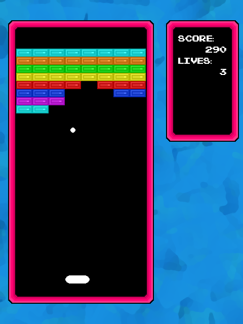
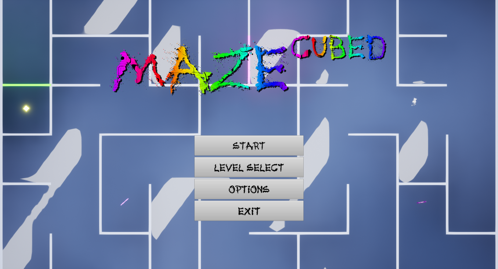
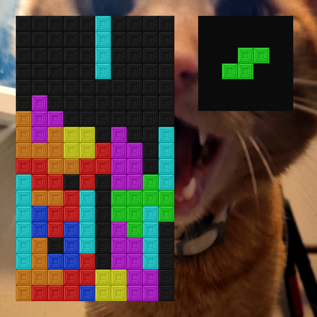

<!-- # Games -->








I made _Brick Breaker_ — in about a week — for TCH115, a thinking strategies assignment. When coding this game, I improved heavily on my previous attempts at making a game engine from scratch by learning from my code structuring mistakes. It’s written entirely in Python and can be played in-browser on [Itch.io](https://longestboi.itch.io/brick-breaker).

<a class="read-more-button" href="/games/brick-breaker/">Read more</a>

<!--  -->





_Maze³_ is my final project for GPE230, Gameplay Programming Implementation. _Maze³_ and GPE230 and GPE230 are both the games and classes that made me like using Unreal Engine, despite its instabilities on Linux. It can be downloaded at [Itch.io](https://longestboi.itch.io/gpe230-final-project).

<a class="read-more-button" href="/games/maze-cubed/">Read more</a>

<!--  -->





_Not Tetris_ is my Tetris clone written for CSC235, Python Programming 1. The game is very unfinished, but I gained a lot of knowledge from coding this game. Since the Tetris company is very litigious — and I don't want my download, or worse, website to be DMCA'd by the Tetris company — I cannot give a link to it.

<a class="read-more-button" href="/games/not-tetris/">Read more</a>
