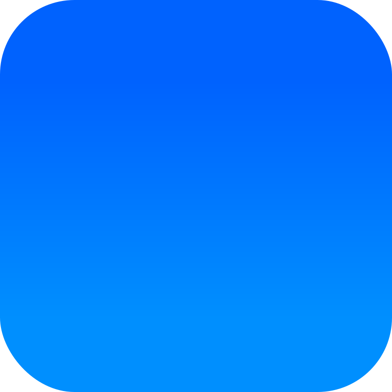


  


# Code, Games, and Video Demos


  

    <a class="social-media-widget" href="https://github.com/Longestboi/">GitHub</a>
    <a class="social-media-widget" href="https://longestboi.itch.io">Itch.io</a>
    <a class="social-media-widget" href="https://www.youtube.com/@longest_boi">YouTube</a>
    





# Social Media


  

    <a class="social-media-widget" href="https://www.linkedin.com/in/andrewrlong02/">Linkedin</a>
    <a class="social-media-widget" href="https://twitter.com/Long_boii">Twitter</a>
    <a class="social-media-widget" href="https://www.discordapp.com/users/788796881219616810">Discord</a>
    <a class="social-media-widget" href="https://bsky.app/profile/longestboi.bsky.social">Bluesky</a>
  





# Direct Contact


  

    <a class="social-media-widget" href="mailto:AndrewRLong02+PW@gmail.com">Email</a>
  


